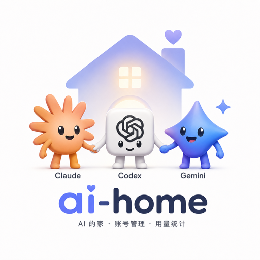

<p align="center">
  
</p>

# ai-home

`ai-home` (`aih`) 用来管理 Codex / Claude / Gemini / Antigravity(agy) / OpenCode / Grok / Kimi / Kiro 的多账号、多沙箱运行，并把它们统一成一个内置的 OpenAI / Anthropic 兼容网关——一个端点对外，背后自动在多账号、多 provider 间按额度路由、按 (账号,模型) 粒度熔断、按别名优先级降级。每个 CLI 会话默认跑在持久 tmux 里，关终端 / 断 SSH 都不丢。

## 安装

```bash
npm install
```

## 常用命令

### 账号

使用内置 AIH Server profile 启动客户端：

```bash
aih gemini
aih claude
aih codex
aih opencode
aih grok
aih kimi
aih kiro
```

新增账号：

```bash
aih gemini add
aih claude add
aih codex add
aih opencode add
aih grok add
aih kimi add
aih kiro add
```

指定账号运行：

```bash
aih gemini 1
aih claude 2
aih codex 3
aih opencode 4
aih grok 5
aih kimi 1
aih kiro 1
```

查看账号：

```bash
aih ls
aih gemini ls
aih claude ls
aih codex ls
aih opencode ls
aih grok ls
aih kimi ls
aih kiro ls
```

切换默认账号 / Codex App 账号：

```bash
aih codex set-default 1
aih codex unset-default
aih codex set-mobile 1
aih codex unset-mobile
```

`set-mobile` 只接受 Codex ChatGPT OAuth 账号；API Key 账号不能设为 Codex App 账号。

删除账号：

```bash
aih codex delete 1,2,3
aih codex delete 1-9
aih codex deleteall
```

查看 usage：

```bash
aih gemini usage 1
aih claude usage 1
aih codex usage 1
```

刷新账号额度状态：

```bash
aih codex usage 4 --no-cache
```

### 导入导出

#### 命令速查

```bash
aih export cliproxyapi [all|codex|gemini|claude] [file.json]
aih export sub2api [provider] [file.json]
aih export antigravity [file.json]
aih import [provider] [sources...] [-j N] [-f <folder>] [--dry-run]
```

- `cliproxyapi` 生成 `cliproxyapi-data` JSON；只导出数据文件，不写入本机 CLIProxyAPI 配置。
- `sub2api` 生成 `sub2api-data` JSON；`provider` 可选，支持 `codex`、`claude`、`gemini`、`agy`、`grok`、`kimi`。
- `antigravity` 只导出 `agy` OAuth 账号，生成 Antigravity Manager JSON。
- `import` 可混合读取目录、zip、JSON、JSONL、`cliproxyapi`；这些目录只作为显式输入，不参与运行时账号发现。
- `-j N` 控制并发预算；`-f <folder>` 从 zip 内指定子目录开始导入；`--dry-run` 只解析和统计，不写入数据库。

#### 普通账号压缩包

```bash
aih export accounts.zip
aih codex export accounts.zip
```

普通压缩包在 zip 根目录写入单账号标准 JSON；不会创建 provider 子目录，也不会把本机
CLI 数字别名写进路径或迁移 payload。

OAuth 账号文件名为 `provider_email.json`；API key 账号文件名为
`provider_url_xxx.json`，其中 `xxx` 是 account-ref 风格的公开 hash 后缀（不带
`acct_`），用于避免同一个上游 URL 配多把 key 时互相覆盖。

```text
codex_user@example.com.json
codex_api.openai.com_v1_2f4c0f6fb7fd9b2e58ac.json
claude_team@example.com.json
gemini_user@example.com.json
agy_user@example.com.json
```

#### 标准格式导出

导出为 CLIProxyAPI 数据 JSON：

```bash
aih export cliproxyapi ./cliproxyapi-data.json
aih export cliproxyapi codex ./cliproxyapi-data.json
aih export cliproxyapi gemini ./cliproxyapi-data.json
aih export cliproxyapi claude ./cliproxyapi-data.json
```

`cliproxyapi` 导出只生成 JSON 数据文件，不会同步或写入 server 机器的 `~/.cli-proxy-api` 配置。

导出为 sub2api 标准 JSON：

```bash
aih export sub2api
aih export sub2api codex ./sub2api-data.json
aih export sub2api claude ./sub2api-data.json
aih export sub2api gemini ./sub2api-data.json
aih export sub2api agy ./sub2api-data.json
```

`provider` 可选；省略时导出 `codex`、`claude`、`gemini`、`agy`、`grok`、`kimi` 的所有可迁移账号。

sub2api 导出结构示例：

```json
{
  "type": "sub2api-data",
  "version": 1,
  "exported_at": "2026-06-08T00:00:00.000Z",
  "proxies": [
    {
      "proxy_key": "proxy-main",
      "name": "Main proxy",
      "protocol": "http",
      "host": "127.0.0.1",
      "port": 7890,
      "status": "active",
      "fallback_mode": "none",
      "expiry_warn_days": 0
    }
  ],
  "accounts": [
    {
      "name": "codex-user@example.com",
      "notes": "optional note",
      "platform": "openai",
      "type": "oauth",
      "credentials": {
        "email": "user@example.com",
        "access_token": "access-token",
        "refresh_token": "refresh-token",
        "id_token": "id-token",
        "chatgpt_account_id": "chatgpt-account-id",
        "plan_type": "plus"
      },
      "proxy_key": "proxy-main",
      "concurrency": 0,
      "priority": 0,
      "rate_multiplier": 1,
      "expires_at": 1893456000,
      "auto_pause_on_expired": false
    },
    {
      "name": "codex-api-key",
      "platform": "openai",
      "type": "apikey",
      "credentials": {
        "api_key": "sk-openai",
        "base_url": "https://api.openai.com/v1"
      },
      "concurrency": 0,
      "priority": 0
    }
  ]
}
```

WebUI 的迁移 JSON 也使用 `sub2api-data` 结构。历史 `format=aih` 下载参数只作为
`sub2api` 别名保留，下载文件名为 `sub2api-data.json`，不再提供单独的 AIH 私有包。它不会导出
本机 CLI 数字别名；导入到另一台机器或另一个 AIH 目录时会按
`provider + email` 或 `provider + normalizedUrl + key` 去重，并为 CLI 重新分配数字别名。
Codex 凭据里的 `chatgpt_account_id` 属于上游 OAuth 元数据，会保留在 `credentials` 中。

导出为 Antigravity-Manager JSON：

```bash
aih export antigravity ./antigravity-accounts.json
```

`antigravity` 只导出 `agy` OAuth 账号。普通 UI 格式示例：

```json
{
  "accounts": [
    {
      "email": "agy@example.com",
      "refresh_token": "refresh-token"
    }
  ]
}
```

#### 标准格式导入

```bash
aih import accounts.zip
aih import ./accounts
aih import ./sub2api-data.json
aih import ./antigravity-accounts.json
aih import cliproxyapi
aih import codex ./sub2api-data.json
aih import gemini cliproxyapi
aih codex import ./some-folder
aih import ./many-zips -j 8
aih import ./backup.zip -f nested/folder
aih import ./sub2api-data.json --dry-run
```

支持的导入来源：

- 目录
- zip 压缩包
- provider 凭据目录（仅作为显式导入输入）
- 单账号 JSON
- 多行 JSONL
- 手动粘贴 JSON / JSONL
- CLIProxyAPI 本地配置和 auth-dir
- sub2api `sub2api-data` / `sub2api-bundle` JSON
- Antigravity-Manager UI JSON

账号注册后，`accountRef` 是持久化、Server、WebUI、事件、用量和运行时寻址使用的唯一账号键。
CLI 命令中的数字只是 `cliAccountId` 别名；CLI 在入口处把它解析成 `accountRef`，后续链路不再携带数字 ID。
Codex 凭据中的 `account_id` 是上游协议字段，进入内部模型后统一命名为 `upstreamAccountId`，不会参与本地账号寻址。

持久化结构：

```text
$AIH_HOME/app-state.db
  account_refs              # accountRef PRIMARY KEY，业务与运行时账号真相
  account_cli_aliases       # accountRef -> CLI 数字别名，仅 CLI 使用
  cli_account_id_sequences  # 各 provider 的 CLI 别名分配序列
  account_credentials       # accountRef -> env/native auth 凭据
  account_state             # accountRef -> 启停、额度与运行状态
  model_aliases             # 模型别名
  model_usage_*             # 模型用量、会话、价格与扫描状态
  app_kv                    # Server/usage 配置、默认账号、缓存与 Server 状态
```

`$AIH_HOME` 根目录只保留数据库及两个职责明确的目录：

```text
$AIH_HOME/
  app-state.db              # 唯一持久化状态库
  app-state.db-wal          # SQLite 运行时伴生文件
  app-state.db-shm          # SQLite 运行时伴生文件
  run/                      # PID、锁、tmux 注册表和 provider 临时投影
    accounts/<provider>/<accountRef>/
    login/<provider>/<sessionId>/
    codex-desktop/<accountRef>/
    persistent-sessions/
    tmux/
    fabric/
  logs/                     # Server、provider 与诊断日志
```

`run/accounts/...` 下的 `auth.json`、`.credentials.json`、OAuth 文件等只是在启动 provider
前由 `app-state.db` 物化的临时投影，可随时重建，不是凭据真相源。目录和 zip 只是一次性
显式导入来源；运行时不会扫描、发现或恢复任何旧账号目录，也不会双读或双写。
Server 启动时会按数据库中的 `accountRef` 清理已经失去账号记录的 `run/accounts` 与
`run/codex-desktop` 投影；数据库 schema 异常时清理会直接跳过，不会把异常误判为空账号。

`logs/` 内的 `.log`/`.jsonl` 默认每个文件最多保留最近 10 MiB，并删除 30 天未更新的日志。
巡检在 Server 启动时和之后每小时执行，采用原地裁剪，避免 launchd 持有旧文件描述符后
继续向已轮转文件写入。可通过 `AIH_LOG_MAX_BYTES` 和 `AIH_LOG_MAX_AGE_DAYS` 调整限制。

导入接口和 CLI 把来源数据注册为 `accountRef` 并写入数据库，不保留来源包里的本地账号 ID。
如果目标环境已经存在同一身份，会按下面的去重规则跳过，不覆盖现有凭据。

`aih import [provider] ...` 中的 `provider` 可选，用来限制导入范围。当前支持：

- `codex`
- `claude`
- `gemini`
- `agy`
- `opencode`

导入行为等价于新增账号：成功写入凭据后会触发账号凭据维护 hook；如果是默认账号，相关客户端配置会通过解耦 hook 同步。

导入 / 导出去重规则只有一套：

- OAuth 账号只按 `provider + email` 判断身份；缺少 email 的 OAuth 数据无效。
- 相同 OAuth 身份已存在时跳过，不覆盖旧账号；不会因为导入数据里的过期时间、refresh token 或 `account_id` 更新旧账号。
- 不读取 provider `account_id`、`chatgpt_account_id` 或 refresh token hash 作为本地 `accountRef` 身份。
- API Key 账号只按 `provider + normalizedUrl + key` 判断身份。
- 相同 API Key 身份已存在时跳过，不覆盖旧账号。
- `normalizedUrl` 会 trim 并移除尾部 `/` 后参与比较。
- sub2api 的 `notes`、`extra`、`proxy_key`、`concurrency`、`priority`、`rate_multiplier`、`expires_at`、`auto_pause_on_expired`、`proxies` 会按 `accountRef` 保存到 `app-state.db`；再次导出 sub2api 时会恢复这些字段，避免丢失上游迁移信息。

### 内置代理服务

启动默认 AIH provider 服务：

```bash
aih server start
```

默认监听：

- `base_url`: `http://127.0.0.1:9527/v1`
- `api_key`: 未配置时可使用 `dummy`

`aih claude`、`aih codex` 不带账号 ID 时会使用内置 AIH Server profile，不需要把 `127.0.0.1:9527` 手动添加成 provider 账号。

启动后台服务：

```bash
aih server start
```

前台运行：

```bash
aih server serve
```

查看状态 / 重启 / 停止：

```bash
aih server status
aih server restart
aih server stop
```

`aih daemon` 是同一组后台服务命令的别名：

```bash
aih daemon status
aih daemon restart
```

开机自启：

```bash
aih server autostart install
aih server autostart status
aih server autostart uninstall
```

自启实现按平台落到系统原生位置：

- macOS: `~/Library/LaunchAgents/com.clawdcodex.ai_home.plist`
- Linux: `~/.config/systemd/user/com.clawdcodex.ai_home.service`
- Windows: Startup 文件夹里的 `com.clawdcodex.ai_home.cmd`

自启项统一使用 `aih` 命令入口；如果当前环境无法解析 `aih`，安装会失败并提示设置 `AIH_CLI_PATH` 或先安装 CLI。
安装新自启项时会清理历史旧自启项，避免重复启动。

Linux 使用 user systemd service，不自动提权；无登录的服务器级启动需要部署层启用 linger 或改成系统级 service。

自定义监听地址、端口、API Key：

```bash
aih server serve --host=0.0.0.0 --port=9527 --api-key=my-key
```

后台服务的 `start` / `restart` / `stop` / `status` 是单实例生命周期命令，不接收端口参数；后台服务会读取已保存的 Server 配置。

外部调用方配置：

- `base_url`: `http://127.0.0.1:9527/v1`
- `api_key`: 你配置的 `--api-key`，未配置时默认可用 `dummy`

### Web UI

启动服务后打开：

- `http://127.0.0.1:9527/ui/`

当前 Web UI 支持：

- 账号管理
- 账号导入 / 导出
- 模型别名管理
- 手动打开项目
- 选择文件夹打开项目
- 新建会话
- 原生会话续写
- 图片粘贴发送
- 运行中交互输入回写（`y` / `n` / 文本）
- Server 配置与一键重启

### Server、客户端与 SSH 开发机

AIH 当前主流程只保留三个用户概念：

- **Server**：运行 AIH 网关与管理 API，持有账号、模型、会话、SSH 配置和可选 worker 状态。
- **Client**：包括浏览器、可安装 Web/PWA 壳、CLI，以及基于 Tauri 的 macOS/Windows/Linux 原生桌面客户端。客户端可保存多个 Server，并切换当前 Server。
- **SSH 开发机**：由 Server 保存 SSH 连接与工作区，用于远程开发；它不是客户端授权身份。

源码中的 `node` 仅表示高级的内部远程 worker/运行目标。普通客户端连接 AWS 或其他 Server 时不需要创建 node，也不需要先在本机运行 Server。

客户端访问 Server 只需两项配置：

- **Server URL**：例如 `http://192.168.3.181:9527`。
- **Management Key**：Server 的管理密钥，作为 Bearer 凭据访问账号、节点、会话和 Fabric API。

客户端无需额外授权流程。Browser/PWA、CLI 与原生桌面客户端都使用同一个 `Server URL + Management Key` 契约。Management Key 具有完整管理能力；跨不可信网络使用时，应优先通过 HTTPS、VPN 或受控隧道暴露 Server URL。

Dashboard、账号、会话和配置等 WebUI 数据接口即使来自同机 loopback，也必须携带 Management Key；Server 未配置 Key 时统一 fail-closed。只有 Provider 会话 Hook 与 Claude 审批桥两个不返回管理数据的内部 POST 入口保留窄 loopback capability，不能用于访问 WebUI 数据面。

所有可信客户端共享这把 Management Key。已认证客户端可在 `Server 管理` 中轮换 Key，当前客户端会同步更新；其他客户端随后使用“更新本客户端 Key”保存同一新 Key。也可以在 Server 机器使用 `aih server config set --generate-management-key` 轮换。轮换不会引入 pairing、device token 或权限 scope。

#### 配置 Server 与客户端

在 Server 上开放局域网访问并生成 Management Key：

```bash
aih server config set --open-network --generate-management-key
aih server restart
aih server config show --show-secrets
aih node doctor
```

`--show-secrets` 会显示真实密钥，只应在受信任的终端中显式使用。`aih node doctor` 会打印 `endpoint candidate`，例如 `http://192.168.3.181:9527`；其他机器必须使用这个局域网/Tailscale/FRP/公网入口，不能使用 `127.0.0.1`。

在另一个 CLI 客户端上保存并切换 Server：

```bash
aih server add home --url http://192.168.3.181:9527 --management-key "<management-key>"
aih server ls
aih server use home
```

`aih server ls` 只显示 Management Key 是否已配置，不输出原始密钥。浏览器/Web 壳与原生桌面客户端都在 `Server 管理` 中填写相同的 URL 和 Management Key；原生客户端由 Rust `SecretStore` 将凭据保存到系统 Keyring。

> `aih claude` / `aih codex` 使用的内置 `.aih-server` 是 provider CLI 启动 profile，不是这里保存的远程 Server profile。

#### 无公网入口的 Server 作为账号网关

当公网 Server 1 没有账号，而本机 Server 2 持有账号但无法被公网主动访问时，可在原生桌面的 `设置 → 公网入口` 中：

1. 将“需要外网访问的 Server”选为本机 Server 2。
2. 将“公网 Server”选为 Server 1，并保存公网入口。

Server 2 会使用已保存的 Management Key 主动建立并维持到 Server 1 的 WebSocket 连接；Server 1 不需要、也不会尝试直连 Server 2。连接建立后，Server 2 周期性公告不含账号标识或凭据的 provider / 模型可用性。Server 1 仅在自身账号总数为零时，自动把 `/v1/*`、`/v1beta/*` 和 `/v1/responses` WebSocket 请求经这条反向连接交给兼容的 Server 2；一旦 Server 1 拥有本地账号，仍使用原有本地调度。

公网客户端凭据不会穿透到 Server 2。反向连接在 Server 2 侧改用它自己的本地 Client Key，并用协议版本、provider / 模型能力、单跳限制、并发上限和消息大小上限约束转发。`/readyz` 的 `gateway` 字段可用于确认 Server 1 是否已发现可用的反向账号网关。

#### 高级：内部远程 worker（实验能力）

普通 Browser、PWA、CLI 或原生桌面客户端都不需要 worker；远程开发的当前稳定入口是 `SSH 开发机`。

Server 后端仍保留一次性 worker join invite，以及 `aih node ...` 这组内部部署/诊断命令，用于实验性的多机执行拓扑。当前 WebUI 不暴露 worker 接入或节点管理入口；join invite 由 Server 管理 API 创建，具体低层命令可查看 `aih node --help`。这条内部 worker 启动链路与客户端连接无关；worker 加入后，管理操作仍统一使用 Management Key。

#### 跨平台客户端架构

macOS、Windows 和 Linux 共用同一套 React UI 与 TypeScript Server API Client，不为每个平台复制业务逻辑：

```text
Shared React UI（Browser / Tauri 共用）
    ↓
TypeScript Server API Client
    ├─ Browser Adapter → fetch / fetch-SSE / Blob media
    └─ Tauri Adapter   → Rust commands / native stream bridge

CLI → 同一 Server Profile 契约（URL + Management Key）
```

- **Browser / 可安装 Web 壳**：当前把 Server Profile 保存在浏览器存储中，包括 Management Key。这是浏览器版的明确信任边界：只应在受信任的浏览器配置中使用，不把 Web Storage 视为桌面凭据保险库。JSON、实时流、媒体和附件统一通过 `Authorization` header 发送密钥，不把完整密钥拼入 URL。当前没有离线 service worker，因此不宣称离线 PWA 能力。
- **跨 Server 信任边界**：在 Server A 托管的 WebUI 中保存 Server B 时，A 会保存 B 的 Management Key 并作为受信任代理转发请求；不要通过不受信任的 Server A 管理其他 Server。
- **Tauri Desktop**：复用同一套 React UI；Rust 层负责 Server Profile、系统 Keyring、JSON/SSE/Blob 请求和原生 stream bridge。Profile 元数据只保存 `id` / `name` / `endpoint` / `credentialRef` / `managementKeyConfigured`，Management Key 由 `SecretStore` 按 `credentialRef` 读写，不返回 React，也不进入 `localStorage`、URL query、日志、进程参数或 Tauri event payload。原生请求适配器从 Keyring 取出密钥并添加 `Authorization` header；轮换通过专用 Rust 命令协调 Server 与 Keyring，通用原生 HTTP transport 仍拒绝凭据字段。远程 Server 必须使用 HTTPS，HTTP 只允许 loopback。
- **CLI**：`aih server add/ls/use/remove` 管理同一种 Server Profile；列表和普通诊断只暴露 `managementKeyConfigured`，不输出原始密钥。

Tauri `SecretStore` 的三平台后端：

| 平台 | 凭据后端 |
|---|---|
| macOS | Keychain |
| Windows | Credential Manager |
| Linux | Secret Service（不可用时明确报错，不降级为明文文件） |

仓库已实现原生客户端链路、收紧的 allowlist/CSP，以及 macOS、Windows、Linux 构建与 packaged smoke 工作流。某个平台只有在真实安装包完成安装、启动、Keyring、JSON、SSE、Blob smoke 并产出 evidence 后，才视为该平台发布验证通过；本文不把尚未取得 evidence 的安装包标记为已验证交付。

### 持久会话（tmux 保活，显式续接）

`aih` 用 **tmux** 把每个 CLI 会话跑在后台持久进程里：**关终端、SSH 断线、合盖睡眠都不丢**。裸命令（例如 `aih claude 1`）始终新建会话，不会因为目录相同而进入旧会话；需要继续旧会话时，通过 `sessions` 选择器显式进入。tmux 平时是隐形的（隐藏状态栏、零延迟），你几乎感觉不到它——但记住下面几个键就能掌控它。

> tmux 的「指挥键」是 **`Ctrl-b`**：先按住 `Ctrl-b` 松开，**再**按下一个键。它本身不输入任何东西，只是告诉 tmux「下一个键是给你的命令」。

**日常只需要这 4 件事：**

| 你想做什么 | 怎么做 |
|---|---|
| **暂时离开、但让它继续在后台跑** | `Ctrl-b` 然后 `d`（detach）。终端回到普通 shell，会话不中断。 |
| **回到刚才的会话**（续接） | 运行 `aih claude sessions 1`。兼容目标会按精确 tmux 名称进入；旧运行时或已结束的目标会保留原会话并新建兼容替代会话。裸跑 `aih claude 1` 只会新建。 |
| **往回翻屏 / 看刷过去的历史** | `Ctrl-b` 然后 `[` 进入滚动模式 → 用 `↑/↓`、`PageUp/PageDown` 翻（保留 5 万行）→ 按 `q` 退出滚动。（鼠标滚轮默认**不**接管，用这个方式翻。） |
| **彻底结束会话** | 在 AI 工具里用它自己的退出命令正常退出，会话随之销毁。 |

**同一个账号可以同时开多个项目 / 多个窗口**（这是按目录 + 具名寻址的好处）：

```bash
cd ~/projA && aih claude 1            # 项目 A：新建会话 1
cd ~/projA && aih claude 1            # 同目录再次运行：仍然新建会话 2，旧会话不受影响
cd ~/projA && aih claude 1 -S debug   # 具名 upsert：不存在则创建，兼容的已有目标则进入
cd ~/projB && aih claude 1            # 项目 B（同账号、并发、互不干扰）
```

**① 查看并进入已有会话** —— 在项目目录里运行 `sessions`，选择器会自动把本项目和其他项目分开。选中兼容目标后按 `Enter`，AIH 会用该会话的精确 tmux 名称进入，不会再按 cwd 猜测；若该行来自旧运行时或 pane 已结束，AIH 不会强行 attach，而是在对应项目中 fresh launch 一个兼容替代会话：

```bash
cd ~/projA && aih claude sessions 1
# [aih] claude #1 持久会话（socket aih-claude-<accountRef>）：
# 本项目（/Users/you/projA）：
#   ● 在用   项目 A 会话 1
# > ○ 空闲   项目 A 会话 2             ← 选中后按 Enter 精确进入
#   ○ 空闲   debug
# 其他项目：
#   ○ 空闲   项目 B 会话 1
```

**② 同一目录再次运行会发生什么**：

- 无论旧会话是 **attached** 还是 **detached**，裸命令都新建一个独立会话，旧会话不受影响。
- 想继续兼容的旧会话 → 运行 `aih claude sessions 1`，选中后按 `Enter` 精确进入；旧运行时或已结束的行会 fresh launch 兼容替代会话。
- 想接管本项目**最近创建**的会话 → 显式加 `-R`；想和最近会话镜像同屏 → 显式加 `-M`。两者都必须先成功探测 latest：探测异常时会 fail closed，不 attach、也不 create；探测正常但本项目没有会话时，才会创建基础会话。
- `-S <名字>` 是具名 upsert：目标不存在时创建；兼容目标存在时进入（已被占用时接管）；目标不兼容时保留原会话并创建具名替代 sibling。

寻址规则：**每个账号一个独立 tmux**（socket `aih-<provider>-<accountRef>`，CLI 数字别名只在入口解析，凭据只走环境变量，`ps` 里看不到密钥）。cwd 只用于启动目录、项目分组和会话名前缀，不负责选择旧会话；每次裸启动都会分配新的唯一会话名。`sessions` picker / `AIH_SESSION_TARGET` 表达 exact selection，`-S` 表达 named upsert，`-R` / `-M` 表达 current-project latest selection。

兼容性与生命周期同样 fail-safe：探测已确认 exact target 不存在或不兼容时直接失败，不创建替代 sibling；只有 picker 预先识别出的旧运行时 / 已结束行，以及 named upsert，才会走 fresh replacement。launcher 永远不会自动执行 `kill-server`，旧会话和同账号的其他会话保持原样；README 下方的 kill 命令仅供用户显式手工操作。

底层约束同样严格：fresh launch 使用 `tmux new-session -s <unique-session>`，不带 `-A` / `-D`；兼容的 exact target 使用 `tmux attach-session -t <exact-session>`。只有重启恢复引擎可以使用 `new-session -A -d`，以幂等恢复 registry 中的精确目标。

### 跨机器 / SSH：在另一台电脑接着干

持久会话最大的用处就是这个：在**电脑 A** 的项目里开着 `aih claude 1`，人走到**电脑 B**，`ssh` 回电脑 A 想接着干。两种情况：

```bash
# 在电脑 B 上：
ssh you@电脑A
cd ~/projA

# 继续兼容的已有会话（无论它当前是 detached 还是 attached）
aih claude sessions 1   # → 选中后按 Enter；旧运行时 / 已结束行会 fresh replacement

# 或明确选择其他行为：
aih claude 1            # → 始终新建会话，各干各的，互不打扰
aih claude 1 -R         # → 「接管」本项目最近会话：电脑 A 那个窗口被挤下线
aih claude 1 -M         # → 「镜像」本项目最近会话：A 和 B 实时同屏，谁都不被挤
```

**四种模式一句话区分**：

| 你想要 | 用什么 | 效果 |
|---|---|---|
| 各干各的 | 直接跑（默认） | 新开一个独立并发会话，原会话不受影响 |
| 精确继续兼容旧会话 | `sessions` 选择器 + `Enter` | exact attach 选中的兼容会话；旧运行时 / 已结束行改为 fresh replacement |
| 把最近会话抢过来 | `-R` | 接管本项目 latest，会挤下原客户端；latest probe 异常则拒绝执行 |
| **和最近会话同屏** | `-M` | 镜像本项目 latest，**谁都不挤掉谁**；latest probe 异常则拒绝执行 |

> 不确定先 `aih claude sessions 1` 看一眼：`●` = 正被别处占用，`○` = 空闲。兼容行会显式进入；旧运行时 / 已结束行会 fresh replacement。
> `-M` 的底层就是 tmux 的共享 attach（多个 client 连同一 session），和结对编程/屏幕共享是同一个机制。
> 注意 `-R` / `-M` 是 aih 自己的开关（不是 claude 的 `--resume`）；要把 `--resume` 传给 claude 照常用，不会被吞。

**会话卡死要强杀**（很少用到——先用 `sessions` 看到准确名字，再杀）：

```bash
aih claude sessions 1                              # 看名字（具名会话显示成 s-<名字>）
tmux -L aih-claude-<accountRef> kill-session -t s-debug  # 杀指定一个
tmux -L aih-claude-<accountRef> kill-server              # 杀该账号下全部会话
```

**完全不想要 tmux**：`AIH_NO_PERSIST=1 aih claude 1`，直接前台运行、不进 tmux（断线即丢）。

跨平台：

- macOS / Linux / WSL：用系统 `tmux`（没装就 `brew install tmux` / `apt install tmux`）；
- **原生 Windows**：自动探测 tmux 兼容引擎——优先 [`psmux`](https://github.com/psmux/psmux)（原生 ConPTY、兼容 tmux 命令），其次 MSYS2 / Cygwin 的 `tmux.exe` 或 PATH 上的 `tmux`；都没有则降级为直接启动（Windows 路径需在 Windows 机器上实测验证）。

### 模型别名与网关调度

内置网关（`http://127.0.0.1:9527/v1`）对外是**一个**统一端点，背后自动在多账号、多 provider 间路由。

**模型别名**（WebUI「模型别名管理」里配置）——把一个对外模型名映射到真实模型，支持通配和优先级：

- 例：`claude-*` → `claude-opus-4-6-thinking`（agy）；再加一条 `claude-*` → `gemini-3.5-flash-low`（agy）当**降级**。
- **优先级高的先用**；同名多条规则自动形成 **fallback 链**。
- 通配 pattern（`claude-*`）**不会出现在 `/v1/models` 列表**里（客户端没法把通配名当模型发），但请求时照常解析。

**调度与熔断**（自动，无需配置）：

- 选号按各账号剩余额度加权。
- **429 / 配额耗尽是按 (账号, 模型) 粒度熔断的**：某账号的 claude 模型被限流，它的 gemini 模型**照常可用**，不会整号被锁。
- 当某个别名目标（如 claude-opus）在**所有账号上都被限流**时，自动**降级到下一条优先级的别名**（如 gemini-3.5-flash-low）顶上。
- `/v1/models` 带 stale-while-revalidate 缓存，稳态响应 <5ms。

## 开发

运行测试：

```bash
npm test
```

构建前端：

```bash
npm run build
```

AI 前端设计委托：

```bash
npm run ui:delegate -- --provider claude --scope "Accounts mobile redesign"
npm run ui:delegate -- --provider agy --agy-account 1 --scope "H5 interaction audit"
npm run ui:delegate -- --provider agy --agy-account 1 --agy-continue --scope "Continue design review"
npm run ui:delegate -- --provider agy --agy-account 1 --agy-conversation <id> --scope "Resume design review"
```

`ui:delegate` 直接封装 `aih claude` / `aih agy <id> -p`。Agy 支持 `--agy-continue` 保持最近会话，也支持 `--agy-conversation <id>` 恢复指定会话。Claude 委托沿用当前运行时配置和模型 alias，不在脚本里固定模型；输出会写入 `tmp/ai-ui-delegation/` 供前端重构审计。

Web UI 规范：

- 设计规范入口：`/ui/design-system`。
- 样式基础：Tailwind CSS v4 + AntD theme token + 少量页面级 CSS 变量。
- 动效基础：`animate.css` 只用于页面入场、Sheet 上滑和短强调；业务状态动效优先使用 CSS transition。
- PC/H5 必须按两套交互结构开发，移动端不允许用隐藏表格列来伪装响应式。

## 说明

- 关于 agy (Antigravity CLI) 用量刷新：当前走 Antigravity Code Assist 的 `loadCodeAssist` / `fetchAvailableModels` 链路，从真实返回的模型 `quotaInfo` 生成用量快照；实现会刷新过期 OAuth token，并在 `project` 请求 403 时去掉 `project` 重试。用量刷新会向上游发送 AGY OAuth access token，排障时不要打印 token 或 refresh token。
- 文档只保留当前可用用法
- 具体实现细节以代码和测试为准
