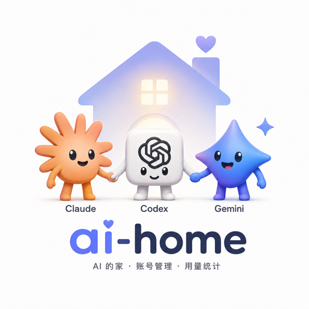

<p align="center">
  
</p>

# ai-home

`ai-home`（命令 `aih`）在一台机器上管理多个 AI CLI 的多账号，并内置一个 OpenAI / Anthropic / Gemini 兼容网关（**AIH Server**）：对外一个端点，背后在多账号、多 provider 之间按额度路由，按（账号, 模型）熔断，按模型别名的优先级降级。CLI 会话默认跑在持久 tmux 里，关终端、断 SSH 都不会丢。

支持的 CLI：`codex`、`claude`、`gemini`、`agy`（Antigravity）、`opencode`、`grok`、`kimi`、`kiro`、`qoder`、`qodercn`、`codebuddy`、`codebuddycn`。上游 Gemini CLI 已停止服务，Google 账号请改用 `agy`。

部分 provider 还可以在 WebUI 的账号页里按账号打开桌面 App（例如 Codex、Claude、Kimi、ZCode、WorkBuddy、CodeBuddy），具体以账号页实际显示为准。

## 设计原则

- **账号之间只隔离凭据。** 每个账号的目录（`~/.ai_home/run/auth-projections/<provider>/<accountRef>/`）里只放该账号的凭据。
- **会话在原生位置，所有账号共用一份。** 会话、历史、设置和工具缓存都留在各工具自己的目录里（如 `~/.codex/sessions`、`~/.claude/projects`、`~/.kiro/sessions`），宿主和各账号看到的是同一份，换账号不会让会话"消失"。
  - agy 是唯一例外：它固定从 `$HOME` 读凭据，所以启动时 HOME 指向账号目录，会话仍共享 `~/.gemini/antigravity-cli`。
  - 桌面 App 中，WorkBuddy 的数据目录整体共享宿主；CodeBuddy IDE 和 ZCode 只共享会话存储，因为登录态和会话在同一个目录里。
- **aih 自己的数据只放在 `~/.ai_home`**（可用 `AIH_HOME_DIR` 改到别处），不在宿主 home 另建目录，也不留备份文件。

## 安装

需要 Node.js 22。macOS / Linux 建议安装 `tmux`；Windows 会自动使用 `psmux` 或 MSYS2 / Cygwin 的 `tmux.exe`。

```bash
cd ai_home
npm install       # 同时安装并构建 WebUI
npm link          # 把 aih 命令装到 PATH，指向这份源码
```

更新：在仓库目录执行 `git pull --ff-only`；如果 WebUI 有变化，再执行 `npm run build`；最后 `aih server restart`。`aih update --check` 会显示当前的安装来源。

## 账号

### 启动用哪个账号

| 命令 | 使用的账号 |
|---|---|
| `aih codex`、`aih claude`、`aih opencode`、`aih kimi`（可带原生参数） | **AIH Server**：请求走网关账号池，不锁定某个账号 |
| `aih <cli> .aih-server [args]` | 显式指定 AIH Server（仅限上面 4 个 provider） |
| `aih <cli> <id> [args]` | 指定的账号 |
| `aih agy`、`aih grok`、`aih kiro`、`aih qoder`、`aih codebuddy` 等其他 provider（不带 ID） | 默认账号；没有设置默认账号时用 1 号账号 |

**默认账号**（`set-default <id>`）：

- 对 codex、claude、opencode、kimi：只决定**不经 aih** 直接运行的原生 CLI（终端里的 `codex`、`claude`，IDE 插件等）和桌面 App 用哪个账号，不影响 `aih <cli>` 的裸启动。
- 对其他 provider：除上面的作用外，也决定 `aih <cli>` 裸启动用哪个账号。
- `aih codex|claude|opencode|kimi set-default`（不带 ID）：让宿主上的原生 CLI 也改走 AIH Server。

### 常用命令

```bash
aih ls                                # 所有工具的账号与状态
aih codex ls                          # 某个工具的账号

aih codex login                       # 新增账号并登录（浏览器）
aih codex login --no-browser          # 无浏览器 / 设备码登录
aih codex login api_key               # 新增 API Key 账号（交互输入 Key 与可选 Base URL）

aih codex 3                           # 用 3 号账号启动
aih codex 3 exec "fix the tests"      # 原生参数照常透传
aih codex 3 home                      # 查看该账号实际使用的 HOME / 配置路径

aih codex usage 3 --refresh           # 查询并刷新单个账号额度
aih codex usage                       # 扫描全部账号（-j N 控制并发）

aih codex set-default 3               # 设置默认账号（作用见上）
aih codex set-default                 # 宿主原生 CLI 改走 AIH Server
aih codex unset-default
aih codex --restart-client            # 重启 / 启动已识别的桌面 App
aih codex set-mobile 3                # 设置 Codex App 账号（仅 ChatGPT OAuth 账号）
aih codex unset-mobile
aih claude set-default 2 --desktop-mode web --restart-client   # Claude Desktop：web 或 api 模式
aih codex policy set workspace-write  # codex exec 沙箱策略（read-only / workspace-write / danger-full-access）

aih codex delete 1,2,3                # 也支持 1-9 这样的范围
aih codex deleteall
aih codex terminal-icon --install     # 为当前终端安装 provider 图标
```

## 导入导出

```bash
aih export accounts.zip                       # 全部账号
aih export accounts.zip codex claude:1,2      # 选择器：provider 或 provider:ID 列表
aih export cliproxyapi [all|codex|gemini|claude] [file.json]
aih export sub2api [provider] [file.json]
aih export antigravity [file.json]            # 只导出 agy OAuth 账号

aih import accounts.zip
aih import ./sub2api-data.json --dry-run      # 只解析统计，不写入
aih import codex ./some-folder                # 限定 provider
aih import cliproxyapi                        # 读本机 CLIProxyAPI 的配置与 auth-dir
aih import ./many-zips -j 8 -f nested/folder  # 并发预算；从 zip 内指定子目录开始
```

- **导入来源**：目录、zip（含嵌套 zip）、单账号 JSON、JSONL、手动粘贴的 JSON、CLIProxyAPI 配置与 auth-dir（仅 codex / gemini / claude）、sub2api 的 `sub2api-data` / `sub2api-bundle`、Antigravity-Manager 的 JSON。
- **去重**：同一身份已存在时跳过，不覆盖已有凭据。
  - OAuth 账号按各 provider 稳定的账号标识判断，例如 codex 的用户 ID、claude 的账号 UUID；gemini 和 agy 按邮箱。
  - API Key 账号按 provider + 规范化后的 URL + Key 判断。
- **sub2api 元数据**：`notes`、`proxy_key`、`priority`、`concurrency` 等字段会保存下来，再次导出 sub2api 时原样带回。
- **账号编号**：aih 内部用 `accountRef` 唯一标识账号，CLI 里的数字 ID 只是别名。导入到另一台机器时会重新分配数字。

## AIH Server（内置网关）

```bash
aih server start                  # 后台启动（不带参数的 aih serve 与之相同）
aih server status
aih server restart
aih server stop
aih server serve --port 9527      # 前台运行
aih daemon status                 # aih daemon 是 aih server 的别名

aih server autostart install      # 开机自启；还有 status / uninstall
aih server config show            # 加 --show-secrets 才显示真实密钥
aih server config set --client-key <key>
```

- **默认监听**：`http://127.0.0.1:9527`。
- **兼容端点**：OpenAI（`/v1/chat/completions`、`/v1/responses`、`/v1/models`）、Anthropic（`/v1/messages`）、Gemini（`/v1beta/...`）。外部工具把 `base_url` 设为 `http://127.0.0.1:9527/v1` 即可。
- **Client Key**：没有配置时，任意 key 都能调用；配置后，请求必须带这个 key。
- **代码更新**：源码有变化时，`aih server status` 会显示 `stale`，执行 `aih server restart` 生效。运行中的请求不会被自动打断。
- **生命周期命令**：`start` / `restart` / `stop` / `status` 管理单实例，不接收端口参数，使用已保存的 Server 配置。
- **自启位置**：
  - macOS：`~/Library/LaunchAgents/com.clawdcodex.ai_home.plist`（launchd 直接运行 `aih`）
  - Linux：`~/.config/systemd/user/com.clawdcodex.ai_home.service`（用户级 systemd；无人登录时也要运行，需要启用 linger）
  - Windows：启动文件夹里的 `com.clawdcodex.ai_home.vbs`

### 模型别名与调度

- **模型别名**（WebUI 设置页）：把对外的模型名映射到真实模型，支持通配（如 `claude-*`）和优先级。同名的多条规则按优先级组成 fallback 链。通配规则不会出现在 `/v1/models` 列表里，但请求时照常解析。
- **选号**：按各账号的剩余额度加权。
- **熔断**：429 和额度耗尽按（账号, 模型）熔断。某账号的一个模型被限流，它的其他模型照常可用。
- **降级**：某个别名目标在所有账号上都不可用时，自动降级到下一条优先级的别名。

### 图片生成与编辑

- **接口**：`POST /v1/images/generations`（文生图）和 `POST /v1/images/edits`（图生图）。
  - 请求字段兼容 OpenAI：`model`、`prompt`、`n`（1–10）、`size`、`quality`、`response_format`。
  - 编辑接口接受 multipart 上传或 JSON data URL，支持 png / jpeg / webp，单张不超过 4 MiB，最多 16 张，可带 `mask`。
  - `response_format=url` 时，图片存入本机 blob 存储，返回 `/v1/blobs/<id>`。
- **按账号类型选择实现**：
  - API Key 账号：直通上游的 Images API。
  - codex OAuth 账号：使用 ChatGPT Codex Images（`gpt-image-2`，最多 5 张参考图）。
  - agy / gemini OAuth 账号：`gemini-*-image` 系列模型。
  - grok OAuth 账号：xAI Images（最多 3 张参考图）。
- **报错**：某个 provider 或模型不支持的参数会明确报错，不会被静默丢弃。

## Web UI

服务启动后打开 `http://127.0.0.1:9527/ui/`。WebUI 和管理接口即使从本机访问，也需要 Management Key（见下文）。

页面：

- 仪表盘
- 账号管理：登录、额度、导入导出、按账号打开桌面 App 或终端
- AI 会话：网关会话，以及各 provider 的原生会话续写
- 模型用量
- 模型目录
- 开发工具
- AI 生图
- Server 管理、SSH 开发机
- 设置：Server 配置、模型别名等

手机上有单独的移动端布局，也可以作为 Web App 安装。

## 远程 Server 与 SSH 开发机

只有三个概念：

- **Server**：运行网关和管理接口，持有账号、模型、会话、SSH 配置。
- **Client**：浏览器 / Web App 和 CLI，可以保存多个 Server 并随时切换。
- **SSH 开发机**：由 Server 保存的 SSH 连接与工作区，用于远程开发。

客户端连接 Server 只需要 **Server URL + Management Key**。

- Management Key 具有完整管理权限，所有可信客户端共用同一把。
- 跨不可信网络时，请通过 HTTPS、VPN 或受控隧道暴露 Server。
- 浏览器会把 Server URL 和 Management Key 存在浏览器存储里，只应在受信任的浏览器里使用。

在 Server 上开放局域网访问：

```bash
aih server config set --open-network --generate-management-key
aih server restart
aih server config show --show-secrets   # 查看密钥（只在受信任的终端里用）
aih node doctor                         # 打印其他机器应使用的 endpoint candidate
```

在另一台机器的 CLI 上保存并切换 Server：

```bash
aih server add home --url http://192.168.3.181:9527 --management-key "<management-key>"
aih server ls          # 只显示是否已配置密钥，不输出原文
aih server use home
aih server remove home
```

浏览器里在「Server 管理」页填写同样的 URL 和 Management Key。已认证的客户端可以在该页轮换密钥，也可以在 Server 上执行 `aih server config set --generate-management-key`。

> `aih codex` 等使用的内置 `.aih-server` 是 provider 的启动 profile，和这里保存的远程 Server 是两回事。

**无公网入口的 Server 作为账号网关**

场景：公网上的 Server 1 没有账号，本地的 Server 2 有账号，但公网访问不到它。

- **配置**：在 Server 2 上通过管理接口 `/v0/webui/server-routes/relays`（需要 Management Key）登记 Server 1 的 URL 和 Management Key。目前没有界面入口。
- **连接方向**：Server 2 主动建立并维持到 Server 1 的连接，Server 1 不会直连 Server 2。
- **转发条件**：Server 1 只在自己一个账号都没有时，才把 `/v1/*`、`/v1beta/*`（含 Responses WebSocket）请求经这条连接交给 Server 2 处理。
- **凭据**：公网客户端的凭据不会传到 Server 2。
- **状态**：Server 1 的 `/readyz` 返回里有 `gateway` 字段，可以确认网关是否可用。

`aih node ...` 和 `aih fabric ...` 是实验性的多机执行与诊断命令，普通使用不需要，详见 `aih node --help`。

## 持久会话

`aih` 用 tmux 把每个 CLI 会话放在后台持久进程里，关终端、SSH 断线、合盖睡眠都不会丢。直接运行总是**新建**会话；要回到已有会话，用 `sessions` 选择器。

```bash
cd ~/projA && aih claude     # 新建会话（AIH Server）
aih claude sessions          # 列出 claude 所有账号和 AIH Server 的会话，选中后按 Enter 进入
aih claude 1                 # 用 1 号账号新建会话
aih claude sessions 1        # 只看 1 号账号的会话
aih claude 1 -S debug        # 具名会话：不存在就新建，已存在就进入
aih claude 1 -R              # 接管本项目最近的会话（原来的终端被挤下线）
aih claude 1 -M              # 镜像本项目最近的会话（两边同屏，谁都不挤掉谁）
aih ss                       # 所有工具的会话总览（--list 只预览）
```

- **选择器标记**：`●` 表示正被别处占用，`○` 表示空闲。
- **长参数**：`-S`、`-R`、`-M` 是 aih 自己的开关，对应 `--session`、`--aih-resume`、`--aih-mirror`；它们不会吞掉原生的 `--resume` 等参数。
- **socket 命名**：每个账号一个 tmux server，socket 为 `aih-<provider>-<accountRef>`；AIH Server 的会话用 `aih-<provider>-gateway`。

tmux 常用操作（指挥键 `Ctrl-b`：先按 `Ctrl-b` 松开，再按下一个键）：

| 想做什么 | 怎么做 |
|---|---|
| 暂时离开、让它在后台继续跑 | `Ctrl-b` 然后 `d` |
| 往回翻历史 | 鼠标滚轮，或 `Ctrl-b` 然后 `[`，按 `q` 退出（保留 5 万行） |
| 彻底结束会话 | 在工具里用它自己的退出命令正常退出 |
| 强制结束卡死的会话 | `tmux -L aih-claude-<accountRef> kill-session -t <会话名>` |

不想用 tmux：`AIH_NO_PERSIST=1 aih claude 1`，直接前台运行，断线即丢。

在另一台电脑接着干：`ssh` 回到这台机器，进入项目目录，运行 `aih claude sessions` 选中原来的会话即可。

## 用量统计

```bash
aih usage                                   # 按 provider / 模型统计 token 与费用
aih usage models --from 2026-10-01 --to 2026-10-07
aih usage sessions
aih usage scan                              # 重新扫描本地会话日志
aih usage recalculate-costs                 # 用当前价格表重算历史费用
```

## SSH 图片粘贴

通过普通 SSH 在远端运行 `aih <cli> <id>` 时，如果本地终端支持 OSC 5522，或者能通过 OSC 52 读回图片，直接粘贴（或按 `Alt+V`）就能把剪贴板图片发过去。

- 诊断：`aih ssh-clipboard probe --json`。
- 终端不支持时，可以改用 `aih ssh user@host -- aih claude`，或 `aih clip-agent start` 配合 SSH RemoteForward。

## 插件

```bash
aih plugin validate <dir>
aih plugin pack <dir>
aih plugin install <file.aih-plugin>
aih plugin list
aih plugin enable <pluginId>
aih plugin disable <instanceId>
aih plugin doctor
```

## 开发

```bash
npm test             # Node 测试
npm run test:web     # WebUI 单元测试（bun）
npm run build        # 构建 WebUI
```

贡献者与 agent 的工作约定见 [AGENTS.md](./AGENTS.md)。
