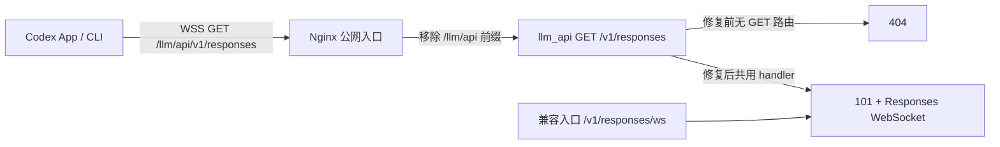

# Codex Responses WSS 404：原因、修复与验收

日期：2026-09-07（Asia/Shanghai）。当前状态：**上游不可修改；修复转为仅在 AIH 侧兼容。Node/Go 网关已实现标准握手 404 后尝试 `/responses/ws` 一次；后续已完成客户端连接配置统一及官方 App runtime/CLI 实测，UI 点击验收仍受工具连接故障限制。**

用户已要求撤销 `llm_api` 推送，回退提交为 `61efadd99ea8036b6a9090d37b200cb2263edc46`。Git 回退不等于生产回退：此前误部署没有在本轮恢复，也不再操作该生产环境。下文第 1–9 节关于上游补丁、部署、测试及推送的描述保留为历史记录，不能作为当前方案或独立于上游修改的修复证明。

最新方案、已验证范围及后续入口工作见 [AIH 侧兼容与接入方案](codex-wss-aih-only-compatibility-2026-09-07.md)。

## 1. 结论

上游支持 WSS。这次故障是上游把标准 WebSocket GET 入口从 `/v1/responses` 移到 `/v1/responses/ws`，没有保留标准入口。Codex 仍按标准请求 `/responses`，握手因此收到 404，出现 `Reconnecting …/5`。

修复前后的公网实测：

| 请求 | 修复前 | 修复后 |
| --- | --- | --- |
| WSS `/llm/api/v1/responses` | 404，`404 page not found` | 101，真实推理完成 |
| WSS `/llm/api/v1/responses/ws` | 101，可交换协议消息 | 101，真实推理完成 |
| POST `/llm/api/v1/responses` | 进入原 HTTP handler | 200，SSE 收到 `response.completed` |
| 两个 WSS 入口使用错误 key | 不具备成功升级权限 | 均 401 |

**不是 Codex 安装问题，也不是 Nginx 完全不支持 Upgrade。** 无需为此重装或禁用 WebSocket。后续 Codex 安装/更新仍以用户指定命令为首选：

```sh
curl -fsSL https://chatgpt.com/codex/install.sh | sh
```

## 2. 实际链路与失败阶段

取证时宿主 Codex 配置：

```toml
model_provider = "aih_server"
openai_base_url = "https://www.yeslaoban.com/llm/api/v1"

[model_providers.aih_server]
base_url = "https://www.yeslaoban.com/llm/api/v1"
wire_api = "responses"
```

以上省略认证信息。`aih_server` 是 provider 名称，URL 指向公网，因此该直连请求不经过本机 AIH 的 HTTP/WS 转发。



WSS 先执行 TLS 上的 HTTP GET Upgrade 握手，成功返回 101。本次 404 发生在连接建立前，模型请求尚未开始，所以不是模型名、上下文长度或工具结果导致。重试无法补出缺失路由。

Nginx 生产配置现已通过 `sudo nginx -T` 确认：

```nginx
location ^~ /llm/api/ {
    proxy_pass http://127.0.0.1:8317/;
    proxy_http_version 1.1;
    proxy_set_header Upgrade $http_upgrade;
    proxy_set_header Connection $connection_upgrade;
    # 其余原配置省略
}
```

两个路径在同一公网链路分别得到 404/101，已足以证明 Upgrade 基础转发可用。公网入口对缺 key 请求另有“返回 404”的规则，不能用无认证 404 推断路由；根因对照使用同一有效 key 完成。

## 3. 源码和历史根因

历史提交 `da5fdba7240fbb0c9c8d703dd04ada431e079b28`（2026-05-22，`Align Codex websocket response chain`）包含：

```diff
- v1.GET("/responses", openaiResponsesHandlers.ResponsesWebsocket)
+ v1.GET("/responses/ws", openaiResponsesHandlers.ResponsesWebsocket)
```

日志路径识别也随之从标准路径改为 `/ws`。所以“以前支持 WSS”的记忆成立，当前失败来自入口兼容性变化。

- [本地路由](/Users/model/projects/feature/llm_api/internal/api/server.go:347)：修复后同时注册两个 GET。
- [日志路径识别](/Users/model/projects/feature/llm_api/internal/api/middleware/request_logging.go:86)：修复后同时识别两个入口。
- [Responses WebSocket handler](/Users/model/projects/feature/llm_api/sdk/api/handlers/openai/openai_responses_websocket.go:46)：执行 Upgrade，读取 `response.create` 并进入统一执行链。
- [真实路由测试](/Users/model/projects/feature/llm_api/internal/api/responses_websocket_routes_test.go:13)：覆盖两路鉴权、101、应用层消息和原 POST handler。

本地基线 HEAD 为 `ca23951a0b3376f1f91d981457a395c29949210a`。连接生产后确认其 HEAD 为 `51950054e67c27517128f936e9d6ba932b173034`，还有未提交的 Codex executor/compact 修复。因此最终产物基于**生产当前源码加本次窄补丁**构建；没有把本地旧版本整包覆盖生产。

## 4. 已实施修复

### 4.1 上游 llm_api

在原鉴权路由组内恢复标准入口，保留旧别名：

```go
v1.GET("/responses", openaiResponsesHandlers.ResponsesWebsocket)
v1.GET("/responses/ws", openaiResponsesHandlers.ResponsesWebsocket)
v1.POST("/responses", openaiResponsesHandlers.Responses)
```

GET/POST 同路径不冲突。两条 GET 复用同一 handler，没有复制业务处理或增加另一套协议。日志中间件同步识别两条 Upgrade 路径。

本地及生产源码补丁范围均为：

1. `internal/api/server.go`
2. `internal/api/middleware/request_logging.go`
3. `internal/api/middleware/request_logging_test.go`
4. `internal/api/responses_websocket_routes_test.go`

无需改通用 base URL。将它改成 `/responses/ws` 会让客户端继续追加资源路径，破坏 HTTP/其他端点。也没有为此增加 Nginx rewrite、HTTP 重定向或全局禁用 WSS。

### 4.2 AIH 转发

此前工作区已有 [codex-responses-websocket.js](../lib/server/codex-responses-websocket.js) 和 [server.js 入口](../lib/server/server.js#L1692) 的传输补丁，本次进行了复核及真实运行验收：

- `X-Account-Ref` 显式钉住账号；未知账号返回 503，不换用其他账号。
- 上游认证取自选定账号，OAuth account ID 不接受客户端覆盖。
- 白名单转发 beta/会话等协议头。
- 双向保留文本/二进制帧类型；`ws` 的文本 payload 也可能是 Buffer，不能直接默认当二进制发送。
- 握手超时/404 转为 502；关闭码和活动计数完成清理。

本次修正了测试夹具：用 Set 跟踪被 Upgrade listener 接管的 socket，在 teardown 显式销毁。Node 的 `closeAllConnections()` 不负责这些连接，原“故意悬停握手”测试因此不退出；隔离探针证明业务模块本身已及时返回 502。这是测试资源清理问题，不是公网 404 根因。

运行中的本机 AIH PID 88752 在模块修改后启动，且本次直接对其 `127.0.0.1:9527/v1/responses` 完成真实 WSS 验收；本轮无需再重启本机服务。

## 5. 生产部署与回滚

### 实际部署入口

DNS 实测 `www.yeslaoban.com` 与根域均指向 `52.77.254.185`。本机 `yesboss` SSH 别名仍指向旧的 `13.229.128.218`，这解释了前轮管理连接超时。使用现有 `yesboss.pem` 连接当前域名 IP 成功；未修改全局 SSH 配置。

| 项目 | 已验证状态 |
| --- | --- |
| 主机 | `52.77.254.185`，Linux x86_64 |
| 服务 | `llm_api.service`，运行用户 `ubuntu` |
| 工作目录 | `/data/llm_api` |
| 启动命令 | `/data/llm_api/CLIProxyAPI -config /data/llm_api/config.yaml` |
| 监听 | `127.0.0.1:8317` |
| 部署时间 | 2026-09-07 14:28:11–14:28:12（UTC+8） |
| 新 PID | `893966` |
| 构建标识 | `codex-wss-route-fix-20260907` / `51950054-wss-route-local` |
| 旧二进制 SHA-256 | `f82d7f03108fdf0f0e81c79d6e09a1327a2709dbbd0b45d8b1e7de019aefb198` |
| 新二进制及运行进程 SHA-256 | `9a20eb546014a64ab9007b962045824e2afc5647f3fab7e7ed5ec4f1be35a7d8` |
| 生产备份目录 | `/home/ubuntu/llm-api-wss-repair-20260907T062714Z` |

已完成：备份旧二进制/相关源码 → 原生产源码应用补丁 → 测试/构建 → 校验保护文件 → 原子替换二进制 → 仅重启 `llm_api.service` → 探测/运行 hash 验证 → 公网验收。

备份目录内 `CLIProxyAPI` 为原运行二进制，`CLIProxyAPI.fixed` 为新产物，另有源码、manifest、测试日志和部署结果。部署脚本具备启动/校验失败自动回滚，实际没有触发回滚。人工回滚时将备份二进制复制到服务目录的临时文件，原子替换 `CLIProxyAPI` 后重启同一服务；不要覆盖配置或凭据。

校验确认以下内容未改变：

- `config.yaml`、`config.example.yaml`。
- 原生产 `codex_executor.go`、`codex_executor_compact_test.go` 的未提交修复。
- `internal/registry/models/models.json`。
- systemd unit、完整 Nginx 配置。

账号/凭据目录没有执行写入操作；运行时 token 正常刷新不属于本次部署变更。部署阶段未执行 Git commit/push；后续提交交付见第 9 节。

## 6. 验收结果

所有真实请求仅使用诊断短句和无外部动作的常量工具，不提交原用户会话历史。认证从现有本地存储读取，不写进脚本或结果文件。

### 测试与构建

| 验证 | 结果 |
| --- | --- |
| 本地 llm_api `go test ./...` | 通过 |
| 本地 `go build ./cmd/server` | 通过；仅作为本地验证，未拿该构件覆盖生产 |
| 生产当前源码 `go test ./...` | 44 个有测试包通过，0 失败 |
| 生产当前源码 `go build … ./cmd/server` | 通过；该产物实际部署 |
| Go 改动 `gofmt` / `git diff --check` | 通过 |
| AIH `test/codex-responses-websocket.test.js` | 4/4 真实 socket 测试通过 |
| 合并旧 `test/websocket-support.test.js` 检查 | 共 7/7；旧文件的常量断言不作为真实网络验收证据 |

### 真实网络与客户端

| 入口/场景 | 结果 | 证据 |
| --- | --- | --- |
| 公网标准 WSS | 101；`WSS_ROUTE_OK` → `response.completed` | `live-wss-acceptance.json` |
| 同连接 `previous_response_id` | `WSS_CONTINUE_OK`，completed | 同上 |
| 工具调用与结果回传 | 收到 `verify_route_marker` function_call；提交 function_call_output 后 `WSS_TOOL_OK` | 同上 |
| 关闭后重新连接并新建一轮 | 101；`WSS_RECONNECT_OK` | 同上 |
| 旧 `/responses/ws` | 101；`WSS_ALIAS_OK` | 同上 |
| 本机 AIH → 公网上游 | 首轮、续接、工具闭环、重连均通过；所有消息保持文本帧 | `local-gateway-wss-acceptance.json` |
| App 随附 Codex 0.153.4 | 正常回复；日志明确 successfully connected to websocket | `native-runtime-acceptance.json` |
| 独立 CLI 0.154.0-alpha.3 | 正常回复；明确 WebSocket transport | 同上 |
| App 二进制的 app-server | thread/start 后两轮 turn/start 均 completed，WSS 日志成立 | `app-server-acceptance.json` |
| app-server 恢复会话并选内建 openai | thread/resume 成功；`APP_RESUMED_OPENAI_WSS_OK`；WSS 日志成立 | `app-server-resume-acceptance.json` |
| 内建 openai 的裸运行时 | 正常回复；明确连接自定义域名 WSS | `builtin-openai-acceptance.json` |
| `aih codex 1 exec` | `AIH_CLI_WSS_OK`，exit 0，WSS 日志成立 | `aih-cli-acceptance.json` |
| 错误 key、缺失 key、未知钉住账号 | 公网错误 key 为 401；本机无 key 为 401；未知账号为 503 | `auth-http-final.json` |
| 原 HTTP POST | 200，`HTTP_ROUTE_OK`，response.completed | `http-post-acceptance.json` |
| 部署后服务 | active；运行进程 hash 与部署产物相同；保护文件不变 | `deployment/final-verification.json` |

原生客户端验收使用隔离的临时 CODEX_HOME，API-key provider 通过进程环境取得认证；内建 openai 验收所需 auth.json 仅写入权限 0600 的隔离测试目录。没有向本机默认登录文件写入测试 key。App/CLI 测试中 `supports_websockets=true` 只用于隔离配置或单次启动参数，确保验收确实走 WSS，没有全局配置降级。

验收脚本调整也保留了原记录：

- 工具条目来自 `response.output_item.done`；终态 `response.completed.output` 可能是空数组。调整为读取真实流事件后工具闭环通过，无需改业务实现。
- 一次固定短句回复附带句号，明确提示“无标点”后通过。
- 初始 HTTP 探针使用字符串 input 返回 400；改用 Codex 实际发送的结构化 message 数组后 200/completed。HTTP handler 未改动，此处不声称所有输入形式都已验证。
- 首次内建 openai 探针错误地尝试覆盖保留 provider ID；改用合法 `openai_base_url` 配置后通过。
- 首次 AIH 探针设置 `--ignore-user-config`，导致缺失由配置提供的 provider name；按真实启动链保留配置后通过。

### 明确边界

这次已证明“标准 WSS 路由 404”已解决，并验证了 App 所用真实运行时、app-server、独立 CLI、AIH CLI 和本机转发链。没有把单个 200 或单个 101 当成完整完成。

App 界面自动化两次失败于工具自身 `Sky Computer Use native pipe startup failed`，所以不声称已点击 App 界面验收。原故障会话没有被测试修改；恢复验证使用本次新建的隔离会话，再以内建 openai 恢复。原生客户端日志有 websocket.warmup，但没有将它额外算作所有预热语义都已独立验收。

AIH WS 的首帧模型公平路由、跨模型多账号完整等价、压力流控和跨连接旧 response_id 续接不在“404 修复已验证”声明范围。当前模块在握手阶段选账号，这一既有边界没有因恢复标准路由而消失；不能宣称所有 provider 或所有未来协议能力“全局永不出问题”。

## 7. 设计模式与工程原则

| 文件/模块 | 模式 | 为什么使用 | 验证证据 |
| --- | --- | --- | --- |
| llm_api `internal/api/server.go` | 路由兼容别名，复用单一 handler | 恢复标准契约、保留现有客户端，不复制业务逻辑 | 两入口本地/公网 101、真实推理、原 POST 200 |
| llm_api `request_logging.go` | 共用路径谓词；无需新增模式类 | 两入口使用统一日志分类 | 中间件测试及全量 Go 测试 |
| AIH `codex-responses-websocket.js` | 传输适配器＋依赖注入 | 将账号选择依赖与 socket 转发分开，集中处理帧及协议头 | 4 项真实 socket 测试、真实本机网关多轮/工具验证 |
| AIH `codex-responses-websocket.test.js` | Set 资源跟踪；无需新业务模式 | 完整回收 Upgrade 接管的测试 socket，避免 teardown 挂起 | 超时测试约 32ms 通过 |

SOLID：路由负责接入，已有 handler 负责执行，传输模块依赖账号选择接口。KISS：恢复一条路由别名，不增域名特例。DRY：两个入口共用 handler/日志谓词。YAGNI：不新增自动试多个路径、不引入新协议或全局禁用策略。

## 8. 证据与资料

- [本次修复及验收证据目录](/Users/model/.ai_home/backups/codex-wss-repair-20260907)：脚本、JSON 结果、隔离运行时日志。
- [部署证据](/Users/model/.ai_home/backups/codex-wss-repair-20260907/deployment)：远端 manifest、完整 Go 测试日志、构建结果、部署与最终校验结果。
- [首次分析证据](/Users/model/.ai_home/backups/codex-wss-analysis-20260907)：修复前标准 404/别名 101、代理对照、历史 route-change.patch；保留原状。
- [OpenAI Responses WebSocket Mode](https://developers.openai.com/api/docs/guides/websocket-mode)：标准 `/v1/responses` 与 `response.create`。
- [Codex Configuration Reference](https://learn.chatgpt.com/docs/config-file/config-reference)：provider 的 `supports_websockets` 配置。

前轮“公网未修复、SSH 超时”的状态已被本轮实际部署和验收更新。本次没有依赖修复前的报告宣布完成，最终状态由正在运行的生产二进制、真实请求和客户端日志共同证明。

## 9. 提交前范围与验证

用户随后明确要求提交并推送。本次源码交付范围为 llm_api 的四个路由/日志及测试文件，以及 AIH 的 WS 传输模块、server 接线、测试和两份分析/验证文档。`server.js` 中其他任务的 `accountStateIndex` 接线不包含在提交中；其余未提交业务/Web 改动保持原样。未提交构建二进制、凭据或隔离测试目录。

提交前 AIH 全量 `npm test` 实测为 6361 项：6351 通过、3 失败、7 跳过。失败项为本机 CLI 路径解析、Fabric 测试端口占用和 node-rpc 账号字段断言。通过不创建 Git 分支/worktree 的临时源码导出做基线对照：CLI 路径断言在原 HEAD 和仅应用本次暂存补丁后均失败；其余两项在两种状态下均通过。不能把共享 dirty 工作区的全量结果描述为全绿，也没有将这些失败当作本次 WSS 回归。

仅本次暂存内容导出后的 WSS 两份测试 7/7 通过，接线及传输模块语法检查通过。两仓暂存补丁均完成 `git diff --cached --check` 与 Gitleaks 脱敏扫描，未发现密钥。交付前 `main` 与远端更新按快进同步，不重写或丢弃既有提交。
