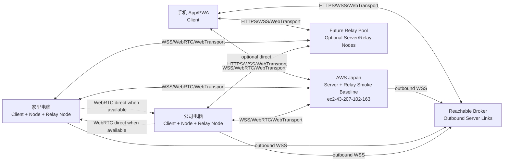
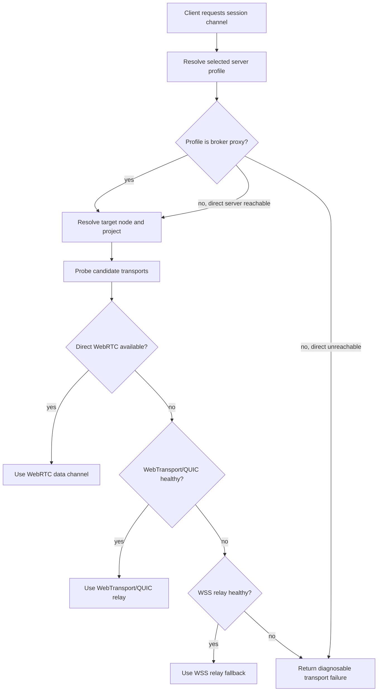

# AIH Fabric Network Topology

## 角色叠加模型

AIH Fabric 不再假设一个固定中心管理所有节点。每个 AIH 实例都可以声明多个角色。

| 角色 | 责任 | 可叠加示例 |
|---|---|---|
| Client | 选择 server、选择 node/project、发送输入、查看会话 | 手机、公司电脑、家里电脑 |
| Server | 身份、配对、目录索引、路由、审计、策略 | VPS、本机 server、公司 server |
| Broker | 可达薄路由入口，接收 client 请求并转发到 outbound server link | VPS、Cloudflare Tunnel 后端、公司/家里可达 relay |
| Node | 暴露本机项目，运行 provider runtime | 公司电脑、家里电脑、开发服务器 |
| Relay Node | 为其他节点转发控制流和会话流 | VPS、家里电脑、公司电脑 |
| Agent Runtime | Codex/Claude/AGY/OpenCode 会话进程 | provider session adapter |

一台家里电脑可以同时是 client、node、relay node；如果它本地也启动 server，则还可以是 server。角色的开启必须显式配置，并在 UI 上可见。

## AIH Instance 与角色边界

`AIH instance` 是一台机器上的安装实例。角色是 instance 上显式启用的 capability，不是同一个全局对象。

| 角色 | Source of truth | 进程/端口 | 凭证 | UI 可见状态 |
|---|---|---|---|---|
| Client | 本地 `server_profiles` | 浏览器、PWA、桌面壳或 CLI | device token，只能访问已配对 server | 当前 server、device、登录状态 |
| Server | server 本地配置和 registry | `aih server` HTTP/WSS/QUIC listener | server signing key、device token hash、node secret hash | server endpoint、capabilities、device/node 列表 |
| Broker | broker 内存在线 link registry | HTTP/WSS listener | broker link token hash，不保存 provider 账号 | online servers、route health、proxy base |
| Node | server registry + node 本地状态 | node 本地 `aih server` 或 runtime bridge | node secret、project grant，不复用 device token | roles、projects、runtimes、transport health |
| Relay Node | server registry + relay link | relay listener 或 outbound relay link | relay grant、relay link key，不复用 node/project secret | capacity、bandwidth limit、link health |
| Agent Runtime | node 本地 runtime store | provider session adapter 子进程 | provider 账号引用或短期 account grant | runtime status、session、capabilities |

边界规则：

- client device token 不能用于 node 注册。
- node secret 不能用于读取用户的 server profile。
- relay grant 只能转发授权的 route，不能读取 provider credentials。
- provider 账号默认留在 runtime 所在 node；跨 node 使用必须走 account grant。
- server 可以调度 relay，但不默认拥有 node 文件系统权限。
- broker 只能转发 allowlist route，不默认拥有 server 管理权或 provider credentials。

## 基准拓扑

## 选路流程

WebRTC 和 WebTransport/QUIC 虽然进入本阶段 transport lab，但在满足 promotion gate 前只能通过 lab flag 或显式实验配置启用。默认生产路径必须保留 WSS relay fallback，不能把未验收实验 transport 静默设为默认。

Server 也可能没有公网入口，因此默认入口先解析为 server profile endpoint。该 endpoint 可以是真实 server，也可以是 [12-outbound-broker-routing.md](12-outbound-broker-routing.md) 定义的 broker proxy base。只有在 endpoint 探测证明 HTTP 应用层可达时，才能选择 direct public ingress。

## Transport 候选

| Transport | 阶段 | 用途 | 约束 |
|---|---|---|---|
| WSS | 必须可用 | 最稳 fallback，企业网络和移动网络优先兜底 | 延迟和头部开销较高 |
| Outbound Broker WSS | MVP 默认 underlay | server/node 都无公网时的最小可达路径 | broker 必须可达，且只允许 allowlist route |
| WebRTC DataChannel | 本阶段实验并争取进 MVP | 浏览器/移动端 P2P，支持 NAT traversal | 需要 signaling 和 TURN/relay 兜底 |
| WebTransport/QUIC | 本阶段实验并争取进 MVP | client 到 server/relay 的低延迟多流传输 | 部署和浏览器兼容要实测 |
| Direct HTTP/SSE | 可选 | LAN/Tailscale/FRP 可达时简单可靠 | 无公网时不可用 |
| Multipath QUIC | 实验 | 多路径并行和故障切换 | 标准和生态未完全成熟 |
| OpenMPTCPRouter | 高级实验 | 多 WAN 聚合和链路级 failover | 单宽带无收益，部署重 |

Promotion 规则：

- `lab`: 可以在 transport lab 中手动启用，必须写 evidence。
- `candidate`: 达到单场景 gate，可在小范围用户机器显式启用。
- `default`: 达到 [07-test-plan.md](07-test-plan.md) 的 promotion gate 后才允许进入默认选路。

## 低带宽策略

- 空闲 node 到 server 的心跳目标低于 1KB/s。
- 普通 agent 会话控制流目标 5KB/s 到 30KB/s。
- 输入、审批、控制消息优先级最高。
- 高频输出 frame 可以降帧、合并、丢弃旧帧；semantic event 不允许丢。
- 大日志、大 diff、大文件走 artifact lane，按需分页拉取。
- relay server 只转发和记录最小索引，不做模型调用和重 CPU 操作。

## Relay 调度

每个 node 可以同时连接多个 relay server。Server 记录每条 link 的最近指标：

- RTT p50/p95
- 丢包或重连次数
- 最近成功 ack
- 最近错误码
- 可用 transport 类型
- 上下行估算吞吐

调度规则：

1. 新会话优先选综合分最高的 relay。
2. 输入和审批消息可以复制到当前主 relay 和一个备用 relay。
3. 会话事件按 `seq` 去重。
4. 主 relay 超过阈值未 ack 时切换备用 relay。
5. 切换后使用 `resumeToken` 续流，不重启 agent。
