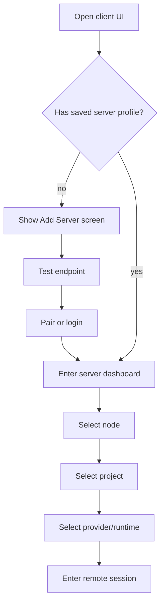
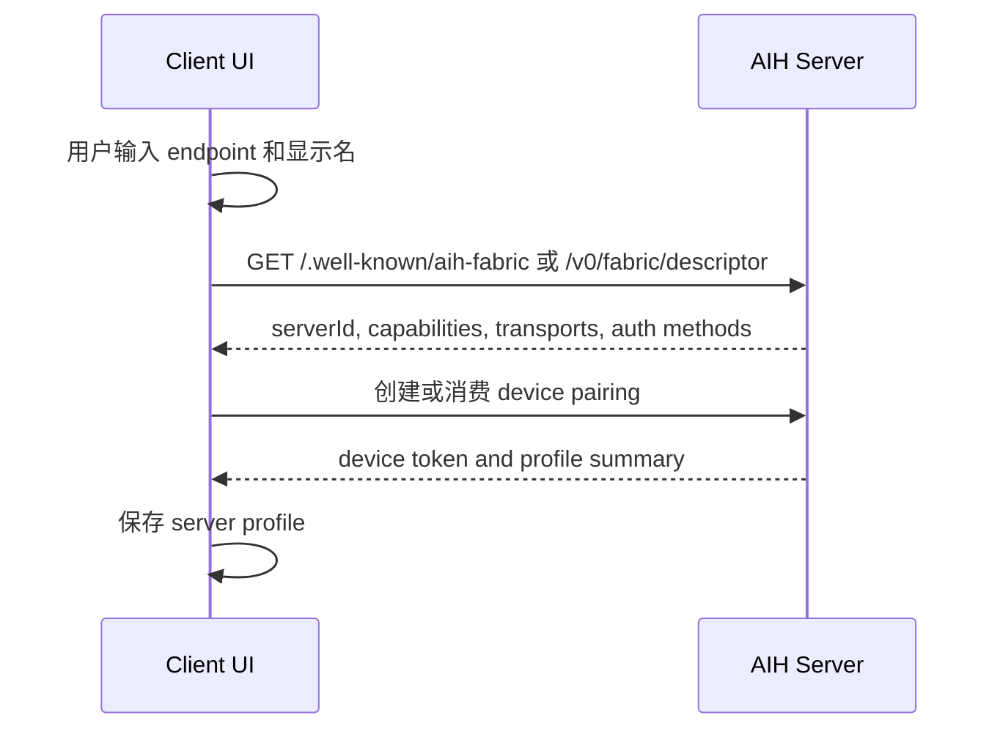
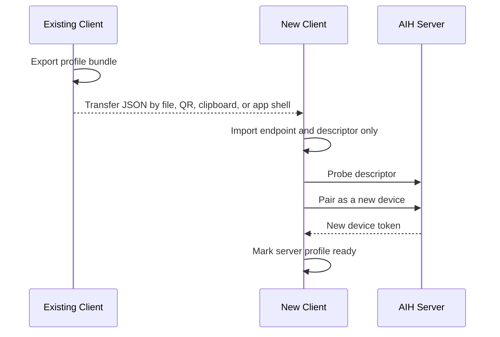
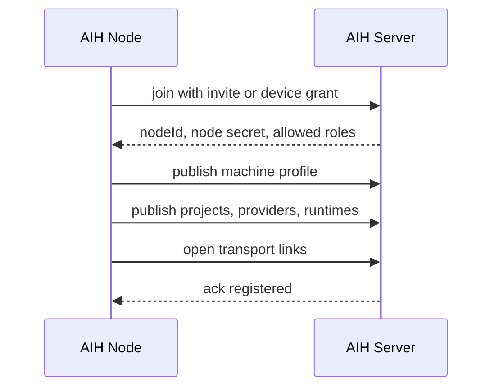
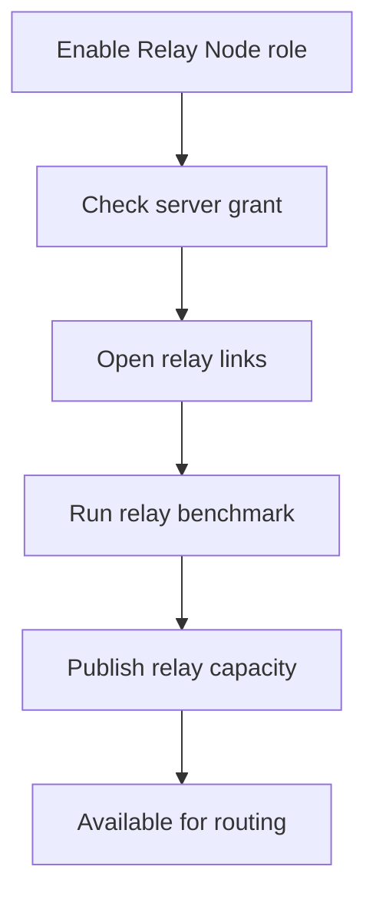
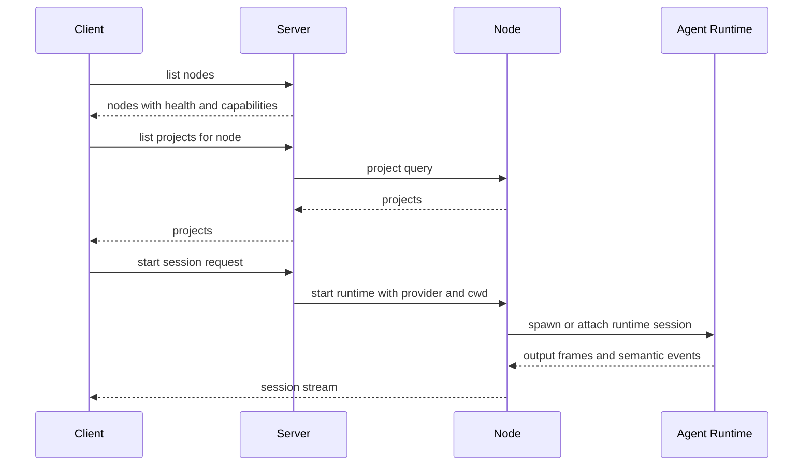
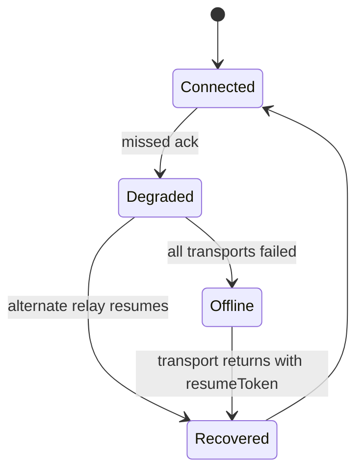

# AIH Fabric User Flows

> **历史归档（禁止作为当前实现依据）**：本文保留旧阶段设计；其中客户端 pairing、device token、scope/revoke、Control Plane 或 Node-first 表述仅用于追溯，**不得实现或恢复**。当前客户端只使用 `Server URL + Management Key`；worker join invite 仅用于高级 worker 接入，不是客户端授权。当前规范见 [20-current-server-client-model.md](20-current-server-client-model.md) 和仓库根 [README.md](../../README.md)。

## 首次打开客户端

规则：

- 未配置 server 时不能直接进入当前 WebUI。
- server profile 必须显示 endpoint、auth 状态、最近测试结果、能力摘要。
- 测试失败时留在配置页，并给出可操作诊断。

## 添加 Server

验收：

- endpoint 指向 `127.0.0.1` 时必须提示“只对本机可用”。
- endpoint 可达但未登录时必须显示“需要配对”。
- 登录成功后才允许进入 server dashboard。

## 迁移 Server Profile

规则：

- bundle 只允许包含 endpoint、descriptor 和非敏感摘要。
- bundle 不允许包含 `deviceToken`、management key、client key、API key、refresh token 或本地 profile id。
- 导入到新设备后必须是 `discovered/unpaired`；每个设备重新配对拿自己的 device token。
- 如果同一客户端已存在 paired profile，导入同 endpoint bundle 不应破坏本地已有 device token。

## 公司和家里互管 Walkthrough

默认 MVP 发生在同一个 server coordination domain，例如 `server1`。跨 server federation 不进 MVP，避免先把身份、审计和路由复杂度放大。

1. 在 VPS 1 启动 `server1`，启用 server + relay role。
   - UI 状态：Server Dashboard 显示 `VPS 1 Lab / online / relay enabled`。
   - 授权边界：server 保存 device token hash、node secret hash，不保存用户 SSH 私钥。

2. 家里电脑添加 `server1`，完成 device pairing。
   - UI 状态：家里电脑 Client 显示 active server 为 `server1`。
   - 授权边界：家里电脑得到 device token，只能代表这个 client 访问 server。

3. 家里电脑启用 Node role，并选择允许暴露的项目。
   - UI 状态：`Home Mac` 出现在 server1 的 Nodes 列表。
   - 授权边界：只登记授权项目，不默认暴露整机文件系统。

4. 家里电脑启用 Relay Node role。
   - UI 状态：`Home Mac` 同时出现在 Relay Health。
   - 授权边界：relay grant 只允许转发已授权 channel，不允许读取会话 payload 明文之外的 secret。

5. 公司电脑重复步骤 2 到 4。
   - UI 状态：`Company PC` 同时是 node 和 relay node。

6. 公司电脑作为 Client 选择 `server1 -> Home Mac -> project -> Codex/Claude`。
   - UI 状态：Remote Session header 显示 `Server: server1 / Node: Home Mac / Project: ... / Transport: ...`。
   - 授权边界：使用 Home Mac 本地 provider account，或使用明确授予 Home Mac/project 的 account grant。

7. 家里电脑作为 Client 选择 `server1 -> Company PC -> project -> Codex/Claude`。
   - UI 状态同上，node 换成 `Company PC`。

8. relay 调度按实时 health 选择 VPS relay、Home relay 或 Company relay。
   - UI 状态：Relay Health 显示当前主 relay 和备用 relay。
   - 故障恢复：主 relay 断开后用 `resumeToken` 切换备用 relay，不重启 agent runtime。

## 注册 Node

Node 注册后必须显示：

- 机器名和 nodeId。
- 当前角色：Node、Relay Node、Server、Client。
- 项目列表和可见范围。
- provider/runtime 摘要。
- transport link 健康状态。

## 注册 Relay Node

Relay Node 不是“普通 node 的附带能力”，必须单独授权。原因是 relay 会消耗带宽、暴露转发路径，并影响其他机器的稳定性。

## 打开远程项目

## 远程交互会话

客户端必须支持明确的 command envelope：

- `message`: prompt、普通文本。
- `slash`: provider slash command。
- `approval_response`: approve/reject。
- `stop`: stop run 或 stop session。

slash 支持原则：

- 首选透传到 provider runtime，由 Codex/Claude/AGY/OpenCode 自己解释。
- 对 AIH 自有 slash 只使用明确 namespace，例如 `/aih status`。
- 不在中间层重写 provider 原生命令，避免兼容分支扩散。

## 断线恢复

恢复要求：

- Agent runtime 不因 client 断线退出。
- semantic event 通过 `seq` 和 `resumeToken` 补齐。
- output frame 可以只恢复最近窗口，不回放全部历史。
- UI 明确显示恢复来源：原 transport、备用 relay、直连。
