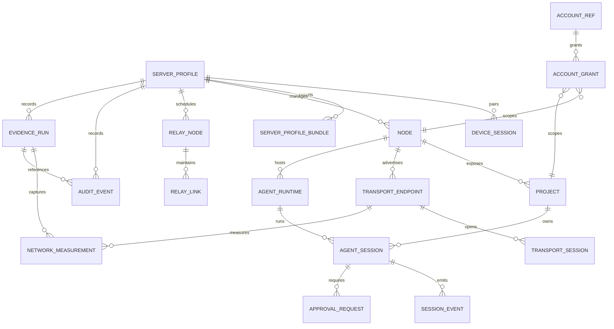
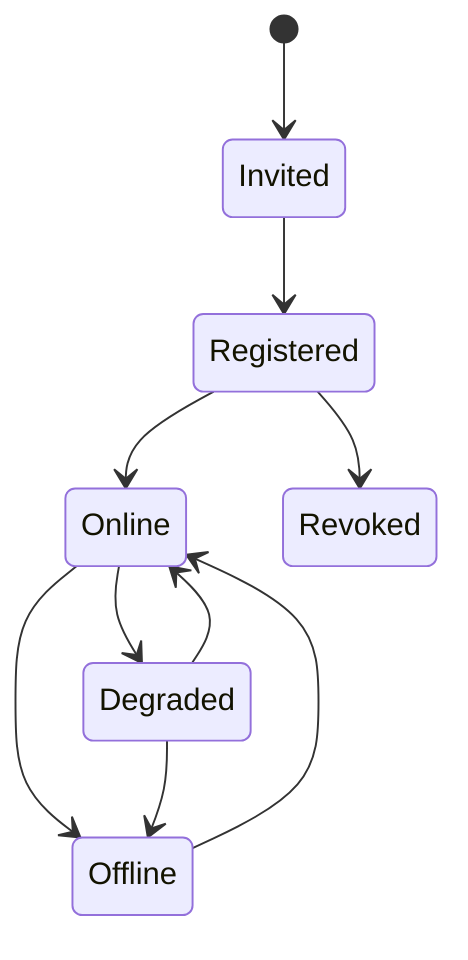
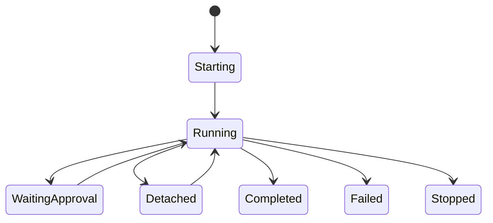

# AIH Fabric Data Model

## ER 图

## 对象定义

### server_profiles

客户端本地保存。表示一个可登录的 AIH coordination domain。

字段：

- `id`: 本地 profile ID。
- `serverId`: server 返回的稳定 ID。
- `name`: 用户显示名。
- `endpoint`: 用户配置的入口。
- `deviceId`: 本客户端设备 ID。
- `deviceTokenRef`: 本地安全存储引用。
- `capabilities`: server 能力摘要。
- `lastProbe`: 最近连通测试摘要。
- `active`: 当前选中的 server。

### server_profile_bundles

客户端导入/导出的可迁移描述符，不是认证备份。

字段：

- `kind`: 固定为 `aih-control-plane-profile-bundle`。
- `version`: 当前为 `1`。
- `exportedAt`
- `profiles[]`
- `profiles[].name`
- `profiles[].endpoint`
- `profiles[].descriptor`
- `profiles[].nodeCount`
- `profiles[].accountCount`
- `profiles[].schedulableAccountCount`
- `profiles[].sessionCount`
- `warnings[]`: 例如 `device_token_not_exported`、`import_requires_pairing`。

禁止字段：

- `deviceToken`
- `managementKey`
- `clientKey`
- `apiKey`
- `refreshToken`
- 本地 `server_profiles.id`

导入规则：

- 新客户端导入后只能得到 `discovered/unpaired` profile。
- ready 状态必须通过新的 device pairing 获得。
- 同一客户端已存在 paired profile 时，导入同 endpoint bundle 不应覆盖本地 device token。

### device_sessions

server 保存。表示一个客户端设备的授权。

字段：

- `id`
- `deviceId`
- `displayName`
- `scopes`
- `tokenHash`
- `createdAt`
- `lastSeenAt`
- `revokedAt`

### nodes

server 保存。表示一台接入机器。

字段：

- `id`
- `name`
- `machineFingerprintHash`
- `roles`: `node`, `relay-node`, `server`, `client`
- `platform`
- `arch`
- `ownerDeviceId`
- `capabilities`
- `status`
- `lastSeenAt`

### relay_nodes

server 保存。表示可被调度的 relay role。

字段：

- `id`
- `nodeId`
- `enabled`
- `capacityClass`: `tiny`, `small`, `standard`
- `bandwidthLimitKbps`
- `allowedScopes`
- `status`
- `lastMeasuredAt`

### transport_endpoints

server 保存。表示 node 或 relay 的可用传输入口。

字段：

- `id`
- `ownerType`: `node` or `relay-node`
- `ownerId`
- `kind`: `wss`, `webrtc`, `webtransport`, `direct`, `tailscale`, `frp`
- `endpoint`
- `priority`
- `health`
- `lastError`
- `lastSeenAt`
- `measurement`: 最近一次轻量 health probe 摘要，包含 `status`、`durationMs`、`successes`、`failures`、`sampleCount`、`successRate`、`failureReason`、`rttMs`、`measuredAt`。长期序列指标同步进入 `network_measurements` / `networkMeasurements`。

### relay_links

server 保存。表示 node 到 relay node 或 relay server 的实时 link。

字段：

- `id`
- `serverId`
- `relayNodeId`
- `nodeId`
- `transportEndpointId`
- `status`
- `connectedAt`
- `lastAckAt`
- `lastErrorCode`
- `bandwidthLimitKbps`
- `activeSessionCount`

### transport_sessions

server 和 node 都可记录摘要。表示一次实际打开的传输会话。

字段：

- `id`
- `traceId`
- `sessionId`
- `nodeId`
- `relayNodeId`
- `transportEndpointId`
- `kind`
- `openedAt`
- `closedAt`
- `closeCode`
- `resumeToken`
- `fallbackFromTransportSessionId`

### network_measurements

append-only。表示 transport lab、运行时 health probe 或 relay 调度测量。

字段：

- `id`
- `evidenceRunId`
- `serverId`
- `nodeId`
- `relayNodeId`
- `transportEndpointId`
- `kind`
- `metric`: `connect_ms`, `rtt_ms`, `p95_ms`, `packet_loss_pct`, `throughput_kbps`, `resume_ms`
- `value`
- `sampleCount`
- `measuredAt`
- `commandRef`
- `rawEvidenceRef`

当前 registry 兼容层：

- `networkMeasurements[]` 是 SQL/event store 尚未提升前的 JSON registry trace 形态。
- 每次 heartbeat 携带 transport `measurement` 时，会追加 capped trace entry：`nodeId`、`transportId`、`transportKind`、`status`、`durationMs`、`successes`、`failures`、`sampleCount`、`successRate`、`failureReason`、`rttMs`、`measuredAt`、`createdAt`。

### projects

node 上报，server 缓存摘要。

字段：

- `id`
- `nodeId`
- `pathHash`
- `displayPath`
- `name`
- `vcs`
- `permissions`
- `lastOpenedAt`

项目路径必须避免默认暴露完整绝对路径给所有设备；UI 可以对授权用户显示真实路径。

### agent_runtimes

node 上报。表示可启动的 provider runtime。

字段：

- `id`
- `nodeId`
- `provider`: `codex`, `claude`, `agy`, `opencode`
- `mode`: `tui`, `gui`, `api`
- `version`
- `capabilities`
- `status`

### agent_sessions

server 保存索引，node 保存运行真相。

字段：

- `id`
- `serverId`
- `nodeId`
- `projectId`
- `runtimeId`
- `provider`
- `state`
- `transportSessionId`
- `resumeToken`
- `createdAt`
- `lastEventSeq`

### session_events

append-only。用于恢复、回放、审计。

字段：

- `sessionId`
- `seq`
- `type`
- `payloadRef` or `payload`
- `transportId`
- `createdAt`
- `ackState`

### approval_requests

字段：

- `id`
- `sessionId`
- `seq`
- `kind`
- `summary`
- `riskLevel`
- `status`
- `decidedBy`
- `decidedAt`

### audit_events

append-only。用于解释谁在什么时候通过哪个 server/node/transport 做了什么。

字段：

- `id`
- `traceId`
- `serverId`
- `deviceId`
- `nodeId`
- `projectId`
- `sessionId`
- `transportSessionId`
- `action`
- `scope`
- `result`
- `errorCode`
- `riskLevel`
- `evidenceRunId`
- `createdAt`

### evidence_runs

append-only。用于记录真实实验、验收、故障复盘和可追溯结论。

字段：

- `id`
- `title`
- `type`: `network_lab`, `runtime_smoke`, `weak_network`, `relay_failover`, `manual_review`
- `startedAt`
- `finishedAt`
- `operator`
- `environment`
- `commands`
- `artifactRefs`
- `summary`
- `verdict`: `pass`, `fail`, `partial`, `inconclusive`

### account_refs and account_grants

账号默认跟 node-local；跨节点共享必须走 grant。

字段：

- `account_refs.id`
- `account_refs.provider`
- `account_refs.displayName`
- `account_refs.ownerScope`
- `account_grants.accountRefId`
- `account_grants.nodeId`
- `account_grants.projectId`
- `account_grants.scopes`
- `account_grants.expiresAt`

## 状态机

### Node 状态

### Agent Session 状态

## 可追溯要求

- 所有远程写操作必须生成 `audit_events`。
- 所有 session event 必须有单调递增 `seq`。
- 网络测量必须记录到 `network_measurements`，不能只显示在 UI。
- 真实实验必须产生 `evidence_runs`，并能关联到 `network_measurements`、`audit_events` 或 artifact 文件。
- 所有跨进程请求必须带 `traceId`，错误响应和审计记录都要保留这个 trace。
- 设计实验中使用的 VPS 地址可以进入测试 fixture，但不能记录私钥、token、refresh token。
- 所有错误必须落到可搜索的错误码，不允许只写自然语言日志。
