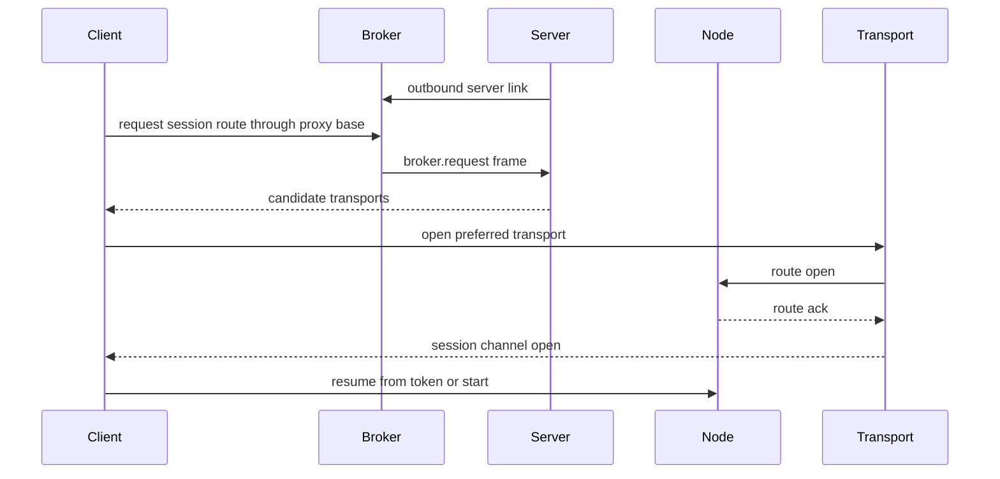

# AIH Fabric Protocol

## 分层

AIH Fabric 协议分三层：

1. Transport Layer: WSS、WebRTC DataChannel、WebTransport/QUIC、direct HTTP。
2. Session Layer: 认证、路由、seq、ack、resume、优先级。
3. Runtime Layer: PTY frame 和 semantic event。

业务代码只能依赖 Session/Runtime 层，不直接依赖某个 transport。

## Frame 格式

```json
{
  "version": 1,
  "channel": "semantic",
  "sessionId": "sess_...",
  "seq": 42,
  "ack": 41,
  "type": "agent.message.delta",
  "priority": "normal",
  "resumeToken": "rt_...",
  "payload": {}
}
```

字段规则：

- `version`: 协议版本。
- `channel`: `control`, `semantic`, `pty`, `artifact`, `bulk`。
- `seq`: session 内单调递增。
- `ack`: 接收端最后确认的 seq。
- `priority`: `critical`, `high`, `normal`, `low`, `bulk`。
- `resumeToken`: 断线恢复游标。

## Channel

| Channel | 内容 | 策略 |
|---|---|---|
| control | ping、auth、route、resize、stop | 最高优先级，小包 |
| semantic | 消息、工具、审批、diff 元数据 | 不允许丢，必须可恢复 |
| pty | terminal frame、raw input | 可合并、可降帧 |
| artifact | diff 片段、文件片段、日志页 | 按需分页 |
| bulk | 大文件、图片、归档 | 低优先级，可暂停 |

## PTY Layer

PTY layer 目标是保留原生 TUI 体验。

事件：

- `pty.open`
- `pty.frame`
- `pty.input`
- `pty.resize`
- `pty.close`
- `pty.snapshot`

规则：

- slash 默认作为普通输入透传给原生 runtime。
- `Ctrl+C`、方向键、Tab、Enter、粘贴都必须走 raw input。
- resize 必须同步给 node 端 PTY。
- 弱网时 `pty.frame` 可以合并，但最后可见状态必须正确。

## Semantic Layer

Semantic layer 目标是产品 UI、审计和恢复。

事件：

- `runtime.status`
- `agent.message.start`
- `agent.message.delta`
- `agent.message.end`
- `agent.tool.request`
- `agent.tool.result`
- `agent.approval.required`
- `agent.approval.resolved`
- `file.diff.available`
- `session.snapshot`
- `session.error`

规则：

- semantic event 是 append-only。
- 每个事件必须可按 `sessionId + seq` 查回。
- UI 恢复时先拉 `session.snapshot`，再从 resume cursor 补事件。
- provider-specific payload 必须放入 `provider` 子对象，避免污染通用字段。

## Transport Handshake

默认 handshake 必须允许 server 自身没有公网入口。Client 解析 server profile 时，如果 endpoint 是 broker proxy base，就先通过 broker 路由到 outbound server link；如果 endpoint 是 direct server，则要求 HTTP 应用层探测成功后才继续。



Broker routing 的详细决策、路径和 allowlist 以 [12-outbound-broker-routing.md](12-outbound-broker-routing.md) 为准。业务层仍只能依赖 canonical server/node/session API，不能把 broker 细节散落到 runtime adapter。

## Role Registry API

Role registry 是 M3 的 server-side truth source。它与旧 `remote-nodes.json` 双写一段时间，但客户端新能力应读 Fabric registry。

| Method | Path | Scope | Purpose |
|---|---|---|---|
| `GET` | `/v0/fabric/registry` | `nodes:read` | 读取 nodes、relayNodes、projects、runtimes、transports 摘要 |
| `GET` | `/v0/fabric/registry/nodes` | `nodes:read` | 与 registry read 等价，保留给节点列表视图 |
| `POST` | `/v0/fabric/registry/nodes` | `nodes:write` | 注册或替换一台 AIH instance 的角色快照 |

注册 payload 是 snapshot 语义：同一 `node.id` 再次上报会替换该 node 的 projects、runtimes、transports、relay metadata。这样可以避免旧项目/runtime 永久残留。

```json
{
  "node": {
    "id": "home-mac",
    "name": "Home Mac",
    "roles": ["node", "relay-node"],
    "platform": "darwin",
    "arch": "arm64",
    "capabilities": ["projects", "sessions"]
  },
  "relayNode": {
    "capacityClass": "tiny",
    "bandwidthLimitKbps": 2048
  },
  "transports": [
    { "id": "home-mac-relay", "kind": "relay", "health": "up" }
  ],
  "projects": [
    { "path": "/Users/model/projects/feature/ai_home", "name": "ai_home", "vcs": "git" }
  ],
  "runtimes": [
    { "provider": "codex", "mode": "tui", "version": "0.142.0" }
  ]
}
```

安全规则：

- 写入必须有 `nodes:write`，读取必须有 `nodes:read`。
- 原始机器指纹不得落盘；只保存 `machineFingerprintHash`。
- 项目路径必须同时保存 `pathHash`；是否展示 `displayPath` 由授权 UI 决定。
- 可兼容的 relay/direct/overlay transport 会镜像到旧 remote node registry，用于迁移期读兼容。

## Ack 和恢复

- 接收端每 N 条事件或每 250ms 发送 ack，取更早者。
- critical/high 事件必须立即 ack。
- 断线恢复使用 `resumeToken` 加最后 ack seq。
- 如果 node 缺少历史事件，必须返回 `snapshot_required`，客户端重新拉 snapshot。

## Backpressure

- 每条 channel 都有窗口大小。
- 低优先级 channel 不得阻塞 control/semantic。
- pty frame 队列超过阈值时丢弃旧 frame，保留最后状态。
- artifact/bulk 必须支持暂停和继续。

## 错误码

| 错误码 | 含义 |
|---|---|
| `server_profile_missing` | 客户端未选择 server |
| `server_auth_required` | server 未登录或 token 失效 |
| `node_offline` | node 不在线 |
| `project_not_authorized` | 无项目权限 |
| `runtime_unavailable` | provider runtime 不可用 |
| `transport_unavailable` | 没有可用 transport |
| `resume_token_expired` | 恢复游标过期 |
| `relay_capacity_exceeded` | relay 达到限速或容量 |
| `approval_required` | 需要用户审批 |

错误响应必须带 `traceId`、`serverId`、`nodeId`、`transportId`、`sessionId` 中已知字段。
