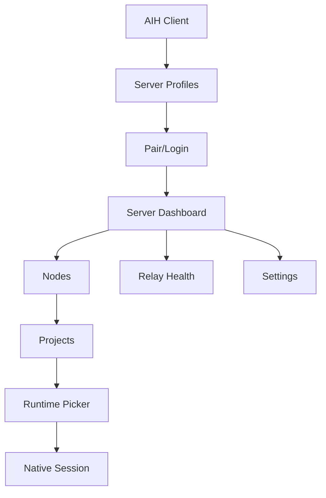

# AIH Fabric UI Wireframes

## 信息架构

客户端启动不再默认进入 Chat。新的信息架构：



## 1. Server Profile 页面

目的：用户知道自己正在连接哪个 server。

布局：

```text
+------------------------------------------------------+
| AIH Fabric                                           |
| Add or select a server before managing projects.     |
+------------------------------------------------------+
| [ Current Server v ]        [ Add Server ] [ Test ]  |
+------------------------------------------------------+
| Server Name      Endpoint                 Status     |
| Home Fabric      https://...              Paired     |
| Company Fabric   https://...              Needs auth |
| VPS 1 Lab        https://152...           Online     |
+------------------------------------------------------+
```

必须显示：

- server name
- endpoint
- auth status
- last probe result
- capabilities
- active profile

## 2. 添加 Server 页面

```text
+------------------------------------------------------+
| Add AIH Server                                       |
+------------------------------------------------------+
| Display name     [ VPS 1 Lab                  ]      |
| Endpoint         [ https://152.70.105.41      ]      |
|                                                           |
| [ Test connection ] [ Pair device ] [ Save ]          |
+------------------------------------------------------+
| Probe result                                         |
| - HTTPS: ok, 82ms                                    |
| - WSS: ok, 91ms                                      |
| - WebTransport: unavailable                          |
| - WebRTC signaling: ok                               |
| - Warning: certificate is self-signed                |
+------------------------------------------------------+
```

规则：

- 没有测试成功不能保存为 active server。
- 配对前只能显示公开 descriptor。
- endpoint 是 loopback 时必须提示作用域。

## 3. Server Dashboard

```text
+------------------------------------------------------+
| VPS 1 Lab                         Online  3 nodes    |
| endpoint: https://152.70.105.41                      |
+------------------------------------------------------+
| Nodes       Relay Health       Sessions       Audit  |
+------------------------------------------------------+
| Node          Roles                 Health           |
| Home Mac      node, relay-node      good             |
| Company PC    node, relay-node      degraded         |
| VPS 1         server, relay-node    good             |
+------------------------------------------------------+
```

## 4. Node 详情

```text
+------------------------------------------------------+
| Home Mac                                             |
| Roles: Node, Relay Node                              |
| Transports: WebRTC pending, WSS good, QUIC lab       |
+------------------------------------------------------+
| Projects                                             |
| shalou             Laravel app        last 2h        |
| ai_home            Node.js app        active         |
+------------------------------------------------------+
| Runtimes                                             |
| Codex              TUI available      5 accounts     |
| Claude             TUI available      2 accounts     |
| AGY                GUI/TUI partial    1 account      |
| OpenCode           TUI available      1 account      |
+------------------------------------------------------+
```

## 5. Native Session 页面

原生 TUI 体验优先。WebUI chat 只作为辅助，不是主画面。

```text
+------------------------------------------------------+
| Server: VPS 1 | Node: Company PC | Project: shalou   |
| Runtime: Codex | Transport: WSS relay | Latency 92ms |
+------------------------------------------------------+
| Terminal / Native TUI viewport                       |
|                                                      |
|  > /plan                                             |
|  assistant is thinking...                            |
|                                                      |
+------------------------------------------------------+
| [ message or slash input                         ]   |
| [ Send ] [ Raw Keys ] [ Resize ] [ Stop ] [ Detach ] |
+------------------------------------------------------+
| Semantic side rail: approvals, diffs, files, events  |
+------------------------------------------------------+
```

要求：

- PTY viewport 尺寸稳定。
- 输入框支持 slash。
- 支持 raw terminal mode。
- 右侧或底部有 semantic side rail，显示审批、diff、文件引用和错误。
- 显示当前 server/node/project/transport，用户不迷路。

## Provider Runtime Capability Matrix

MVP 明确承诺 **TUI/native terminal bridge**，不声称已经完整覆盖 GUI。GUI bridge 是独立能力，需要自己的事件模型和验收。

| Provider | MVP TUI | MVP GUI | Slash/raw input | Resize | Approval side rail | 说明 |
|---|---:|---:|---:|---:|---:|---|
| Codex | yes | no | yes | yes | yes | 以 PTY/TUI 和 semantic events 为主 |
| Claude | yes | no | yes | yes | yes | 以 PTY/TUI 和 tool approval 为主 |
| AGY | partial | no | partial | partial | partial | 先验证 TUI/CLI 能力，GUI bridge 延后 |
| OpenCode | yes | no | yes | yes | partial | 先接 TUI，再补 provider-specific 语义 |

GUI bridge deferred contract：

- 必须定义 GUI surface 类型、输入事件、截图/DOM/窗口同步策略。
- 必须有 provider-specific capability discovery。
- 必须有独立弱网策略，不能把 GUI 当 PTY frame 处理。
- 在该 contract 落地前，产品文案只能写“GUI planned / GUI lab”，不能写“GUI supported”。

## 6. Relay Health 页面

```text
+------------------------------------------------------+
| Relay Health                                         |
+------------------------------------------------------+
| Relay          RTT p50  RTT p95  Reconnects  Score  |
| VPS 1          82ms     180ms    0           92     |
| VPS 2          121ms    260ms    1           77     |
| Home Mac       38ms     90ms     0           88     |
+------------------------------------------------------+
| [ Run benchmark ] [ Export evidence ]                |
+------------------------------------------------------+
```

## 7. 审批页面

移动端需要优先做好审批，而不是完整编辑器。

```text
+------------------------------------------------------+
| Approval Required                                    |
+------------------------------------------------------+
| Runtime wants to run: npm test                       |
| Project: company-api                                 |
| Risk: low                                            |
+------------------------------------------------------+
| [ Approve once ] [ Deny ] [ Always allow in project ]|
+------------------------------------------------------+
```

## 设计约束

- 不使用大 hero；这是工作台，不是营销页。
- 卡片只用于列表项、弹窗和工具面板，不做卡片套卡片。
- 页面文字必须解释当前状态，不用空泛宣传语。
- 移动端优先保证选择 server、审批、发送输入、查看状态。
- 桌面端优先保证原生 TUI viewport 和快捷键体验。
