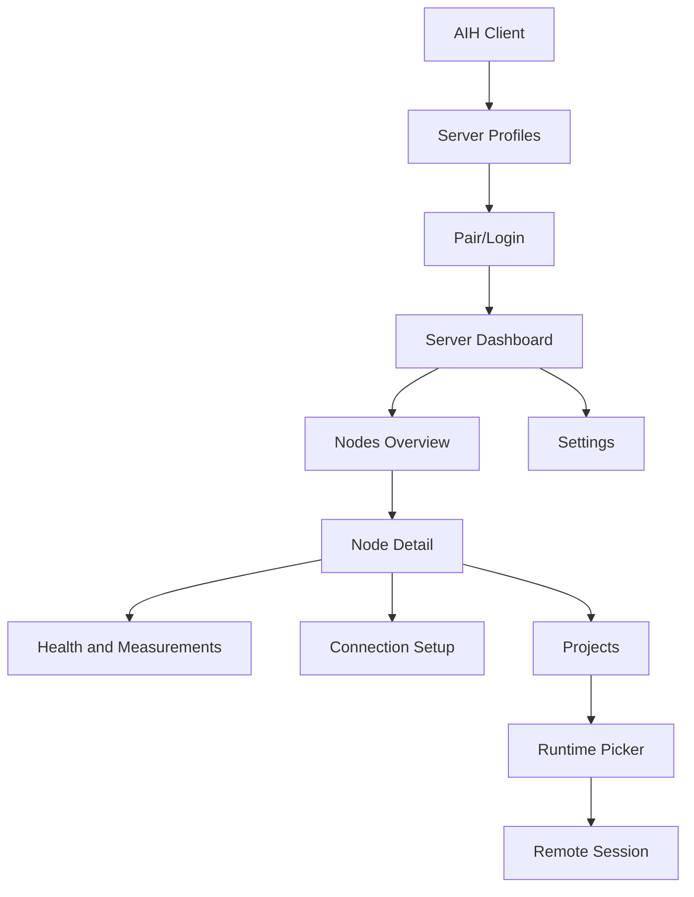

# AIH Fabric UI Wireframes

> **历史归档（禁止作为当前实现依据）**：本文保留旧阶段设计；其中客户端 pairing、device token、scope/revoke、Control Plane 或 Node-first 表述仅用于追溯，**不得实现或恢复**。当前客户端只使用 `Server URL + Management Key`；worker join invite 仅用于高级 worker 接入，不是客户端授权。当前规范见 [20-current-server-client-model.md](20-current-server-client-model.md) 和仓库根 [README.md](../../README.md)。

## 信息架构

客户端启动不再默认进入 Chat。新的信息架构：



信息架构规则：

- `Nodes Overview` 是所有可管理机器的主入口。
- `Server Profiles` 只管理 server endpoint、pairing、device 状态和切换。
- `SSH 开发机` 是 Node Detail 的 bootstrap/ops transport，不是独立资源类型。
- `Relay Health` 改为 Node Detail 和 Health 页面中的 measurement，不再作为割裂对象。
- `WebRTC 实验室` 改为 `Transport Candidates`；用户看到的是候选连接方式和 promotion 证据，不是一个孤立实验玩具。

## 1. Server Profile 页面

目的：用户知道自己正在连接哪个 server。

布局：

```text
+------------------------------------------------------+
| AIH Fabric                                           |
| Add or select a server before managing projects.     |
+------------------------------------------------------+
| [ Current Server v ]        [ Add Server ] [ Test ]  |
+------------------------------------------------------+
| Server Name      Endpoint                 Status     |
| Home Fabric      https://...              Paired     |
| Company Fabric   https://...              Needs auth |
| VPS 1 Lab        https://152...           Online     |
+------------------------------------------------------+
```

必须显示：

- server name
- endpoint
- auth status
- last probe result
- capabilities
- active profile

## 2. 添加 Server 页面

```text
+------------------------------------------------------+
| Add AIH Server                                       |
+------------------------------------------------------+
| Display name     [ VPS 1 Lab                  ]      |
| Endpoint         [ https://152.70.105.41      ]      |
|                                                           |
| [ Test connection ] [ Pair device ] [ Save ]          |
+------------------------------------------------------+
| Probe result                                         |
| - HTTPS: ok, 82ms                                    |
| - WSS: ok, 91ms                                      |
| - WebTransport: unavailable                          |
| - WebRTC signaling: ok                               |
| - Warning: certificate is self-signed                |
+------------------------------------------------------+
```

规则：

- 没有测试成功不能保存为 active server。
- 配对前只能显示公开 descriptor。
- endpoint 是 loopback 时必须提示作用域。

## 3. Server Dashboard

```text
+------------------------------------------------------+
| VPS 1 Lab                         Online  3 nodes    |
| endpoint: https://152.70.105.41                      |
+------------------------------------------------------+
| Nodes       Relay Health       Sessions       Audit  |
+------------------------------------------------------+
| Node          Roles                 Health           |
| Home Mac      node, relay-node      good             |
| Company PC    node, relay-node      degraded         |
| VPS 1         server, relay-node    good             |
+------------------------------------------------------+
```

Server Dashboard 只做所选 server profile 的摘要。进入实际资源管理必须从 `Nodes Overview` 开始。

## 4. Nodes Overview

```text
+----------------------------------------------------------------+
| Nodes                                      [ Add / Pair Server ] |
+----------------------------------------------------------------+
| Node                 Capabilities              Health  Actions  |
| AWS Current Node     node, relay-node          good    Details  |
| Local Mac            node, relay-node,runtime  good    Details  |
| Company PC           ssh-bootstrap             unknown Setup    |
+----------------------------------------------------------------+
```

规则：

- 一行就是一台 node 或可升级为 node 的 SSH host。
- capabilities 决定动作；没有 runtime-host 时不能显示可启动 provider session。
- health 必须能展开到 transport/relay/runtime 具体测量。

## 5. Node 详情

```text
+------------------------------------------------------+
| Home Mac                                             |
| Capabilities: Node, Relay Node, Runtime Host          |
| Transports: WSS good, WebRTC candidate, SSH ready     |
+------------------------------------------------------+
| Projects                                             |
| shalou             Laravel app        last 2h        |
| ai_home            Node.js app        active         |
+------------------------------------------------------+
| Runtimes                                             |
| Codex              session ready      5 accounts     |
| Claude             session ready      2 accounts     |
| AGY                session partial    1 account      |
| OpenCode           session ready      1 account      |
+------------------------------------------------------+
| Health                                                |
| relay: ws_echo_pass, p95 2ms, 100% ok                |
+------------------------------------------------------+
| Actions                                               |
| [Open project] [Start Codex] [Attach session]         |
| [Configure SSH] [Run measurement] [Enable relay]      |
+------------------------------------------------------+
```

动作 gating：

- `Start Codex/Claude/AGY/OpenCode` 需要 node 上有 project + runtime + account authority。
- `Configure SSH` 只需要 SSH bootstrap capability。
- `Enable relay` 需要 relay grant 或 server-side role enable flow。
- `Run measurement` 写入 network measurement evidence。

## 6. 远程会话页面

远程会话体验优先。WebUI chat 只作为辅助，不是主画面。

```text
+------------------------------------------------------+
| Server: VPS 1 | Node: Company PC | Project: shalou   |
| Runtime: Codex | Transport: WSS relay | Latency 92ms |
+------------------------------------------------------+
| Remote session event stream                          |
|                                                      |
|  > /plan                                             |
|  assistant is thinking...                            |
|                                                      |
+------------------------------------------------------+
| [ message or slash input                         ]   |
| [ Send ] [ Stop ] [ Detach ]                         |
+------------------------------------------------------+
| Semantic side rail: approvals, diffs, files, events  |
+------------------------------------------------------+
```

要求：

- 会话 event stream 尺寸稳定。
- 输入框支持 slash。
- 普通消息、slash、审批回复和 stop 必须是不同命令类型。
- 右侧或底部有 semantic side rail，显示审批、diff、文件引用和错误。
- 显示当前 server/node/project/transport，用户不迷路。

## Provider Runtime Capability Matrix

MVP 明确承诺远程开发会话的消息、slash、审批、artifact 和恢复能力，不声称已经完整覆盖 GUI。GUI bridge 是独立能力，需要自己的事件模型和验收。

| Provider | Message | Slash | Approval | Artifact lane | Resume | 说明 |
|---|---:|---:|---:|---:|---:|---|
| Codex | yes | yes | yes | yes | yes | 以 canonical command 和 semantic events 为主 |
| Claude | yes | yes | yes | yes | yes | 以 tool approval 和 artifact refs 为主 |
| AGY | partial | partial | partial | partial | partial | 先验证 CLI/session 能力，GUI bridge 延后 |
| OpenCode | yes | yes | partial | yes | yes | 先接 command/event contract，再补 provider-specific 语义 |

GUI bridge deferred contract：

- 必须定义 GUI surface 类型、输入事件、截图/DOM/窗口同步策略。
- 必须有 provider-specific capability discovery。
- 必须有独立弱网策略，不能把 GUI 当普通 event frame 处理。
- 在该 contract 落地前，产品文案只能写“GUI planned / GUI lab”，不能写“GUI supported”。

## 7. Health and Measurements 页面

```text
+------------------------------------------------------+
| Health and Measurements                              |
+------------------------------------------------------+
| Node       Capability   RTT p50  RTT p95  OK%  Code |
| AWS        relay        0ms      1ms      100  ok   |
| Home Mac   relay        -        -        -    stale|
+------------------------------------------------------+
| [ Run benchmark ] [ Export evidence ]                |
+------------------------------------------------------+
```

## 8. 审批页面

移动端需要优先做好审批，而不是完整编辑器。

```text
+------------------------------------------------------+
| Approval Required                                    |
+------------------------------------------------------+
| Runtime wants to run: npm test                       |
| Project: company-api                                 |
| Risk: low                                            |
+------------------------------------------------------+
| [ Approve once ] [ Deny ] [ Always allow in project ]|
+------------------------------------------------------+
```

## 设计约束

- 不使用大 hero；这是工作台，不是营销页。
- 卡片只用于列表项、弹窗和工具面板，不做卡片套卡片。
- 页面文字必须解释当前状态，不用空泛宣传语。
- 移动端优先保证选择 server、审批、发送输入、查看状态。
- 桌面端优先保证远程会话 viewport 和快捷键体验。
