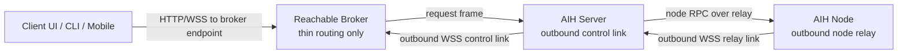

# AIH Fabric Outbound Broker Routing ADR

## Status

Accepted for the next implementation slice.

## Context

公司电脑、家里电脑、手机都可能没有公网入口。当前 remote node relay 已能让 node 通过 outbound WebSocket 连接到 control server，但这仍假设 control server 有一个客户端可达的 HTTP/WSS 入口。

2026-06-27 的真实验证显示：

- AWS current 上 `127.0.0.1:9527` 的 `/readyz`、`/v1/responses`、native relay Codex TUI session 都可用。
- 公网 `43.207.102.163:9527` 只能 TCP connect，HTTP 请求没有进入 Node handler。
- 本机到 AWS 的 API-mode relay smoke 卡在真实 `node_join` HTTP timeout。

因此产品不能把“server 暴露公网高端口”作为默认路线。

## Decision

AIH Fabric 默认采用 outbound broker routing：



规则：

- Broker 是薄路由节点，只维护在线 control links 和转发帧。
- Broker 不保存 provider credentials，不执行模型请求调度，不落地项目文件。
- Client 可以把 server profile endpoint 配成 broker proxy endpoint。
- AIH Server 主动连接 Broker，不要求自己的 HTTP listener 对公网可达。
- Node 继续主动连接 AIH Server；下一阶段再支持 node 直连 Broker 做多 relay 选路。
- Direct public ingress、SSH tunnel、FRP、Tailscale、WireGuard 都是 underlay 选项，不是默认依赖。

## Route Shape

Broker control link:

```text
GET /v0/fabric/broker/control?serverId=<id>
Authorization: Bearer <brokerLinkToken>
Upgrade: websocket
```

Client-facing proxy base:

```text
<broker-url>/v0/fabric/broker/servers/<serverId>/proxy
```

示例：客户端请求 server descriptor：

```text
GET <proxy-base>/v0/fabric/descriptor
```

Broker 转成 control link frame：

```json
{
  "type": "broker.request",
  "requestId": "uuid",
  "method": "GET",
  "pathname": "/v0/fabric/descriptor",
  "headers": {
    "authorization": "Bearer <device-token>"
  }
}
```

Server outbound client 在本机请求 `http://127.0.0.1:9527/v0/fabric/descriptor`，再回传：

```json
{
  "type": "broker.response",
  "requestId": "uuid",
  "status": 200,
  "headers": {
    "content-type": "application/json"
  },
  "body": { "ok": true }
}
```

## Allowlist

第一阶段只允许这些路径通过 broker：

- `GET /readyz`
- `GET /v0/fabric/descriptor`
- `POST /v0/fabric/device-pair`
- `GET /v0/fabric/registry`
- `GET /v0/fabric/registry/nodes`
- `POST /v0/fabric/registry/nodes`
- `POST /v0/fabric/registry/heartbeat`
- `GET /v0/node-rpc/device-profile`
- `GET /v0/node-rpc/device-status`
- `GET /v0/node-rpc/device-accounts`
- `GET /v0/node-rpc/device-sessions`
- `GET /v0/node-rpc/device-nodes`
- `GET /v0/node-rpc/device-node-sessions`
- `GET /v0/node-rpc/device-node-session-run-events`
- `POST /v0/node-rpc/device-node-session-start`
- `POST /v0/node-rpc/device-node-session-run-input`
- `POST /v0/node-rpc/device-node-session-run-abort`

不在 allowlist 的路径必须返回可诊断错误，不能静默代理全站。

## Verification Gates

最小闭环验收：

1. 本机真实 broker server 启动在默认 server 端口策略内。
2. 一个真实 AIH server 通过 outbound broker link 注册为 `serverId`。
3. Client 通过 broker proxy 访问 `/readyz` 和 `/v0/fabric/descriptor`。
4. Client 通过 broker proxy 完成 device pair。
5. 如本地 node relay 已在线，Client 通过 broker proxy 触发 native session smoke。

当前状态：

- 本地真实 socket broker proxy 验证通过，证据见 `evidence/2026-06-27-outbound-broker-routing-local-smoke.md`。
- AWS current 默认 `9527` 已完成 broker proxy -> outbound relay -> real Codex native session smoke，证据见 `evidence/2026-06-27-outbound-broker-relay-aws-smoke.md`。
- AWS current 默认 `9527` 已完成 broker link 断开诊断和同 `serverId` 恢复验证；proxy 离线响应包含 `brokerStatus.lastDisconnected`，重连后 readyz 恢复 200，并再次通过 broker relay real Codex native session。证据见 `evidence/2026-06-27-broker-diagnostics-recovery.md`。
- Browser-level Server Setup broker profile smoke 已完成，并已在 AWS current 默认 `9527` 验证 broker proxy device scoped routes。证据见 `evidence/2026-06-27-browser-broker-profile-smoke.md`。
- Cross-host outbound broker Server Profile/control-plane slice 已完成：本机 server outbound 到 AWS public broker，本机 client 通过 AWS broker proxy 完成 readyz、descriptor、device pair 和 device scoped reads。证据见 `evidence/2026-06-27-crosshost-outbound-broker-profile-smoke.md`。
- 跨主机 node relay/native session 仍待同一路径验证；不能只用 Server Profile/control-plane slice 代表完整远程开发链路。

## Consequences

- 这条路径解决 server 无公网入口的问题，比继续修 AWS 高端口更符合产品目标。
- Broker 成为可用性关键点，后续必须支持多 broker、多 control link、ack/resume 和 failover。
- WebRTC、WebTransport/QUIC、Multipath QUIC 仍然可以作为 transport promotion，但不能阻塞 outbound broker MVP。
