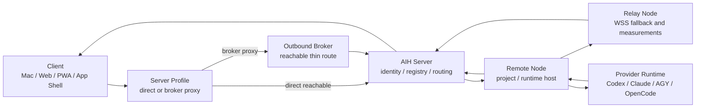
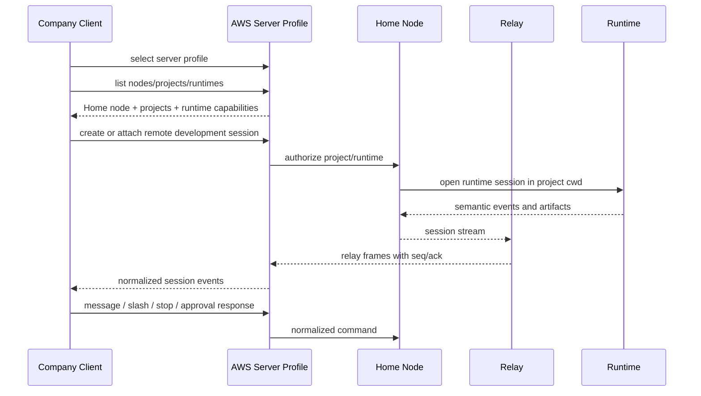
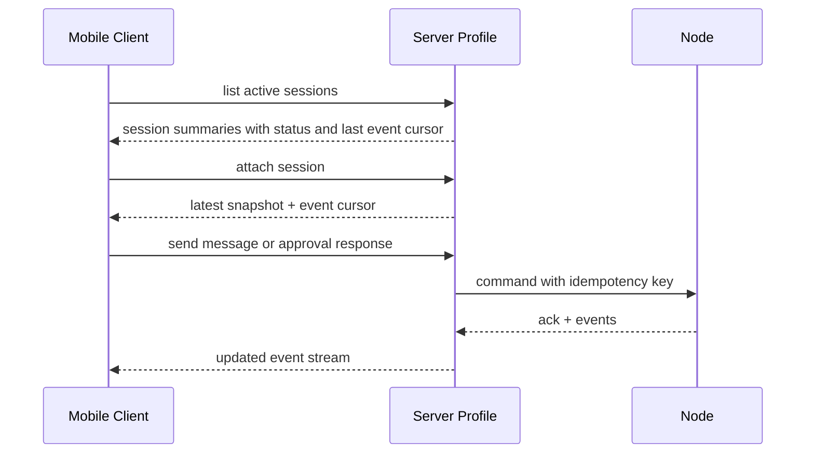
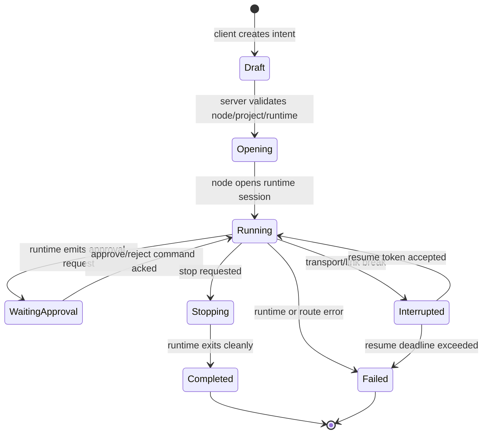
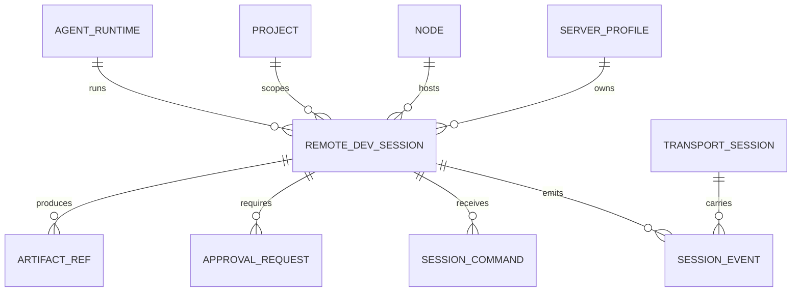

# M4 Remote Development Session Plan

## Purpose

M4 的目标不是新增一个旧式专用入口，而是让任意已授权 client 能从 server profile 进入一个可解释、可恢复、可诊断的远程开发会话。

本阶段先冻结概念和协议边界，再进入实现。没有冻结前，不新增客户端页面入口。

## Non-goals

- 不新增独立的旧式专用菜单或页面。
- 不把“远程启动一个 CLI 进程”当作产品完成。
- 不用 mock 数据证明会话能力。
- 不要求 AWS current 以外的旧服务器参与新测试。
- 不新增产品端口；默认继续使用现有 server listener 和默认 `9527`。

## Current Baseline

当前已证明的能力：

- server profile、broker proxy、device pair、device scoped reads 可用。
- AWS current 默认 `9527` 可作为当前唯一 server/broker 测试目标。
- Role Registry 已能展示本机和 AWS current 两个真实 node/relay-node。
- Relay health 已有 `ws_echo_pass`、p95、successRate 和 networkMeasurements evidence。
- broker link 断开诊断和同 `serverId` 恢复已有 evidence。
- 用户从 server profile -> node -> project -> runtime -> session 的路径已冻结到本计划和 `08-current-status.md`。
- 会话目录、attach、resume、事件去重、stop、approval、artifact 已形成统一协议，并完成 M4 8.2-8.7 的本地/AWS/mobile 真实验收。
- AWS current default `9527` 已完成真实 Codex session start、event polling、message/slash、cursor reconnect、artifact retrieval 和 stop cleanup；证据见 `2026-06-28-m4-aws-real-remote-session-smoke.md` 与 `2026-06-28-m4-mobile-pwa-session-smoke.md`。

仍不能越级宣称的能力：

- AWS current 自身不能作为 provider runtime host，因为当前不导入 provider 凭据，registry 中 `aws-current-node.runtimeHost=false` 且存在 `missing_provider_runtime` gaps。
- WebRTC/WebTransport/Multipath 不能作为默认 transport；M6 promotion 仍受外部 TURN/HTTPS-H3/OMR 前置约束。

## Topology

Routing rules:

- Client 永远先选择 ready server profile。
- Server profile endpoint 可以是 direct server，也可以是 broker proxy base。
- Server 只调度已注册且授权的 node/project/runtime。
- Node 上的 provider account 默认留在 node，本阶段不做跨 node credential 搬运。
- Relay 只转发 allowlist route，不读取 provider credentials。

## Primary User Flows

### Company manages home project

### Home manages company project

Same flow, with Home Client selecting Company Node. The server must show which account authority is used:

- node-local provider account;
- explicit account grant;
- denied with a visible reason.

### Mobile controls existing session

## Functional Matrix

| Capability | M4 requirement | Source of truth | Acceptance evidence |
|---|---|---|---|
| Session catalog | list active and recent remote development sessions by server/node/project/runtime | server session registry | real paired AWS profile returns non-empty session list after a real session is opened |
| Create session | create session from selected node/project/runtime | server -> node route + node runtime registry | real AWS broker/default `9527` request creates a session with stable `sessionId` |
| Attach session | re-enter an existing session from another client | server event store + node active session handle | close client, reopen, attach, cursor resumes without duplicate events |
| Message input | send normal prompt/message | canonical command envelope | command ack includes idempotency key and event cursor |
| Slash input | send slash command without approval prompt id | canonical command envelope | slash command accepted without `promptId`; approval response uses separate command type |
| Stop/abort | stop current run or session with visible state | session state machine | stop changes state and emits lifecycle/session event; no leaked process |
| Approval | approve/reject high-risk request | approval request table + command envelope | approval request visible with prompt id; approve/reject is idempotent |
| Artifacts | expose diff/log/file snippets without flooding stream | artifact refs | large output stored as artifact ref, stream stays responsive |
| Diagnostics | show server/node/transport/session error layer | diagnostic event | failure includes serverId, nodeId, transportId, sessionId, code |
| Recovery | resume after relay/server link interruption | seq/ack/resume token | kill relay/broker; reconnect and continue from last ack |

## State Model

## Data Model Delta

New logical fields:

- `remote_dev_sessions.id`: stable server-visible session id.
- `remote_dev_sessions.nodeId`
- `remote_dev_sessions.projectId`
- `remote_dev_sessions.runtimeProvider`
- `remote_dev_sessions.runtimeAccountRef`
- `remote_dev_sessions.status`
- `remote_dev_sessions.lastCursor`
- `remote_dev_sessions.resumeTokenRef`
- `session_commands.idempotencyKey`
- `session_commands.type`: `message`, `slash`, `approval_response`, `stop`, `attach`, `detach`
- `session_events.seq`
- `session_events.kind`: `message`, `tool`, `approval`, `artifact`, `diagnostic`, `lifecycle`

## Protocol Boundary

Client payloads must target canonical command types instead of runtime-specific raw shapes:

| Command type | Required fields | Notes |
|---|---|---|
| `message` | `sessionId`, `text`, `idempotencyKey` | normal prompt text |
| `slash` | `sessionId`, `command`, `args`, `idempotencyKey` | never carries approval prompt id |
| `approval_response` | `sessionId`, `approvalId`, `decision`, `idempotencyKey` | only valid for active approval |
| `stop` | `sessionId`, `scope`, `idempotencyKey` | `scope=run` or `session` |
| `attach` | `sessionId`, `cursor` | returns snapshot and stream cursor |
| `detach` | `sessionId` | client leaves; runtime may continue |

Server/node adapters can still translate into provider-specific runtime input internally, but the public client protocol stays stable.

## M4 Todo Queue

This queue is authoritative for M4. New requirements must be added here before implementation.

| 顺序 | 状态 | 子项 | 验收 |
|---:|---|---|---|
| 8.0 | done | 删除旧 M4 路线和历史 M4 baseline 证据 | full repo search has no deprecated route identifiers |
| 8.1 | done | M4 远程开发会话设计冻结 | this document exists and is referenced by `08-current-status.md` |
| 8.2 | done | Session catalog + attach contract | server can list active/recent remote development sessions and attach by stable session id; evidence: `2026-06-28-m4-session-catalog-attach-contract.md` |
| 8.3 | done | Canonical command envelope | message/slash/approval/stop are separate command types with idempotency keys; evidence: `2026-06-28-m4-canonical-command-envelope.md` |
| 8.4 | done | Event store + seq/ack/resume | events can resume from cursor after client reconnect without duplication; evidence: `2026-06-28-m4-event-store-seq-ack-resume.md` |
| 8.5 | done | Approval and artifact lanes | approval requests, idempotent approval responses, and artifact refs are routed without blocking normal message stream; evidence: `2026-06-28-m4-approval-artifact-lanes.md` |
| 8.6 | done | Real AWS current smoke | AWS current default `9527` opened a real Codex session through node invite, device pair, relay, event polling, and artifact retrieval; evidence: `2026-06-28-m4-aws-real-remote-session-smoke.md` |
| 8.7 | done | Mobile/PWA smoke | real mobile viewport against AWS current default `9527` can start a Codex session, attach to the active run, send message/slash, conditionally respond to a real approval request, recover from cursor reconnect without duplicate events, fetch artifacts, and stop cleanly; evidence: `2026-06-28-m4-mobile-pwa-session-smoke.md` |

## Next Implementation Slice

M4 is complete at the current protocol/product slice, and M5 Recovery has also been completed in the current status queue. The next implementation slice is not another M4 recovery task:

- Keep M4 as a regression gate for future node/session changes.
- Continue transport work only through M6 prerequisite gates: controlled TURN, HTTPS/H3 WebTransport endpoint, or real OpenMPTCPRouter/Linux underlay.
- New session features must first extend this queue or `08-current-status.md`, then add focused tests and real AWS default `9527` evidence.

## Verification Gates

Minimum local verification:

- Deprecated route residual search returns no product-route residue outside this plan queue.
- Focused tests for new catalog/attach modules.
- `git diff --check`.

Minimum real verification:

- Use only AWS current default `9527`.
- No mock data.
- No old `152/155/39.104` servers.
- Evidence must include request path, result status, session id, cursor, and process cleanup or detach behavior.
