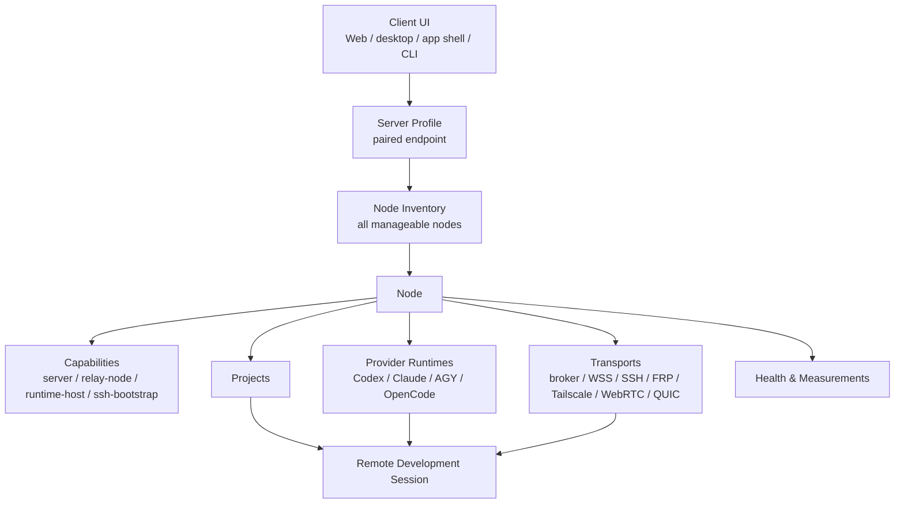

# AIH Fabric Unified Node Product Model

## Decision

AIH Fabric 的用户可见对象必须收敛为一个主对象：**Node**。

Node 表示一个已经被某个 server profile 授权管理的机器或资源端点。控制面、远程节点、SSH 开发机、relay、provider runtime、节点健康都不是互相独立的产品对象；它们是一个 node 上的不同能力、连接方式或观测结果。

这解决当前 UI 的核心问题：用户看到 `控制面`、`远程节点`、`SSH 开发机`、`节点健康`、`WebRTC 实验室` 时，不知道它们如何组合成“我能不能打开这台机器上的项目并启动 agent 会话”。

## Product Vocabulary

| 名词 | 用户理解 | 系统含义 | 不再如何表达 |
|---|---|---|---|
| Server Profile | 我登录并选择的 AIH 管理域 | endpoint + device pairing + auth state + capability descriptor | 不叫“当前 WebUI 写死的 server” |
| Node | 我可以管理的一台机器或资源端点 | registry 中的一条 node record，关联 projects/runtimes/transports/health | 不把 remote node、SSH host、relay 分成三种用户对象 |
| Capability | 这台 node 能做什么 | `server`、`node`、`relay-node`、`runtime-host`、`ssh-bootstrap`、`broker` 等角色能力 | 不把能力做成平铺菜单 |
| Transport | 怎么连到这台 node | direct、broker proxy、WSS relay、SSH tunnel、FRP、Tailscale、WireGuard、WebRTC、WebTransport | 不把文本说明当成功能 |
| Health / Measurement | 当前能力是否可用、质量如何 | `networkMeasurements`、transport measurement、relay link、runtime status | 不单独叫“节点监控”而不说明监控什么 |
| Remote Development Session | 真正的开发体验 | server -> node -> project -> runtime -> session 的事件和命令通道 | 不等于远程打开一个 TUI 进程 |

## Relationship

## Page Mapping

Target information architecture:

| Target page | Purpose | Reads/writes | Current confusing pieces to absorb |
|---|---|---|---|
| `Nodes / 节点总览` | 所有可管理 node 的主列表 | Fabric registry + SSH inventory + server descriptors | `远程节点`、`SSH 开发机`、`节点健康` 的列表入口 |
| `Node Detail / 节点详情` | 一台 node 能做什么、怎么连接、能否启动会话 | node + projects + runtimes + transports + measurements | 当前健康详情、relay metadata、项目/runtimes 分散信息 |
| `Server Profiles / Server 管理` | 添加、测试、配对、切换 AIH server | local shared server profile store + device pairing | `控制面`、`通过配对添加 Control Plane`、`已保存 Control Plane` |
| `Connection Setup / 连接方式` | 为 node 配置 SSH、relay、broker、FRP、Tailscale、WebRTC candidate | transport endpoint + bootstrap evidence | 一键加入部署里的文本说明 |
| `Health / 测量` | RTT、p95、success rate、last seen、error layer | `networkMeasurements` + relay status | `节点健康`、`节点监控` |
| `Transport Candidates / 传输候选` | WebRTC、WebTransport、MPTCP/OMR 的证据和 promotion gate | evidence + measurement | `WebRTC 实验室` |

`控制面` 不是 node 列表。它只应该回答：我保存了哪些 AIH server profile、哪些 device 已配对、当前 client 选择哪个 server。

`SSH 开发机` 不是另一套 node。SSH 只是一个 node 的 bootstrap/ops transport：能探测、部署、浏览目录、写服务配置，但不能代表 remote development session 已经可用。

`节点健康` 也不是另一套 node。它是 node detail 中的观测面，必须总是落回到具体 node、capability、transport 和 measurement。

## Capability Matrix

| Capability | Meaning | Required evidence before UI action is enabled |
|---|---|---|
| `server` | 可以作为 server profile endpoint、管理 pairing、registry、routing | descriptor 200、device pair 可用、authorized read 可用 |
| `broker` | 可作为 broker proxy base | broker link online、allowlist route smoke、diagnosable offline response |
| `node` | 暴露 projects，可被选择为开发目标 | registry node online、project list 非空、lastSeen fresh |
| `runtime-host` | 可在项目里启动 provider runtime | runtime list has provider + account authority + start smoke |
| `relay-node` | 可转发控制流/会话流 | relay link online、echo measurement、successRate/p95 recorded |
| `ssh-bootstrap` | 可通过 SSH 部署/修复/探测 | SSH command pass、no secret printed、bootstrap evidence recorded |
| `transport-candidate` | 可作为候选连接方式 | promotion gate evidence, fallback path, failure reason |

用户看到的按钮必须绑定 capability：

- 没有 `runtime-host`：不显示或禁用 `启动 Codex/Claude`，原因写清楚。
- 没有 `relay-node` measurement：不宣称 relay 可用，只显示待测。
- 只有 SSH 可达：只能显示部署/诊断动作，不能显示远程会话已就绪。
- WebRTC 只有 signaling pass：只能显示为 candidate evidence，不能显示为默认连接方式。

## AWS Current Readback

2026-06-28 本地已授权 profile 真实读取 AWS current：

| Item | Current result |
|---|---|
| Local saved server profile | one paired direct AWS profile |
| AWS `/readyz` | HTTP 200, `ready=false`, account counts all 0 |
| Authorized AWS registry read | HTTP 200, `nodes=2`, `relayNodes=2`, `projects=2`, `runtimes=4`, `transports=2` |
| AWS node | `aws-current-node`, roles `node, relay-node`, status `online` |
| AWS project | `/home/ubuntu/aih-fabric-current` |
| AWS relay | `aws-current-node-relay`, `ws_echo_pass`, successRate `1`, p95 around `0-1ms` |
| Local Mac node | `local-mac-remote-node`, roles `node, relay-node`, status `online` |
| Runtime records | currently attached to `local-mac-remote-node` only: Codex, Claude, AGY, OpenCode TUI records |

Therefore local WebUI can currently do this with AWS:

- select/use the AWS server profile after pairing;
- read AWS Fabric registry with authorization;
- display AWS and local Mac as online nodes;
- display AWS project path and relay health measurements;
- use AWS as the current server/coordination domain and relay-capable node baseline.

It cannot yet honestly claim this product action:

- click AWS node -> select AWS project -> start Codex/Claude/AGY/OpenCode remote development session.

Reasons:

- AWS `/readyz` currently has no provider accounts loaded;
- AWS node has no provider runtime records in the current registry readback;
- M4 remote development session UX/action surface is not complete;
- event store, approval/artifact lanes, attach/resume, and real AWS end-to-end M4 smoke are still pending.

## WebRTC Naming

`WebRTC 实验室` is a poor user-facing name. The product should call this `Transport Candidates / 传输候选`.

The reason WebRTC is not default yet is evidence, not priority:

- signaling room pass only proves offer/answer/candidate exchange;
- production use requires `ICE connected`, `DataChannel open`, RTT samples, reconnect/fallback behavior, and TURN/relay diagnosis;
- it must be tested in real mobile/headed/cross-network scenarios, not only a local browser mock;
- WSS relay remains the default fallback until WebRTC passes promotion gates.

Promotion states:

| State | Meaning | UI wording |
|---|---|---|
| `lab` | evidence incomplete, manual test only | Candidate, not default |
| `candidate` | one or more real scenarios pass, explicit opt-in | Try WebRTC |
| `default` | pass stability/fallback gates, safe for automatic selection | Auto-selected when best |

## Next Plan

P0 must happen before more transport feature work:

1. Build the unified Node Inventory read model.
   - Join registry nodes, projects, runtimes, relayNodes, transports, measurements, and SSH inventory by stable node identity.
   - Verify with AWS current default `9527`, no mock data.

2. Replace confusing menu semantics.
   - `Fabric Nodes` becomes the main product area.
   - `控制面` becomes `Server Profiles`.
   - `远程节点` and `SSH 开发机` become onboarding/connection setup under nodes.
   - `节点健康` becomes node detail health/measurements.

3. Add Node Detail action gating.
   - Actions: open project, start/attach session, configure SSH/bootstrap, enable relay, run measurement.
   - Disabled state must include exact missing capability.
   - AWS current must show why runtime session is unavailable until runtime/account records exist.

4. Continue M4 only after the node model is understandable.
   - 8.4 event store + seq/ack/resume.
   - 8.5 approval/artifact lanes.
   - 8.6 real AWS current remote development session smoke.

5. Promote transports by evidence.
   - WebRTC and QUIC stay as transport candidates until promotion gates pass.
   - OMR/MPTCP stays underlay optimization and only enters product setup when real multi-WAN evidence exists.
