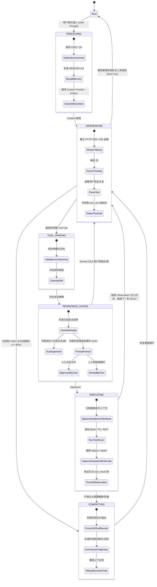

# 00-01 为什么单纯封装 API 远远不够？Agent 运行时的核心壁垒与本质

> **“LLM（大型语言模型）只是无状态的推理引擎内核，而 Harness（运行时脚手架/底座）才是让模型具备具身行动、长期记忆、安全受控与复杂工程问题解决能力的操作系统。”**

---

## 1. 绪论：从无状态补全到有状态自主系统的范式转移

在生成式 AI 落地初期，大量开发者与团队将 AI 应用的构建简化为 **“API Client + Prompt 模板”** 的薄封装模式（Thin Wrapper）。然而，当应用场景从简单的聊天问答、文本摘要迈向 **自主代码编写（Coding Agent）、复杂故障排查、长程工程重构与多子代理协同** 等严肃工业级场景时，这种纯 API 封装的架构迅速遭遇系统性崩溃。

本章作为整部《现代 AI Agent 运行时与 Harness 架构设计》的技术基石，将深入剖析：**为什么大模型 API 本身只是冰山一角？为什么必须构建自主的 Agent Harness 运行时？现代 Agent Harness 的核心壁垒与架构本质究竟是什么？**

<div class="rich-diagram-box">
  <div class="diagram-header-tag">Architecture Topology</div>
  <div class="diagram-title"><span>🏛️</span> Agent Harness 现代具身运行时全景拓扑图</div>
  <div class="harness-stack">
    <div class="stack-layer">
      <div class="layer-badge">User Intent Layer (用户意图层)</div>
      <div class="tech-card blue">
        <div class="card-label">👤 用户业务目标与复杂需求描述 (Prompt)</div>
      </div>
    </div>
    <div class="flow-connector">⬇️ 有状态感知与上下文水合</div>
    <div class="stack-layer">
      <div class="layer-badge">Agent Harness Runtime Environment (具身运行时底座)</div>
      <div class="chips-grid-3">
        <div class="tech-card blue"><div class="card-label">📦 上下文编排与压缩</div><div class="card-sub">Context Compaction</div></div>
        <div class="tech-card purple"><div class="card-label">🔄 ReAct 核心事件循环</div><div class="card-sub">ReAct Event Loop</div></div>
        <div class="tech-card red"><div class="card-label">🛡️ 权限状态机与沙箱</div><div class="card-sub">Permission & Sandbox</div></div>
        <div class="tech-card green"><div class="card-label">🧠 长期记忆与状态水合</div><div class="card-sub">Memory & Hydration</div></div>
        <div class="tech-card cyan"><div class="card-label">🔌 工具系统与 MCP 协议</div><div class="card-sub">Tools & MCP Bridge</div></div>
        <div class="tech-card orange"><div class="card-label">👥 多 Agent 协同编排</div><div class="card-sub">Subagent Fork & Pipeline</div></div>
      </div>
    </div>
    <div class="flow-connector">⬇️ 有状态调度 / ⬆️ 物理环境观测反馈</div>
    <div class="split-two-col">
      <div class="col-box">
        <div class="col-title">🧠 无状态大模型推理引擎 (LLM Core)</div>
        <div class="chips-flex-wrap">
          <span class="tech-card purple" style="padding:4px 8px; font-size:11px;">Claude Opus 5</span>
          <span class="tech-card blue" style="padding:4px 8px; font-size:11px;">OpenAI GPT-5.5</span>
          <span class="tech-card green" style="padding:4px 8px; font-size:11px;">DeepSeek-R1</span>
        </div>
      </div>
      <div class="col-box">
        <div class="col-title">💻 物理操作系统 / 工具环境 / 仓库</div>
        <div class="chips-flex-wrap">
          <span class="tech-card red" style="padding:4px 8px; font-size:11px;">node-pty Master/Slave</span>
          <span class="tech-card orange" style="padding:4px 8px; font-size:11px;">Git Worktrees</span>
          <span class="tech-card cyan" style="padding:4px 8px; font-size:11px;">MCP Stdio/SSE Bus</span>
        </div>
      </div>
    </div>
  </div>
</div>

---

## 2. 核心专业术语与概念精确释义

为了建立统一的工程语言体系，本书在涉及核心架构概念时，均严格遵循工业界标准定义并提供中文术语对照与机制解释：

| 专业术语 (Terminology) | 中文标准译名 | 底层架构定义与机制说明 |
| :--- | :--- | :--- |
| **Harness** | **运行时脚手架 / 具身底座** | 围绕无状态模型构建的完整软件运行时容器。负责管理执行生命周期、上下文状态注入、工具调用分发、安全审批流、异常熔断及物理环境交互。 |
| **LLM Inference / Completion** | **无状态模型推理** | 模型根据输入的 Token 序列，单次计算条件概率分布并生成下一个 Token 序列的过程。模型本身不具备状态保持、时间感知与系统副作用。 |
| **ReAct Loop** | **推理-行动闭环 (Reasoning + Acting)** | Agent 运行时的核心控制拓扑：`模型思考 (Thought) -> 决定动作 (Action/Tool Call) -> 执行环境获得反馈 (Observation/Result) -> 迭代下一轮思考`。 |
| **Trajectory** | **交互轨迹 / 执行履历** | Agent 从接收任务到最终交付过程中，所有 Thought、Action、Observation 及上下文状态变更的完整时间序只有追加（Append-only）的事件日志。 |
| **Context Window** | **上下文窗口** | 模型单次 Forward 计算能够处理的最大 Token 容量上限（如 128k、200k、1M）。是运行时必须严格精细化分配与治理的有限物理内存。 |
| **Prompt Caching** | **提示词缓存** | 模型服务商在计算注意力机制（Attention KV）时对公共前缀进行哈希持久化复用的机制。要求 Harness 保证输入前缀的严格字节级稳定。 |
| **Context Compaction** | **上下文压缩 / 滚扎** | 当执行轨迹逼近窗口上限时，运行时通过启发式剪枝、结构化摘要、工具输出折叠等策略有损或无损缩减 Token 的技术。 |
| **Hydration / Dehydration** | **状态水合 / 脱水** | 将持久化存储中的历史事件、记忆、环境元信息重新加载并转化为 Prompt 结构的过程称为水合；反向持久化为脱水。 |
| **Side Effect** | **副作用** | Agent 执行工具时对外部宿主系统（如磁盘文件、进程列表、Git 树、网络端点）产生的不可逆状态修改。 |
| **Human-in-the-Loop (HITL)** | **人在回路 / 人工审批流** | 在 Agent 触发破坏性操作（如写文件、跑 Bash 命令、提交 PR）时，运行时挂起执行循环并请求人类授权的协议与机制。 |
| **Model Context Protocol (MCP)** | **模型上下文协议** | Anthropic 提出的标准化开源协议，解耦大模型客户端与本地/远程数据源、工具集合之间的通信标准。 |

---

## 3. 为什么 API 薄封装（Thin Wrapper）必然崩溃？六大结构性断裂剖析

直接基于 HTTP 客户端调用大模型 `POST /v1/messages` 或 `POST /v1/chat/completions` 的架构设计，在面对真实软件研发场景时存在六个无法逾越的结构性断裂。

<div class="rich-diagram-box">
  <div class="diagram-header-tag">Collapse Analysis</div>
  <div class="diagram-title"><span>⚠️</span> API 薄封装（Thin Wrapper）架构的六大坍塌断裂点</div>
  <div class="chips-grid-3">
    <div class="tech-card red"><div class="card-label">💥 上下文膨胀断崖</div><div class="card-sub">Context Explosion / Token Overflow</div></div>
    <div class="tech-card orange"><div class="card-label">🌪️ 环境状态漂移</div><div class="card-sub">Physical State Drift / Desync</div></div>
    <div class="tech-card red"><div class="card-label">🔓 安全与权限真空</div><div class="card-sub">Permission & AST Security Void</div></div>
    <div class="tech-card purple"><div class="card-label">⚡ 长事务中断失效</div><div class="card-sub">Session Crash & Resumption Fail</div></div>
    <div class="tech-card cyan"><div class="card-label">👥 子代理并发污染</div><div class="card-sub">Multi-agent Context Poisoning</div></div>
    <div class="tech-card blue"><div class="card-label">❄️ Prompt Cache 击穿</div><div class="card-sub">Prefix Invariance Busting</div></div>
  </div>
</div>

### 3.1 上下文膨胀断崖与 Token 经济学破产 (Context Explosion)
- **现象**：一次 `grep` 或 `cat` 输出了 5,000 行代码，或者调用 `git log` 返回了 200KB 文本，如果未经处理直接塞入上下文，单轮请求就会消耗掉数万 Token。
- **后果**：
  1. 上下文迅速触顶（Context Exhaustion），导致后续轮次直接抛出 HTTP 400 Bad Request；
  2. 极高的 Token 成本与不可接受的 TTFT（Time to First Token）延迟；
  3. **大海捞针效应（Needle in a Haystack Degradation）**：过长且充斥噪音的上下文会导致大模型的注意力被分散，出现推理质量骤降、忽略核心系统指令的“灾难性遗忘”。

### 3.2 物理环境交互的一致性断裂与状态漂移 (State Drift)
- **现象**：大模型生成了一个 `Edit` 指令修改 `src/app.ts`，但在执行前该文件已被用户在 IDE 中修改，或者前置的 `npm install` 进程在后台被系统 OOM Killer 杀掉。
- **后果**：无状态的 API 调用者无法知晓文件系统的真实快照。如果 Harness 不具备 **文件指纹校验、命令退出码监控、PTY 缓冲区捕获与 Git Worktree 隔离机制**，Agent 就会基于错误的幻想（Hallucination）继续执行，引发代码覆盖与级联破坏。

### 3.3 权限边界与安全隔离真空 (Permission & Security Void)
- **现象**：大模型在自主排障过程中自主决定执行 `rm -rf /`、`git reset --hard` 或通过 `curl` 将本地 `.env` 配置文件外发。
- **后果**：纯 API 封装缺乏 **权限状态机（Permission State Machine）**。工业级 Harness 必须具备 `Default(Ask) / Auto-Approved / Dangerous-Blocked` 的四态权限流，并在操作落地前进行 AST 静态解析、危险指令模式匹配及用户交互式审批（Human-in-the-loop Gatekeeper）。

### 3.4 长事务的中断、持久化与断点续传失效 (Session Resumption Failure)
- **现象**：一个大型重构任务需要执行 50 轮 ReAct 迭代，在第 35 轮时遇到网络闪断、终端关闭或上游 502 错误。
- **后果**：薄封装应用的所有执行状态均保存在内存变量中，进程退出即全部丢失。真正的 Harness 必须具备基于 **WAL（Write-Ahead Logging）/ Event Sourcing** 的事件溯源架构，每一轮 Thought、Action、Observation 必须毫秒级落盘（如 JSONL 或 SQLite），支持随时从任意历史检查点进行 **Replay（重放）、Rewind（回滚）与 Fork（分支实验）**。

### 3.5 多 Agent 协作时的上下文污染与资源争用 (Context Poisoning in Multi-Agent)
- **现象**：当主 Agent 唤起 3 个子 Agent 并行检索测试用例、扫描安全漏洞和生成文档时，子 Agent 产出的数万行过程日志若直接回传给主 Agent，主上下文瞬间被垃圾信息污染。
- **后果**：缺乏父子 Agent 的上下文隔离、数据投影（Schema-forced Structured Output）和独立 Git Worktree 并发工作空间。

### 3.6 缺失 Prompt Cache 亲和性治理导致的性能雪崩
- **现象**：动态时间戳、随机生成的 UUID、无序排列的 Tools 列表被直接置于 System Prompt 的顶部。
- **后果**：破坏了 Anthropic / OpenAI 的前缀匹配缓存机制（Prompt Cache Miss），导致每一轮迭代都要重新对完整的几万 Token 上下文进行全量 Prompt 预填充计算，成本提高 10 倍，首字延迟从 500ms 恶化至 15s 以上。

---

## 4. 现代 Agent 运行时的四层架构拓扑解剖

工业级 Agent Harness（如 Claude Code、OpenAI Codex CLI、ai_home Harness）均采用了严密的分层架构体系。

<div class="rich-diagram-box">
  <div class="diagram-header-tag">4-Layer Topology</div>
  <div class="diagram-title"><span>🏛️</span> 现代 Agent 运行时四层物理架构体系</div>
  <div class="harness-stack">
    <div class="stack-layer">
      <div class="layer-badge">Layer 1: Perception & Ingestion (感知与摄入层)</div>
      <div class="chips-grid-3">
        <div class="tech-card blue"><div class="card-label">System Prompt 编译器</div><div class="card-sub">静态底护 + 动态能力槽</div></div>
        <div class="tech-card green"><div class="card-label">动态探针注入器</div><div class="card-sub">Git Status / CWD / MEMORY.md</div></div>
        <div class="tech-card purple"><div class="card-label">Prompt Cache 对齐器</div><div class="card-sub">字节级前缀锁定 + 断点标记</div></div>
      </div>
    </div>
    <div class="flow-connector">⬇️ Token-Optimized Context Stream</div>
    <div class="stack-layer">
      <div class="layer-badge">Layer 2: Cognition & Loop (认知调度与事件循环层)</div>
      <div class="chips-grid-3">
        <div class="tech-card purple"><div class="card-label">ReAct 驱动状态机</div><div class="card-sub">Idle ➔ Infer ➔ Gate ➔ Exec</div></div>
        <div class="tech-card orange"><div class="card-label">三通道流式解包器</div><div class="card-sub">Thinking / Text / ToolCall</div></div>
        <div class="tech-card cyan"><div class="card-label">滑动窗口压缩器</div><div class="card-sub">Auto-Compaction & AST Pruning</div></div>
      </div>
    </div>
    <div class="flow-connector">⬇️ Structured Tool Calls (JSON Schema Validated)</div>
    <div class="stack-layer">
      <div class="layer-badge">Layer 3: Execution & Grounding (物理执行与环境接地层)</div>
      <div class="chips-grid-3">
        <div class="tech-card red"><div class="card-label">权限门禁与审批网桥</div><div class="card-sub">4 态状态机 + AST 拦截</div></div>
        <div class="tech-card cyan"><div class="card-label">物理隔离容器池</div><div class="card-sub">Git Worktrees + PTY Pool</div></div>
        <div class="tech-card green"><div class="card-label">标准化工具总线</div><div class="card-sub">Built-in Tools + MCP Bridge</div></div>
      </div>
    </div>
    <div class="flow-connector">⬇️ Observation Payloads / Status Codes / Events</div>
    <div class="stack-layer">
      <div class="layer-badge">Layer 4: State, Telemetry & Storage (状态存储与遥测层)</div>
      <div class="chips-grid-3">
        <div class="tech-card blue"><div class="card-label">WAL 事件溯源引擎</div><div class="card-sub">Append-only JSONL Streams</div></div>
        <div class="tech-card orange"><div class="card-label">Token 财务计量表</div><div class="card-sub">SQLite 3NF 细粒度归属</div></div>
        <div class="tech-card green"><div class="card-label">双端状态同步广播器</div><div class="card-sub">PTY OSC Title + WebUI WS</div></div>
      </div>
    </div>
  </div>
</div>

---

## 5. 核心协议 Payload 与底层数据结构全景

### 5.1 基础 API Payload vs Harness 运行时事件流 Payload

#### (1) 传统无状态 Messages API Request Payload (薄封装)
```json
{
  "model": "claude-opus-5",
  "max_tokens": 4096,
  "messages": [
    {
      "role": "user",
      "content": "请修复项目中的内存泄漏问题"
    }
  ]
}
```
*缺陷*：没有工具声明、没有环境状态快照、没有权限约束、没有会话持久化元信息。

#### (2) 工业级 Harness 运行时内部事件流帧 (Event Frame Wire Protocol)
在 Harness 内部，每一次交互均被标准化为不可变的事件对象：

```json
{
  "eventId": "evt_01j7x8a9b2c3d4e5",
  "sessionId": "ses_aih_20260819_001",
  "parentEventId": "evt_01j7x8a9b0a1b2c3",
  "timestamp": 1787123456789,
  "type": "tool_execution_requested",
  "actor": {
    "role": "assistant",
    "model": "claude-opus-5[1m]",
    "thinkingBudget": 4096
  },
  "payload": {
    "toolName": "Bash",
    "callId": "call_bash_9921",
    "parameters": {
      "command": "git diff --stat origin/main",
      "description": "Check modified files count and insertions/deletions",
      "timeout": 30000
    },
    "securityContext": {
      "riskLevel": "LOW",
      "requiresApproval": false,
      "grantedPolicy": "AUTO_READONLY_GIT"
    }
  },
  "environment": {
    "cwd": "/Users/model/projects/feature/ai_home",
    "gitHead": "2fcc2b81",
    "activeWorktree": null,
    "envSnapshotHash": "sha256:7f83b1657ff1fc53b92dc18148a1d65dfc2d4b1fa3d677284addd200126d9069"
  }
}
```

### 5.2 核心 TypeScript 数据结构定义

以下是工业级 Harness 运行时的核心类型契约，完整定义了生命周期、上下文状态与工具调度：

```typescript
/**
 * Agent 运行时核心状态枚举
 */
export enum AgentLifecycleState {
  IDLE = 'IDLE',                       // 空闲就绪
  PERCEIVING = 'PERCEIVING',           // 环境探针与上下文水合
  INFERENCING = 'INFERENCING',         // 大模型流式推理中
  TOOL_PARSING = 'TOOL_PARSING',       // 工具调用协议解析
  PERMISSION_GATING = 'PERMISSION_GATING', // 权限安全拦截与人工审批中
  EXECUTING = 'EXECUTING',             // 工具与物理环境接地执行中
  COMPACTING = 'COMPACTING',           // 上下文滑动窗口压缩与修剪中
  ERROR_RECOVERING = 'ERROR_RECOVERING', // 异常退避与自动自愈中
  TERMINATED = 'TERMINATED'            // 会话结束
}

/**
 * 权限状态机策略定义
 */
export type PermissionMode = 'default' | 'accept-reads' | 'dont-ask' | 'bypass';

export interface SecurityPolicyRule {
  readonly id: string;
  readonly pattern: RegExp | string;
  readonly action: 'ALLOW' | 'DENY' | 'PROMPT';
  readonly reason: string;
}

/**
 * 上下文 Token 预算与水位线
 */
export interface ContextTokenBudget {
  readonly maxContextTokens: number;     // 硬件/模型硬上限 (例如 200,000)
  readonly targetReserveTokens: number;  // 预留给单次输出的 Token (例如 8,192)
  readonly compactionThreshold: number;  // 触发压缩的水位线 (例如 80% = 160,000)
  currentTotalTokens: number;
  promptCacheBreakpoints: number[];      // 命中 Prompt Cache 的字节偏移标记
}

/**
 * 工具定义与执行契约
 */
export interface ToolDefinition<TParams = Record<string, unknown>, TResult = unknown> {
  readonly name: string;
  readonly description: string;
  readonly parametersSchema: Record<string, unknown>; // JSON Schema
  readonly isReadOnly: boolean;
  readonly isDestructive: boolean;
  
  // 权限决策前置钩子
  evaluatePermission(params: TParams, ctx: ExecutionContext): Promise<'APPROVED' | 'REQUIRES_PROMPT' | 'DENIED'>;
  
  // 物理执行函数
  execute(params: TParams, ctx: ExecutionContext): Promise<ToolResult<TResult>>;
}

export interface ToolResult<T = unknown> {
  readonly callId: string;
  readonly success: boolean;
  readonly content: string | T;
  readonly rawBytesCount: number;
  readonly truncated: boolean;
  readonly executionTimeMs: number;
  readonly exitCode?: number;
}
```

---

## 6. ReAct Harness 核心状态机与事件流时序图

### 6.1 运行时状态跃迁图 (State Machine Diagram)



---

## 7. 核心源码调用栈与五大极端异常边界治理

在工业级 Harness 运行中，最考验工程深度的往往不是常规链路，而是各种极端边界与系统级故障的防御能力。

### 7.1 典型 ReAct 迭代的核心调用栈 (Call Stack Trace)

```
[AgentEngine.runLoop] (lib/runtime/agent-engine.ts:142)
  └── [ContextOrchestrator.hydrate] (lib/context/orchestrator.ts:89)
        ├── [MemoryRetriever.recall] (lib/memory/retriever.ts:45)
        └── [PromptCacheOptimizer.alignPrefix] (lib/context/cache-optimizer.ts:112)
  └── [ModelStreamRouter.generate] (lib/models/router.ts:204)
        └── [AnthropicStreamAdapter.pipeSSE] (lib/models/adapters/anthropic.ts:310)
              ├── [StreamParser.onThinkingChunk] -> WebUI.emit('thinking')
              ├── [StreamParser.onTextChunk] -> PTY.write()
              └── [StreamParser.onToolCallComplete] -> ToolCallBuffer
  └── [PermissionGatekeeper.assertAllowed] (lib/security/gatekeeper.ts:76)
        ├── [AstSafetyScanner.scanBashCommand] (lib/security/ast-scanner.ts:33)
        └── [ApprovalBridge.requestUserInput] (lib/approval/bridge.ts:150)
  └── [ToolDispatcher.dispatch] (lib/tools/dispatcher.ts:98)
        └── [BashTool.executeInWorktree] (lib/tools/drivers/bash.ts:184)
              └── [PtyProcessManager.spawnWithTimeout] (lib/pty/process.ts:62)
  └── [ContextCompactor.checkAndCompact] (lib/context/compactor.ts:215)
  └── [EventSourcingWAL.appendEvent] (lib/storage/wal.ts:51)
```

### 7.2 五大极端异常边界治理策略

| 异常边界分类 | 触发场景与底层机理 | Harness 核心防线与自愈算法 (Self-Healing) |
| :--- | :--- | :--- |
| **1. 上下文硬超限 (Context Exhaustion)** | 单次输出超大日志或多轮循环历史超过模型最大容量（HTTP 400 invalid_request_error）。 | **两阶段分级防御**：<br>1. *微观拦截*：所有工具输出层（Tool Driver）强制施加 `Max Output Cap`（如单次最多 16KB/300 行），超限强制截断并注入 `[Output truncated. Use offset/limit to read remaining]` 引导标记；<br>2. *宏观压缩*：触发 AST 语法感知的 `Compaction Engine`，将已完成的前置子任务折叠为 `<task-completed id="..." summary="..." />` 结构。 |
| **2. 进程死锁与僵尸占用 (Zombie Deadlock)** | 运行了一个交互式命令（如 `top`、没有 `-y` 的 `apt install` 或等待 Stdin 的脚本）。 | **PTY 超时守护与环境伪装**：<br>1. 注入非交互环境变量 `CI=true TERM=dumb DEBIAN_FRONTEND=noninteractive`；<br>2. 设置硬超时定时器（默认 120s），超时后按 `SIGTERM -> 500ms -> SIGKILL` 强杀子进程树并回传超时告警。 |
| **3. 工具畸形参数与幻觉自愈 (Tool Param Healing)** | 大模型在高负荷推理下生成了无效的 JSON 参数（如漏掉引号、未闭合大括号或字段名拼错）。 | **带内语法自愈过滤器**：<br>Harness 在解析阶段引入 `JSON Repair` 启发式解析器；若解析彻底失败，不直接崩溃退出，而是构造一个人工 `is_error: true` 的 `tool_result` 回传给模型：`"Error: Invalid JSON payload for tool X: <err_msg>. Please fix parameter schema and retry."`。 |
| **4. 429 限流与多账号熔断 (Rate Limit & Cascade)** | 某个公有云账户达到 TPM/RPM 限制，或者触发了平台级并发熔断。 | **账户级与模型级双层熔断器**：<br>遵循 `Scheduling Cooldown` 原则，仅对 `(AccountID, ModelID)` 二元组进行指数退避冷却（如 30s/60s），立即平滑将请求调度至账号池中的健康备用凭据，禁止锁死全局应用。 |
| **5. 用户硬打断与状态回滚 (Hard Interrupt & Rewind)** | 用户在 Agent 修改了 3 个文件后紧急按下 `Ctrl+C`。 | **事务性 Git 影子工作区**：<br>所有文件变更优先在隔离的影子 Worktree 或利用内部虚拟文件系统做缓存，用户打断时立即回滚未提交的脏写操作，确保工作目录绝对干净。 |

---

## 8. 四大工业级 Harness 实现的横向对比矩阵

| 评估维度 (Dimensions) | Anthropic Claude Code | OpenAI Codex CLI / App Server | OpenCode | ai_home Next-Gen Harness |
| :--- | :--- | :--- | :--- | :--- |
| **核心实现语言栈** | Node.js (TypeScript) + React Ink TUI | Rust (原生高效) / TypeScript | TypeScript + Go (双核心引擎) | Node.js (TypeScript) + Go 混合高性能网关 |
| **事件循环驱动模型** | 经典 ReAct 自主事件驱动循环 | Stdio JSON-RPC 全双工事件总线 | 双向 Hook 插件流水线机制 | 跨 Provider 归一的统一事件状态机 |
| **工具协议支持** | 内置核心工具 + 原生 MCP 协议 | Responses Wire API + Function Calling | 内部 Plugin 架构 + Stdio 扩展 | 内置工具 + MCP Bridge + 远程 Node 委派 |
| **上下文压缩算法** | 启发式自动压缩 (Auto-Compaction) | 基于 SQLite 的 Thread 分片管理 | 基于 Message 截断与归档 | 语义感知分层压缩 + Prompt Cache 亲和布局 |
| **安全与权限状态机** | 4 态细粒度审批 (Default/Accept/DontAsk/Bypass) | 策略文件规则配置 + 终端实时确认 | 插件级 Hook 拦截器 | 统一审批桥 (WebUI / PTY 全双工双向直通) |
| **持久化与断点续传** | 本地 JSONL 事务日志 + Session Resume | SQLite 本地嵌入式数据库 | SQLite (`opencode.db`) 实体模型 | WAL Append-only JSONL + SQLite 混合索引 |
| **多 Agent 编排能力** | 支持 `Fork`、`Workflow` 与 `Worktree` 隔离 | 线程嵌套与子线程代理调用 | 模块化插件协同 | 跨机器分布式 Node 节点协同调度 (Fabric) |

---

## 9. 对 ai_home 自主 Harness 研发的落地指导与架构设计

基于对现代 Agent 运行时核心壁垒的解构，`ai_home` 项目从早期 **纯网关 API 代理转发（Reverse Proxy）** 向 **全功能自主 Agent Harness 运行时** 演进时，必须在架构层面恪守以下四大设计军规：

### 9.1 军规一：坚决废黜“纯代理思维”，确立“状态机即生命线”原则
- **问题根源**：过去将请求视为短连接 HTTP 请求转发，一旦上游超时或客户端断开，整个会话状态即刻丢失。
- **架构重构**：
  1. `ai_home` 必须将核心调度器设计为独立的 **Session Daemon（会话守护进程）**，所有模型交互、工具执行均在 Daemon 中以后台有限状态机形式驱动；
  2. WebUI 与命令行终端仅作为 **展示与控制投影层（Thin UI Client）**，即使浏览器刷新或终端断开，后台 Agent ReAct 循环依然稳定运行直至遇到审批断点或最终完成。

### 9.2 军规二：所有状态变更均走 WAL 事件溯源，杜绝纯内存黑盒
- **落地方案**：
  1. 废弃散落在各个 Controller 中的局部变量状态，建立全局唯一的 `SessionEventBus`；
  2. 每一帧 `user_input`、`thought`、`tool_call`、`tool_result`、`permission_grant` 必须在广播前先追加写入持久化存储（`~/.aih/sessions/<session_id>.jsonl`）；
  3. 客户端重连时，通过回放 JSONL 事件流即可实现 100% 确定性的 **Session Hydration（状态瞬时水合）**。

### 9.3 军规三：实施严格的 Prompt Cache 亲和度字节级对齐
- **优化实施**：
  1. **静态前缀严格冻结**：基础系统角色定义、全局安全准则、静态工具 Schema 必须严格固定在 Prompt 头部，确保跨轮次哈希 100% 命中；
  2. **动态内容后置与隔离**：当前时间、Git 状态快照、Memory 召回条目统一注入在 `System-Reminder` 尾部区域；
  3. **模型别名与路由感知**：网关在多账号负载均衡时，优先将同一会话路由至同一底层凭据槽位，防止因账号频繁切换导致上游服务商 KV Cache 彻底失效。

### 9.4 军规四：双端完全等价通信桥（PTY & WebUI Dual-Parity）
- **通信矩阵**：
  - 传统终端用户：通过 PTY 捕获 ANSI 颜色序列、OSC 标题用量更新与交互式按键监听；
  - WebUI 现代用户：通过 WebSocket 接收结构化 JSON 消息体、实时 Markdown 流渲染与可视化审批按钮；
  - **统一审批网桥（Unified Approval Bridge）**：无论用户在终端按 `y/n`，还是在 Web 界面点击“批准/拒绝”，统一收敛至底层的 `PermissionGatekeeper` 状态机，实现两端状态毫秒级无缝同步。

---

## 10. 本章小结与下章预告

本章系统性解构了为什么单凭 API 封装无法构建生产级 Agent 系统的根本原因，阐明了 **Harness 运行时在上下文管理、ReAct 循环、物理接地、权限状态机与状态持久化** 维度的核心壁垒，并确立了四层架构拓扑与 `ai_home` 的演进军规。

在下一章 **【01-01 ReAct 核心事件循环与状态机生命周期】** 中，我们将正式开启对工业界标杆 **Anthropic Claude Code** 的深度源码剖析，用放大镜逐行拆解其 `Agent.ts` 内部的核心事件循环、状态跃迁与流式调度实现细节。
