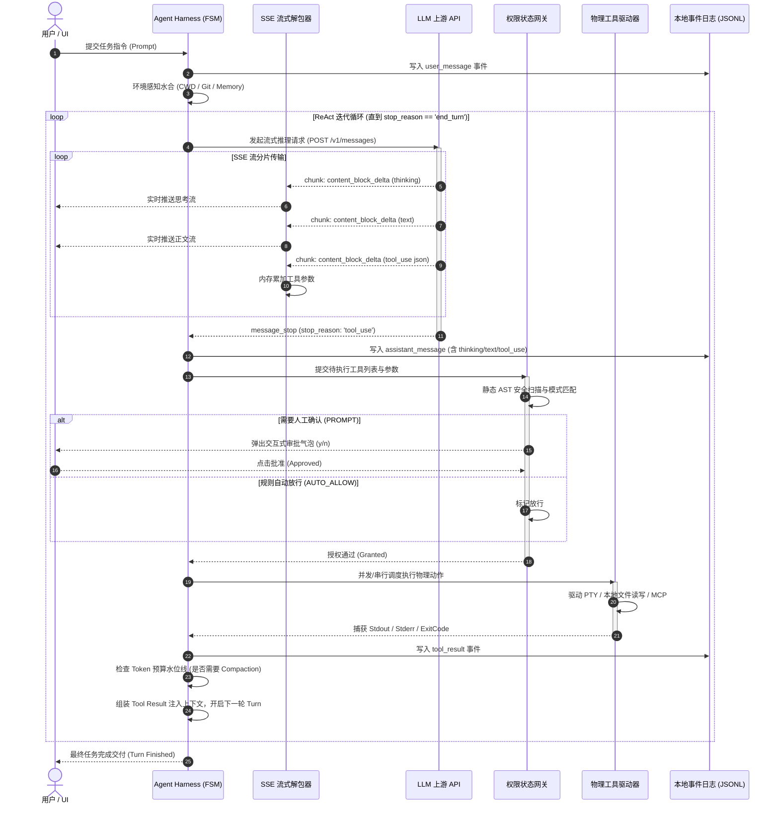

# 01-01 ReAct 核心事件循环与状态机生命周期

> **“在现代工业级 Agent 运行时中，ReAct 不仅是一种提示词工程（Prompt Engineering）技巧，而是一套严密、确定性且具备高容错能力的有限状态机（Finite State Machine, FSM）与异步事件总线（Event Loop）。”**

---

## 1. 章节导读与核心命题

作为当今工业界最强大的编码 Agent（Coding Agent）实现之一，Anthropic **Claude Code** 将大模型的长程规划、工具调用、权限审批与上下文管理收敛于一套极为紧凑且高效的 **ReAct 核心事件循环** 中。

许多开发者误以为 Agent 就是写一个简单的 `while (hasToolCalls)` 循环，但在实际工程中，面对网络闪断、Token 超限、思考流截断、破坏性操作审批挂起、并发子代理分流等现实复杂工况时，简陋的 `while` 循环会瞬间陷入死锁、状态错乱或递归爆栈。

本节将深入 Claude Code 的架构内核，逐行解构其 **ReAct 事件循环（Reasoning + Acting Loop）的状态机生命周期、消息轮次迭代拓扑、流式协议解包通道与异常恢复模型**。

```
                  ┌─────────────────────────────────────────────────────────┐
                  │                   用户输入 (User Prompt)                │
                  └────────────────────────────┬────────────────────────────┘
                                               │
                                               ▼
┌───────────────────────────────────────────────────────────────────────────────────────────┐
│                           Claude Code Agent ReAct 核心事件循环                             │
│                                                                                           │
│       ┌───────────────┐        ┌───────────────────┐        ┌───────────────────┐         │
│       │  INIT / IDLE  │ ─────> │ CONTEXT_HYDRATION │ ─────> │ MODEL_STREAM_INIT │         │
│       └───────────────┘        └───────────────────┘        └─────────┬─────────┘         │
│               ▲                                                       │                   │
│               │                                                       ▼                   │
│       ┌───────┴───────┐        ┌───────────────────┐        ┌───────────────────┐         │
│       │   COMPACTION  │ <───── │   EXECUTE_TOOLS   │ <───── │ PERMISSION_GATING │         │
│       │  & TURN_END   │        │  (Parallel/Async) │        │  (4-State Machine)│         │
│       └───────────────┘        └───────────────────┘        └───────────────────┘         │
│               │                          │                                                │
│               └──────────────────────────┴──────── (Next Turn / Iteration) ───────┐      │
│                                                                                   │      │
└───────────────────────────────────────────────────────────────────────────────────┼──────┘
                                                                                    │
                                                                                    ▼
                                                                        [循环直到 stop_reason = end_turn]
```

---

## 2. 核心专业术语与概念精确释义

为了确保概念的教科书级严谨性，本节对涉及的核心术语定义如下：

| 专业术语 (Terminology) | 中文标准译名 | 底层架构定义与机制说明 |
| :--- | :--- | :--- |
| **ReAct Loop** | **推理-行动迭代循环** | 一种将大模型的隐式思考推理（Reasoning/Thinking）与显式物理动作（Acting/Tool Use）交替执行的闭环控制算法。每次 Action 的执行结果（Observation）将作为新上下文反馈给下一次推理。 |
| **Finite State Machine (FSM)** | **有限状态机** | 一种表示有限个状态以及在这些状态之间的转移和动作等行为的数学计算模型。Agent Harness 依靠 FSM 确保执行流的单向确定性与非法状态拦截。 |
| **Stop Reason** | **停机原因 / 终止判据** | 大模型完成单次 Forward 输出时由上游服务商返回的终止标记（如 `end_turn` 正常结束、`tool_use` 请求调用工具、`max_tokens` 长度截断、`stop_sequence` 命中停用词）。 |
| **Thinking Stream (`<thought>`)** | **显式思考流** | Claude 3.7 / DeepSeek 等推理模型在输出最终答案前，生成的链式思考（Chain-of-Thought）原始 Token 流。Harness 必须将其与正文文本流和工具参数流在传输层解耦。 |
| **Tool Use Block** | **工具调用块** | LLM API 返回的结构化内容块，包含 `id`、`name` 和符合 JSON Schema 的 `input` 参数对象。 |
| **Tool Result Block** | **工具执行反馈块** | 运行时将工具物理执行的 Stdout/Stderr 或结构化数据封装为 `role: "user"`（或专门的 `tool_result` 结构）回传给模型的载荷。 |
| **Turn / Round** | **对话轮次 / 迭代回合** | 从用户发起输入或 Harness 提交前一轮工具结果，到大模型完成响应并产生新的动作或结束标记的单次完整交互。 |
| **Backoff & Jitter** | **指数退避与抖动** | 面对网络错误（5xx）或限流（429）时，采用 $T = \text{base} \times 2^{\text{attempt}} + \text{random\_jitter}$ 计算重试间隔的弹性容错算法。 |

---

## 3. Claude Code ReAct 状态机的六大生命周期阶段

Claude Code 将 Agent 的单次完整任务执行严格划分为 6 个确定性的状态阶段：

```
 [Phase 1: IDLE / INIT]
          │
          ▼
 [Phase 2: PERCEIVE & HYDRATE]  ── (注入: CWD / Git Snapshot / MEMORY.md / Rules)
          │
          ▼
 [Phase 3: INFER & STREAM]      ── (流式解包: Thinking -> Text -> Tool_Use)
          │
          ├─────────────────────────┬─────────────────────────┐
          ▼                         ▼                         ▼
   [Case A: tool_use]      [Case B: end_turn]       [Case C: max_tokens]
          │                         │                         │
          ▼                         ▼                         ▼
 [Phase 4: PERM_GATE]          [Phase 6: TERM]        [Phase 2.5: COMPACT]
          │                     (输出交付，就绪)       (长文本修剪，续跑)
          ▼
 [Phase 5: EXEC_TOOL]
          │
          ▼
  (组装 Tool_Result) ───> [回到 Phase 2 / Phase 3 发起下一轮]
```

### 3.1 Phase 1: 状态初始化与会话绑定 (INIT / IDLE)
- 验证当前 Session ID、环境变量、模型名称与配额配置；
- 初始化或挂载本地事务日志文件（`~/.claude/projects/.../transcripts/<session_id>.jsonl`）；
- 注册信号监听器（`SIGINT`、`SIGTERM`、终端窗口变化 `SIGWINCH`）。

### 3.2 Phase 2: 环境感知与上下文水合 (PERCEIVE & HYDRATE)
在将 Prompt 递交给模型之前，Harness 执行动态环境探针：
1. **静态层对齐**：系统核心角色提示词、全局操作规范；
2. **工具 Schema 注册**：将当前已激活的所有 Built-in Tools 与 MCP Tools 的 JSON Schema 进行全量注入；
3. **动态环境快照（Dynamic Probes）**：执行 `pwd`、`git status --short`、`git rev-parse --short HEAD` 获取物理事实；
4. **记忆召回（Memory Retrieval）**：读取 `MEMORY.md` 索引，根据用户当前输入做语义相似度或规则过滤，注入精准知识。

### 3.3 Phase 3: 流式推理与三通道解包 (INFER & STREAM)
建立长连接流式请求（SSE 或 WebSocket），在此阶段 Harness 必须实现 **三通道实时分流解码器**：
- **通道 1：Thinking 思考流**：实时推送到 UI 面板或折叠渲染，不作为工具参数；
- **通道 2：Text 回复流**：实时流式输出到终端 PTY 或 WebUI 气泡；
- **通道 3：Tool_Use 语法块组装器**：在内存中并行累加各工具的 JSON 分片，直至收到完整的 `content_block_stop`。

### 3.4 Phase 4: 权限状态机拦截与审批流 (PERMISSION_GATING)
当模型输出了一个或多个 `tool_use` 请求后，FSM 绝不直接执行物理命令，而是进入安全网关拦截：
- 评估当前会话的权限模式（`default` / `accept-reads` / `dont-ask` / `bypass`）；
- 若为只读工具（如 `Read`、`Glob`）且处于 `accept-reads` 模式，直接放行；
- 若为写操作或高危 Bash 命令（如包含 `rm`、`kill`、`git push` 等 AST 特征），挂起 FSM，触发双端 **HITL 审批交互**；
- 收到用户授权信号后，进入下一状态；若用户拒绝，生成 `PermissionDenied` 的反馈帧。

### 3.5 Phase 5: 工具并行分发与环境执行 (EXECUTE_TOOLS)
- 解析工具调用列表。若包含多个无状态冲突的只读工具，允许并行 `Promise.allSettled` 执行；
- 若包含 Bash 或写文件工具，按串行拓扑执行；
- 执行层必须包含 **硬超时防护、Stdout 截断守护与 ANSI 清理**；
- 生成符合协议的 `tool_result` 内容块。

### 3.6 Phase 6: 上下文收割与结束判断 (HARVEST & COMPACT)
- 检查大模型的 `stop_reason`：
  - 若为 `end_turn`：本次任务交互完成，重置状态回 `IDLE`，等待用户下一次输入；
  - 若为 `tool_use`：将本轮大模型的 Assistant Message 与物理环境生成的 Tool Results 追加到上下文，**递增 Turn 计数器**，无缝返回 Phase 2 开启下一轮迭代；
  - 若为 `max_tokens`：触发紧缩修剪逻辑，请求模型从中断点继续输出。

---

## 4. 核心协议 Payload 与数据结构源码解构

### 4.1 ReAct 核心循环 TypeScript 状态机模型

以下是工业级 ReAct 循环的核心状态转移引擎实现模型：

```typescript
/**
 * ReAct 循环状态枚举
 */
export enum ReActState {
  IDLE = 'IDLE',
  HYDRATING = 'HYDRATING',
  STREAMING = 'STREAMING',
  GATING = 'GATING',
  EXECUTING = 'EXECUTING',
  COMPACTING = 'COMPACTING',
  COMPLETE = 'COMPLETE',
  ERROR = 'ERROR'
}

/**
 * 单轮 ReAct 迭代的上下文载荷
 */
export interface ReActTurnContext {
  readonly sessionId: string;
  readonly turnIndex: number;
  readonly parentTurnId?: string;
  messages: Array<ModelMessage>;
  pendingToolCalls: Array<ToolUseBlock>;
  executedToolResults: Array<ToolResultBlock>;
  tokenUsage: {
    inputTokens: number;
    outputTokens: number;
    cacheReadTokens: number;
    cacheWriteTokens: number;
  };
  aborted: boolean;
}

/**
 * 大模型流式 Content Block 协议结构
 */
export type ContentBlock = 
  | { type: 'thinking'; thinking: string; signature?: string }
  | { type: 'text'; text: string }
  | { type: 'tool_use'; id: string; name: string; input: Record<string, unknown> };

export interface ModelMessage {
  role: 'user' | 'assistant' | 'system';
  content: string | Array<ContentBlock | ToolResultBlock>;
}

export interface ToolResultBlock {
  type: 'tool_result';
  tool_use_id: string;
  content: string | Array<{ type: 'text'; text: string } | { type: 'image'; source: unknown }>;
  is_error?: boolean;
}
```

### 4.2 ReAct 单轮迭代请求与响应的完整 Wire Payload 范例

#### (1) Assistant 返回 `tool_use` 的上行响应帧 (SSE Stream Aggregate)
```json
{
  "id": "msg_01XyZ882910a",
  "type": "message",
  "role": "assistant",
  "model": "claude-opus-5",
  "stop_reason": "tool_use",
  "content": [
    {
      "type": "thinking",
      "thinking": "用户要求查看当前的 git 分支状态并检查 package.json 是否有更新。我需要先调用 Bash 工具执行 git status，然后再读取 package.json 文件。"
    },
    {
      "type": "text",
      "text": "我正在检查当前 Git 工作区状态和项目依赖..."
    },
    {
      "type": "tool_use",
      "id": "call_bash_001",
      "name": "Bash",
      "input": {
        "command": "git status --short",
        "description": "Check modified files in workspace"
      }
    },
    {
      "type": "tool_use",
      "id": "call_read_002",
      "name": "Read",
      "input": {
        "file_path": "/Users/model/projects/feature/ai_home/package.json",
        "limit": 50
      }
    }
  ],
  "usage": {
    "input_tokens": 15200,
    "output_tokens": 185,
    "cache_read_input_tokens": 14800,
    "cache_creation_input_tokens": 0
  }
}
```

#### (2) Harness 执行物理工具后回传的下行请求帧 (Next Turn Request)
```json
{
  "model": "claude-opus-5",
  "messages": [
    {
      "role": "user",
      "content": "请检查当前工作区状态"
    },
    {
      "role": "assistant",
      "content": [
        {
          "type": "text",
          "text": "我正在检查当前 Git 工作区状态和项目依赖..."
        },
        {
          "type": "tool_use",
          "id": "call_bash_001",
          "name": "Bash",
          "input": { "command": "git status --short", "description": "Check modified files" }
        },
        {
          "type": "tool_use",
          "id": "call_read_002",
          "name": "Read",
          "input": { "file_path": "/Users/model/projects/feature/ai_home/package.json", "limit": 50 }
        }
      ]
    },
    {
      "role": "user",
      "content": [
        {
          "type": "tool_result",
          "tool_use_id": "call_bash_001",
          "content": " M docs/harness-book/README.md\n?? docs/harness-book/01-claude-code/"
        },
        {
          "type": "tool_result",
          "tool_use_id": "call_read_002",
          "content": "{\n  \"name\": \"ai_home\",\n  \"version\": \"2.4.0\",\n  \"main\": \"dist/index.js\"\n}"
        }
      ]
    }
  ]
}
```

---

## 5. ReAct 核心事件循环时序流与源码级调用栈

### 5.1 完整 ReAct 循环流式时序图 (Sequence Diagram)



### 5.2 核心源码级调用栈 (Source Call Stack)

```
[AgentLoopEngine.executeTask] ────────────────────────── (核心入口: 调度整个 ReAct 生命期)
  │
  ├── [ContextManager.assembleInitialContext] ──────── (注入 System Prompt, Tools, Env Probes)
  │     ├── [EnvironmentProbe.snapshot] ────────────── (采集 cwd, git sha, platform)
  │     └── [MemoryStore.queryRelevant] ────────────── (语义检索 MEMORY.md 规则)
  │
  └── while (!context.isTerminal()) ────────────────── (核心 ReAct 状态机循环)
        │
        ├── [LLMClient.streamMessages] ─────────────── (发起流式 HTTP SSE/WebSocket 连接)
        │     └── [ResponseStreamParser.feed] ──────── (解包器: 分离 thinking/text/tool_use)
        │           ├── emit('thinking', delta)
        │           ├── emit('text', delta)
        │           └── onComplete('tool_use', block)
        │
        ├── [PermissionManager.verifyPolicies] ─────── (安全拦截与权限门禁)
        │     ├── [AstCommandAnalyzer.analyze] ─────── (扫描 rm, sudo, curl 危险特征)
        │     └── [ApprovalBridge.awaitUserChoice] ── (若需审批: 挂起等待终端/WebUI 输入)
        │
        ├── [ToolExecutionPipeline.run] ────────────── (工具物理执行器)
        │     ├── [BashToolDriver.spawnPty] ────────── (PTY 进程安全包装，带 Timeout 守护)
        │     ├── [FileEditDriver.applyPatch] ──────── (原子化写文件与 AST 指纹校验)
        │     └── [OutputTruncator.clamp] ──────────── (超长日志防爆截断: 保留前100+后200行)
        │
        ├── [ContextCompactor.compactIfNeeded] ─────── (滑动窗口水位线检测与结构化折叠)
        └── [WALJournal.flushTurn] ─────────────────── (持久化当前轮次事件到 JSONL)
```

---

## 6. 异常边界、容错矩阵与死循环防御

在长程自主 ReAct 循环中，以下五大异常场景必须在 Harness 状态机层提供确定性防御：

```
                           ReAct 运行时异常防御矩阵
                                      │
    ┌─────────────────┬───────────────┴───────────────┬─────────────────┐
    ▼                 ▼                               ▼                 ▼
[死循环与重复震荡]   [网络退避与抖动]               [流式中断与半包]   [级联失败熔断]
 (Infinite Ping)   (429/502 Exponential Backoff)  (Partial Stream)   (Tool Cascading)
```

### 6.1 死循环与重复震荡防御 (Infinite Ping-Pong Detection)
- **触发机理**：大模型调用 `Read` 读取一个不存在的文件，报错后模型没有修改逻辑，再次尝试调用 `Read` 相同文件，连续触发数十次无意义消耗。
- **Harness 防御算法**：
  1. 维护最近 5 轮 Tool Calls 的 **SHA-256 指纹滑窗队列**：$H = \text{Hash}(\text{tool\_name} + \text{canonical\_json\_params})$；
  2. 若检测到完全相同的工具及参数在连续 3 轮中重复出现且均返回失败：
  3. Harness 强制阻断执行，合成一条显式系统干预提示注入模型：
     `"[SYSTEM GUARD]: You have called tool 'X' with identical arguments 3 times and received the same error. Stop repeating this action. Re-evaluate your strategy or ask the user."`

### 6.2 网络瞬断、429 限流与指数退避 (Backoff with Jitter)
- **触发机理**：上游 API 偶发 502/503 或突发 429 Rate Limit。
- **Harness 防御算法**：
  - 严禁在 ReAct 循环内部直接向用户抛出异常中断；
  - 启动带抖动的指数退避重试器：
    $$\text{Delay} = \min(\text{MaxDelay}, \text{InitialDelay} \times 2^{\text{retry\_count}}) \pm \text{Uniform}(0, \text{Jitter})$$
  - 重试期间通过状态机向 UI 抛出 `RETRYING` 瞬态事件，并在控制台显示倒计时，最大重试 5 次后再升级为 Fatal 异常。

### 6.3 思考流过大吃光 Token 预算 (Thinking Starvation)
- **触发机理**：推理模型（如 Claude 3.7 Thinking / DeepSeek R1）将绝大部分 `max_tokens` 消耗在 `<thought>` 思考过程中，导致正文尚未输出即触发 `stop_reason = 'max_tokens'`。
- **Harness 防御算法**：
  - 严格限制 `thinking.budget_tokens` 与 `max_tokens` 的保留差值（例如保留至少 4,096 tokens 给 Answer 和 Tool Use）；
  - 若截断发生，Harness 捕获半包并自动发起带历史前缀的 continuation 请求，拼接未完成的 JSON 语法树。

---

## 7. 对 ai_home 自主 Harness 研发的落地指导与架构设计

针对 `ai_home` 项目当前已有的架构基础，研发下一代生产级 Agent ReAct 运行时必须落地以下具体设计规范：

### 7.1 设计规范一：重构统一的 `AgentEventLoop` 引擎核心
- **当前现状**：`ai_home` 目前存在部分逻辑直接依赖 Provider 客户端的简单回调，缺乏统一的事件循环中枢。
- **重构方案**：
  1. 新建 `lib/runtime/agent-event-loop.ts`，基于 Node.js `EventEmitter` 构建纯状态机驱动的执行中枢；
  2. 严格将一次会话划分为 `INIT` -> `PERCEIVE` -> `INFER` -> `GATE` -> `EXECUTE` -> `HARVEST` 六大状态；
  3. 彻底解耦“物理工具执行”与“模型流式传输”，使两者成为事件总线上的可插拔消费者。

### 7.2 设计规范二：构建防重入与带指纹追踪的 Tool Dispatcher
- **落地方案**：
  1. 在 `lib/tools/dispatcher.ts` 中加入工具调用指纹记录表（`ToolCallDeduplicator`）；
  2. 当大模型在一轮中并行返回多个工具调用时：
     - 若全部为无副作用的只读工具（`isReadOnly: true`），并行分发给 worker pool；
     - 若包含任何有副作用的写工具（`isDestructive: true`），强行转换为拓扑串行队列执行；
  3. 任何工具调用执行时间超过预设（如 Bash 120s，Read 5s）必须触发带超时的 AbortSignal。

### 7.3 设计规范三：双端完全等价的非阻塞审批网桥 (Unified Approval Bridge)
- **落地方案**：
  1. 当状态机流转到 `GATING` 阶段时，生成全局唯一 `approvalId`，并将当前 AgentLoop 挂起在一个 `Promise<ApprovalResult>` 上；
  2. 同时向 WebSocket（WebUI 客户端）与 PTY Stdout（终端用户）广播审批请求帧；
  3. 无论哪一端先提交了 `APPROVE` 或 `REJECT`，网桥立即 `resolve` 该 Promise，恢复 AgentLoop 运行，并向另一端广播已审批状态，防止两端状态不一致。

---

## 8. 本章小结与下章预告

本章对 **Claude Code** 核心的 ReAct 事件循环进行了源码级、状态机级与数据流协议级的全面解构，揭示了生产级 Agent 运行时在生命周期管理、流式解包、并发调度与容错自愈上的架构本质，并给出了 `ai_home` 运行时的具体落地重构规范。

在下一章 **【01-02 工具系统（Tools Protocol）、动态注入与执行沙箱】** 中，我们将深入剖析 Claude Code 的工具协议设计，详细拆解其 `Read`、`Edit`、`Bash` 等核心工具的高性能实现原理、AST 补丁机制以及基于 OS/Worktree 的多层防御沙箱体系。
