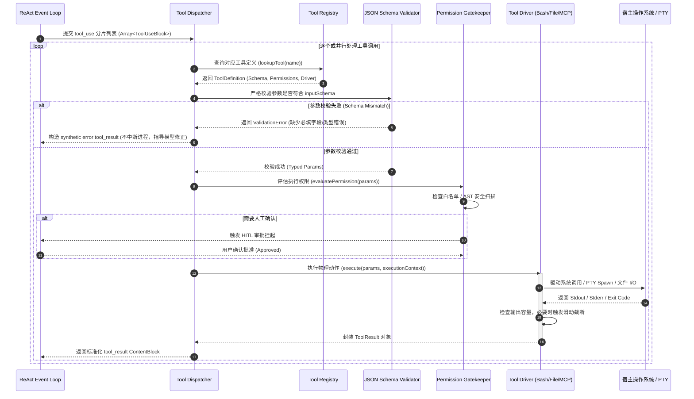

# 01-02 工具系统（Tools Protocol）、动态注入与执行沙箱

> **“在 Agent 运行时中，工具（Tools）是无状态大模型触达物理世界的唯一‘手与眼’。一套健壮的工具系统必须同时解决：精确的语义表达、严格的参数类型约束、毫秒级的物理执行隔离与不可逆副作用的安全防护。”**

---

## 1. 章节导读与核心命题

大语言模型（LLM）的本质是概率图灵机，其自身无法感知外部时间、无法直接读取硬盘扇区、更无法修改任何一行代码。**工具调用协议（Tool Use Protocol）与执行沙箱（Execution Sandbox）** 是连接模型数字认知与物理操作系统环境的确定性桥梁。

在 Anthropic **Claude Code** 的架构中，工具系统经历了从早期简单的 `eval()` 脚本式执行，到现代标准化、高内聚、沙箱化、动态发现（MCP）的工业级工具运行时的演进。

本节将系统解构 Claude Code 的工具系统底层实现，包括：
1. **Tools Wire Protocol 规范与 JSON Schema 严格校验机制**；
2. **核心工具集（Read / Edit / Write / Bash）的高性能实现与源码细节**；
3. **动态工具注入与 Model Context Protocol (MCP) 运行时桥接**；
4. **多层执行沙箱、OS 级限制（Sandbox-exec / Seccomp）与 Git Worktree 隔离机制**；
5. **对 `ai_home` 自主 Harness 工具总线研发的架构落地指导**。

```
┌────────────────────────────────────────────────────────────────────────────────────────────┐
│                               Claude Code 工具运行时子系统                                  │
│                                                                                            │
│  ┌──────────────────────────────────────────────────────────────────────────────────────┐  │
│  │                               Tools Registry & Ingestion                              │  │
│  │  ┌───────────────────────┐  ┌────────────────────────┐  ┌─────────────────────────┐  │  │
│  │  │  Built-in Core Tools  │  │  Dynamic Plugin Tools  │  │    MCP Client Bridge    │  │  │
│  │  │  (Read/Edit/Bash...)  │  │  (Skills / Subagents)  │  │ (Stdio/SSE MCP Servers) │  │  │
│  │  └───────────┬───────────┘  └───────────┬────────────┘  └────────────┬────────────┘  │  │
│  └──────────────┼──────────────────────────┼────────────────────────────┼───────────────┘  │
│                 ▼                          ▼                            ▼                  │
│  ┌──────────────────────────────────────────────────────────────────────────────────────┐  │
│  │                         Tool Schema Compiler & Token Budgeter                        │  │
│  │     - JSON Schema 编译与类型严格化     - Tools Prompt 注入器 (按需/延迟加载)              │  │
│  └─────────────────────────────────────────┬────────────────────────────────────────────┘  │
└────────────────────────────────────────────┼───────────────────────────────────────────────┘
                                             │ JSON Schema Definitions
                                             ▼
                               ┌───────────────────────────┐
                               │  LLM Inference (API Wire) │
                               └─────────────┬─────────────┘
                                             │ Tool Use Action Frame (tool_use)
                                             ▼
┌────────────────────────────────────────────────────────────────────────────────────────────┐
│                             Tool Dispatcher & Security Sandbox                             │
│                                                                                            │
│  ┌─────────────────────────┐  ┌─────────────────────────┐  ┌────────────────────────────┐  │
│  │   AST Parameter Check   │  │ Permission Gatekeeper   │  │   Isolation Environment    │  │
│  │  (JSON Schema Validator)│  │ (Default/Accept/Bypass) │  │ (OS Sandbox / Worktree)    │  │
│  └────────────┬────────────┘  └────────────┬────────────┘  └─────────────┬──────────────┘  │
│               ▼                            ▼                             ▼                 │
│  ┌──────────────────────────────────────────────────────────────────────────────────────┐  │
│  │                                Tool Execution Drivers                                │  │
│  │  ┌────────────────┐  ┌────────────────┐  ┌────────────────┐  ┌────────────────────┐  │  │
│  │  │  File Driver   │  │  Pty Process   │  │ AST Patch Eng  │  │   Network Client   │  │  │
│  │  │ (Atomic/Paged) │  │ (Timeout/Tree) │  │(Unique Replace)│  │ (MCP JSON-RPC Bus) │  │  │
│  │  └────────────────┘  └────────────────┘  └────────────────┘  └────────────────────┘  │  │
│  └─────────────────────────────────────────┬────────────────────────────────────────────┘  │
└────────────────────────────────────────────┼───────────────────────────────────────────────┘
                                             │ Tool Result Observation Frame (tool_result)
                                             ▼
                               ┌───────────────────────────┐
                               │  Next ReAct Turn Context  │
                               └───────────────────────────┘
```

---

## 2. 核心专业术语与概念精确释义

| 专业术语 (Terminology) | 中文标准译名 | 底层架构定义与机制说明 |
| :--- | :--- | :--- |
| **Tool Calling / Tool Use** | **工具调用** | 模型在生成文本流时，依据预先注入的 Schema 生成结构化参数并请求宿主环境执行特定函数或系统指令的协议机制。 |
| **JSON Schema** | **JSON 模式定义** | 一种基于 JSON 格式定义数据结构的标准化规范。用于向大模型精确描述工具名称、字段类型（string/number/array/object）、必填项及字段释义。 |
| **AST (Abstract Syntax Tree)** | **抽象语法树** | 源代码语法结构的一种树状抽象表示。工具系统利用 AST 解析 Bash 命令、源码 Patch，以实现精准的指令安全审计与无损代码替换。 |
| **PTY (Pseudoterminal)** | **伪终端设备** | 一对虚拟字符设备（Master 与 Slave），用于在没有物理硬件终端的情况下为子进程提供完整的 TTY 终端环境（支持 ANSI 转义序列、作业控制与交互缓冲区）。 |
| **Model Context Protocol (MCP)** | **模型上下文协议** | Anthropic 推出的跨进程、跨网络标准化协议。允许 Agent Harness 通过统一的 JSON-RPC 2.0 规范接入第三方数据源与工具服务（如 GitHub、Postgres、Slack）。 |
| **OS-level Sandboxing** | **操作系统级沙箱** | 利用宿主内核特性（macOS 的 `sandbox-exec`/Seatbelt、Linux 的 `seccomp-bpf`/`bubblewrap`）对 Agent 子进程的系统调用（Syscall）、文件读写与网络访问进行内核层硬性拦截。 |
| **Git Worktree** | **Git 工作树隔离区** | Git 原生支持的多工作区机制，允许在同一个仓库的同一个 `.git` 对象库下，检出不同的分支或 Commit 到不同的独立文件目录，实现多 Agent 零拷贝并发工作空间隔离。 |
| **Atomic Write** | **原子化写入** | 保证文件写入操作“要么完全成功生效，要么完全不发生修改”的技术（通常先写隐蔽临时文件，再通过内核原子重命名 `rename(2)` 替换原文件）。 |

---

## 3. 核心工具栈（Core Built-in Tools）深度源码级解构

在 Claude Code 中，最核心的物理交互集中在四个内建工具上：`Read`、`Edit`、`Write` 与 `Bash`。每个工具的设计都包含了深厚的工程考量。

### 3.1 `Read` 工具：分页、行号锚定与多模态扩展
```typescript
interface ReadToolParams {
  file_path: string;       // 绝对路径
  offset?: number;         // 起始行号 (1-indexed)
  limit?: number;          // 读取行数 (默认 2000 行)
  pages?: string;          // PDF 分页范围 (如 "1-5")
}
```
- **核心机制**：
  1. **严格绝对路径守卫**：拒绝任何相对路径，避免多目录并发时因 CWD 状态漂移读错文件；
  2. **`cat -n` 格式化注入**：每一行文本均强制前缀 `\t<line_number>\t`。这不仅让大模型具备绝对行号感知，更是后续精准 `Edit` 替换的前提；
  3. **超大文件滑动窗口截断**：单次默认上限 2,000 行。超过限制时在末尾注入结构化截断提示：`[File continues... Use offset: 2001, limit: 2000 to read next chunk]`；
  4. **多模态与二进制探针**：内置 `file-type` 探测器，若为 PNG/JPG/WebP 则转换为视觉图像载荷，若为 PDF 则调用内置解析器，若为未知二进制（如 `.so` / `.dylib`）则直接拒绝并返回元信息，防止乱码冲垮上下文。

### 3.2 `Edit` 工具：确定性唯一字符串替换（String-Anchor Replacement）
```typescript
interface EditToolParams {
  file_path: string;
  old_string: string;      // 待替换的原文本块
  new_string: string;      // 替换后的目标文本块
  replace_all?: boolean;   // 是否全量替换 (默认 false)
}
```
- **核心机制**：
  1. **Read-Before-Edit 硬性约束**：Harness 在内存中维护当前会话的 `ReadFileTracker`。如果模型试图 `Edit` 一个本会话中从未被 `Read` 过的文件，工具层直接 Fast-Fail 报错：`"You must Read the file in this conversation before editing, or the call will fail."`；
  2. **严格单匹配校验（Uniqueness Assertion）**：
     - 当 `replace_all: false` 时，Harness 在文件全文中搜索 `old_string`；
     - 若出现次数 $N = 0$，报错并提示上下文不匹配；
     - 若出现次数 $N > 1$，**坚决拒绝修改并报错**：`"old_string occurs 3 times in the file. Please provide more surrounding context lines to make it uniquely identifiable."`；
  3. **空行与缩进严格对齐**：自动剔除模型从 `Read` 复制时附带的 `cat -n` 行号前缀，但在字符串内部对 Tab 与 Space 缩进做精确匹配。

### 3.3 `Write` 工具：原子落盘与读后写保护
```typescript
interface WriteToolParams {
  file_path: string;
  content: string;
}
```
- **核心机制**：
  1. **创建与全量覆盖二相性**：若文件不存在，直接创建父目录并写入；若文件已存在，必须同样满足 Read-Before-Write 校验；
  2. **原子写入事务（Atomic Write）**：
     - 先将 `content` 写入同目录下的 `.tmp.<uuid>.<filename>`；
     - 执行 `fs.renameSync()` 原子替换；
     - 若中途进程中断或断电，原文件 100% 保持完整，杜绝产生 0-byte 的半截坏文件。

### 3.4 `Bash` 工具：PTY 终端沙箱、超时守护与进程树强杀
```typescript
interface BashToolParams {
  command: string;
  description: string;     // 5-10 个词的简要意图描述 (用于 UI 与审批)
  timeout?: number;        // 超时毫秒数 (默认 120000ms, 上限 600000ms)
  run_in_background?: boolean;
}
```
- **核心机制**：
  1. **非交互环境伪装**：自动注入环境变量：`export CI=true TERM=dumb DEBIAN_FRONTEND=noninteractive`，并关闭各种 CLI 工具的交互提示（如 `git --no-pager`、`npm --yes`）；
  2. **PTY 缓冲区捕获与 ANSI 清洗**：使用 `node-pty` 分配独立的 Master/Slave 虚拟终端，捕获子进程包括色彩控制在内的全部输出，并利用流式正则清洗掉对 LLM 无意义的 ANSI Cursor Jump 控制字符；
  3. **进程树级杀灭（Process Tree SIGKILL）**：
     - 很多脚本会启动子进程（如 `npm run dev` 唤起 `vite` 和 `esbuild`）；
     - 超时发生时，普通的 `process.kill(pid)` 只能杀掉父脚本，子进程沦为孤儿守护进程；
     - Claude Code 通过执行 `pgrep -P <pid>` 递归获取所有子孙 PID，先发送 `SIGTERM`，等待 500ms，未退出则全量发送 `SIGKILL -<pgid>` 彻底清场。

---

## 4. 动态工具注入与 Model Context Protocol (MCP) 运行时桥接

除了静态编译的内置工具外，现代 Harness 必须支持动态工具扩展。Claude Code 通过 **MCP 客户端桥接器** 实现了热插拔能力。

```
┌────────────────────────────────────────────────────────────────────────────────────────┐
│                              Harness MCP Bridge Architecture                           │
│                                                                                        │
│  ┌───────────────────────┐                                                             │
│  │   LLM Tool Request    │                                                             │
│  │ (mcp__github__get_pr) │                                                             │
│  └───────────┬───────────┘                                                             │
│              ▼                                                                         │
│  ┌──────────────────────────────────────────────────────────────────────────────────┐  │
│  │                            McpBridge Router / Dispatcher                         │  │
│  │  1. 拦截以 mcp__<server>__<tool> 命名的外部工具调用                                   │  │
│  │  2. 映射为对应 MCP Server 实例与标准 JSON-RPC 2.0 请求 payload                     │  │
│  └───────────┬──────────────────────────────────────────────────────┬───────────────┘  │
│              │ (Stdio Transport: Subprocess stdin/stdout)           │ (SSE HTTP)       │
│              ▼                                                      ▼                  │
│  ┌────────────────────────┐                             ┌────────────────────────┐     │
│  │ GitHub MCP Server (CLI)│                             │ Remote Enterprise DB   │     │
│  │ (stdio: node server.js)│                             │ (https://mcp.corp/sse) │     │
│  └────────────────────────┘                             └────────────────────────┘     │
└────────────────────────────────────────────────────────────────────────────────────────┘
```

### 4.1 MCP 工具命名的双下划线命名空间编码
为了防止第三方 MCP 工具与 Harness 内置工具发生重名冲突，系统采用结构化命名空间映射：
$$\text{ToolName}_{\text{Exposed}} = \text{mcp}\_\_\langle \text{server\_name} \rangle\_\_\langle \text{method\_name} \rangle$$
*例如*：`mcp__sqlite__query_records` 明确映射到名为 `sqlite` 的 MCP 服务器上的 `query_records` 工具。

### 4.2 MCP 运行时通信协议帧 (JSON-RPC 2.0 Wire Protocol)

#### (1) 工具能力发现请求与响应 (`tools/list`)
```json
// Harness 发送给 MCP Server 的初始化发现请求
{
  "jsonrpc": "2.0",
  "id": 1,
  "method": "tools/list",
  "params": {}
}

// MCP Server 返回的工具能力 Schema 列表
{
  "jsonrpc": "2.0",
  "id": 1,
  "result": {
    "tools": [
      {
        "name": "query_database",
        "description": "Execute a read-only SQL query against the target PostgreSQL instance",
        "inputSchema": {
          "type": "object",
          "properties": {
            "sql": { "type": "string", "description": "SQL query statement" }
          },
          "required": ["sql"]
        }
      }
    ]
  }
}
```

#### (2) 工具调用执行请求与响应 (`tools/call`)
```json
// Harness 路由发起的工具调用
{
  "jsonrpc": "2.0",
  "id": 2,
  "method": "tools/call",
  "params": {
    "name": "query_database",
    "arguments": {
      "sql": "SELECT id, username, email FROM users WHERE status = 'active' LIMIT 5;"
    }
  }
}

// MCP Server 返回的执行结果
{
  "jsonrpc": "2.0",
  "id": 2,
  "result": {
    "content": [
      {
        "type": "text",
        "text": "[{\"id\": 101, \"username\": \"alice\", \"email\": \"alice@example.com\"}]"
      }
    ],
    "isError": false
  }
}
```

---

## 5. 多层执行沙箱与安全隔离机制

<div id="widget-worktree-container"></div>


当 Agent 拥有执行代码和修改系统的能力时，**沙箱与隔离** 就是阻断系统灾难的最后一道防线。

```
┌────────────────────────────────────────────────────────────────────────────────────────┐
│                              多层防护执行沙箱拓扑 (Defense-in-Depth)                    │
│                                                                                        │
│  [Layer 1: 语义与权限层] ──> JSON Schema 校验 -> AST 危险指令过滤 -> 4 态权限状态机       │
│                                   │                                                    │
│                                   ▼                                                    │
│  [Layer 2: 工作区隔离层] ──> Git Worktree 临时隔离区 (隔离代码脏写，支持一键丢弃)        │
│                                   │                                                    │
│                                   ▼                                                    │
│  [Layer 3: 进程与资源层] ──> PTY 进程树组隔离 (Setpgid) + 硬超时守护 + 内存配额 (Ulimit) │
│                                   │                                                    │
│                                   ▼                                                    │
│  [Layer 4: 操作系统内核] ──> macOS sandbox-exec (Seatbelt) / Linux Bubblewrap (bwrap) │
└────────────────────────────────────────────────────────────────────────────────────────┘
```

### 5.1 macOS 内核级沙箱配置范例 (Seatbelt Profile)
在 macOS 上，Harness 可以通过 `sandbox-exec` 启动子进程，利用 Scheme 语言定义的规则限制子进程的系统调用：

```scheme
;; 极度严格的只读探索沙箱 Profile
(version 1)
(deny default)

;; 允许基本的进程生命周期与控制台输入输出
(allow process-exec*)
(allow process-fork)
(allow sysctl-read)
(allow file-read* (subpath "/Users/model/projects/feature/ai_home"))
(allow file-read* (subpath "/usr/lib"))
(allow file-read* (subpath "/System/Library"))
(allow file-read* (subpath "/opt/homebrew"))

;; 显式禁止任何网络连接与写操作
(deny network*)
(deny file-write*)
```

### 5.2 Git Worktree 事务性工作空间隔离
当需要运行可能产生未知破坏性重构的任务，或者唤起子代理（Subagent）并行作业时，Harness 动态创建独立的 Git Worktree：
1. **创建影子隔离区**：
   ```bash
   git worktree add -b agent/sandbox-task-8821 .claude/worktrees/task-8821 HEAD
   ```
2. **重定向执行上下文**：将子代理的 `CWD` 绑定到 `.claude/worktrees/task-8821`；
3. **完成验收与合并策略**：
   - 若任务成功且通过评审：在主工作区执行 `git merge` 并安全删除该 Worktree；
   - 若任务失败或用户中止：直接执行 `git worktree remove --force .claude/worktrees/task-8821` 并删除分支，主工作区毫发无伤。

---

## 6. 工具调度状态机时序图与核心源码调用栈

### 6.1 工具生命周期执行时序图 (Tool Execution Sequence)



### 6.2 核心源码级调用栈 (Source Call Stack Trace)

```
[ToolDispatcher.dispatch] (lib/tools/dispatcher.ts:45)
  │
  ├── [ToolRegistry.find] (lib/tools/registry.ts:88)
  │     └── [McpServerManager.resolveTool] (lib/mcp/manager.ts:134)
  │
  ├── [JsonSchemaValidator.validateOrThrow] (lib/tools/validator.ts:32)
  │
  ├── [PermissionGatekeeper.assertAccess] (lib/security/gatekeeper.ts:95)
  │     ├── [AstCommandAnalyzer.scan] (lib/security/ast-scanner.ts:40)
  │     └── [ApprovalBridge.requestApproval] (lib/approval/bridge.ts:112)
  │
  └── [ToolDriver.execute] (lib/tools/drivers/index.ts:77)
        ├── [BashToolDriver.run] (lib/tools/drivers/bash.ts:110)
        │     ├── [PtyManager.create] (lib/pty/manager.ts:48)
        │     ├── [OutputTruncationStream.pipe] (lib/pty/truncator.ts:65)
        │     └── [TimeoutGuard.arm] (lib/pty/timeout.ts:28)
        ├── [FileEditDriver.applyExactReplace] (lib/tools/drivers/edit.ts:54)
        │     ├── [ReadFileTracker.assertRead] (lib/tools/drivers/tracker.ts:19)
        │     └── [AtomicFileWriter.write] (lib/fs/atomic.ts:33)
        └── [McpJsonRpcClient.callTool] (lib/mcp/client.ts:180)
```

---

## 7. 极端异常边界与防御治理策略

| 异常边界场景 | 物理成因与危害 | Harness 核心防线与自愈算法 (Self-Healing) |
| :--- | :--- | :--- |
| **1. 巨大输出冲垮上下文 (Output Bomb)** | 执行 `find /` 或 `cat large.log` 产生数百兆文本，若全量回传将直接耗尽内存并使模型 API 崩溃（HTTP 400）。 | **两级双端保护流**：<br>1. *流式实时计数器*：在 PTY 数据流到达 16KB 时自动停止接收剩余输出；<br>2. *头尾保留修剪法（Head-Tail Truncation）*：保留输出的前 50 行（看启动日志）与后 150 行（看核心报错），中间插入 `"\n... [15,200 lines truncated by Harness. Please refine command with grep] ...\n"`。 |
| **2. 交互式挂起死锁 (Interactive Lockup)** | 模型执行了 `git pull` 遇到密码输入提示，或者 `npm update` 弹出交互式多选菜单，PTY 永远等待 Stdin。 | **动态终端探测与超时强杀**：<br>1. 注入环境禁用一切交互式提示；<br>2. 若检测到 PTY 连续 15s 无任何 Stdout 输出且子进程仍在运行，状态机判定为疑似阻塞，发送 `Ctrl+C`；若依然未退出，按超时定时器（默认 120s）执行 `SIGKILL` 树杀。 |
| **3. Edit 冲突与幽灵修改 (Edit Conflict)** | 模型基于过期的上下文发起 `Edit`，原文本块因被外部修改而已无法匹配。 | **严禁模糊替换与友好错误导向**：<br>绝不尝试猜测模糊替换。工具层直接返回显式报错，附带当前文件的真实行片段：`"Error: old_string not found. The file content may have changed. Please use Read tool to refresh your context."`，驱动模型重新感知。 |
| **4. 参数 JSON 结构损坏 (Malformed JSON)** | 大模型在输出大参数时遇到网络抖动或长文本生成的语法幻觉，导致 JSON 漏掉括号或引号。 | **自动容错与引导重试**：<br>引入 `dirty-json` 尝试做局部容错解析；若仍彻底无法解析，拦截该错误并生成结构化提示帧：`"Invalid JSON arguments: <error>. Tool was not executed. Please retry with valid JSON schema."`。 |

---

## 8. 对 ai_home 自主 Harness 研发的落地指导与架构设计

在 `ai_home` 项目从模型网关向自主 Agent Harness 底座跃迁的过程中，工具系统的建设应全面遵循以下三大核心架构设计：

### 8.1 架构设计一：建立类型安全的统一工具总线（Universal Tool Bus）
- **当前现状**：部分工具执行逻辑散落在路由或服务层，缺乏统一的 Schema 编译、校验与结果包装。
- **重构方案**：
  1. 在 `lib/tools/` 下建立纯接口抽象 `BaseTool<TParams, TResult>`，每一个工具必须声明严格的 Zod Schema 或 JSON Schema；
  2. 统一定义输入输出协议帧，自动完成参数类型校验（Schema Validation）与错误捕获（Error Wrapping）；
  3. 内置 `Read`、`Edit`、`Write`、`Bash` 作为一级公民，并提供 Read-Before-Write/Edit 内存会话追踪器。

### 8.2 架构设计二：构建生产级 PTY 进程管理与超时防护池
- **落地方案**：
  1. 彻底淘汰简陋的 `child_process.exec`（该方法在处理大量输出或长连接时极易内存溢出），全面改用 `node-pty` 分配虚拟终端；
  2. 实现 `PtyProcessManager`，所有 Bash 命令启动时自动生成唯一的 `processId`，挂载全局 `TimeoutGuard`（默认 120s）与 `OutputTruncationStream`（默认 16KB 上限）；
  3. 支持通过 WebUI 或终端向正在运行的命令发送中断信号（`SIGINT` / `SIGKILL`）。

### 8.3 架构设计三：完整集成 Model Context Protocol (MCP) 运行时生态
- **落地方案**：
  1. 新增 `lib/mcp/` 模块，支持解析项目根目录下的 `.mcp.json` 或用户全局配置文件；
  2. 实现基于 `StdioClientTransport` 与 `SSEClientTransport` 的双向通信客户端；
  3. 在 Agent 初始化阶段，自动扫描已配置的 MCP 服务器，提取工具 Schema 并合并到主工具注册表；在工具分发时根据 `mcp__<server>__<tool>` 命名空间进行透明 RPC 路由。

---

## 9. 本章小结与下章预告

本章深入解构了现代 Agent Harness 的工具系统与沙箱设计，剖析了核心工具（`Read`、`Edit`、`Write`、`Bash`）的设计精髓、MCP 跨进程工具协议的通信机制以及多层内核/文件系统沙箱隔离方案，并为 `ai_home` 的工具中枢提供了落地方案。

在下一章 **【01-03 上下文滑动窗口、自动压缩（Auto-Compaction）与 Token 预算】** 中，我们将聚焦 Agent 运行时最核心的“内存治理”问题，拆解面对数十万 Token 的长程任务时，系统如何进行智能修剪、微观截断与宏观语义压缩，以确保执行轨迹永不触顶。
