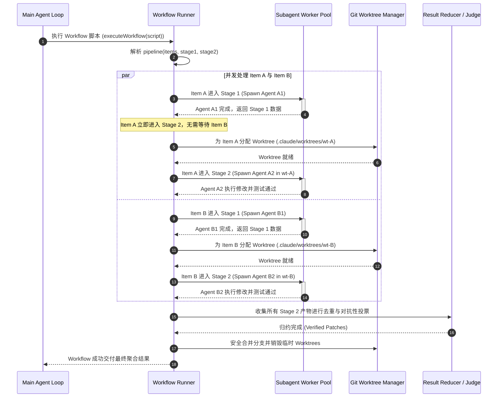

# 01-04 多 Agent 协同编排：Fork 机制、Workflow 与并发隔离

> **“单个 Agent 的上下文容量与注意力深度总有物理极限。现代工业级 Harness 解决复杂大规模软件工程难题的终极路径，是通过进程级 Fork、声明式流水线（Pipeline/Workflow）以及物理级 Git Worktree 隔离，构建多智能体协同编排网络。”**

---

## 1. 章节导读与核心命题

在面对大型工程重构、跨模块依赖分析、海量测试用例并发修复或对抗性安全审计等复杂场景时，单个 Agent 往往会陷入 **“上下文容量爆炸”** 与 **“思维惯性/单点偏见（Cognitive Bias）”** 的双重困境。

Anthropic **Claude Code** 并没有简单地堆砌提示词，而是在运行时底层构建了一套极具工程美感且高度工业化的 **多 Agent 编排子系统**：
1. **轻量级上下文派生机制（Subagent Fork）**：继承父会话上下文快照，在后台静默运行且不污染主会话；
2. **声明式流水线与工作流引擎（Workflow Engine）**：提供 `pipeline()`、`parallel()`、`agent()`、`phase()` 等确定性 JS/TS 编排原生原语；
3. **结构化产物强约束（Schema-Forced Structured Output）**：杜绝自由文本传递，通过 JSON Schema 强制子代理输出结构化数据契约；
4. **物理工作空间并发隔离（Git Worktree Isolation）**：确保并行执行写操作的子代理在完全独立的文件系统沙箱中工作，杜绝文件脏写冲突。

本节将逐层解构 Claude Code 多 Agent 编排机制的底层实现原理、通信协议帧、并发调度状态机与异常边界防御。

<div class="rich-diagram-box">
  <div class="diagram-header-tag">Multi-Agent Orchestration</div>
  <div class="diagram-title"><span>👥</span> Claude Code 多 Agent 协同编排系统架构</div>
  <div class="harness-stack">
    <div class="stack-layer">
      <div class="layer-badge">Main Agent (Parent Session - 维持用户界面与全局 Token 预算)</div>
      <div class="chips-grid-2">
        <div class="tech-card blue"><div class="card-label">Subagent Fork 派生</div><div class="card-sub">继承上下文快照，后台静默执行</div></div>
        <div class="tech-card purple"><div class="card-label">Workflow 流水线引擎</div><div class="card-sub">声明式 pipeline() / parallel() 编排</div></div>
      </div>
    </div>
    <div class="flow-connector">⬇️ 派生子代理并挂载物理隔离工作空间</div>
    <div class="stack-layer">
      <div class="layer-badge">Concurrency Pool (并发隔离池)</div>
      <div class="chips-grid-3">
        <div class="tech-card cyan"><div class="card-label">Worker 1: Read-Only</div><div class="card-sub">只读探索分析</div></div>
        <div class="tech-card orange"><div class="card-label">Worker 2: Worktree 沙箱</div><div class="card-sub">.aih/worktrees/wt-2 (修改代码)</div></div>
        <div class="tech-card green"><div class="card-label">Worker 3: 对抗性裁决</div><div class="card-sub">独立 Skeptic 盲审投票</div></div>
      </div>
    </div>
  </div>
</div>

---

## 2. 核心专业术语与概念精确释义

| 专业术语 (Terminology) | 中文标准译名 | 底层架构定义与机制说明 |
| :--- | :--- | :--- |
| **Subagent Fork** | **子代理进程派生** | 类似 POSIX `fork()` 的机制，主 Agent 将当前上下文内存镜像复制给一个全新的子代理实例，子代理在后台独立完成专项探索，其过程日志完全隔离，仅向父级返回最终摘要。 |
| **Workflow Engine** | **工作流编排引擎** | 一种在 Harness 内置的确定性代码执行环境，通过声明式 JS 脚本精确定义多 Agent 之间的并行（Parallel）、流水线（Pipeline）与阶段跃迁（Phase）控制流。 |
| **Barrier Synchronization** | **屏障同步** | 并发编排中的一种同步机制。所有并行运行的子代理必须全部到达某个执行点（Barrier）并完成输出后，流水线才允许统一汇聚并进入下一阶段。 |
| **Pipelining (Non-barrier)** | **无屏障流式流水线** | 数据项在多个处理阶段之间独立流动，先完成阶段 1 的项立即进入阶段 2，无需等待同批次其他项，以最大化消除长尾子代理的木桶延迟。 |
| **Schema-Forced Output** | **模式强约束输出** | 运行时通过底层 API 注入强制约束工具（如 `StructuredOutput`），利用大模型 Grammar 采样确保子代理返回 100% 严格符合 JSON Schema 的结构化实体。 |
| **Adversarial Verification** | **对抗性交叉验证** | 一种提高交付质量的模式：生成者 Agent 产出方案后，Harness 派生若干个以“证伪（Refute）/找茬”为唯一系统目标的独立验证者 Agent 进行盲审投票。 |
| **Worktree Isolation** | **工作树沙箱隔离** | 为每一个需要执行代码修改的子代理动态分配独立的临时 Git Worktree，各个代理在各自的文件系统分支上读写编译，互不干扰。 |
| **Loop-until-dry** | **饱和收敛循环** | 一种未知规模发现算法：持续并行唤起 Finder 探针 Agent，直到连续 $K$ 轮再无任何新发现（返回集合为空）时才宣告探索收敛。 |

---

## 3. Subagent Fork 机制：上下文克隆与静默运行原理

在单 Agent 模式下，如果需要去检索一个涉及 20 个文件的复杂问题，如果主 Agent 自己逐个读取，单单工具输出就会消耗 5 万 Token，严重污染主会话。**Fork 机制** 彻底终结了这一痛点。

```
 [Main Agent Session] (Context: 15k Tokens)
          │
          ├───────────────────────────────────────────────────────┐ (Fork Request)
          │                                                       ▼
 [Main Agent Suspended / Awaiting]                  [Forked Subagent Instance]
                                                    - 继承 15k Tokens 上下文快照
                                                    - 拥有独立 ToolRunner 与 EventLoop
                                                    - 执行: Read 20 Files (产出 50k Tokens 日志)
                                                    - 终态提取: 3 行核心结论
                                                                  │
          │ <─────────────────────────────────────────────────────┘ (Return Structured Result)
          ▼
 [Main Agent Resumes]
 (新上下文 = 原 15k Tokens + 3 行结论，50k 垃圾日志被物理丢弃)
```

### 3.1 Fork 的五大底层契约
1. **上下文快照继承（Context Inheritance）**：子代理启动时深度拷贝父代理截至当前轮次的所有消息历史，获得完整的任务背景认知；
2. **工具输出隔离（Tool Output Encapsulation）**：子代理内部发起的所有 `Read`、`Bash`、`Grep` 工具调用产生的庞大 Observation 日志，只写入该子代理独立的 JSONL 事务文件，**绝不回流**至父级上下文；
3. **模型与算力对齐**：`subagent_type: "fork"` 默认强制继承父代理的模型架构（如 Opus 5），确保推理与理解能力不发生降级；
4. **强行静默执行（Headless Execution）**：子代理的中间 Thinking 思考流与中间文本输出仅作为事件流推送到专用的 UI 抽屉面板，终端主屏保持绝对清爽；
5. **单向产物收割**：子代理的 `End Turn` 最终返回文本或结构化数据，作为父代理 `Agent` 工具调用的 `tool_result` 单次喂回。

---

## 4. Workflow 声明式流水线引擎：DSL 协议与四大编排模式

Claude Code 内置了一个基于 JavaScript 的高性能 Workflow 编排引擎，支持开发者或 Agent 自身编写声明式编排脚本。

### 4.1 Workflow 核心 DSL 原语契约
- `agent(prompt, options)`：唤起一个独立的无状态或有状态子代理；
- `pipeline(items, stage1, stage2, ...)`：无屏障流式流水线，每个 item 独立串联流转；
- `parallel([thunk1, thunk2, ...])`：屏障同步并发，等待所有任务全部完成并聚合数组；
- `phase(title)`：定义视觉与逻辑阶段（如 `Scan` -> `Verify` -> `Fix`）；
- `log(message)`：向主控制器广播进度遥测事件；
- `budget`：全局 Token 配额管理器（`budget.spent()` / `budget.remaining()`）。

### 4.2 模式一：流式无屏障流水线模式 (Pipelining Pattern - 默认推荐)
```javascript
export const meta = {
  name: 'audit-and-fix',
  description: '并行扫描安全漏洞，并在发现后立即进入验证阶段，无木桶延迟'
};

const MODULES = ['auth', 'billing', 'gateway', 'storage'];

// pipeline 中，auth 模块一旦完成 Scan，立即启动其独立的 Verify，无需等待 storage 完成 Scan
const results = await pipeline(
  MODULES,
  mod => agent(`审计模块 ${mod} 的潜在越权漏洞`, {
    phase: 'Scan',
    schema: VULNERABILITY_SCHEMA
  }),
  (scanResult, mod) => parallel(
    scanResult.findings.map(vuln => () =>
      agent(`对抗性验证漏洞真实性: ${vuln.title}`, {
        phase: 'Verify',
        schema: VERIFY_SCHEMA
      }).then(v => ({ ...vuln, verified: v.isReal }))
    )
  )
);
```

### 4.3 模式二：对抗性证伪验证面板 (Adversarial Judge Panel Pattern)

<div id="widget-judge-container"></div>


为了防止单一 Agent 的“自圆其说”幻觉，引入 $N$ 个独立的对抗性怀疑者（Skeptics）：

```
                       [Candidate Finding / Code Patch]
                                      │
              ┌───────────────────────┼───────────────────────┐
              ▼                       ▼                       ▼
      [Judge A: Correctness]    [Judge B: Security]    [Judge C: Reproducibility]
      (Prompt: 尝试全力推翻)   (Prompt: 寻找潜在后门)   (Prompt: 寻找反例用例)
              │                       │                       │
              └───────────────────────┼───────────────────────┘
                                      │
                                      ▼
                        [Majority Vote (>= 2/3 Votes)]
                                      │
                         ┌────────────┴────────────┐
                         ▼                         ▼
                     [PASS / Merge]         [REJECT / Discard]
```

```javascript
// 对抗性裁决实现代码
async function adversarialVerify(claim) {
  const SKEPTIC_LENSES = ['correctness', 'security', 'regression'];
  
  const votes = await parallel(SKEPTIC_LENSES.map(lens => () =>
    agent(`尝试以 ${lens} 视角全力推翻此结论: "${claim}". 若证据不足必须判为 refuted: true`, {
      phase: 'Verify',
      schema: {
        type: 'object',
        properties: {
          refuted: { type: 'boolean' },
          reason: { type: 'string' }
        },
        required: ['refuted', 'reason']
      }
    })
  ));
  
  // 只有少数派（< 2 人）认为被推翻，该结论才算存活
  const refutedCount = votes.filter(v => v && v.refuted).length;
  return refutedCount < 2;
}
```

### 4.4 模式三：未知规模饱和收敛循环 (Loop-Until-Dry Pattern)
```javascript
const seenIssues = new Set();
const confirmedIssues = [];
let consecutiveDryRounds = 0;

// 连续 2 轮探针均无任何新发现，判定全量扫描收敛
while (consecutiveDryRounds < 2 && budget.remaining() > 50000) {
  const found = (await parallel(EXPLORATION_PROBES.map(probe => () =>
    agent(probe.prompt, { phase: 'Explore', schema: ISSUES_SCHEMA })
  ))).filter(Boolean).flatMap(r => r.issues);

  const fresh = found.filter(item => !seenIssues.has(item.fingerprint));
  
  if (fresh.length === 0) {
    consecutiveDryRounds++;
    continue;
  }
  
  consecutiveDryRounds = 0;
  fresh.forEach(item => seenIssues.add(item.fingerprint));
  confirmedIssues.push(...fresh);
}
```

---

## 5. 基于 Git Worktree 的物理工作区并发隔离机制

当多个子代理需要并行修改代码、编译运行甚至执行 `npm test` 时，直接在宿主工作目录操作必然导致严重的**文件写覆盖（Write-Write Conflict）与编译锁冲突**。

Claude Code 引入了基于 Git Worktree 的轻量级物理隔离引擎：

```
                              Host Repository (/workspace)
                                           │
         ┌─────────────────────────────────┼─────────────────────────────────┐
         ▼                                 ▼                                 ▼
[Subagent-1 Worktree]             [Subagent-2 Worktree]             [Subagent-3 Worktree]
Path: .claude/worktrees/wt-1      Path: .claude/worktrees/wt-2      Path: .claude/worktrees/wt-3
Branch: agent/task-001            Branch: agent/task-002            Branch: agent/task-003
Isolated: node_modules, build     Isolated: node_modules, build     Isolated: node_modules, build
         │                                 │                                 │
         ▼                                 ▼                                 ▼
 (Self-contained Tests)            (Self-contained Tests)            (Self-contained Tests)
         │                                 │                                 │
         └─────────────────────────────────┼─────────────────────────────────┘
                                           │ (Sequential Merge & Squash)
                                           ▼
                              Clean Fast-Forward on Main
```

### 5.1 Worktree 隔离生命周期状态机
1. **动态检出（Provisioning）**：
   - 提取唯一子代理任务哈希：`task_id = "wt_" + crypto.randomUUID().slice(0, 8)`；
   - 执行隔离检出命令：
     ```bash
     git worktree add -b "agent/${task_id}" ".claude/worktrees/${task_id}" HEAD
     ```
2. **运行时环境重定向（Context Redirection）**：
   - 将子代理的 `process.env.PWD` 与 `ExecutionContext.cwd` 强行绑定至 `.claude/worktrees/${task_id}`；
   - 所有子代理的 `Read`、`Edit`、`Bash` 工具调用均被限制在该物理目录树内；
3. **无损自动清理与合并（Tear Down & Merge）**：
   - 若子代理未做任何修改（`git status --porcelain` 为空）：直接执行 `git worktree remove --force` 并删除临时分支；
   - 若子代理修改有效并被裁决通过：父代理通过 Cherry-pick 或 Squash Merge 方式将变更合并回主分支，随后物理销毁隔离目录。

---

## 6. 底层数据结构与协议 Payload 解构

### 6.1 TypeScript 多 Agent 编排核心类型契约

```typescript
/**
 * 子代理类型定义
 */
export type SubagentType = 'fork' | 'general-purpose' | 'Explore' | 'Plan' | 'code-reviewer';

/**
 * 子代理派生配置参数
 */
export interface AgentSpawnOptions {
  label?: string;
  phase?: string;
  subagent_type?: SubagentType;
  model?: string;                   // 模型覆盖 (默认继承父级)
  isolation?: 'none' | 'worktree';  // 物理隔离模式
  schema?: Record<string, unknown>; // JSON Schema 强约束
  timeoutMs?: number;
}

/**
 * 结构化输出注入工具 Schema (StructuredOutput Wire Tool)
 */
export interface StructuredOutputToolCall<T = unknown> {
  name: 'StructuredOutput';
  arguments: {
    result: T;
  };
}

/**
 * Workflow 运行时实例与 Token 预算
 */
export interface WorkflowExecutionContext {
  readonly runId: string;
  readonly parentSessionId: string;
  readonly budget: {
    total: number | null;
    spent(): number;
    remaining(): number;
  };
  log(message: string): void;
  phase(title: string): void;
  spawnAgent<T>(prompt: string, opts?: AgentSpawnOptions): Promise<T>;
}
```

### 6.2 结构化强约束 Wire Payload 范例

当调用 `agent(prompt, { schema: BUGS_SCHEMA })` 时，Harness 在后台动态向子代理注入专用的输出拦截工具：

#### (1) Harness 向子代理注入的隐式 System Prompt 与 Tool Schema
```json
{
  "tools": [
    {
      "name": "StructuredOutput",
      "description": "Deliver the final validated structured output for this task. You MUST call this tool to finish.",
      "input_schema": {
        "type": "object",
        "properties": {
          "bugs": {
            "type": "array",
            "items": {
              "type": "object",
              "properties": {
                "file": { "type": "string" },
                "line": { "type": "number" },
                "severity": { "type": "string", "enum": ["CRITICAL", "HIGH", "MEDIUM", "LOW"] },
                "description": { "type": "string" }
              },
              "required": ["file", "line", "severity", "description"]
            }
          }
        },
        "required": ["bugs"]
      }
    }
  ]
}
```

#### (2) 子代理终止时返回的 Wire Payload
```json
{
  "role": "assistant",
  "stop_reason": "tool_use",
  "content": [
    {
      "type": "thinking",
      "thinking": "已完成对全部 4 个认证模块的源码审计，发现了 2 处高危缺陷。现在调用 StructuredOutput 提交结构化数据。"
    },
    {
      "type": "tool_use",
      "id": "call_struct_out_9921",
      "name": "StructuredOutput",
      "input": {
        "bugs": [
          {
            "file": "src/auth/jwt.ts",
            "line": 42,
            "severity": "CRITICAL",
            "description": "JWT 签名校验逻辑存在密钥混淆漏洞 (Algorithm Confusion)"
          }
        ]
      }
    }
  ]
}
```

---

## 7. 调度状态机时序流与核心源码调用栈

### 7.1 并发流水线调度时序图 (Pipeline Sequence Diagram)



### 7.2 核心源码级调用栈 (Source Call Stack)

```
[WorkflowEngine.run] (lib/workflow/engine.ts:60)
  │
  ├── [ScriptSandbox.evaluate] (lib/workflow/sandbox.ts:44)
  │     └── [PipelineExecutor.pipeline] (lib/workflow/pipeline.ts:78)
  │           ├── [WorkerPool.acquireSlot] (lib/concurrency/pool.ts:32)
  │           ├── [SubagentSpawner.spawn] (lib/agents/spawner.ts:90)
  │           │     ├── [WorktreeManager.createIsolation] (lib/git/worktree.ts:51)
  │           │     ├── [AgentRuntime.createChildSession] (lib/runtime/session.ts:114)
  │           │     │     └── [StructuredOutputInjector.wrap] (lib/tools/schema-injector.ts:28)
  │           │     └── [ChildAgentEventLoop.runUntilTerminal] (lib/runtime/child-loop.ts:65)
  │           └── [StageStep.resolveNext] (lib/workflow/pipeline.ts:102)
  │
  └── [ResultReducer.synthesize] (lib/workflow/reducer.ts:55)
        ├── [AdversarialJudgePanel.vote] (lib/workflow/judge.ts:40)
        └── [WorktreeManager.squashAndCleanup] (lib/git/worktree.ts:88)
```

---

## 8. 极端异常边界与防御治理策略

| 异常边界场景 | 物理成因与危害 | Harness 核心防线与自愈算法 (Self-Healing) |
| :--- | :--- | :--- |
| **1. 子代理风暴与算力击穿 (Agent Storm)** | 递归派生子代理（Subagent 内部再次循环派生 Subagent），导致进程数与 Token 消耗指数爆炸。 | **双层硬顶熔断器**：<br>1. *递归深度硬上限*：`maxDepth = 1`（严格禁止子代理再调用 `Workflow` 或派生子代理）；<br>2. *会话生命周期总量硬顶*：全局设置 `maxLifetimeAgents = 1000`，并发并发槽位上限 `concurrencyCap = min(16, CPU_cores - 2)`。 |
| **2. 子代理静默挂死与僵尸槽占用 (Subagent Hang)** | 某个子代理在执行长命令或等待不可达网络时挂起，导致 `parallel()` 屏障永远无法 Resolve。 | **独立超时与自动降级为 null**：<br>每个子代理分配独立的 `AbortSignal`（默认超时 300s）。超时后子代理被强行终止并返回 `null`，Promise 立即释放，上层通过 `.filter(Boolean)` 容错处理，杜绝阻塞主流水线。 |
| **3. 结构化 Schema 输出违约 (Schema Violation)** | 大模型虽然输出了 JSON，但字段名拼错或类型不符，导致下游流水线解析抛出 TypeError。 | **强制 Grammar 采样与带反馈重试**：<br>1. 上游 API 开启 JSON Mode / Tool-Choice 强制约束；<br>2. 若 Schema 校验失败，Harness 自动向子代理回传错误信息要求其原地重新修正输出，最多重试 2 次。 |
| **4. 并发 Worktree 磁盘与锁泄漏 (Worktree Leak)** | 节点突然掉电或 Agent 异常崩溃，遗留大量 `.claude/worktrees/wt-*` 僵尸目录与未释放的 Git Lock 文件。 | **启动时孤儿扫描与 GC 垃圾回收**：<br>Harness 守护进程在启动与退出时，自动执行 `git worktree prune`，并扫描 `.claude/worktrees/` 目录下超过 1 小时无活跃心跳的孤儿目录进行强力清理。 |

---

## 9. 对 ai_home 自主 Harness 研发的落地指导与架构设计

在 `ai_home` 项目构建支持多 Agent 协同的下一代分布式 Harness 架构时，必须严格贯彻以下三大核心设计规范：

### 9.1 架构设计一：构建独立的 `SubagentOrchestrator` 与 Worker 线程池
- **当前现状**：目前 `ai_home` 主要处理单会话交互，多模型协同主要靠用户手动切换账号或简单路由。
- **重构方案**：
  1. 新增 `lib/orchestration/subagent-pool.ts`，建立统一的 Worker 调度池，支持最大并发数限制与排队机制；
  2. 实现 `spawnSubagent({ type, prompt, schema, isolation })` 原语，封装底层事件日志记录与结构化数据校验；
  3. 将子代理的实时执行轨迹作为子事件流（Sub-event Stream）挂载到主会话 WebSocket，使 WebUI 能够以折叠卡片或抽屉形式实时查看子代理运行状态。

### 9.2 架构设计二：原生落地声明式流水线编排器（Workflow DSL Engine）
- **落地方案**：
  1. 引入 `lib/workflow/pipeline.ts`，提供 `pipeline`、`parallel` 与 `adversarialJudge` 核心库函数；
  2. 严密设计无屏障流水线流转模型，保证大批量子任务流转时无长尾等待；
  3. 引入全局 `TokenBudgetTracker`，任何多 Agent 工作流在消耗达到预设阈值（如 500k tokens）时自动暂停并请求人类批准续跑。

### 9.3 架构设计三：生产级 Git Worktree 隔离与事务性合并引擎
- **落地方案**：
  1. 在 `lib/git/worktree-manager.ts` 中实现全生命周期的 Worktree 创建、路径重定向、冲突检测与清理逻辑；
  2. 当且仅当子代理任务声明为 `isolation: 'worktree'` 且需要修改代码时才分配物理 Worktree，普通只读分析任务直接共享主工作区；
  3. 提供安全的 `SquashAndMerge` 事务接口，确保多 Agent 产出的代码补丁以清晰、干净的 Git Commit 历史合入主分支。

---

## 10. 本章小结与下章预告

本章深度解构了现代 Agent Harness 的多 Agent 协同体系，剖析了 Subagent Fork 的上下文快照隔离机制、声明式 Workflow 流水线与对抗性裁决设计，以及基于 Git Worktree 的物理并发沙箱，并为 `ai_home` 的多 Agent 编排引擎制定了落地架构蓝图。

在下一章 **【01-05 双层自记忆系统（MEMORY.md + 语义 Frontmatter）与召回机制】** 中，我们将深入剖析 Claude Code 的持久化长效记忆架构，拆解其如何通过人类可读的 Markdown 索引与结构化元数据，实现跨会话的精准经验沉淀与零噪音上下文注入。
