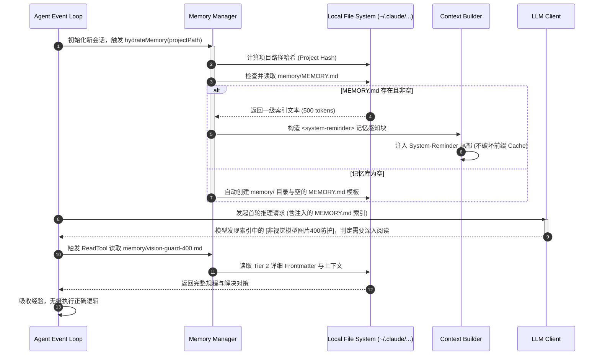

# 01-05 双层自记忆系统（MEMORY.md + 语义 Frontmatter）与召回机制

> **“无状态的 LLM 只能活在‘单次会话的当下’。现代工业级 Agent Harness 必须赋予模型‘越用越聪明、跨会话经验沉淀、用户偏好自适应’的长期记忆能力。其核心不在于盲目引入复杂的外部向量数据库，而在于构建一套人类可读、版本可控、结构化与低 Token 开销的双层文件记忆系统。”**

---

## 1. 章节导读与核心命题

在真实的软件研发场景中，工程师经常会对 Agent 提出各种隐式约束与工程偏好，例如：“本项目中永远不要使用 `npm install`，统一用 `pnpm`”、“所有前端组件禁止自定义 CSS，必须使用 antd-pro 主题 Token”、“遇到 429 错误时优先检查 account-pool 状态”。

如果每次开启新会话（New Session）时，用户都必须把这些经验和规则重复输入一遍，Agent 将彻底退化为一次性工具。

早期的很多开源项目尝试使用 **LangChain + 向量数据库（Vector DB / RAG）** 来解决长期记忆问题，但在代码级 Harness 实践中迅速遭遇滑铁卢：
1. **语义碎片化与召回噪音**：向量相似度无法准确理解代码目录规则与版本变迁；
2. **人类无法直观审计与修正**：存储在向量空间中的嵌入向量（Embeddings）是黑盒，用户无法手动编辑或删除错误的记忆；
3. **高昂的检索延迟与冷启动开销**。

Anthropic **Claude Code** 另辟蹊径，开创性地设计了一套 **“双层自记忆系统（Two-Tier Auto-Memory Architecture）”**：通过根目录轻量索引文件 `MEMORY.md` 搭配包含结构化 YAML Frontmatter 的离散记忆文件，实现了极高召回精度、人类完全透明可控、毫秒级本地水合的工业级长效记忆方案。

本节将深入拆解这套记忆系统的文件存储拓扑、Frontmatter 语义分类规范、动态水合与检索算法，以及防腐化淘汰机制。

```
┌────────────────────────────────────────────────────────────────────────────────────────────┐
│                              Claude Code 双层自记忆系统全景架构                             │
│                                                                                            │
│  ┌──────────────────────────────────────────────────────────────────────────────────────┐  │
│  │                     Tier 1: 轻量级一级总索引 (Top-Level Index)                        │  │
│  │                                                                                      │  │
│  │   文件路径: ~/.claude/projects/<project-hash>/memory/MEMORY.md                       │  │
│  │   内容特征: 单行 Pointer 列表，纯 Markdown 无 Frontmatter，常驻会话 System-Reminder    │  │
│  │                                                                                      │  │
│  │   - [非视觉模型图片400防护](vision-guard-400.md) — 剥图存blob句柄让子代理借视觉      │  │
│  │   - [禁止 god file 铁律](no-god-files-clean-code.md) — 功能放独立模块不塞大文件      │  │
│  │   - [git 只用 main 工作流](git-main-only.md) — 不建侧分支直接 main 提交              │  │
│  └──────────────────────────────────────────┬───────────────────────────────────────────┘  │
│                                             │ (双向超链接 [[slug]] 拓扑与语义召回)         │
│                                             ▼                                              │
│  ┌──────────────────────────────────────────────────────────────────────────────────────┐  │
│  │                  Tier 2: 结构化深层实体记忆库 (Deep Memory Entities)                 │  │
│  │                                                                                      │  │
│  │   存储目录: ~/.claude/projects/<project-hash>/memory/*.md                            │  │
│  │   每个文件独占一个原子事实，严格包含 YAML Frontmatter 元数据：                       │  │
│  │                                                                                      │  │
│  │   ┌────────────────────────────────────────────────────────────────────────────────┐ │  │
│  │   │  ---                                                                           │ │  │
│  │   │  name: no-god-files-clean-code                                                 │ │  │
│  │   │  description: 禁止创建超过 300 行的混杂大文件，严格遵循 SOLID 模块拆分原则     │ │  │
│  │   │  metadata:                                                                     │ │  │
│  │   │    type: feedback | user | project | reference                                 │ │  │
│  │   │  ---                                                                           │ │  │
│  │   │  用户明确要求：功能必须拆分至独立子模块。                                      │ │  │
│  │   │  **Why:** 降低认知负载与 Merge 冲突风险。                                      │ │  │
│  │   │  **How to apply:** 在创建新功能前先查重，超过 300 行必须重构拆分。关联 [[pty]] │ │  │
│  │   └────────────────────────────────────────────────────────────────────────────────┘ │  │
│  └──────────────────────────────────────────────────────────────────────────────────────┘  │
└────────────────────────────────────────────────────────────────────────────────────────────┘
```

---

## 2. 核心专业术语与概念精确释义

| 专业术语 (Terminology) | 中文标准译名 | 底层架构定义与机制说明 |
| :--- | :--- | :--- |
| **Two-Tier Auto-Memory** | **双层自记忆系统** | 一种将全局精简目录索引（Tier 1）与离散详细记忆实体（Tier 2）解耦的记忆架构，兼顾全量上下文感知与按需深读。 |
| **YAML Frontmatter** | **YAML 头部前置元数据** | 在 Markdown 文本顶部以 `---` 包裹的键值对元数据块，用于在无结构文本中强行注入结构化类型标识（如 `name`、`description`、`type`）。 |
| **Memory Hydration** | **记忆水合** | 在新会话初始化或轮次迭代时，Harness 自动读取磁盘上的记忆索引并编译注入到模型 Prompt 上下文中的过程。 |
| **Memory Compaction / Consolidation** | **记忆整理与合并** | 类似人类睡眠时的记忆重组机制。通过后台定时任务清理过时/失效记忆，合并同类项，消除逻辑冲突。 |
| **Cross-Session Persistence** | **跨会话持久化** | 记忆脱离单次终端进程或单次 API 请求的生命周期，按项目（Project-level）持久化保存于宿主磁盘中。 |
| **Semantic Recall** | **语义精准召回** | 基于任务上下文与实体元数据的匹配机制，只在模型真正需要深入某项特定规则时，才调取 Tier 2 详细内容。 |
| **Wikilink Topology (`[[slug]]`)** | **双向链接知识拓扑** | 借鉴 Roam Research / Obsidian 的双链语法，允许记忆文件之间相互引用，构建项目维度的网状知识图谱。 |

---

## 3. Tier 1 与 Tier 2 双层架构运行机制

### 3.1 Tier 1: `MEMORY.md` 全局一级索引
- **物理路径**：`~/.claude/projects/<cwd-hash>/memory/MEMORY.md`；
- **定位**：**全景常驻概览**。每次启动会话时，Harness 会自动读取 `MEMORY.md`，并作为 `System-Reminder` 注入上下文；
- **排版契约**：
  - 每条记忆仅占一行：`- [标题](slug.md) — 一句话核心钩子/结论`；
  - **严禁**将详细描述或代码块塞入 `MEMORY.md`，必须保持极小体积（通常 < 50 行，~500 Tokens）；
  - 充当 Agent 的“目录雷达”，让模型知道“我知道哪些项目经验”。

### 3.2 Tier 2: 独立实体记忆文件（`*.md`）
- **物理路径**：`~/.claude/projects/<cwd-hash>/memory/<name>.md`；
- **定位**：**原子知识实体**。每个文件只记录一个独立的、不可分割的经验或事实；
- **四大记忆类型规范（`metadata.type`）**：

| 类型 (Type) | 语义定义 | 触发场景与内容结构 |
| :--- | :--- | :--- |
| `feedback` | **用户指令与纠偏** | 用户给出的否定批评或肯定指导。必须包含 `**Why:**`（原因）与 `**How to apply:**`（应用方法）。 |
| `user` | **用户特征与习惯** | 记录用户的角色、技术栈偏好、常用语言风格、编辑器习惯等。 |
| `project` | **项目目标与隐藏规则** | 无法直接从代码或 Git 历史中推导出的隐性约束、历史技术债务背景、架构路线图。 |
| `reference` | **外部资源指针** | 内部 Wiki、生产环境看板 URL、Issue 工单系统关键 ID 与规范文档链接。 |

---

## 4. 记忆写入、更新与召回的完整生命周期

```
                               用户输入 / 工具执行结果
                                         │
                                         ▼
                             [Step 1: 记忆价值评估]
                    (是否为非显而易见的非代码事实？是否跨会话有用？)
                                         │
                                         ▼
                             [Step 2: 查重与防腐化判定]
                                         │
                     ┌───────────────────┴───────────────────┐
                     ▼                                       ▼
            [发现已有同类记忆]                      [全新原子知识]
          (读取并更新原文件内容)               (生成独立 kebab-case.md 文件)
                     │                                       │
                     └───────────────────┬───────────────────┘
                                         │
                                         ▼
                             [Step 3: 结构化元数据落盘]
                    (写入 YAML Frontmatter + Markdown Body + [[wikilink]])
                                         │
                                         ▼
                             [Step 4: 同步刷新 MEMORY.md 索引]
                      (原子化追加/修改一行短索引，完成持久化闭环)
```

### 4.1 记忆写入的三大准则（Memory Writing Discipline）
1. **不存显而易见的代码事实**：代码目录结构、已有函数名、Git 历史均已存在于物理工作区，严禁写入记忆；
2. **必须提炼本质原因（The "Why" Rule）**：不能只记“不要做 X”，必须阐明“因为 X 会导致 Y 边界崩溃”；
3. **查重优先于新建（Update over Duplicate）**：写入前必须先检索已有记忆，若是已有经验的修正，直接原地 `Edit` 更新该文件，严禁产生重复碎片。

### 4.2 记忆格式的标准 YAML Payload 范例

```markdown
---
name: gateway-restart-and-singleton
description: 本地网关基于 launchd 托管，重启必须使用 kickstart 且具备单实例互斥锁
metadata:
  type: project
---

本地 `aih` 网关服务由 macOS `launchd`（com.clawdcodex.ai_home）托管。

**Why:** 
此前网关在 `serve` 时因未加单实例文件锁（仅依赖 SO_REUSEADDR），导致热重启时常出现新旧两个进程同时监听 9527 端口的双实例异常。

**How to apply:**
1. 重启网关必须执行 `launchctl kickstart -k gui/$UID/com.clawdcodex.ai_home`；
2. 服务端在启动时必须先获取 `/tmp/aih_gateway.lock` 文件互斥锁；
3. 关联排查记忆：[[local-server-launch-and-proxy]] 与 [[account-isolation-north-star]]。
```

---

## 5. 记忆水合（Hydration）时序流与核心源码解构

### 5.1 启动会话时的记忆水合时序图 (Hydration Sequence)



### 5.2 TypeScript 记忆管理器核心实现代码

```typescript
import * as fs from 'fs';
import * as path from 'path';
import * as crypto from 'crypto';

export interface MemoryMetadata {
  type: 'user' | 'feedback' | 'project' | 'reference';
}

export interface MemoryEntity {
  name: string;
  description: string;
  metadata: MemoryMetadata;
  body: string;
  filePath: string;
}

export class MemoryManager {
  private memoryDir: string;
  private indexPath: string;

  constructor(projectRoot: string) {
    // 根据项目绝对路径生成确定性哈希
    const projectSlug = projectRoot.replace(/[\/:]/g, '-');
    const userHome = process.env.HOME || '/Users/model';
    this.memoryDir = path.join(userHome, '.claude', 'projects', projectSlug, 'memory');
    this.indexPath = path.join(this.memoryDir, 'MEMORY.md');
    this.ensureDirectoryExists();
  }

  private ensureDirectoryExists(): void {
    if (!fs.existsSync(this.memoryDir)) {
      fs.mkdirSync(this.memoryDir, { recursive: true });
    }
    if (!fs.existsSync(this.indexPath)) {
      fs.writeFileSync(this.indexPath, '# Project Auto-Memory Index\n\n', 'utf-8');
    }
  }

  /**
   * 会话启动时水合：读取 Tier 1 索引并封装为 System-Reminder 载荷
   */
  public hydrateTier1Index(): string | null {
    if (!fs.existsSync(this.indexPath)) return null;
    const content = fs.readFileSync(this.indexPath, 'utf-8').trim();
    if (!content) return null;

    return `<system-reminder>\n# Active Project Auto-Memory\n${content}\n</system-reminder>`;
  }

  /**
   * 写入或更新一条 Tier 2 记忆并原子同步刷新 Tier 1 索引
   */
  public saveMemory(name: string, description: string, type: MemoryMetadata['type'], body: string): void {
    const fileName = `${name}.md`;
    const targetFilePath = path.join(this.memoryDir, fileName);

    // 格式化 YAML Frontmatter
    const fileContent = [
      '---',
      `name: ${name}`,
      `description: ${description}`,
      'metadata:',
      `  type: ${type}`,
      '---',
      '',
      body.trim()
    ].join('\n');

    // 1. 原子写入 Tier 2 实体文件
    fs.writeFileSync(targetFilePath, fileContent, 'utf-8');

    // 2. 刷新 Tier 1 MEMORY.md 索引
    this.upsertIndexEntry(name, fileName, description);
  }

  private upsertIndexEntry(name: string, fileName: string, description: string): void {
    const lines = fs.readFileSync(this.indexPath, 'utf-8').split('\n');
    const newEntry = `- [${name}](${fileName}) — ${description}`;
    
    let updated = false;
    const updatedLines = lines.map(line => {
      if (line.includes(`](${fileName})`)) {
        updated = true;
        return newEntry;
      }
      return line;
    });

    if (!updated) {
      updatedLines.push(newEntry);
    }

    fs.writeFileSync(this.indexPath, updatedLines.filter(Boolean).join('\n') + '\n', 'utf-8');
  }
}
```

---

## 6. 核心源码级调用栈 (Source Call Stack)

```
[AgentRuntime.initializeSession] (lib/runtime/session.ts:80)
  │
  ├── [MemoryManager.hydrateTier1Index] (lib/memory/manager.ts:45)
  │     ├── [ProjectHashResolver.resolve] (lib/project/resolver.ts:22)
  │     └── [FileSystem.readUtf8Sync] (lib/fs/index.ts:18)
  │
  └── [PromptCompiler.assembleSystemPrompt] (lib/prompt/compiler.ts:105)
        ├── [PromptPrefix.lockStatic] (lib/prompt/cache.ts:33)
        └── [SystemReminder.appendDynamic] (lib/prompt/reminder.ts:50)

// 当触发记忆写入时：
[AgentRuntime.onMemoryInstructionDetected] (lib/runtime/agent-loop.ts:240)
  │
  └── [MemoryManager.saveMemory] (lib/memory/manager.ts:68)
        ├── [FrontmatterFormatter.serialize] (lib/memory/yaml.ts:29)
        ├── [AtomicFileWriter.write] (lib/fs/atomic.ts:41)
        └── [IndexUpserter.syncEntry] (lib/memory/index-sync.ts:55)
```

---

## 7. 极端异常边界与记忆防腐化治理

| 异常边界场景 | 物理成因与危害 | Harness 核心防线与自愈算法 (Self-Healing) |
| :--- | :--- | :--- |
| **1. 记忆腐化与陈旧冲突 (Stale Contradiction)** | 项目重构后，过去的某个技术方案已被废弃，但记忆中依然残留过时规则，导致 Agent 反复产生倒退动作。 | **基于验证的淘汰机制（Verification-before-apply）**：<br>1. 规则要求：当记忆中提及具体文件名或函数名时，Agent 在采用前**必须先验证其物理存在性**；<br>2. 若发现目标已不存在，触发 `MemoryCleaner` 自动将该条目从 `MEMORY.md` 和磁盘中删除。 |
| **2. MEMORY.md 膨胀爆仓 (Index Bloat)** | 积累了数百条经验，`MEMORY.md` 超过 5,000 行，导致常驻 System-Reminder 挤占大量 Token。 | **自动滚扎合并（Memory Consolidation）**：<br>当 `MEMORY.md` 超过 100 行时，触发后台整理子代理：将同类主题的条目（如 5 条关于 PTY 终端的碎片记忆）合并为 1 个专题文件，消除冗余行。 |
| **3. 幻觉写入与无意义记忆 (Trivial Memory Spam)** | Agent 将某次偶然的调试变量打印结果写入记忆，生成大量垃圾文件。 | **严格类型守卫与语义过滤**：<br>必须严格符合 `user/feedback/project/reference` 四大语义分类，且必须包含明确的 `Why` 与 `How to apply`；缺乏原因支撑的写入请求在工具层直接拦截。 |
| **4. 索引与实体脱节 (Broken Links)** | 用户在终端手动删除了某个 `.md` 实体文件，导致 `MEMORY.md` 存在死链悬空。 | **启动时一致性自愈校验（Integrity Self-check）**：<br>Harness 启动时快速做一次 `fs.existsSync` 扫掠，自动将指向不存在文件的失效索引条目静默剔除。 |

---

## 8. 对 ai_home 自主 Harness 研发的落地指导与架构设计

在 `ai_home` 项目落地高性能自主 Agent 记忆中枢时，必须严格执行以下三大架构规范：

### 8.1 架构设计一：基于项目哈希建立持久化 `~/.aih/memory/` 子系统
- **当前现状**：`ai_home` 目前跨会话主要依赖外部 SQLite 会话库，缺少代码/项目级别的显性工程记忆。
- **重构方案**：
  1. 新建 `lib/memory/` 模块，为每个被打开的工作区项目生成确定性目录：`~/.aih/projects/<project-hash>/memory/`；
  2. 初始化标准的 `MEMORY.md` 索引模板；
  3. 在会话水合阶段，将索引文本自动注入网关 Prompt 的 `System-Reminder` 区域。

### 8.2 架构设计二：在 WebUI 中暴露可视化记忆管理看板
- **落地方案**：
  1. 在 `ai_home` WebUI 的侧边栏新增 **“项目记忆与规则库”** 面板；
  2. 支持通过 Web 界面以 Markdown 卡片形式直接查看、新增、编辑或删除特定记忆条目；
  3. 彻底打破大模型黑盒记忆，让开发者对 Agent 的认知资产具备 100% 的掌控权。

### 8.3 架构设计三：严格实施“不破坏 Prompt Cache”的记忆注入协议
- **落地方案**：
  1. 绝对禁止将动态记忆拼接到 Prompt 最顶部的 System 角色定义中；
  2. 统一定义在最后一轮 User Message 前的固定位置，并使用结构化 XML `<project_memory>` 标签包裹；
  3. 确保上方的系统指令与工具 Schema 依然能够 100% 命中服务商的 KV 缓存。

---

## 9. 本章小结与下章预告

本章深入解构了 Claude Code 开创性的 **双层自记忆系统（Tier 1 索引 + Tier 2 结构化实体）**，剖析了其 YAML Frontmatter 规范、生命周期流转、TypeScript 核心实现与防腐化自愈算法，并为 `ai_home` 设计了项目级记忆架构。

在下一章 **【01-06 权限状态机（4 种模式）、Approval 审批流与安全策略拦截】** 中，我们将聚焦 Agent 运行时的安全中枢，深度解构 Claude Code 的 4 态权限状态机、危险指令 AST 拦截器以及终端/WebUI 全双工双向非阻塞审批网桥设计。
