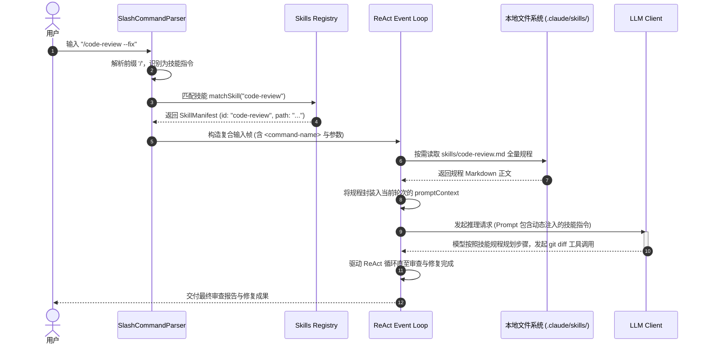

# 01-07 动态 Skills 系统、Slash Commands 与热插拔契约

> **“Agent Harness 的能力边界不应在编译期被焊死。一套现代化的 Agent 运行时必须具备像操作系统加载动态链接库（.so/.dll）一样的能力：通过轻量级文件系统契约、Slash 快捷指令拦截与按需提示词注入（On-demand Prompt Ingestion），实现能力的无限热插拔扩展。”**

---

## 1. 章节导读与核心命题

随着项目复杂度的上升，开发者往往需要沉淀大量垂直领域的专项工作流，例如：“运行 `/code-review` 进行多维度代码审查”、“触发 `/loop 15m` 建立定时巡检”、“调用 `/simplify` 自动重构臃肿模块”或“执行 `/deploy` 跑特定的发版流程”。

如果在每次会话中都将所有可能的技能提示词（Skill Prompts）一股脑全量灌入 System Prompt：
1. **Token 严重浪费与 Prompt Cache 击穿**：会导致初始 Prompt 膨胀数万 Token，每次会话启动成本剧增；
2. **模型注意力分散与工具幻觉**：过多的工具与规范会导致大模型发生指令混淆（Instruction Drift）。

Anthropic **Claude Code** 设计了一套优雅高效的 **动态 Skills 系统与 Slash Commands 架构**：
- **两级 Slash 命令拦截管道**：在 Harness 调度层拦截纯客户端命令（如 `/clear`、`/help`），将能力型 Slash 命令无缝映射为标准 `Skill` 工具调用；
- **文件系统契约与零配置发现**：基于 `~/.claude/skills/` 与 `<repo>/.claude/skills/` 实现全局与项目级技能热插拔；
- **两阶段延迟按需加载（Two-Phase Lazy Ingestion）**：会话常驻阶段仅注入一行短描述索引，触发时才将完整 Markdown 指令注入当前轮次；
- **目录作用域绑定（Directory-Scoped Skills）**：支持多子项目/Monorepo 维度的精确定向覆盖。

本节将系统拆解该子系统的底层解析器、动态注入生命周期、协议载荷规范与架构落地指南。

<div class="rich-diagram-box">
  <div class="diagram-header-tag">Lazy Ingestion Flow</div>
  <div class="diagram-title"><span>⚡</span> 动态 Skills 两阶段延迟按需加载（Two-Phase Lazy Ingestion）</div>
  <div class="split-two-col">
    <div class="col-box">
      <div class="col-title">Phase 1: 会话启动 (轻量目录曝光)</div>
      <div class="tech-card blue" style="margin-bottom:6px;"><div class="card-label">System-Reminder 轻量索引 (~300 Tokens)</div></div>
      <div class="tech-card purple"><div class="card-label">- code-review: Review git diff for bugs<br>- simplify: Clean up changed code</div></div>
    </div>
    <div class="col-box">
      <div class="col-title">Phase 2: 运行时触发 (全量规程水合)</div>
      <div class="tech-card orange" style="margin-bottom:6px;"><div class="card-label">用户调用 /code-review --fix</div></div>
      <div class="tech-card green"><div class="card-label">动态读取 skills/code-review.md 注入当前轮次上下文</div></div>
    </div>
  </div>
</div>

---

## 5. 核心协议 Payload 与数据结构源码解构

### 5.1 技能元数据与 Frontmatter TypeScript 类型定义

```typescript
/**
 * 技能作用域类型
 */
export type SkillScope = 'global' | 'project' | 'directory';

/**
 * 技能清单元信息实体
 */
export interface SkillManifest {
  readonly id: string;            // 唯一标识 (如 "code-review" 或 "apps/web:deploy")
  readonly name: string;          // 显示名称
  readonly description: string;   // 一句话概要 (用于 Phase 1 索引曝光)
  readonly filePath: string;      // 本地 Markdown 物理路径
  readonly scope: SkillScope;     // 作用域等级
  readonly directoryPath?: string;// 当 scope 为 directory 时的限定路径
  readonly runInBackground?: boolean; // 是否默认在后台子代理运行
}

/**
 * Skill 工具调用的标准 Wire Protocol 参数
 */
export interface SkillToolParams {
  skill: string;                  // 技能唯一 ID (如 "code-review")
  args?: string;                  // 透传的参数字符串 (如 "--fix --level=high")
}
```

### 5.2 技能定义 Markdown 标准文件范例（`skills/code-review.md`）

```markdown
---
name: code-review
description: 对当前分支改动或指定 PR 进行代码审查，识别正确性缺陷、并发安全隐患与重构点
scope: project
runInBackground: false
---

# Code Review 工业级审查规程

当用户调用本技能时，你必须严格遵循以下阶段执行审查：

## 1. 差异探测阶段
- 优先执行 `git diff origin/main...HEAD` 获取当前的完整变更；
- 若指定了文件参数，仅针对目标文件进行审查。

## 2. 四维审查矩阵
1. **正确性（Correctness）**：边界条件处理、空指针防护、异步 Promise 未处理异常；
2. **并发与安全（Concurrency & Security）**：数据竞争、SQL 注入、未脱敏日志输出；
3. **架构与分层（Architecture）**：是否违背单一职责原则、是否存在上帝类（God File）；
4. **性能与内存（Performance）**：是否存在无效循环查询、长连接未释放。

## 3. 结果交付与修复
- 严格按照严重级别从高到低排列（`CRITICAL` -> `HIGH` -> `MEDIUM` -> `LOW`）；
- 若参数包含 `--fix`，在报告完毕后立即通过 `Edit` 工具实施自动化修复并运行测试验证。
```

---

## 6. 技能生命周期时序图与核心源码实现

### 6.1 技能动态水合与执行时序图 (Skill Execution Sequence)



### 6.2 TypeScript 动态技能管理器核心实现代码

```typescript
import * as fs from 'fs';
import * as path from 'path';

export class SkillManager {
  private skillsMap: Map<string, SkillManifest> = new Map();
  private projectRoot: string;

  constructor(projectRoot: string) {
    this.projectRoot = projectRoot;
    this.discoverAllSkills();
    this.watchSkillsDirectory();
  }

  /**
   * 扫描多级目录发现所有可用 Skills
   */
  public discoverAllSkills(): void {
    this.skillsMap.clear();
    const userHome = process.env.HOME || '/Users/model';

    // 1. 扫描全局技能 (~/.claude/skills)
    this.scanDirectory(path.join(userHome, '.claude', 'skills'), 'global');

    // 2. 扫描项目级技能 (<repo>/.claude/skills)
    this.scanDirectory(path.join(this.projectRoot, '.claude', 'skills'), 'project');
  }

  private scanDirectory(dirPath: string, scope: SkillScope): void {
    if (!fs.existsSync(dirPath)) return;

    const files = fs.readdirSync(dirPath);
    for (const file of files) {
      if (file.endsWith('.md')) {
        const fullPath = path.join(dirPath, file);
        const content = fs.readFileSync(fullPath, 'utf-8');
        const manifest = this.parseSkillFrontmatter(file, content, fullPath, scope);
        if (manifest) {
          this.skillsMap.set(manifest.id, manifest);
        }
      }
    }
  }

  private parseSkillFrontmatter(fileName: string, content: string, filePath: string, scope: SkillScope): SkillManifest | null {
    const id = fileName.replace(/\.md$/, '');
    const lines = content.split('\n');
    
    // 简要解析 Frontmatter description
    let description = 'Custom user skill';
    if (lines[0]?.trim() === '---') {
      for (let i = 1; i < lines.length; i++) {
        if (lines[i].trim() === '---') break;
        if (lines[i].startsWith('description:')) {
          description = lines[i].replace('description:', '').trim();
        }
      }
    }

    return { id, name: id, description, filePath, scope };
  }

  /**
   * Phase 1: 编译常驻 System-Reminder 的轻量索引清单
   */
  public compileSystemPromptListing(): string {
    if (this.skillsMap.size === 0) return '';

    const lines = ['Available skills for use with the Skill tool:'];
    for (const [id, skill] of this.skillsMap.entries()) {
      lines.push(`- ${id}: ${skill.description}`);
    }
    return lines.join('\n');
  }

  /**
   * Phase 2: 运行时按需水合指定技能的正文规范
   */
  public hydrateSkillInstructions(skillId: string): string {
    const skill = this.skillsMap.get(skillId);
    if (!skill) {
      throw new Error(`Skill '${skillId}' not found in registry.`);
    }

    const rawContent = fs.readFileSync(skill.filePath, 'utf-8');
    // 去除 Frontmatter 头部，保留纯指令 Markdown 正文
    const bodyContent = rawContent.replace(/^---[\s\S]*?---\n*/, '');

    return bodyContent;
  }

  /**
   * 监听本地目录实现热插拔重载
   */
  private watchSkillsDirectory(): void {
    const projectSkillsDir = path.join(this.projectRoot, '.claude', 'skills');
    if (fs.existsSync(projectSkillsDir)) {
      fs.watch(projectSkillsDir, () => {
        this.discoverAllSkills();
      });
    }
  }
}
```

---

## 7. 核心源码级调用栈 (Source Call Stack)

```
[CLIInputHandler.onLineReceived] (lib/cli/input-handler.ts:40)
  │
  ├── [SlashCommandParser.parse] (lib/commands/parser.ts:25)
  │     ├── [BuiltinCommandRouter.tryHandle] ── (若为 /clear 直接本地清屏并返回)
  │     └── [SkillCommandMatcher.match] (lib/skills/matcher.ts:35)
  │
  └── [AgentEventLoop.submitTask] (lib/runtime/agent-event-loop.ts:95)
        │
        ├── [SkillManager.hydrateSkillInstructions] (lib/skills/manager.ts:60)
        │     └── [FileSystem.readUtf8Sync] (lib/fs/index.ts:18)
        │
        └── [PromptContextBuilder.injectSkillBlock] (lib/prompt/context.ts:110)
              └── `<command-name>/code-review</command-name>\n<skill-instructions>...`
```

---

## 8. 极端异常边界与防御治理策略

| 异常边界场景 | 物理成因与危害 | Harness 核心防线与自愈算法 (Self-Healing) |
| :--- | :--- | :--- |
| **1. 技能命名冲突与覆盖混乱 (Skill Name Collision)** | 项目级技能和全局技能同名（如都叫 `deploy.md`），导致行为不可预测。 | **严格作用域优先级单调覆盖**：<br>定义绝对优先级：`Directory Scope > Project Scope > Global Scope`；当同名冲突发生时，高优先级静默覆盖低优先级，并在 Debug 日志中记录覆盖追踪信息。 |
| **2. 技能文件语法损坏与死锁 (Malformed Skill)** | 开发者编辑 `skill.md` 时破坏了 Frontmatter 格式或未闭合代码块，导致解析器崩溃。 | **容错隔离与默认回退（Graceful Degradation）**：<br>解析异常的文件被标记为 `INVALID` 并从索引清单中剔除，同时向开发者抛出非阻塞警告提示行号，**严禁影响其他正常技能的加载**。 |
| **3. 递归技能调用与死循环 (Recursive Skill Call)** | 技能 A 的提示词中指示 Agent 调用技能 B，技能 B 又指示调用技能 A。 | **调用栈深度计数器（Recursion Guard）**：<br>在执行上下文中维护 `skillCallDepth`。硬性限制 `maxSkillDepth = 2`；若超过深度限制，强行阻断并向模型报错：`"[SKILL GUARD]: Maximum skill call depth exceeded. Recursive invocation blocked."`。 |
| **4. 参数注入与逃逸攻击 (Arg Injection)** | 用户输入 `/code-review $(rm -rf /)` 试图通过参数拼接注入非法命令。 | **参数纯数据化转义（Strict Literal Escaping）**：<br>所有 Slash 参数作为纯文本字符串注入 `<command-args>` 标签内，严禁直接通过 `eval` 或无转义拼接进 Shell 子进程。 |

---

## 9. 对 ai_home 自主 Harness 研发的落地指导与架构设计

在 `ai_home` 项目落地高性能自主 Agent Harness 时，动态 Skills 与 Slash 指令子系统必须贯彻以下三大架构规范：

### 9.1 架构设计一：重构统一的 `SlashCommandRouter` 词法分流器
- **当前现状**：目前 `ai_home` 部分 Slash 指令与普通聊天混杂，缺乏统一的客户端/服务端两级分流。
- **重构方案**：
  1. 新增 `lib/commands/slash-router.ts`，在前端与终端入口统一拦截 `/` 指令；
  2. 将系统级指令（`/clear`、`/model`、`/account`）在本地即时结算，将业务技能指令（`/review`、`/simplify`、`/collab`）标准化映射为 `Skill` 载荷交由底层 Agent 状态机驱动。

### 9.2 架构设计二：落地基于 `.aih/skills/` 的双层热插拔技能发现器
- **落地方案**：
  1. 支持 `~/.aih/skills/`（用户全局）与 `<workspace>/.aih/skills/`（项目专属）两级目录；
  2. 实现基于 `fs.watch` 的热重载机制，开发者新增或修改 Markdown 技能文件后立即生效，无需重启网关进程；
  3. 在 WebUI 侧边栏提供 **“已装载技能看板”**，直观展示当前会话可用的所有扩展技能与使用说明。

### 9.3 架构设计三：实施极简的两阶段延迟注入（Lazy Ingestion）
- **落地方案**：
  1. 初始 System Prompt 仅注入一行短索引清单，保持首字响应延迟（TTFT）与 Token 成本最低；
  2. 只有在收到对应 `/skill` 命令或模型自主触发 `Skill` 工具时，才动态读取 Markdown 并在当前对话轮次中水合注入完整规范。

---

## 10. 本章小结与第一篇总结

本章全面解构了 Claude Code 工业级的 **动态 Skills 系统、两级 Slash 拦截流水线、两阶段延迟按需加载与热插拔目录契约**，并为 `ai_home` 设计了标准化的扩展能力架构。

### 📘 第一篇：Claude Code 架构深度解构·全景结语
至此，我们已经完整解构了 Anthropic **Claude Code** 的全部核心技术壁垒：
- **01-01**：ReAct 核心事件循环与 6 阶段状态机生命周期；
- **01-02**：工具调用协议（`Read`/`Edit`/`Bash`）、AST 补丁与多层执行沙箱；
- **01-03**：多级 Token 预算水位线、微观/宏观双层压缩与 Prompt Cache 字节级对齐；
- **01-04**：Subagent Fork 上下文克隆、声明式 Workflow 流水线与 Git Worktree 物理隔离；
- **01-05**：双层自记忆系统（`MEMORY.md` 索引 + Frontmatter 实体）与跨会话沉淀；
- **01-06**：4 态权限状态机、AST 安全扫描与双端完全等价审批网桥；
- **01-07**：动态可插拔 Skills、Slash 指令拦截与两阶段延迟水合。

在接下来的 **【第二篇：OpenAI Codex CLI / App Server 解构】** 中，我们将把视野转向 OpenAI 的工业级实践，深入剖析其基于 **Stdio JSON-RPC 全双工通信、Responses API 协议与 SQLite 线程持久化** 的另一套完全不同的设计哲学与架构范式。
