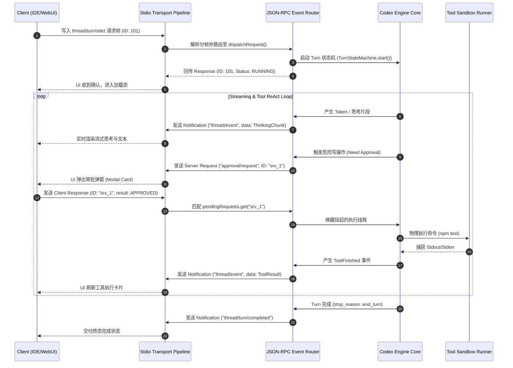

# 02-01 Stdio JSON-RPC App Server 架构与全双工事件总线

> **“当 Agent 从单一进程内的 CLI 命令行演进为服务于 IDE 插件、Web 控制台与分布式工作区的多宿主核心时，基于 Stdio 的全双工 JSON-RPC 协议与强类型事件总线，便成为了解耦 UI 渲染与执行内核的工业级标准范式。”**

---

## 1. 章节导读与核心命题

在解构了 Anthropic Claude Code 的 ReAct 单进程状态机后，我们进入 **第二篇：OpenAI Codex CLI / App Server 架构体系**。

OpenAI 在构建其下一代编程 Agent（Codex CLI 及桌面端/IDE 集成产品）时，面临着与 Claude Code 截然不同的工程诉求：
1. **多宿主中立性（Host Agnostic）**：同一套 Agent 执行内核必须同时驱动 macOS 桌面客户端、VS Code / JetBrains IDE 扩展以及无头（Headless）CI/CD 容器；
2. **进程隔离与宿主安全**：UI 进程与高特权的 Agent 执行进程物理隔离，即使 UI 崩溃或重新加载，后台长事务 Agent 也不能中断；
3. **语言层的高性能与内存安全**：Codex 核心采用 **Rust 语言** 构建底层 App Server，追求微秒级启动延迟、绝对零 GC 停顿与跨平台原生分发。

为了实现这一目标，OpenAI 确立了 **“Stdio JSON-RPC App Server + 全双工事件总线（Full-Duplex Event Bus）”** 架构。

本节将深入拆解 Codex App Server 的进程生命周期管理、JSON-RPC 2.0 协议分帧、雙向异步消息路由模型以及反压（Backpressure）流控机制。

```
┌────────────────────────────────────────────────────────────────────────────────────────────┐
│                             OpenAI Codex App Server 全景分层架构                            │
│                                                                                            │
│  ┌──────────────────────────────────────────────────────────────────────────────────────┐  │
│  │                     Host Client Layer (宿主接入层: IDE / WebUI / Desktop)            │  │
│  │                                                                                      │  │
│  │   [VS Code Extension]         [macOS Desktop App]         [ai_home Gateway Bridge]   │  │
│  └──────────────────────────────────────────┬───────────────────────────────────────────┘  │
│                                             │                                              │
│                                             ▼ (Stdio / Named Pipe / Domain Socket)         │
│  ┌──────────────────────────────────────────────────────────────────────────────────────┐  │
│  │                  Transport & Framing Layer (传输与数据分帧层: Rust Core)              │  │
│  │                                                                                      │  │
│  │   [Framed Read Stream (Stdin)]  ──> [Line-delimited JSON-RPC Parser]                 │  │
│  │   [Framed Write Stream (Stdout)] <── [JSON-RPC Serializer & Event Dispatcher]        │  │
│  └──────────────────────────────────────────┬───────────────────────────────────────────┘  │
│                                             │                                              │
│                                             ▼                                              │
│  ┌──────────────────────────────────────────────────────────────────────────────────────┐  │
│  │                   JSON-RPC 2.0 Router & Dispatcher (全双工消息总线)                   │  │
│  │                                                                                      │  │
│  │   [Incoming Requests Router]   [Outgoing Notifications]   [Pending Request Tracker]  │  │
│  │   - thread/start               - thread/event             - Map<RequestId, Sender>   │  │
│  │   - thread/turn/start          - progress/update          - (Timeout & Cancellation) │  │
│  │   - tool/respond               - log/message              -                          │  │
│  └──────────────────────────────────────────┬───────────────────────────────────────────┘  │
│                                             │                                              │
│                                             ▼                                              │
│  ┌──────────────────────────────────────────────────────────────────────────────────────┐  │
│  │                   Codex Engine Core Layer (Agent 线程管理与执行引擎)                 │  │
│  │                                                                                      │  │
│  │  ┌─────────────────────────┐  ┌─────────────────────────┐  ┌──────────────────────┐  │  │
│  │  │  Thread Runtime State   │  │  Responses Wire Client  │  │ Tool Execution Pool  │  │  │
│  │  │  (Turn FSM & Context)   │  │ (Streaming SSE Engine)  │  │ (Process/Sandbox/FS) │  │  │
│  │  └─────────────────────────┘  └─────────────────────────┘  └──────────────────────┘  │  │
│  └──────────────────────────────────────────────────────────────────────────────────────┘  │
└────────────────────────────────────────────────────────────────────────────────────────────┘
```

---

## 2. 核心专业术语与概念精确释义

| 专业术语 (Terminology) | 中文标准译名 | 底层架构定义与机制说明 |
| :--- | :--- | :--- |
| **App Server Architecture** | **应用服务端架构** | 将 Agent 核心逻辑抽象为一个长期驻留的守护进程服务（Daemon/Server），宿主客户端（Client）通过标准 IPC 协议与其通信，实现职责彻底解耦。 |
| **Stdio Transport** | **标准输入输出传输层** | 基于进程的标准输入（`stdin`）与标准输出（`stdout`）建立的全双工字节流管道。具备零网络端口依赖、天然生命周期绑定与跨平台兼容优势。 |
| **JSON-RPC 2.0** | **JSON 远程过程调用协议** | 一种无状态、轻量级的基于 JSON 的 RPC 传输协议。规范定义了请求（Request）、响应（Response）与单向通知（Notification）的数据结构。 |
| **Full-Duplex Event Bus** | **全双工事件总线** | 允许通信双方（Client 与 Server）在任何时刻、不依赖对方前置请求，自主向对方双向并发推送请求与事件的通信中枢。 |
| **Line-Delimited Framing** | **行分隔分帧协议** | 在字节流传输中，使用换行符（`\n`）作为消息边界的分帧技术（类似 JSON Lines/JSONL），确保流式传输中 JSON 对象的完整边界解析。 |
| **Thread Management** | **线程会话实体** | Codex 架构中对单个任务交互历史与上下文状态的持久化抽象容器（对应一个持续长事务会话）。 |
| **Backpressure Control** | **反压流控机制** | 当下游消费者的处理速率低于上游生产速率时，通过挂起读取缓冲区或限制并发窗口，防止内存无限暴涨导致 OOM 的流控算法。 |

---

## 3. Stdio IPC 传输机制与数据分帧（Framing）设计

在传统的 HTTP REST 架构中，客户端是唯一的发起方，服务端无法主动向客户端推送结构化请求（例如“请用户审批某条高危命令”）。而在 LSP（Language Server Protocol）与 Codex App Server 体系中，**双向实时通信** 是绝对刚需。

```
 Client (UI Layer)                                           Server (Codex Core)
       │                                                              │
       │ === Stdin Pipe: Client -> Server Request ==================> │
       │ {"jsonrpc":"2.0","id":1,"method":"thread/start",...}\n       │
       │                                                              │
       │ <== Stdout Pipe: Server -> Client Notification ==============│
       │ {"jsonrpc":"2.0","method":"thread/event","params":{...}}\n   │
       │                                                              │
       │ <== Stdout Pipe: Server -> Client Request (Approval) ========│
       │ {"jsonrpc":"2.0","id":"srv_99","method":"ask_approval",...}\n│
       │                                                              │
       │ === Stdin Pipe: Client -> Server Response =================> │
       │ {"jsonrpc":"2.0","id":"srv_99","result":{"approved":true}}\n │
```

### 3.1 为什么选择 Stdio 而不是本地 TCP/HTTP 端口？
1. **零端口冲突与高安全性**：本地 TCP 端口（如 `http://127.0.0.1:9527`）容易发生端口占用冲突，且容易受到本机其他恶意软件的未授权扫描与跨站请求伪造（CSRF）攻击；Stdio 仅限于父子进程间管道通信，天然具备 OS 级安全隔离；
2. **生命周期自动绑定（Fate Sharing）**：当宿主 IDE 或 UI 崩溃退出时，其打开的 Stdin 管道自动关闭（EOF / `EPIPE`），内核会自动向 Server 发送 `SIGPIPE` / `SIGHUP` 信号，避免残留孤儿僵尸进程。

### 3.2 分帧协议与粘包拆包（Framing Protocol）
Codex 采用 **Line-Delimited JSON-RPC**（每帧以 `\n` 结尾）规范。Rust 端通过 `tokio::io::BufReader` 与 `tokio_util::codec::LinesCodec` 实现微秒级零拷贝切分。

---

## 4. JSON-RPC 2.0 通信协议规范与核心 Wire Payload

Codex App Server 将全部通信消息归类为三类核心数据包：

### 4.1 协议帧类型与数据结构定义

```typescript
/**
 * 基础 JSON-RPC 消息外壳
 */
export type RequestId = string | number;

export interface JsonRpcRequest<TParams = Record<string, unknown>> {
  jsonrpc: '2.0';
  id: RequestId;
  method: string;
  params: TParams;
}

export interface JsonRpcResponse<TResult = unknown> {
  jsonrpc: '2.0';
  id: RequestId;
  result?: TResult;
  error?: {
    code: number;
    message: string;
    data?: unknown;
  };
}

export interface JsonRpcNotification<TParams = Record<string, unknown>> {
  jsonrpc: '2.0';
  method: string;
  params: TParams;
}
```

### 4.2 核心业务方法 Wire Payload 全景

#### (1) 初始化创建线程 (`thread/start`)
```json
// Client -> Server Request
{
  "jsonrpc": "2.0",
  "id": 1,
  "method": "thread/start",
  "params": {
    "workspaceRoot": "/Users/model/projects/feature/ai_home",
    "model": "gpt-5.5",
    "persistence": {
      "mode": "sqlite",
      "dbPath": "/Users/model/.codex/codex.db"
    }
  }
}

// Server -> Client Response
{
  "jsonrpc": "2.0",
  "id": 1,
  "result": {
    "threadId": "thr_01j7xyz_8892",
    "status": "IDLE",
    "createdAt": 1787125000000
  }
}
```

#### (2) 开启交互轮次 (`thread/turn/start`)
```json
// Client -> Server Request
{
  "jsonrpc": "2.0",
  "id": 2,
  "method": "thread/turn/start",
  "params": {
    "threadId": "thr_01j7xyz_8892",
    "input": "请检查当前项目的 Git 状态并运行测试",
    "permissionMode": "accept-reads"
  }
}
```

#### (3) 运行时事件流双向广播 (`thread/event` Notification)
Server 在执行过程中，通过单向 Notification 实时向 Client 广播执行轨迹：
```json
// Server -> Client Notification (流式状态更新)
{
  "jsonrpc": "2.0",
  "method": "thread/event",
  "params": {
    "threadId": "thr_01j7xyz_8892",
    "turnIndex": 1,
    "event": {
      "type": "turn_event",
      "data": {
        "event_type": "tool_execution_started",
        "tool_name": "bash",
        "call_id": "call_9901",
        "command": "npm test",
        "timestamp": 1787125002100
      }
    }
  }
}
```

#### (4) Server 反向请求 Client 进行人工审批 (`approval/request`)
```json
// Server -> Client Request (Server 发起的 RPC 请求)
{
  "jsonrpc": "2.0",
  "id": "srv_appr_001",
  "method": "approval/request",
  "params": {
    "threadId": "thr_01j7xyz_8892",
    "toolName": "bash",
    "command": "git push --force origin feat/refactor",
    "riskLevel": "CRITICAL",
    "reason": "检测到对远端主干分支的强推操作"
  }
}

// Client -> Server Response (Client 提交决策)
{
  "jsonrpc": "2.0",
  "id": "srv_appr_001",
  "result": {
    "decision": "APPROVED",
    "rememberForSession": false
  }
}
```

---

## 5. 全双工事件总线时序流与核心架构实现

### 5.1 Codex App Server 全双工通信时序图 (Full-Duplex Sequence)



### 5.2 TypeScript/Node.js 客户端驱动 Codex App Server 实现代码

以下是 `ai_home` 作为宿主客户端，通过 Stdio 唤起并双向驱动 Codex App Server 的核心驱动器实现：

```typescript
import { spawn, ChildProcess } from 'child_process';
import * as readline from 'readline';
import { EventEmitter } from 'events';

export class CodexAppServerClient extends EventEmitter {
  private serverProcess: ChildProcess | null = null;
  private requestIdCounter = 0;
  private pendingRequests = new Map<RequestId, { resolve: (res: any) => void; reject: (err: any) => void }>();

  /**
   * 启动并绑定 Codex App Server 守护进程
   */
  public async startServer(serverBinaryPath: string, cwd: string): Promise<void> {
    this.serverProcess = spawn(serverBinaryPath, ['app-server'], {
      cwd,
      stdio: ['pipe', 'pipe', 'inherit'], // stdin, stdout 管道传输，stderr 透传至控制台
      env: { ...process.env, RUST_LOG: 'info', CI: 'true' }
    });

    if (!this.serverProcess.stdout || !this.serverProcess.stdin) {
      throw new Error('Failed to attach Stdio pipes to Codex App Server.');
    }

    const rl = readline.createInterface({
      input: this.serverProcess.stdout,
      terminal: false
    });

    rl.on('line', (line) => {
      if (!line.trim()) return;
      this.handleIncomingLine(line);
    });

    this.serverProcess.on('exit', (code, signal) => {
      this.emit('server_exit', { code, signal });
      this.rejectAllPending(new Error(`Server process exited with code ${code}`));
    });
  }

  /**
   * 发送 JSON-RPC 客户端请求 (Client -> Server)
   */
  public async call<TResult = unknown>(method: string, params: Record<string, unknown>): Promise<TResult> {
    const id = ++this.requestIdCounter;
    const request: JsonRpcRequest = {
      jsonrpc: '2.0',
      id,
      method,
      params
    };

    return new Promise<TResult>((resolve, reject) => {
      this.pendingRequests.set(id, { resolve, reject });
      this.sendRaw(JSON.stringify(request) + '\n');
    });
  }

  /**
   * 响应 Server 发起的反向请求 (Client Response -> Server Request)
   */
  public respondToServer(requestId: RequestId, result: unknown, error?: { code: number; message: string }): void {
    const response: JsonRpcResponse = {
      jsonrpc: '2.0',
      id: requestId,
      ...(error ? { error } : { result })
    };
    this.sendRaw(JSON.stringify(response) + '\n');
  }

  private handleIncomingLine(line: string): void {
    try {
      const msg = JSON.parse(line);

      // Case 1: 客户端之前发起的请求收到了 Server 的响应
      if ('id' in msg && this.pendingRequests.has(msg.id)) {
        const handler = this.pendingRequests.get(msg.id)!;
        this.pendingRequests.delete(msg.id);
        if (msg.error) {
          handler.reject(new Error(`[JSON-RPC Error ${msg.error.code}]: ${msg.error.message}`));
        } else {
          handler.resolve(msg.result);
        }
        return;
      }

      // Case 2: Server 主动向客户端发起的请求 (如 approval/request)
      if ('id' in msg && 'method' in msg) {
        this.emit('server_request', {
          id: msg.id,
          method: msg.method,
          params: msg.params
        });
        return;
      }

      // Case 3: Server 广播的单向事件通知 (Notification)
      if ('method' in msg && !('id' in msg)) {
        this.emit('notification', {
          method: msg.method,
          params: msg.params
        });
        return;
      }
    } catch (err) {
      this.emit('parse_error', { rawLine: line, error: err });
    }
  }

  private sendRaw(data: string): void {
    if (!this.serverProcess || !this.serverProcess.stdin) {
      throw new Error('App Server is not running.');
    }
    this.serverProcess.stdin.write(data);
  }

  private rejectAllPending(err: Error): void {
    for (const [id, handler] of this.pendingRequests.entries()) {
      handler.reject(err);
    }
    this.pendingRequests.clear();
  }
}
```

---

## 6. 核心源码级调用栈 (Source Call Stack)

```
[CodexServerMain::main] (src/bin/app_server.rs:25)
  │
  ├── [StdioTransport::init] (src/transport/stdio.rs:40)
  │     ├── [tokio::io::BufReader::new(tokio::io::stdin())]
  │     └── [tokio_util::codec::LinesCodec::new()]
  │
  └── [JsonRpcRouter::run_event_loop] (src/rpc/router.rs:75)
        │
        ├── match incoming_frame {
        │     Frame::Request(req) => [MethodDispatcher::dispatch(req)]
        │       ├── "thread/start" => [ThreadManager::create_thread]
        │       └── "thread/turn/start" => [TurnExecutionEngine::start_turn]
        │     Frame::Response(res) => [PendingManager::settle_response(res)]
        │     Frame::Notification(n) => [NotificationHandler::handle(n)]
        │   }
        │
        └── [TurnExecutionEngine::tick] (src/engine/turn_loop.rs:110)
              ├── [ResponsesClient::stream_sse] (src/client/responses.rs:65)
              │     └── emit_notification("thread/event", ThinkingChunk)
              └── [ToolDispatcher::execute_or_prompt] (src/tools/dispatcher.rs:90)
                    └── send_server_request("approval/request", tool_payload)
```

---

## 7. 极端异常边界与容错流控防御

| 异常边界场景 | 物理成因与危害 | Harness 核心防线与自愈算法 (Self-Healing) |
| :--- | :--- | :--- |
| **1. 管道破裂与子进程意外夭折 (Broken Pipe / EPIPE)** | UI 客户端突发崩溃或强行被杀死，Server 尝试向已关闭的 Stdout 写入引发崩溃。 | **SIGPIPE 信号捕获与优雅停机**：<br>Rust Server 在底层全局忽略 `SIGPIPE`，并在写失败时感知管道破裂，自动触发 `SessionPersister` 将未完成的内存事件安全刷盘落库，随后安全优雅自毁。 |
| **2. 巨量输出导致内存反压阻塞 (Backpressure Starvation)** | 模型在一轮中吐出数万行日志，Client 渲染跟不上，导致 Stdio 管道缓冲区占满，Server 进程挂死。 | **流式缓冲区水位调节（High-Watermark Drop）**：<br>Server 内部维护有界事件通道（Bounded Channel，容量 1000 帧）。当队列达到 80% 警戒水位时，触发中间层日志合并压缩，阻断非关键帧广播，防止生产者线程死锁。 |
| **3. 请求超时悬挂 (Orphaned Request Hanging)** | Client 向 Server 发起 `thread/turn/start`，但因后端网络死锁永远不返回 Response。 | **带心跳监测的客户端超时熔断**：<br>Client 维护 120s 请求定时器；超过时限自动向 Server 发送 `$/cancelRequest` 取消通知，并主动 reject 该 Promise 释放 UI 锁。 |
| **4. JSON 跨行残包与粘包乱序 (Chunk Malformation)** | 在极端高频输出下，换行符被拆分在两个不同的操作系统 TCP/Stdio Read Buffer 中。 | **基于缓冲区的状态机分帧器（Stateful Framer）**：<br>解析层必须保存上一分片的未闭合残尾（Tail Buffer），直到遇到真正的 `\n` 之后才组装送入 JSON 解析器，杜绝因粘包产生 `SyntaxError`。 |

---

## 8. 对 ai_home 自主 Harness 研发的落地指导与架构设计

在 `ai_home` 项目演进为支持多前端宿主（WebUI / CLI / IDE 插件）的通用 Agent 运行时架构时，必须落地以下三大设计规范：

### 8.1 架构设计一：落地 `ai_home` App Server 守护进程模式
- **当前现状**：`ai_home` 目前以一体化 CLI 或独立 HTTP Server 启动，缺乏纯净的标准 IPC 桥接层。
- **重构方案**：
  1. 新增 `aih app-server` 子命令，提供标准 Stdio JSON-RPC 2.0 全双工运行模式；
  2. 支持第三方开发者编写轻量级 VS Code 插件或 JetBrains 插件，只需启动 `aih app-server` 子进程即可零成本接入 `ai_home` 强大的多模型路由与 Agent 能力。

### 8.2 架构设计二：构建严格分帧的双向 JSON-RPC 消息总线
- **落地方案**：
  1. 在 `lib/rpc/` 目录下实现 `JsonRpcEventBus`，规范定义 `MethodHandler` 与 `NotificationEmitter`；
  2. 实现 Server 主动发起 `approval/request` 的非阻塞反向调用机制，彻底统一 Web 端与桌面端的审批接入层。

### 8.3 架构设计三：实现 Client 与 Server 的解耦与断线重连（State Re-attachment）
- **落地方案**：
  1. 所有的线程状态（Thread State）必须由 Server 底层 SQLite 数据库持久化守护；
  2. 即使前端 WebUI 刷新或 IDE 重载，重新连接到 App Server 后只需发送 `thread/resume` 即可在 10 毫秒内恢复历史事件流水合。

---

## 9. 本章小结与下章预告

本章深入剖析了 OpenAI Codex 工业级 **Stdio JSON-RPC App Server 架构与全双工事件总线** 的设计哲学，拆解了其分帧协议、双向请求/通知机制、TypeScript/Node 驱动层实现以及反压异常防御策略，为 `ai_home` 的多宿主演进提供了标准蓝图。

在下一章 **【02-02 Responses API 协议契约、流式解包与工具调用桥接】** 中，我们将深入剖析 OpenAI 新一代 `Responses API` 的底层传输协议，对比其与传统 `Chat Completions` 的本质差异，并拆解流式状态机如何实现极速工具调用桥接。
