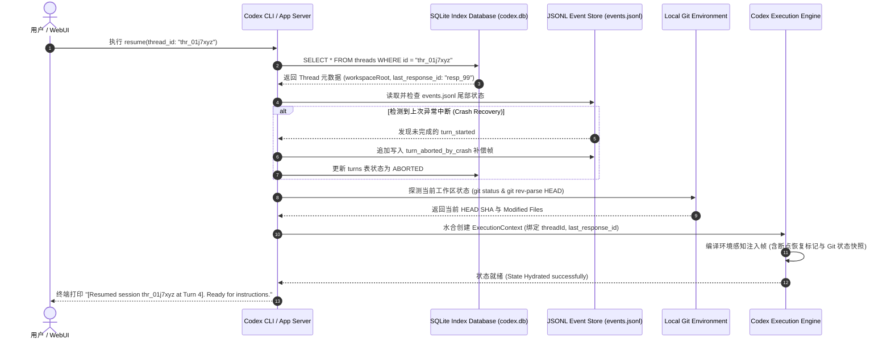

# 02-03 线程持久化、JSONL 事件追溯与会话断点续传（Resume）

> **“在企业级 Agent Harness 体系中，会话（Session）与线程（Thread）绝不能仅仅是内存变量。一个健壮的运行时必须基于事件溯源（Event Sourcing）与关系型索引双层存储架构，确保任意时刻的突发崩溃均可实现零状态丢失的断点秒级恢复（Resume）与执行轨迹完全可重放（Replay）。”**

---


<div class="ai-concept-hero">
  
  <div class="ai-hero-caption">
    <div class="hero-cap-title"><span>🎨</span> SQLite 关系索引 + JSONL 事件溯源双轨 (Dual-Track SQLite & WAL Resume)</div>
    <span class="hero-cap-badge">AI 8K Concept</span>
  </div>
</div>

## 1. 章节导读与核心命题

编程 Agent 的单次任务执行周期往往持续数十分钟甚至数小时。在这一长程交互过程中，系统面临各种不可预知的宿主中断事件：
1. 开发者笔记本电量耗尽或盒盖休眠；
2. IDE 崩溃重载、前端 Web 页面刷新或终端意外关闭；
3. 上游大模型 API 遭遇网络抖动或临时限流。

如果运行时缺乏严密的持久化与恢复设计，进程一旦退出，前序消耗了数十万 Token 积累的代码分析上下文与执行状态将瞬间化为乌有，用户不得不重新从零描述任务。

OpenAI **Codex CLI / App Server** 在存储架构上确立了一套极具工业参考价值的 **“双轨混合持久化引擎（Dual-Track Persistence Engine）”**：
- **底轨：JSONL 事务事件日志（Append-only Event Log）** —— 记录物理粒度的每一帧原始 Thought、Action、Observation 与环境快照，用于高保真重放与调试审计；
- **顶轨：SQLite 线程与实体索引库（Relational Session Index）** —— 维护 Thread 会话元数据、Turn 轮次聚合状态、Token 用量归属与断点标记，用于高性能毫秒级查询与目录管理。

本节将深入解构这套双轨持久化架构的表结构设计、事件溯源机制、断点续传（Session Resume）状态机以及数据一致性与崩溃恢复策略。

<div class="rich-diagram-box">
  <div class="diagram-header-tag">Dual-Track Storage</div>
  <div class="diagram-title"><span>💾</span> OpenAI Codex 关系索引 + 物理事件溯源双轨持久化架构</div>
  <div class="split-two-col">
    <div class="col-box">
      <div class="col-title">🗄️ Track 1: SQLite 关系实体库</div>
      <div class="tech-card blue" style="margin-bottom:6px;"><div class="card-label">threads &amp; turns 表</div><div class="card-sub">会话元信息、状态枚举与 Token 统计</div></div>
      <div class="tech-card green"><div class="card-label">tool_calls 索引表</div><div class="card-sub">结构化工具执行历史</div></div>
    </div>
    <div class="col-box">
      <div class="col-title">📜 Track 2: JSONL 物理事件溯源</div>
      <div class="tech-card purple" style="margin-bottom:6px;"><div class="card-label">events.jsonl 追加日志</div><div class="card-sub">O(1) 物理追加，零损耗记录每帧思考与操作</div></div>
      <div class="tech-card cyan"><div class="card-label">100% 确定性重放引擎</div><div class="card-sub">离线高保真复现任意历史时刻</div></div>
    </div>
  </div>
</div>

---

## 2. 核心专业术语与概念精确释义

| 专业术语 (Terminology) | 中文标准译名 | 底层架构定义与机制说明 |
| :--- | :--- | :--- |
| **Session Resume** | **会话断点续传** | 当中断的客户端重新连接或新进程启动时，通过加载持久化状态快照与历史上下文，从上一次中断的精确执行点恢复运行的能力。 |
| **Event Sourcing (ES)** | **事件溯源架构** | 不直接存储实体的最终状态，而是将系统发生的所有业务事件（Event）按时间序列以不可变（Immutable）日志形式持久化，实体状态通过重放事件流计算得出。 |
| **Write-Ahead Logging (WAL)** | **预写式日志** | 在修改数据库主体或内存状态之前，必须先将变更以追加方式写入物理日志文件，以确保在突发断电或崩溃时能够进行原子重做（Redo）或回滚。 |
| **State Hydration / Rehydration** | **状态水合 / 重新水合** | 将磁盘持久化存储（SQLite/JSONL）中的序列化数据流反序列化，并在内存中重新构建完整的会话对象、状态机与工具注册表的过程。 |
| **Deterministic Replay** | **确定性重放** | 基于事件溯源日志，在完全不发起上游真实 LLM 网络请求的情况下，按原始时序逐帧模拟回放当时的思考、命令执行与输出，用于调试与安全审计。 |
| **State Drift** | **状态漂移** | 断点续传时，宿主物理环境（如文件内容、Git 分支、依赖库）在 Agent 停机期间被外部人类修改，导致内存快照与物理现实不一致的现象。 |
| **ACID Transactions** | **ACID 事务特性** | 数据库事务的四大特性：原子性（Atomicity）、一致性（Consistency）、隔离性（Isolation）与持久性（Durability）。 |

---

## 3. SQLite 关系型实体库设计与数据模型架构

为了支持毫秒级会话列表检索、多维度分页过滤、Token 用量统计与快速状态定位，Codex 在本地采用嵌入式 **SQLite 3（开启 WAL 模式）** 管理结构化实体。

<div class="rich-diagram-box">
  <div class="diagram-header-tag">Relational ER Diagram</div>
  <div class="diagram-title"><span>🗄️</span> SQLite 实体关系模型 (threads ➔ turns ➔ tool_calls)</div>
  <div class="chips-grid-3">
    <div class="tech-card blue">
      <div class="card-label">threads (会话主表)</div>
      <div class="card-sub">id (PK), workspace_root, model, status, last_response_id</div>
    </div>
    <div class="tech-card purple">
      <div class="card-label">turns (交互轮次表)</div>
      <div class="card-sub">id (PK), thread_id (FK), user_prompt, assistant_text, tokens</div>
    </div>
    <div class="tech-card green">
      <div class="card-label">tool_calls (工具索引表)</div>
      <div class="card-sub">call_id (PK), turn_id (FK), tool_name, arguments, result</div>
    </div>
  </div>
</div>

---

## 4. JSONL 物理事件溯源日志（Event Sourcing Log）与 Wire 格式

虽然 SQLite 提供了极佳的关系查询能力，但在长文本流式传输与长程调试时，频繁进行 SQL UPDATE 会带来锁争用。因此，Codex 将每一帧最原始的细粒度事件以 **JSON Lines（JSONL）** 格式追加落盘。

### 4.1 JSONL 文件命名与存储规范
- **物理路径**：`~/.codex/threads/<thread_id>/events.jsonl`；
- **存储模式**：`O_APPEND | O_CREAT | O_WRONLY`，纯物理追加写入；
- **分帧契约**：每一行是一个独立的 JSON 字符串，严格以 `\n` 结尾。

### 4.2 典型 JSONL 事件日志流范例

```json
{"version":"1.0","event_id":"evt_001","timestamp":1787126000000,"type":"thread_created","thread_id":"thr_01j7xyz","workspace_root":"/Users/model/projects/feature/ai_home","model":"gpt-5.5"}
{"version":"1.0","event_id":"evt_002","timestamp":1787126000100,"type":"turn_started","turn_index":1,"user_prompt":"修复认证模块缺陷"}
{"version":"1.0","event_id":"evt_003","timestamp":1787126001200,"type":"reasoning_chunk","turn_index":1,"delta":"需要先检查 src/auth/jwt.ts 的实现..."}
{"version":"1.0","event_id":"evt_004","timestamp":1787126002500,"type":"tool_call_requested","turn_index":1,"call_id":"call_read_01","name":"Read","args":{"file_path":"/workspace/src/auth/jwt.ts"}}
{"version":"1.0","event_id":"evt_005","timestamp":1787126002600,"type":"tool_call_finished","turn_index":1,"call_id":"call_read_01","name":"Read","result":"export function verifyToken() {...}","is_error":false,"duration_ms":12}
{"version":"1.0","event_id":"evt_006","timestamp":1787126005000,"type":"turn_completed","turn_index":1,"usage":{"input_tokens":1400,"output_tokens":320},"last_response_id":"resp_01j7xyz_1"}
```

---

## 5. 断点续传（Session Resume）状态机与重放（Replay）引擎实现

当用户发起 `aih resume <thread_id>` 或在 WebUI 点击历史会话时，Harness 执行四阶段水合与自愈流程：

```
 [User requests: Resume Session]
                │
                ▼
 [Phase 1: SQLite Fast State Fetch] ──> 查询 threads + turns 表，获取最新 turnIndex 与 last_response_id
                │
                ▼
 [Phase 2: JSONL Consistency Check] ──> 校验 events.jsonl 尾部，若发现有未闭合的 turn_started
                │                         ├── 自动标记为 ABORTED 并自愈补偿
                │                         └── 提取真实最新一致性检查点
                ▼
 [Phase 3: Environmental State Verification] ──> 校验当前 CWD 与 Git HEAD SHA
                │                                 ├── 若检测到代码发生外部变更 (Diff > 0)
                │                                 └── 自动向上下文注入环境漂移警告提示
                ▼
 [Phase 4: Turn Loop Re-attachment] ──> 恢复 ReAct 事件循环，准备接收新指令
```

### 5.1 TypeScript 完整会话持久化与恢复引擎实现

```typescript
import * as fs from 'fs';
import * as path from 'path';
import { Database } from 'sqlite3';

export interface ThreadSnapshot {
  id: string;
  workspaceRoot: string;
  title: string;
  model: string;
  status: string;
  lastResponseId?: string;
  turnsCount: number;
}

export class SessionPersistenceManager {
  private db: Database;
  private storageRoot: string;

  constructor(storageRoot: string) {
    this.storageRoot = storageRoot;
    const dbPath = path.join(this.storageRoot, 'codex.db');
    this.ensureDirectory(this.storageRoot);
    this.db = new Database(dbPath);
    this.initializeTables();
  }

  private ensureDirectory(dir: string): void {
    if (!fs.existsSync(dir)) fs.mkdirSync(dir, { recursive: true });
  }

  private initializeTables(): void {
    // 启用 WAL 模式大幅提高并发读写性能
    this.db.run('PRAGMA journal_mode = WAL;');
    this.db.run(`
      CREATE TABLE IF NOT EXISTS threads (
        id TEXT PRIMARY KEY,
        workspace_root TEXT NOT NULL,
        title TEXT NOT NULL,
        model TEXT NOT NULL,
        status TEXT DEFAULT 'IDLE',
        last_response_id TEXT,
        created_at INTEGER NOT NULL,
        updated_at INTEGER NOT NULL
      );
    `);
    this.db.run(`
      CREATE TABLE IF NOT EXISTS turns (
        id TEXT PRIMARY KEY,
        thread_id TEXT NOT NULL,
        turn_index INTEGER NOT NULL,
        status TEXT DEFAULT 'IN_PROGRESS',
        user_prompt TEXT NOT NULL,
        assistant_text TEXT,
        started_at INTEGER NOT NULL,
        completed_at INTEGER
      );
    `);
  }

  /**
   * 追加写入一条不可变物理事件至 JSONL
   */
  public appendEventLog(threadId: string, event: Record<string, unknown>): void {
    const threadDir = path.join(this.storageRoot, 'threads', threadId);
    this.ensureDirectory(threadDir);
    const jsonlPath = path.join(threadDir, 'events.jsonl');

    const line = JSON.stringify({
      ...event,
      timestamp: Date.now()
    }) + '\n';

    fs.appendFileSync(jsonlPath, line, 'utf-8');
  }

  /**
   * 核心恢复逻辑：从 SQLite 与 JSONL 瞬时恢复会话
   */
  public async resumeThread(threadId: string): Promise<ThreadSnapshot> {
    return new Promise((resolve, reject) => {
      this.db.get('SELECT * FROM threads WHERE id = ?', [threadId], (err, row: any) => {
        if (err) return reject(err);
        if (!row) return reject(new Error(`Thread '${threadId}' not found in database.`));

        // 检查 JSONL 完整性并自愈
        this.verifyAndRepairJsonl(threadId);

        resolve({
          id: row.id,
          workspaceRoot: row.workspace_root,
          title: row.title,
          model: row.model,
          status: row.status,
          lastResponseId: row.last_response_id,
          turnsCount: 0
        });
      });
    });
  }

  /**
   * 扫描 JSONL 尾部自愈未决崩溃
   */
  private verifyAndRepairJsonl(threadId: string): void {
    const jsonlPath = path.join(this.storageRoot, 'threads', threadId, 'events.jsonl');
    if (!fs.existsSync(jsonlPath)) return;

    const lines = fs.readFileSync(jsonlPath, 'utf-8').trim().split('\n');
    if (lines.length === 0) return;

    try {
      const lastEvent = JSON.parse(lines[lines.length - 1]);
      // 若最后一条事件是 turn_started，说明上次在推理途中突发崩溃
      if (lastEvent.type === 'turn_started' || lastEvent.type === 'tool_call_requested') {
        this.appendEventLog(threadId, {
          type: 'turn_aborted_by_crash',
          turn_index: lastEvent.turn_index,
          reason: 'Auto-recovered from unexpected process crash on resume.'
        });
      }
    } catch (e) {
      // 容错处理损坏的尾部分片
    }
  }
}
```

---

## 6. 断点续传时序图与核心源码调用栈

### 6.1 会话断点续传（Resume）时序图 (Resume Sequence)



### 6.2 核心源码级调用栈 (Source Call Stack)

```
[CodexCliApp::resume_session] (src/cli/commands/resume.rs:35)
  │
  ├── [ThreadStorage::load_thread_metadata] (src/storage/sqlite.rs:60)
  │     └── SELECT * FROM threads WHERE id = ?
  │
  ├── [EventLogAuditor::verify_and_repair] (src/storage/jsonl.rs:88)
  │     ├── [JsonlReader::read_tail_events]
  │     └── [JsonlWriter::append_recovery_frame]
  │
  ├── [EnvironmentAuditor::check_state_drift] (src/env/git.rs:42)
  │     ├── [GitCommand::rev_parse_head]
  │     └── [GitCommand::status_porcelain]
  │
  └── [CodexEngine::rehydrate_thread] (src/engine/runtime.rs:110)
        ├── [ResponsesWireClient::set_continuity_id(last_response_id)]
        └── [TurnLoop::listen_for_input]
```

---

## 7. 极端异常边界与数据一致性防御

| 异常边界场景 | 物理成因与危害 | Harness 核心防线与自愈算法 (Self-Healing) |
| :--- | :--- | :--- |
| **1. 突发断电导致 JSONL 尾行残缺 (Torn Write)** | 操作系统写入磁盘时断电，`events.jsonl` 末尾留存了半截非法 JSON 字符。 | **末行截断自愈算法（Tail Truncation Recovery）**：<br>恢复引擎在解析 JSONL 时，若最后一行抛出 `JSON.parse` 错误，自动将文件指针回退并执行 `ftruncate` 丢弃损坏的末尾残字节，确保前序完好日志不被破坏。 |
| **2. SQLite 文件被意外删除 (DB Corruption / Loss)** | 开发者手误删除了 `codex.db`，但 `threads/<id>/events.jsonl` 依然完好。 | **从 JSONL 全量离线重构 SQLite（Event Sourcing Rebuild）**：<br>启动时若发现 SQLite 丢失，自动遍历 `threads/*/events.jsonl`，逐行重放所有物理事件，100% 幂等无损重建 `threads`、`turns` 与 `tool_calls` 表。 |
| **3. 跨机器迁移导致路径硬编码失效 (Path Mismatch)** | 用户将会话目录拷贝到了另一台 Mac 上（用户名从 `/Users/alice` 变为 `/Users/bob`）。 | **相对路径动态重写与 CWD 自适应**：<br>在持久化时一律对工作区内文件使用相对路径存储；在 Resume 时动态获取当前工作目录前缀进行拼装，杜绝因绝对路径漂移导致 `File Not Found`。 |
| **4. 数据库并发写锁死 (Database Locked / SQLITE_BUSY)** | 多个后台 Worker 线程或多 Agent 并发写入同一个 SQLite 实例。 | **开启 WAL 模式与 Busy Timeout 队列**：<br>1. 必须配置 `PRAGMA journal_mode = WAL;`；<br>2. 设置 `PRAGMA busy_timeout = 5000;`，自动进行 5 秒内的指数重试等待，杜绝并发死锁。 |

---

## 8. 对 ai_home 自主 Harness 研发的落地指导与架构设计

在 `ai_home` 项目落地高性能多模型会话管理与断点续传系统时，存储层必须严格落地以下三大设计规范：

### 8.1 架构设计一：全面确立 SQLite + JSONL 双轨存储引擎
- **当前现状**：目前 `ai_home` 主要依赖纯 SQLite 单轨存储或部分内存缓存。
- **重构方案**：
  1. 保留 `~/.aih/aih.db` 作为全局快速索引（存储会话列表、账号归属、Token 统计）；
  2. 新增 `~/.aih/sessions/<session_id>.jsonl` 作为每个会话的底层不可变物理事件溯源流；
  3. 彻底实现读写分离：高频流式事件写 JSONL，聚合状态写 SQLite。

### 8.2 架构设计二：原生落地 `aih resume <session_id>` 命令行与 WebUI 瞬时恢复
- **落地方案**：
  1. 新增 `lib/storage/session-resumer.ts`；
  2. 支持在终端通过 `aih resume` 查看历史会话列表并一键继续未完成的任务；
  3. WebUI 刷新页面后，通过 WebSocket 握手自动发送 `session_attach` 帧，10ms 内完成状态水合与 UI 历史重放。

### 8.3 架构设计三：引入崩溃自动感知与事件一致性自愈管道
- **落地方案**：
  1. 在会话启动与恢复时，自动对上次异常退出的未决轮次打上 `ABORTED` 标记；
  2. 探测工作区 Git 状态漂移并生成显式提示，消除大模型由于本地代码被人类手动修改而产生的推理幻觉。

---

## 9. 本章小结与下章预告

本章深入解构了 OpenAI Codex 工业级的 **双轨持久化架构（SQLite 关系索引 + JSONL 事件溯源）**、断点续传（Resume）四阶段状态机、TypeScript/Rust 核心实现与极端崩溃自愈算法，并为 `ai_home` 的持久化中枢制定了落地方案。

在下一章 **【02-04 多账号凭据投影、原生 auth.json 与环境隔离模型】** 中，我们将深入剖析 Codex 的账号与鉴权子系统，拆解其如何通过多账号凭据投影、原生 `auth.json` 安全托管以及环境变量动态注入，实现企业级多租户与多凭据的安全隔离。
