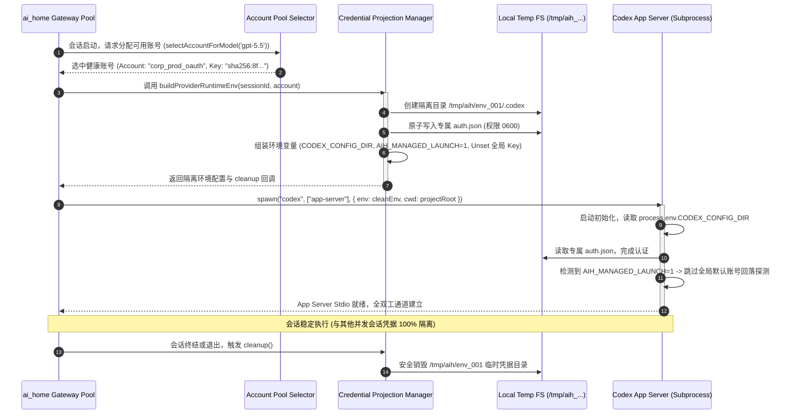

# 02-04 多账号凭据投影、原生 auth.json 与环境隔离模型

> **“在企业级多租户与多账号并发场景下，凭据管理绝不能简单地依赖修改全局宿主环境（如写入 `~/.bashrc` 或全局覆盖 `~/.config/`）。现代 Agent Harness 必须基于‘内存沙箱投影、会话级动态凭据注入与进程级隔离’，实现多账号零冲突并发与凭据物理不落地。”**

---

## 1. 章节导读与核心命题

在实际工业界落地中，开发团队与企业用户往往配置了多个不同等级、不同计费团队或不同限流阈值的模型账号（例如个人付费账号、企业 Team 账号、按量付费的 API Key 账号、海外节点订阅账号等）。

传统的 CLI 工具（如官方 `codex` 或早期 `claude`）在账号认证上大多假设**单用户单机独占模式**：通常将凭据直接写入宿主机器的固定目录（如 `~/.config/codex/auth.json` 或系统的 Keychain/Keyring）。这种设计在并发场景下会导致灾难性的结构性缺陷：
1. **全局凭据覆写竞争（Credential Trampling）**：当会话 A 正在使用账号 1 运行长任务时，用户在终端启动会话 B 登录账号 2，直接覆写全局凭据文件，导致会话 A 突发 `401 Unauthorized / Token Expired` 崩溃；
2. **凭据物理泄漏风险**：将明文 API Key 写入全局环境变量或磁盘临时文件，极易被 Agent 自身执行的 `Bash` 脚本或第三方恶意代码读取外泄；
3. **缺少托管启动标记（Managed-Launch Marker）**：当 Harness 作为父进程唤起原生 CLI 进程时，全局 CLI 钩子（Global Hook）可能会误判为人类手动运行，进而强行回退到宿主默认账号或弹出交互式登录，破坏自动化流水线。

为了解决这一系列难题，OpenAI **Codex CLI / App Server** 联合工业级网关（如 `ai_home`）演进出了一套成熟的 **“多账号凭据投影、原生 `auth.json` 虚拟化与托管环境隔离模型（Managed Launch & Credential Projection Model）”**。

本节将系统拆解这套凭据架构的底层数据结构、内存投影机制、环境变量清理与进程沙箱隔离方案。

<div class="rich-diagram-box">
  <div class="diagram-header-tag">Credential Isolation</div>
  <div class="diagram-title"><span>🔒</span> 多账号凭据动态投影与受控环境隔离模型</div>
  <div class="harness-stack">
    <div class="stack-layer">
      <div class="layer-badge">Central Account Pool (中央统一凭据池)</div>
      <div class="chips-grid-3">
        <div class="tech-card blue"><div class="card-label">OAuth 凭据槽 1</div><div class="card-sub">team_prod (自动 Token 轮转)</div></div>
        <div class="tech-card purple"><div class="card-label">API Key 凭据槽 2</div><div class="card-sub">fast_relay (直连高并发)</div></div>
        <div class="tech-card green"><div class="card-label">(Account, Model) 熔断器</div><div class="card-sub">429 独立退避冷却</div></div>
      </div>
    </div>
    <div class="flow-connector">⬇️ 动态构建干净运行时环境 (Build Isolated Runtime Env)</div>
    <div class="split-two-col">
      <div class="col-box">
        <div class="col-title">🧪 Subprocess Sandbox A (Session 1)</div>
        <div class="tech-card cyan" style="margin-bottom:6px;"><div class="card-label">CODEX_CONFIG_DIR = /tmp/c1</div></div>
        <div class="tech-card orange"><div class="card-label">AIH_MANAGED_LAUNCH = 1 (防回落)</div></div>
      </div>
      <div class="col-box">
        <div class="col-title">🧪 Subprocess Sandbox B (Session 2)</div>
        <div class="tech-card cyan" style="margin-bottom:6px;"><div class="card-label">CODEX_CONFIG_DIR = /tmp/c2</div></div>
        <div class="tech-card orange"><div class="card-label">AIH_MANAGED_LAUNCH = 1 (防回落)</div></div>
      </div>
    </div>
  </div>
</div>

---

## 2. 核心专业术语与概念精确释义

| 专业术语 (Terminology) | 中文标准译名 | 底层架构定义与机制说明 |
| :--- | :--- | :--- |
| **Credential Projection** | **凭据沙箱投影** | 将中央凭据池中的特定账号信息，在进程启动瞬间以临时虚拟文件（Virtual File）或环境变量形式安全映射到目标子进程中，宿主真实环境无任何变更。 |
| **Managed-Launch Marker** | **托管启动标记** | Harness 在拉起子进程时注入的环境变量哨兵标记（如 `AIH_MANAGED_LAUNCH=1`），指示子进程运行在受控 Harness 托管容器内，禁止其触发交互式登录或回退到全局默认账号。 |
| **Transient Config Directory** | **临时配置目录** | 为每个并发 Agent 实例动态分配的临时存储路径（如 `/tmp/aih_codex_env_<uuid>`），实现多实例间 `auth.json`、缓存与会话状态的物理隔离。 |
| **Fake-HOME Anti-pattern** | **伪造宿主主目录反模式** | 过去某些系统通过修改 `HOME=/tmp/fake` 来强行隔离凭据的简陋做法。该反模式会导致 `~/.gitconfig`、`~/.ssh`、`~/.npmrc` 等开发者基础配置全部丢失，严重破坏工程编译。 |
| **Environment Sanitization** | **环境变量净化与清洗** | 在子进程启动前，严格清除宿主可能遗留的污染变量（如系统 `OPENAI_API_KEY`、`HTTP_PROXY`），确保子进程 100% 严格受 Harness 注入参数约束。 |
| **OAuth Token Refresh Loop** | **OAuth 令牌自动轮转** | 在后台无感检测 Access Token 的过期时间，利用 Refresh Token 异步与上游鉴权端点换发新令牌，并在内存与持久层原子化更新的机制。 |

---

## 3. 原生 `auth.json` 契约结构与 OAuth / API Key 凭据规范

OpenAI Codex 原生客户端使用 `auth.json` 保存身份与令牌信息。Harness 必须精准模拟并生成符合其原生校验规则的数据结构。

### 3.1 `auth.json` 核心 Wire 结构定义

```json
{
  "auth_mode": "oauth",
  "openai_api_key": null,
  "tokens": {
    "access_token": "eyJhbGciOiJSUzI1NiIsImtpZCI6...",
    "refresh_token": "v1.NzA0MmFjODEt...",
    "id_token": "eyJhbGciOiJSUzI1Ni...",
    "expires_at": 1787130000000,
    "token_type": "Bearer"
  },
  "user_info": {
    "account_id": "acc_prod_team_enterprise",
    "email": "developer@corp.example.com",
    "org_id": "org_aih_cloud_2026"
  },
  "settings": {
    "telemetry_enabled": false,
    "auto_update": false
  }
}
```

### 3.2 API Key 直连模式结构 (`auth_mode: "api_key"`)
```json
{
  "auth_mode": "api_key",
  "openai_api_key": "sk-proj-992144882100abc...",
  "tokens": null,
  "user_info": {
    "account_id": "acc_relay_fast_key",
    "email": "api-key-managed@aih.internal"
  }
}
```

---

## 4. 摒弃 Fake-HOME：现代多租户环境隔离模型架构

在早期 Agent 架构探索中，很多方案采用了粗暴的 `Fake-HOME` 策略：
```bash
# ❌ 错误的反模式：导致用户真实的 git 配置、ssh 密钥和全局依赖全部丢失！
export HOME=/tmp/fake_home_agent_1
codex app-server
```

**为什么 Fake-HOME 必须被坚决废黜？**
1. **开发工具链断链**：Agent 执行 `git commit` 时因找不到 `~/.gitconfig` 报错缺少 User Name/Email；执行 `npm install` 找不到私有源认证 `~/.npmrc`；
2. **SSH 密钥丢失**：无法访问企业内部私有 Git 仓库（缺少 `~/.ssh/id_rsa`）；
3. **极其沉重**：每次启动需要复制大量配置文件到临时目录。

### 4.1 现代正统隔离模型：基于专用 Config Dir 与 Env 投影

```
┌────────────────────────────────────────────────────────────────────────────────────────┐
│                              Modern Environment Isolation Blueprint                    │
│                                                                                        │
│  [Preserved Host State (继承宿主必要开发环境)]                                          │
│  ├── HOME = /Users/model (保留真实主目录，gitconfig / ssh / npmrc 100% 完好)           │
│  ├── USER = model, SHELL = /bin/zsh, PATH = (保留完整工具链编译器路径)                 │
│  └── PWD = /Users/model/projects/feature/ai_home (当前物理工作区)                      │
│                                                                                        │
│  [Isolated Credential Projections (精准隔离凭据与运行配置)]                             │
│  ├── CODEX_CONFIG_DIR = /tmp/aih/envs/<session_uuid>/.codex (专属凭据槽)               │
│  │     └── auth.json (仅写入当前会话被分配的特定账号令牌，严格 0600 权限)               │
│  ├── AIH_MANAGED_LAUNCH = 1 (激活受控托管模式，禁止外部全局 Hook 覆盖凭据)            │
│  └── AIH_SESSION_ID = ses_01j7xyz_88 (链路追踪标记)                                    │
│                                                                                        │
│  [Sanitized Global Leakage (物理抹除全局污染)]                                          │
│  ├── Unset OPENAI_API_KEY (防止宿主全局脏 Key 干扰)                                    │
│  └── Unset ANTHROPIC_API_KEY / OPENCODE_API_KEY                                        │
└────────────────────────────────────────────────────────────────────────────────────────┘
```

---

## 5. 凭据投影构建器（Runtime Environment Builder）TypeScript 实现

以下是工业级 Harness 中负责构建隔离子进程环境的 `buildProviderRuntimeEnv` 核心代码实现：

```typescript
import * as fs from 'fs';
import * as path from 'path';
import * as os from 'os';

export interface AccountCredential {
  uniqueKey: string;
  authMode: 'oauth' | 'api_key';
  email: string;
  apiKey?: string;
  accessToken?: string;
  refreshToken?: string;
  expiresAt?: number;
}

export interface IsolatedRuntimeEnvResult {
  env: NodeJS.ProcessEnv;
  transientConfigDir: string;
  cleanup: () => void;
}

export class CredentialProjectionManager {
  private baseDir: string;

  constructor() {
    this.baseDir = path.join(os.tmpdir(), 'aih_runtime_envs');
    if (!fs.existsSync(this.baseDir)) {
      fs.mkdirSync(this.baseDir, { recursive: true });
    }
  }

  /**
   * 为指定会话构建完全隔离的进程环境变量与凭据投影
   */
  public buildProviderRuntimeEnv(sessionId: string, account: AccountCredential, customEndpoint?: string): IsolatedRuntimeEnvResult {
    // 1. 创建该会话独占的临时配置目录
    const sessionDir = path.join(this.baseDir, `env_${sessionId}_${Date.now()}`);
    const codexConfigDir = path.join(sessionDir, '.codex');
    fs.mkdirSync(codexConfigDir, { recursive: true });

    // 2. 组装原生 auth.json 契约
    const authJsonPath = path.join(codexConfigDir, 'auth.json');
    const authPayload = {
      auth_mode: account.authMode,
      openai_api_key: account.authMode === 'api_key' ? account.apiKey : null,
      tokens: account.authMode === 'oauth' ? {
        access_token: account.accessToken,
        refresh_token: account.refreshToken,
        expires_at: account.expiresAt || (Date.now() + 3600 * 1000),
        token_type: 'Bearer'
      } : null,
      user_info: {
        account_id: account.uniqueKey,
        email: account.email
      }
    };

    // 写入文件并限制权限为仅当前用户可读写 (0600)
    fs.writeFileSync(authJsonPath, JSON.stringify(authPayload, null, 2), {
      encoding: 'utf-8',
      mode: 0o600
    });

    // 3. 构建净化后的环境变量表
    const cleanEnv: NodeJS.ProcessEnv = { ...process.env };

    // 抹除宿主可能存在的全局 API Key 干扰
    delete cleanEnv.OPENAI_API_KEY;
    delete cleanEnv.ANTHROPIC_API_KEY;

    // 注入精准隔离的投影配置
    cleanEnv.CODEX_CONFIG_DIR = codexConfigDir;
    cleanEnv.AIH_MANAGED_LAUNCH = '1'; // 核心托管标记：禁止回落默认账号
    cleanEnv.AIH_SESSION_ID = sessionId;

    // 若配置了中转网关端点，注入动态覆盖
    if (customEndpoint) {
      cleanEnv.OPENAI_BASE_URL = customEndpoint;
    }

    // 4. 定义生命周期结束时的清理函数
    const cleanup = () => {
      try {
        if (fs.existsSync(sessionDir)) {
          fs.rmSync(sessionDir, { recursive: true, force: true });
        }
      } catch (err) {
        // 静默处理清理异常
      }
    };

    return {
      env: cleanEnv,
      transientConfigDir: sessionDir,
      cleanup
    };
  }
}
```

---

## 6. 进程派生时序流与核心源码调用栈

### 6.1 凭据投影与隔离启动时序图 (Managed-Launch Sequence)



### 6.2 核心源码级调用栈 (Source Call Stack)

```
[AgentSessionRunner.launch] (lib/runtime/session-runner.ts:50)
  │
  ├── [ModelAccountPoolSelector.acquire] (lib/account/pool-selector.ts:72)
  │     └── [AccountCooldownTracker.checkHealth]
  │
  ├── [CredentialProjectionManager.buildProviderRuntimeEnv] (lib/account/projection.ts:40)
  │     ├── [TempDirectory.createIsolated]
  │     ├── [AuthJsonSerializer.writeSecureFile(0600)]
  │     └── [EnvSanitizer.cleanGlobalPollution]
  │
  └── [PtyProcessManager.spawn] (lib/pty/process-manager.ts:85)
        ├── spawn(binaryPath, args, { env: projectedEnv, cwd: workspaceRoot })
        └── [ChildProcess.on('exit', cleanupCallback)]
```

---

## 7. 极端异常边界与凭据安全防御

| 异常边界场景 | 物理成因与危害 | Harness 核心防线与自愈算法 (Self-Healing) |
| :--- | :--- | :--- |
| **1. 凭据漂移与全局 Hook 越权劫持 (Hook Hijacking)** | 系统全局安装了第三方脚本或拦截器，在 Agent 启动时强制读取全局 `~/.config/codex/auth.json` 覆盖凭据。 | **强制环境变量显式断链（Explicit Override Guard）**：<br>通过在子进程环境强制注入 `CODEX_CONFIG_DIR` 与 `AIH_MANAGED_LAUNCH=1`，并在 Stdio 握手首帧中校验客户端上报的 `AccountIdentityHash`；若发现上报身份与分配身份不符，立即强杀子进程并抛出告警。 |
| **2. 磁盘残留凭据泄露 (Token Residual Leak)** | 宿主服务器异常宕机或断电，`/tmp/` 下留存大量包含有效 Access Token 的 `auth.json` 文件。 | **内存管道或 RAM Disk 挂载 + 启动期清理**：<br>1. 优先使用 `/dev/shm`（内存文件系统）存储临时配置；<br>2. 宿主服务启动时，自动扫描并清除超过 24 小时未更新的临时凭据目录。 |
| **3. Access Token 运行中突发过期 (Token Expiry Mid-Task)** | 一个持续 2 小时的长任务执行中，OAuth Access Token（通常 1 小时有效）过期，导致后续工具调用触发 HTTP 401。 | **后台异步无感 Refresh 循环**：<br>Harness 维护全局 Token 轮转定时器（提前 5 分钟），在后台利用 `refresh_token` 请求上游换发新令牌，并在内存与子进程 `auth.json` 中原子化覆盖写入，子进程无需重启即可自动加载新 Token。 |
| **4. 429 级联雪崩与整号误封 (Cascading Rate Limit)** | 某个模型触发 429 限流，Harness 误以为整个账号被封禁，将该账号下的所有其他模型一同锁死。 | **基于 (Account, Model) 二元组的独立熔断机制**：<br>严格遵循 `lib/account/account-identity.js` 单一真相原则：熔断器仅对 `(UniqueAccountKey, ModelID)` 二元组施加指数退避冷却（如 30s），账号下的其他可用模型继续正常服务。 |

---

## 8. 对 ai_home 自主 Harness 研发的落地指导与架构设计

在 `ai_home` 项目管理多账号凭据、模型路由与多会话并发的核心链路中，必须落地以下三大架构规范：

### 8.1 架构设计一：全面建立基于 `unique_key` 的持久化账号身份中心
- **当前现状**：此前部分模块使用可变的 CLI `accountId` 作为索引，导致换号或重排后状态错乱。
- **重构方案**：
  1. 严格以 `account-identity.js` 为唯一真相源：OAuth 账号以 `email` 为唯一键，API Key 账号以 `URL + KeyHash` 为唯一键（`unique_key`）；
  2. 废除所有以数组下标作为账号引用的遗留代码。

### 8.2 架构设计二：原生落地 `buildProviderRuntimeEnv` 凭据动态投影管道
- **落地方案**：
  1. 将本文实现的 `CredentialProjectionManager` 固化为底层标准服务；
  2. 在唤起 `claude`、`codex`、`opencode` 等任何底层 Provider CLI 或 App Server 时，一律强制执行“专用临时配置目录 + `AIH_MANAGED_LAUNCH=1` 注入 + 宿主全局 Key 净化”的三部曲。

### 8.3 架构设计三：实施精确的 `(Account, Model)` 粒度调度与冷却熔断
- **落地方案**：
  1. 在 `lib/account/model-account-pool-selector.ts` 中维护二元组健康状态表；
  2. 当特定账号的特定模型遭遇 429 时，仅对该二元组进行冷却，负载均衡器自动无感平滑降级至账号池中的健康备用凭据，实现多账号集群的弹性高可用。

---

## 9. 本章小结与第二篇总结

本章全面解构了 OpenAI Codex 工业级的 **多账号凭据投影、原生 `auth.json` 契约结构、托管启动标记（Managed-Launch Marker）与现代环境隔离模型**，彻底终结了 Fake-HOME 的反模式设计，并为 `ai_home` 的账号安全中枢提供了落地方案。

### 📗 第二篇：OpenAI Codex CLI / App Server 解构·全景结语
至此，我们已经完整解构了 OpenAI Codex 体系的核心技术壁垒：
- **02-01**：Stdio JSON-RPC 2.0 App Server 架构、行分隔分帧与全双工事件总线；
- **02-02**：Responses API 协议契约、SSE 语义事件分片流与非阻塞流式工具调用桥接；
- **02-03**：SQLite 关系型索引 + JSONL 事件溯源双轨持久化与断点续传（Resume）状态机；
- **02-04**：多账号凭据投影、原生 `auth.json` 虚拟化与托管环境安全隔离模型。

在接下来的 **【第三篇：OpenCode 架构深度解构】** 中，我们将把视野转向当前最流行的开源多模型 Agent 架构 **OpenCode**，深入拆解其独特的 **双向 Hook 插件流水线、`opencode.db` SQLite 实体模型以及 Zen / Go 双端点路由体系**。
