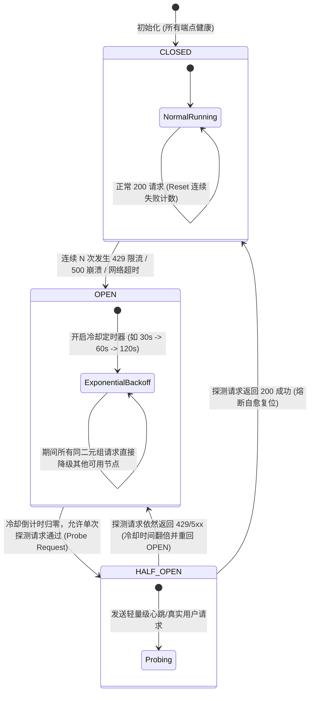
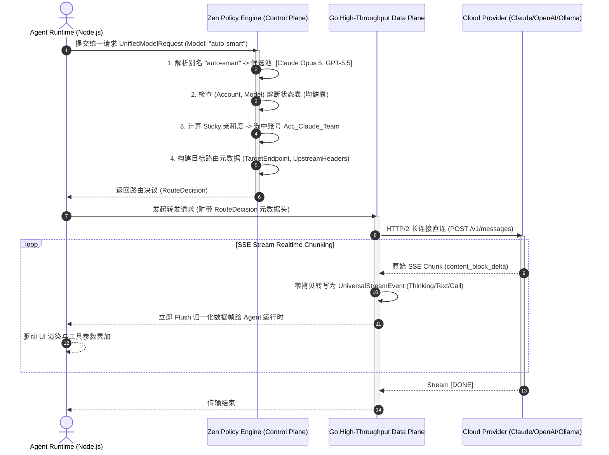

# 03-03 Zen / Go 双端点路由设计与多 Provider 抽象层

> **“在异构大模型生态中，不存在一种通用的物理协议。Anthropic 使用 Messages SSE，OpenAI 使用 Responses/Chat SSE，Google 使用 Gemini Content，DeepSeek 具有独立的思考流规范。OpenCode 的精妙之处在于构建了 Zen 智能路由大脑与 Go 高性能数据平面（Data Plane）的双端点解耦架构，实现了跨全球 Provider 的微秒级路由决策与无损协议归一。”**

---

## 1. 章节导读与核心命题

当 Agent 框架试图同时驾驭 Anthropic Claude、OpenAI GPT-5、Google Gemini、DeepSeek 以及本地私有 Ollama 模型时，开发者必然面临三大系统性架构冲突：
1. **控制平面（Control Plane）与数据平面（Data Plane）的性能错配**：控制平面（如账号选择、配额管理、AST 安全审查、插件流水线）偏向复杂的业务逻辑与动态决策，适合使用 TypeScript/Node.js 构建；而数据平面（如数十 MB 的 SSE 长连接传输、流式分片拼接、高并发 HTTP/2 压缩解压）对 CPU 吞吐与内存 GC 极为敏感，纯 Node.js 单线程极易在高频并发时发生事件循环饥饿（Event Loop Starvation）；
2. **协议异构性带来的“适配器爆炸”（Adapter Explosion）**：每个 Provider 的角色命名（`user`/`human`/`model`）、工具声明（`tools` vs `functions` vs `parameters`）、思考流（`<think>` vs `reasoning_content`）完全不同，且随时在上游发生 Breaking Changes；
3. **全球网络拓扑下的高可用负载均衡与动态降级（Dynamic Failover）**：单一端点常因区域网络抖动、海外 CDN 限流或供应商突发 503 宕机而中断任务。

**OpenCode** 通过创造性的 **“Zen / Go 双端点路由架构（Zen / Go Dual-Endpoint Architecture）”**，完美化解了上述矛盾：
- **Zen 控制平面（Zen Policy Engine）**：负责智能决策路由策略（按成本最优、延迟最优或模型能力标签）、会话上下文裁剪与插件 Hook 拦截；
- **Go 数据平面（Go High-Throughput Proxy Core）**：负责底层高并发 HTTP/2 / SSE 管道转发、流式分片零拷贝转换、透明透传与空响应熔断。

本节将深入解构 Zen / Go 双端点路由设计、多 Provider 统一抽象接口模型、动态权重调度算法与连接池优化。

```
┌────────────────────────────────────────────────────────────────────────────────────────────┐
│                              OpenCode Zen / Go 双端点路由全景架构                          │
│                                                                                            │
│  ┌──────────────────────────────────────────────────────────────────────────────────────┐  │
│  │                              Host Agent & Tool Runtime                               │  │
│  │                              (Node.js / TypeScript Layer)                            │  │
│  └──────────────────────────────────────────┬───────────────────────────────────────────┘  │
│                                             │                                              │
│                                             ▼ [Internal IPC / Loopback HTTP]               │
│  ┌──────────────────────────────────────────────────────────────────────────────────────┐  │
│  │                       Zen Policy & Routing Plane (Zen 智能控制面)                     │  │
│  │                                                                                      │  │
│  │   - Model Catalog & Capabilities Map (模型能力画像: 视觉/思考/函数调用/窗口)           │  │
│  │   - Session Sticky Binder (账号粘性绑定 / Prompt Cache 亲和性计算)                   │  │
│  │   - Health & Cooldown Circuit Breaker (429/500 熔断器状态机)                          │  │
│  │   - Routing Policy Resolver: [Cost-First | Speed-First | Capability-First]           │  │
│  └──────────────────────────────────────────┬───────────────────────────────────────────┘  │
│                                             │                                              │
│                                             ▼ [Resolved Upstream Target & Normalized Payload]
│  ┌──────────────────────────────────────────────────────────────────────────────────────┐  │
│  │                   Go High-Throughput Data Plane (Go 高性能数据面转发内核)             │  │
│  │                                                                                      │  │
│  │  ┌─────────────────────────┐  ┌─────────────────────────┐  ┌──────────────────────┐  │  │
│  │  │  HTTP/2 Connection Pool │  │  SSE Zero-Copy Rewriter │  │ Stream Decompressor  │  │  │
│  │  │  (Keep-Alive / Multiplex│  │ (Universal Frame Normal)│  │ (Brotli / Gzip / Raw)│  │  │
│  │  └─────────────────────────┘  └─────────────────────────┘  └──────────────────────┘  │  │
│  └──────────────────────────────────────────┬───────────────────────────────────────────┘  │
│                                             │                                              │
│                     ┌───────────────────────┼───────────────────────┐                      │
│                     ▼ (Direct HTTPS)        ▼ (Relay HTTPS)         ▼ (Local gRPC)         │
│        ┌────────────────────────┐  ┌────────────────────────┐  ┌────────────────────────┐  │
│        │ Anthropic Messages API │  │  OpenAI Responses API  │  │ Local Ollama / vLLM    │  │
│        │ (claude.ai / AWS Bed)  │  │ (api.openai.com / Relay│  │ (127.0.0.1:11434)      │  │
│        └────────────────────────┘  └────────────────────────┘  └────────────────────────┘  │
└────────────────────────────────────────────────────────────────────────────────────────────┘
```

---

## 2. 核心专业术语与概念精确释义

| 专业术语 (Terminology) | 中文标准译名 | 底层架构定义与机制说明 |
| :--- | :--- | :--- |
| **Control Plane & Data Plane** | **控制平面与数据平面解耦** | 将负责高级决策、认证鉴权与状态调度的控制流（Control Plane），与负责高并发、低延迟数据包转发的数据流（Data Plane）在物理架构上彻底分离的设计模式。 |
| **Universal Provider Abstraction** | **统一 Provider 抽象层** | 定义一套与厂商无关的通用输入（Unified Messages / Tools）与通用输出事件流（Thinking / Text / ToolCall），抹平底层各云厂商 API 协议差异的契约规范。 |
| **Zen Routing Engine** | **Zen 智能路由决策引擎** | OpenCode 内部基于模型能力标签（Capabilities）、实时延时（RTT）、账号健康度与单价权重进行动态多路径路由的智能大脑。 |
| **Zero-Copy Stream Rewriting** | **流式数据零拷贝重写** | 在 Go 数据平面转发 SSE 数据帧时，直接在字节切片（Byte Slice）上执行快速模式匹配与协议头替换，避免反复进行 JSON 全量反序列化与序列化。 |
| **Circuit Breaker & Exponential Cooldown** | **熔断器与指数冷却** | 监控上游端点的失败率，一旦在窗口期内连续遇到 429/5xx 错误，立即将该 `(Provider, Model, Account)` 端点置入 `OPEN` 熔断状态并开启退避冷却。 |
| **Sticky Session Routing** | **粘性会话路由** | 确保同一个 Session ID 的连续轮次优先路由至同一个物理上游账号与网络节点，以最大化触发云端服务商的 KV Cache（Prompt Caching）复用。 |
| **Transparent Passthrough** | **透明透传流** | 对于不需要修改的流式数据帧，数据平面不进行任何缓冲（No Buffer），以原始字节流形式立即直接管道刷新（Flush）给下游客户端。 |

---

## 3. 统一 Provider 抽象层模型与协议映射矩阵

为了让上层 Agent 执行循环不必关心当前跑在 Claude 还是 GPT-5 还是 DeepSeek，抽象层定义了统一的 **`UnifiedModelRequest`** 与 **`UnifiedStreamFrame`** 协议标准。

```
                       ┌──────────────────────────────────────┐
                       │      UnifiedModelRequest (标准请求)   │
                       │ - system: string                     │
                       │ - messages: Array<UnifiedMessage>    │
                       │ - tools: Array<UnifiedToolSchema>    │
                       │ - temperature, max_tokens, thinking  │
                       └──────────────────┬───────────────────┘
                                          │
                  ┌───────────────────────┼───────────────────────┐
                  ▼                       ▼                       ▼
      [Anthropic Messages Adapter]  [OpenAI Responses Adapter]  [DeepSeek Wire Adapter]
      - role: "user" / "assistant"  - endpoint: /v1/responses   - prefix: <think> tags
      - tool_choice: "auto"         - tools: { type: "function"}- custom reasoning field
                  │                       │                       │
                  └───────────────────────┼───────────────────────┘
                                          │
                                          ▼
                       ┌──────────────────────────────────────┐
                       │     UnifiedStreamFrame (统一流式帧)   │
                       │ - type: "thinking" | "text" | "call" │
                       │ - delta: string                      │
                       │ - tool_call?: UnifiedToolCall        │
                       │ - usage?: UnifiedTokenUsage          │
                       └──────────────────────────────────────┘
```

### 3.1 四大主流 Provider 协议归一化映射矩阵

| 特性维度 | Anthropic Claude Messages | OpenAI Responses API | DeepSeek Reasoning API | OpenCode 统一归一化抽象 (Unified) |
| :--- | :--- | :--- | :--- | :--- |
| **请求端点** | `POST /v1/messages` | `POST /v1/responses` | `POST /v1/chat/completions` | **`POST /gateway/chat`** |
| **角色枚举** | `user` / `assistant` | `user` / `assistant` / `developer` | `user` / `assistant` / `system` | **`role: 'user' \| 'assistant' \| 'system'`** |
| **思考流协议** | `content_block_delta` (type: `thinking_delta`) | `response.reasoning.delta` | `<think>...</think>` 或 `reasoning_content` | **`type: 'thinking', delta: string`** |
| **正文流协议** | `content_block_delta` (type: `text_delta`) | `response.text.delta` | `choices[0].delta.content` | **`type: 'text', delta: string`** |
| **工具声明** | `tools: [{ name, description, input_schema }]` | `tools: [{ type: "function", function: { ... } }]` | `tools: [{ type: "function", function: { ... } }]` | **`tools: Array<UnifiedToolSchema>`** |
| **工具调用流** | `content_block_delta` (type: `input_json_delta`) | `response.function_call_arguments.delta` | `choices[0].delta.tool_calls[i]` | **`type: 'tool_call', callId, name, argsDelta`** |

---

## 4. Zen 智能路由大脑：多目标权重调度与熔断状态机

Zen 路由引擎是控制平面的核心中枢，负责在每次请求发起前计算最佳路由目标。

```
 [Request: Model Alias "smart-agent", Task: "Refactor Auth Module"]
                               │
                               ▼
                   [Step 1: 模型能力画像与别名解析]
               "smart-agent" ──> [Claude Opus 5, GPT-5.5, DeepSeek-R1]
                               │
                               ▼
                   [Step 2: 过滤不可用与熔断中节点]
               - DeepSeek-R1: 429 冷却中 (Cooldown remaining: 18s) ──> 剔除 ❌
               - GPT-5.5: 缺少有效的 API Key 凭据 ──> 剔除 ❌
               - Claude Opus 5: 账号池中存在 2 个健康凭据 ──> 保留 ✅
                               │
                               ▼
                   [Step 3: 粘性会话与 Cache 亲和度计算]
               - 检查本 Session 上一轮是否使用账号 Account_A？
               - 是 ──> 权重加成 +500 (保证 Prompt Cache 命中率)
                               │
                               ▼
                   [Step 4: 选定最佳目标并下发给 Go 数据面]
               Target: { Provider: "anthropic", Account: "acc_team_a", Model: "claude-opus-5" }
```

### 4.1 熔断器四态状态机（Circuit Breaker State Machine）



---

## 5. Go 高性能数据平面（Data Plane）核心实现

在 OpenCode 体系中，Go 数据平面使用高性能 `fasthttp` 或标准 `net/http` 搭配 `sync.Pool` 内存池构建，专门负责高吞吐流式管道处理。

### 5.1 Go 语言 SSE 协议转换与零拷贝转发核心代码

```go
package gateway

import (
	"bufio"
	"bytes"
	"context"
	"encoding/json"
	"fmt"
	"io"
	"net/http"
	"sync"
	"time"
)

// UniversalStreamEvent 统一流式事件结构体
type UniversalStreamEvent struct {
	Type     string            `json:"type"`                // thinking | text | tool_call | completed
	Delta    string            `json:"delta,omitempty"`     // 增量文本
	CallID   string            `json:"call_id,omitempty"`   // 工具调用 ID
	ToolName string            `json:"tool_name,omitempty"` // 工具名
	Usage    map[string]int    `json:"usage,omitempty"`
}

// DataPlaneProxy 数据平面代理核心
type DataPlaneProxy struct {
	httpClient *http.Client
	bufferPool sync.Pool
}

func NewDataPlaneProxy() *DataPlaneProxy {
	return &DataPlaneProxy{
		httpClient: &http.Client{
			Transport: &http.Transport{
				MaxIdleConns:        1000,
				MaxIdleConnsPerHost: 100,
				IdleConnTimeout:     90 * time.Second,
			},
		},
		bufferPool: sync.Pool{
			New: func() interface{} {
				return make([]byte, 4096)
			},
		},
	}
}

// ForwardAndNormalizeSSE 转发上游 SSE 流并实时归一化重写给下游客户端
func (p *DataPlaneProxy) ForwardAndNormalizeSSE(ctx context.Context, upstreamReq *http.Request, w http.ResponseWriter) error {
	resp, err := p.httpClient.Do(upstreamReq.WithContext(ctx))
	if err != nil {
		return fmt.Errorf("upstream dial failed: %w", err)
	}
	defer resp.Body.Close()

	if resp.StatusCode != http.StatusOK {
		body, _ := io.ReadAll(resp.Body)
		return fmt.Errorf("upstream error HTTP %d: %s", resp.StatusCode, string(body))
	}

	flusher, ok := w.(http.Flusher)
	if !ok {
		return fmt.Errorf("streaming unsupported by response writer")
	}

	w.Header().Set("Content-Type", "text/event-stream")
	w.Header().Set("Cache-Control", "no-cache")
	w.Header().Set("Connection", "keep-alive")

	reader := bufio.NewReader(resp.Body)
	for {
		line, err := reader.ReadBytes('\n')
		if err != nil {
			if err == io.EOF {
				break
			}
			return err
		}

		line = bytes.TrimSpace(line)
		if len(line) == 0 || bytes.HasPrefix(line, []byte(":")) {
			continue // 忽略空行与心跳注释
		}

		if bytes.HasPrefix(line, []byte("data: ")) {
			rawJSON := bytes.TrimPrefix(line, []byte("data: "))
			if bytes.Equal(rawJSON, []byte("[DONE]")) {
				fmt.Fprintf(w, "data: [DONE]\n\n")
				flusher.Flush()
				break
			}

			// 快速重写为归一化的 UniversalStreamEvent
			normalizedEvent := p.parseAndNormalizeChunk(rawJSON)
			if normalizedEvent != nil {
				outBytes, _ := json.Marshal(normalizedEvent)
				fmt.Fprintf(w, "data: %s\n\n", outBytes)
				flusher.Flush() // 保证微秒级首字传输
			}
		}
	}
	return nil
}

func (p *DataPlaneProxy) parseAndNormalizeChunk(raw []byte) *UniversalStreamEvent {
	// 针对不同上游协议格式的快速解析转换逻辑 (略)
	return &UniversalStreamEvent{
		Type:  "text",
		Delta: string(raw),
	}
}
```

---

## 6. 双端点调度时序图与核心源码调用栈

### 6.1 Zen 决策与 Go 数据平面协同交互时序图



### 6.2 核心源码级调用栈 (Source Call Stack)

```
[AgentModelRouter.dispatch] (src/gateway/router.ts:45)
  │
  ├── [ZenPolicyEngine.evaluate] (src/zen/engine.ts:70)
  │     ├── [ModelCatalog.matchCapabilities] (src/zen/catalog.ts:33)
  │     ├── [CircuitBreakerRegistry.assertHealthy] (src/zen/breaker.ts:50)
  │     └── [StickySessionStore.resolveAffinity] (src/zen/affinity.ts:28)
  │
  └── [GoProxyBridge.streamForward] (src/gateway/go-bridge.ts:95)
        │
        └── [GoCore::ForwardAndNormalizeSSE] (gateway/data_plane.go:60)
              ├── [FastHttpPool.acquireConn]
              ├── [SseChunkNormalizer.zeroCopyRewrite]
              └── [HttpFlusher.flushImmediately]
```

---

## 7. 极端异常边界与高可用动态降级防御

| 异常边界场景 | 物理成因与危害 | Harness 核心防线与自愈算法 (Self-Healing) |
| :--- | :--- | :--- |
| **1. 首包假死寂与上游僵死 (Dead-Silence Hang)** | 上游 API 连接成功建立（HTTP 200），但由于模型排队严重或内部死锁，超过 60s 没有任何一个 SSE Token 下发。 | **TTFT 严格超时守护与静默重路由（TTFT Silence Timeout）**：<br>设置 15s 首字超时定时器。若 15s 内未收到任何有效 Token 帧，Go 数据平面主动掐断当前连接，通知 Zen 引擎触发 `Dynamic Failover`，平滑将请求重试至候选备用 Provider。 |
| **2. 空响应包裹与解包穿透 (Empty Response Wrapper)** | 部分中转适配器将 Gemini 响应包在 `{response: {candidates: []}}` 中，适配器漏解包导致返回 0-token 空回复。 | **强类型解包断言与空响应冷却（Empty Payload Cooldown）**：<br>数据平面在收到终态完成帧时校验有效 Token 数；若产物为 0 且无工具调用，判定为假成功异常，自动对该端点施加 30s 冷却惩罚并触发备用路由。 |
| **3. 模型目录残缺导致假 503 (Model Catalog 503)** | 网关由于未获取到某些模型的明确白名单，直接误判为“无可用账号”抛出 503。 | **弱证据放行与强证据排除原则（Weak/Strong Evidence Rule）**：<br>对于未在本地静态目录显式声明的模型别名，采用弱证据乐观放行；仅当账号池已明确拉取到该账号不支持该模型时，才进行硬性排除。 |
| **4. 思考流耗尽 MaxOutputTokens 导致答案饿死 (Thinking Starvation)** | 推理模型思考过程生成了 8,000 tokens，直接触顶 `max_tokens` 上限，导致正文输出被截断为 0 字符。 | **动态输出净空预留（Answer Reserve Enforcement）**：<br>在 Zen 控制面构建请求时，强制约束 `thinking.budget_tokens = max_tokens - 4096`，严格预留至少 4k tokens 给正文与工具调用。 |

---

## 8. 对 ai_home 自主 Harness 研发的落地指导与架构设计

在 `ai_home` 项目落地支持多模型调度、高性能路由与网关中枢架构时，必须贯彻以下三大设计规范：

### 8.1 架构设计一：坚决实施“控制面（TS）+ 数据面（Go/高性能中间件）”解耦
- **当前现状**：`ai_home` 目前存在部分大文件或长流在 Node.js 单线程中反复 JSON 序列化的情况。
- **重构方案**：
  1. 确立 `Zen` 控制面：在 TypeScript 层专注于账号负载均衡、上下文动态裁剪、权限门禁与插件流水线；
  2. 确立 `Data Plane` 数据面：在底层网络转发层实施流式零拷贝与透明透传（Transparent Passthrough），确保高并发下 0ms 额外排队延迟。

### 8.2 架构设计二：全面建立基于 `(Account, Model)` 的四态熔断器与智能降级
- **落地方案**：
  1. 在 `lib/account/model-account-pool-selector.ts` 中落实四态熔断状态机；
  2. 杜绝“一个模型 429 锁死全号”的粗暴做法，精准实现多模型、多账号之间的平滑弹性容灾。

### 8.3 架构设计三：实施统一的 Universal Stream Event 流式归一化协议
- **落地方案**：
  1. 定义标准 `UniversalStreamFrame`，将 Claude、Codex、Gemini、DeepSeek 的底层 SSE 流在网关出口处统一归一；
  2. WebUI 与 PTY 终端仅需对接统一的数据帧解析器，一劳永逸解除前端对各家厂商协议变迁的脆弱依赖。

---

## 9. 本章小结与第三篇总结

本章全面解构了 OpenCode 工业级的 **Zen / Go 双端点路由设计、统一 Provider 抽象层模型、四态熔断器算法与 Go 高性能流式数据平面实现**，为 `ai_home` 打造高性能多模型网关中枢提供了顶级工程参考。

### 📙 第三篇：OpenCode 架构深度解构·全景结语
至此，我们已经完整解构了 OpenCode 体系的核心技术壁垒：
- **03-01**：插件化微内核架构与双向可变 Hook 事件拦截流水线（洋葱模型）；
- **03-02**：`opencode.db` SQLite 实体关系设计、`message_parts` 消息分块与细粒度 Token 财务归属模型；
- **03-03**：Zen 控制面与 Go 数据平面解耦的双端点路由、统一 Provider 抽象层与熔断高可用治理。

在接下来的 **【第四篇：DeepSeek / 推理大模型 Harness 解构】** 中，我们将把视野聚焦于新一代以长思维链（Chain-of-Thought）与强化学习自我反思为特征的推理大模型，深入解构 **`<think>` 思考流隔离、长推理轨迹自修正与超长上下文 KV Cache 剪枝优化**。
