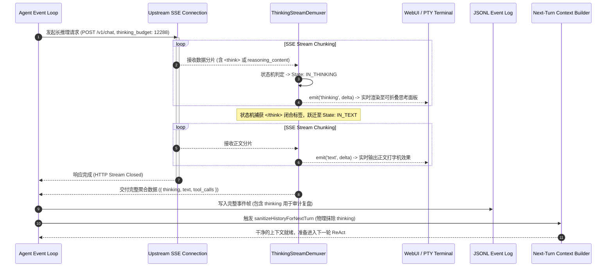

# 04-01 思考过程（`<think>` / `reasoning_content`）与正文流解耦及预算控制

> **“以 DeepSeek-R1、Claude 3.7 Thinking 及 OpenAI o1/o3 为代表的长推理大模型，将 AI 从简单的‘单步条件概率补全’推向了‘深思熟虑、自反思修正与长链思维展开’的新纪元。然而，思考过程并不是最终交付物。Agent Harness 必须在流式传输、存储落盘与后续上下文注入三大阶段，对思考流实施绝对的物理级解耦与动态预算治理，否则系统将迅速陷入 Token 饿死与上下文污染的深渊。”**

---

## 1. 章节导读与核心命题

推理大模型（Reasoning Models）在复杂代码重构、数学推导与逻辑规划上展现了惊人的能力。但将推理大模型接入生产级 Agent Harness 运行时时，传统的输入输出管线瞬间遭遇了四大致命冲突：
1. **“思考吃光答案”的预算饿死危机（Thinking Starvation）**：推理模型可能会自主生成 8,000 到 16,000 个 Token 的超长 `<think>` 思考链。如果网关没有针对 `max_tokens` 与 `thinking_budget` 设置物理差值隔离，大模型会在思考过程结束的瞬间触发 `stop_reason = 'max_tokens'`，导致正文输出被截断为 0 字符（用户端表现为“转圈思考了 30 秒，却没有任何最终回答或工具调用”）；
2. **协议碎片化与解包灾难**：DeepSeek 官方 API 早期通过正文混杂 `<think>...</think>` 标签返回，后期演进为独立的 `reasoning_content` 字段；Anthropic 使用 `content_block_delta (thinking_delta)`；OpenAI 使用 `response.reasoning.delta`。如果 Harness 缺乏统一的解耦流式状态机，UI 渲染将发生严重的文本污染与标签穿透；
3. **上下文回灌污染与 Prompt Cache 击穿（Context Poisoning on Subsequent Turns）**：在多轮 ReAct 交互中，如果将第 1 轮模型生成的数万字中间思考过程原封不动地当作 `assistant` 历史消息喂回第 2 轮请求，上下文会迅速膨胀并引发注意力退化，且会导致后续上游的 Prompt Cache 命中率断崖式下跌。

本节将深入解构推理模型的思考流传输机理、**流式多路解耦分发器（Thinking/Text De-muxer）** 的状态机实现、动态思考预算分配算法以及跨轮次历史净化（Thinking Strip）工程。

<div class="rich-diagram-box">
  <div class="diagram-header-tag">Thinking Demuxing Topology</div>
  <div class="diagram-title"><span>🧠</span> 推理大模型思考流解耦与预算治理全景拓扑</div>
  <div class="harness-stack">
    <div class="stack-layer">
      <div class="layer-badge">ThinkingStreamDemuxer (流式多路解耦解包状态机)</div>
      <div class="chips-grid-3">
        <div class="tech-card orange"><div class="card-label">1. IN_THINKING</div><div class="card-sub">提取纯思维链，实时推送至折叠抽屉</div></div>
        <div class="tech-card cyan"><div class="card-label">2. IN_TEXT</div><div class="card-sub">最终正文文本，流式推送至屏幕</div></div>
        <div class="tech-card green"><div class="card-label">3. IN_TOOL_CALL</div><div class="card-sub">工具参数累加，触发物理动作</div></div>
      </div>
    </div>
    <div class="flow-connector">⬇️ 三层存储与历史上下文分流治理</div>
    <div class="chips-grid-3">
      <div class="tech-card blue"><div class="card-label">1. UI 渲染层</div><div class="card-sub">折叠思考抽屉 + 正文打字机</div></div>
      <div class="tech-card purple"><div class="card-label">2. WAL 持久化</div><div class="card-sub">JSONL 完整保留用于复盘审计</div></div>
      <div class="tech-card red"><div class="card-label">3. 下一轮上下文</div><div class="card-sub">100% 物理剥离 (Thinking Strip)</div></div>
    </div>
  </div>
</div>

---

## 2. 核心专业术语与概念精确释义

| 专业术语 (Terminology) | 中文标准译名 | 底层架构定义与机制说明 |
| :--- | :--- | :--- |
| **Reasoning Stream (`<think>`)** | **显式推理思考流** | 大模型在强化学习（RL）驱动下输出的自我反思、规划与推演文本。在最终输出前生成，表征模型的隐式认知轨迹。 |
| **Thinking Starvation** | **思考流预算饿死** | 当模型的思考 Token 消耗占满了全部 `max_tokens` 额度时，导致其无剩余配额生成有效正文或工具调用的系统级死锁现象。 |
| **Stream Demuxing (De-multiplexing)** | **流式多路数据解耦分流** | 将混合在单一网络传输流中的不同语义数据块（思考、正文、工具调用），在字节流到达时依据状态机毫秒级分离到独立分发通道的技术。 |
| **Thinking Strip / Pruning** | **思考流跨轮次剥离** | 在开启下一轮 ReAct 迭代组装历史消息时，物理剔除上一轮产生的数千 Token 思考过程，仅保留其最终决策与工具结果的上下文净化机制。 |
| **Thinking Budget Dynamic Allocation** | **思考预算动态分配算法** | 根据任务复杂度与上下文总剩余量，在请求参数中精细化计算并下发 `thinking_budget`（如保留 4,096 Tokens 给正文），防止预算穿透。 |
| **Tag Leaking / Tag Piercing** | **标签逃逸 / 标签穿透** | 由于网络分片将 `<think>` 拆分在不同数据包中（如分片 1 为 `<th`，分片 2 为 `ink>`），导致状态机未能识别而将原始 XML 标签直接泄漏到用户屏幕的异常现象。 |

---

## 3. 三大主流推理模型思考流协议规范与对比

目前工业界推理模型的思考流呈现出三种不同的传输协议模式：

```
 [Mode A: DeepSeek Native XML Tag] (混杂模式)
  data: {"choices":[{"delta":{"content":"<think>\n分析 JWT 鉴权边界..."}}]}
  data: {"choices":[{"delta":{"content":"\n</think>\n修复完成，请检查代码。"}}]}

 [Mode B: DeepSeek / OpenAI Field Separation] (独立字段模式)
  data: {"choices":[{"delta":{"reasoning_content":"分析 JWT 鉴权边界..."}}]}
  data: {"choices":[{"delta":{"content":"修复完成，请检查代码。"}}]}

 [Mode C: Anthropic Thinking Block] (独立块模式)
  data: {"type":"content_block_start","content_block":{"type":"thinking"}}
  data: {"type":"content_block_delta","delta":{"type":"thinking_delta","thinking":"分析..."}}
  data: {"type":"content_block_stop"}
```

### 3.1 协议特征对比矩阵

| 维度 (Dimensions) | DeepSeek Tag 模式 (`<think>`) | DeepSeek/OpenAI 字段模式 (`reasoning_content`) | Anthropic 块模式 (`thinking_delta`) |
| :--- | :--- | :--- | :--- |
| **传输位置** | `delta.content` 内部嵌入 XML 标签 | `delta.reasoning_content` 独立字段 | 独立的 `content_block` 结构体 |
| **状态结束标志** | 文本中出现 `</think>` 闭合标签 | `reasoning_content` 停止吐字，转为吐 `content` | 收到 `content_block_stop` 明确事件 |
| **思考签名支持** | 无 | 无 | 支持 `signature` 加密验证防篡改 |
| **解析复杂度** | **极高**（需处理跨包标签边界缓冲） | **中等**（字段级提取） | **低**（标准状态机事件） |

---

## 4. 思考流多路解耦状态机（ThinkingStreamDemuxer）源码级实现

<div id="widget-demuxer-container"></div>


为了在统一协议层抹平上述三种协议差异，Harness 必须构建一个 **字符级/分片级有限状态机解包器**。

```
                       Inbound Stream Token Chunk
                                   │
                                   ▼
             ┌───────────────────────────────────────────┐
             │         State: BUFFERING_TAG_CHECK        │ <── (检测是否以 "<think>" 开头)
             └─────────────────────┬─────────────────────┘
                                   │
                 ┌─────────────────┴─────────────────┐
                 ▼                                   ▼
  [Detected "<think>" or reasoning_content]    [Plain Text / Tool Call]
                 │                                   │
                 ▼                                   ▼
    ┌─────────────────────────┐         ┌─────────────────────────┐
    │   State: IN_THINKING    │         │     State: IN_TEXT      │
    │  - emit('thinking', c)  │         │   - emit('text', c)     │
    └────────────┬────────────┘         └────────────┬────────────┘
                 │ (遇到 "</think>" 或 字段切换)     │
                 └─────────────────┬─────────────────┘
                                   ▼
                     ┌───────────────────────────┐
                     │   State: IN_TOOL_CALL     │
                     │  - emit('tool_call', c)   │
                     └───────────────────────────┘
```

### 4.1 TypeScript 高性能解耦分流器实现代码

```typescript
import { EventEmitter } from 'events';

export enum DemuxerState {
  INITIAL = 'INITIAL',
  IN_THINKING = 'IN_THINKING',
  IN_TEXT = 'IN_TEXT',
  IN_TOOL_CALL = 'IN_TOOL_CALL'
}

export class ThinkingStreamDemuxer extends EventEmitter {
  private state: DemuxerState = DemuxerState.INITIAL;
  private tagBuffer = '';
  private fullThinkingAccumulator = '';
  private fullTextAccumulator = '';

  /**
   * 消费标准增量分片，兼容 XML 模式与独立字段模式
   */
  public feedChunk(contentDelta?: string, reasoningDelta?: string): void {
    // 1. 处理显式独立字段模式 (DeepSeek reasoning_content / OpenAI o1)
    if (reasoningDelta) {
      this.state = DemuxerState.IN_THINKING;
      this.fullThinkingAccumulator += reasoningDelta;
      this.emit('thinking', reasoningDelta);
      return;
    }

    if (!contentDelta) return;

    // 2. 处理 XML 混杂模式 (<think> ... </think>)
    let remaining = contentDelta;

    while (remaining.length > 0) {
      switch (this.state) {
        case DemuxerState.INITIAL: {
          this.tagBuffer += remaining;
          remaining = '';

          // 检测是否以 <think> 开头
          if (this.tagBuffer.startsWith('<think>')) {
            this.state = DemuxerState.IN_THINKING;
            const rest = this.tagBuffer.slice(7);
            this.tagBuffer = '';
            if (rest) this.feedChunk(rest);
          } else if ('<think>'.startsWith(this.tagBuffer)) {
            // 处于分片半包等待中 (如只收到 "<th")，继续等待下一分片
            return;
          } else {
            // 不是以 <think> 开头，直接流转为普通正文
            this.state = DemuxerState.IN_TEXT;
            const textToFlush = this.tagBuffer;
            this.tagBuffer = '';
            this.emit('text', textToFlush);
            this.fullTextAccumulator += textToFlush;
          }
          break;
        }

        case DemuxerState.IN_THINKING: {
          const endTagIndex = remaining.indexOf('</think>');
          if (endTagIndex !== -1) {
            // 思考流结束
            const thinkingChunk = remaining.slice(0, endTagIndex);
            if (thinkingChunk) {
              this.fullThinkingAccumulator += thinkingChunk;
              this.emit('thinking', thinkingChunk);
            }
            this.emit('thinking_complete', this.fullThinkingAccumulator);
            
            // 切换为普通正文流，消费 </think> 后的剩余文本
            this.state = DemuxerState.IN_TEXT;
            remaining = remaining.slice(endTagIndex + 8).replace(/^\n+/, ''); // 清除紧跟的换行
          } else {
            // 检查尾部是否挂着半包 "</th"
            if (remaining.endsWith('<') || remaining.endsWith('</') || remaining.endsWith('</t') || remaining.endsWith('</th') || remaining.endsWith('</thi') || remaining.endsWith('</thin') || remaining.endsWith('</think')) {
              const lastLtIndex = remaining.lastIndexOf('<');
              const safeChunk = remaining.slice(0, lastLtIndex);
              this.tagBuffer = remaining.slice(lastLtIndex);
              if (safeChunk) {
                this.fullThinkingAccumulator += safeChunk;
                this.emit('thinking', safeChunk);
              }
              remaining = '';
            } else {
              this.fullThinkingAccumulator += remaining;
              this.emit('thinking', remaining);
              remaining = '';
            }
          }
          break;
        }

        case DemuxerState.IN_TEXT: {
          this.fullTextAccumulator += remaining;
          this.emit('text', remaining);
          remaining = '';
          break;
        }
      }
    }
  }

  public getAccumulatedResult(): { thinking: string; text: string } {
    return {
      thinking: this.fullThinkingAccumulator.trim(),
      text: this.fullTextAccumulator.trim()
    };
  }
}
```

---

## 5. 思考预算（Thinking Budget）动态分配算法与防饿死公式

为了防止模型将所有的输出 Token 配额耗尽在思考阶段，Harness 在组装请求时必须根据公式严格计算 `max_tokens` 与 `thinking.budget_tokens` 的保留区间。

```
┌────────────────────────────────────────────────────────────────────────────────────────┐
│                              思考预算动态分配与净空预留模型                              │
│                                                                                        │
│   [0] ══════════════════════════════════════════════════════════════════════ [16,384]   │
│   ├───────────────────────────────────────────────┼────────────────────────────────────┤
│   │       Thinking Budget Allocation Area         │       Answer Reserve Headroom      │
│   │             (Max: 12,288 Tokens)              │        (Locked: 4,096 Tokens)      │
│   │                                               │                                    │
│   │   大模型 `<think>` 思考过程最深允许探索的深度   │   绝对保留给最终文本与工具调用的安全净空 │
│   └───────────────────────────────────────────────┴────────────────────────────────────┘
│                                                   ▲                                    │
│                                     Budget Boundary = Total - 4096                     │
└────────────────────────────────────────────────────────────────────────────────────────┘
```

### 5.1 动态预算分配数学公式
设大模型单次请求允许的最大输出上限为 $T_{\text{max\_output}}$（如 16,384 Tokens），正文及工具调用所需的最低净空预留为 $T_{\text{reserve}}$（工业级推荐 $T_{\text{reserve}} \ge 4,096$），任务复杂度系数为 $\alpha \in (0, 1]$：

$$T_{\text{thinking\_budget}} = \min \Big( \lfloor (T_{\text{max\_output}} - T_{\text{reserve}}) \times \alpha \rfloor, \quad T_{\text{provider\_limit}} \Big)$$

**参数约束规则**：
1. 若 $T_{\text{thinking\_budget}} < 1,024$，则直接关闭思考模式（`thinking = { type: "disabled" }`），因为过小的思考预算会导致模型生成半截思考残句而无法得出任何结论；
2. **严禁**将 `thinking_budget` 设置为与 `max_tokens` 相等，必须永远维持 $T_{\text{max\_output}} - T_{\text{thinking\_budget}} \ge 4,096$ 的安全差值。

---

## 6. 跨轮次历史净化（Thinking Strip）工程实践

在长达数十轮的 ReAct 循环中，**思考流属于“瞬态中间变量”，绝不能成为“永久长程上下文”**。

```
 [Turn 1: Assistant 产生交互]
  - Thinking: 思考了 3,500 Tokens (详细推演了 5 种排序算法的优劣)
  - Action: Tool Use -> Read("sort.ts")
  - Observation: Tool Result -> "export function sort() {...}"

 ─────────────────────────────────────────────────────────────────────────────
 [Turn 2: 准备构建下一轮 Prompt 时 —— 必须执行 Thinking Strip 净化]
  
  ❌ 错误回灌 (Poisoned Context: 3,500 Tokens 冗余，打碎 Cache，增加延迟):
     Assistant: <think> 详细推演了 5 种排序算法... </think> ToolUse: Read("sort.ts")
  
  ✅ 正确回灌 (Stripped Clean Context: 仅消耗 50 Tokens，100% 缓存命中):
     Assistant: ToolUse: Read("sort.ts")
```

### 6.1 历史净化执行函数实现

```typescript
export interface MessageContentBlock {
  type: 'thinking' | 'text' | 'tool_use' | 'tool_result';
  text?: string;
  thinking?: string;
  [key: string]: unknown;
}

export function sanitizeHistoryForNextTurn(messages: Array<{ role: string; content: string | MessageContentBlock[] }>): Array<{ role: string; content: string | MessageContentBlock[] }> {
  return messages.map((msg) => {
    // 只对 assistant 历史进行思考流物理剥离
    if (msg.role !== 'assistant') return msg;

    if (typeof msg.content === 'string') {
      // 抹除字符串中的 <think>...</think> 标签块
      const cleanedText = msg.content.replace(/<think>[\s\S]*?<\/think>\n*/g, '').trim();
      return { ...msg, content: cleanedText };
    }

    if (Array.isArray(msg.content)) {
      // 过滤掉所有 type === 'thinking' 的结构化内容块
      const cleanedBlocks = msg.content.filter((block) => block.type !== 'thinking');
      return { ...msg, content: cleanedBlocks };
    }

    return msg;
  });
}
```

---

## 7. 思考流解耦时序图与核心源码调用栈

### 7.1 思考流与正文流解耦分发时序图 (Demuxing Sequence)



### 7.2 核心源码级调用栈 (Source Call Stack)

```
[DeepSeekAdapter.streamChat] (lib/models/adapters/deepseek.ts:40)
  │
  ├── [ThinkingStreamDemuxer.feedChunk] (lib/stream/demuxer.ts:25)
  │     ├── [DemuxerState::IN_THINKING] ──> emit('thinking') ──> [UiDrawer.appendThought]
  │     └── [DemuxerState::IN_TEXT] ──────> emit('text') ──────> [PtyTerminal.write]
  │
  └── [AgentEventLoop.onStreamCompleted] (lib/runtime/agent-event-loop.ts:180)
        │
        ├── [WALJournal.persistRawTurnWithThinking] (lib/storage/wal.ts:65)
        │
        └── [ContextSanitizer.sanitizeHistoryForNextTurn] (lib/context/sanitizer.ts:30)
              └── (Strip <think> blocks before next model forward)
```

---

## 8. 极端异常边界与防御治理策略

| 异常边界场景 | 物理成因与危害 | Harness 核心防线与自愈算法 (Self-Healing) |
| :--- | :--- | :--- |
| **1. 标签跨分片截断穿透 (Tag Fragmentation)** | 闭合标签 `</think>` 被拆分成两个数据包（前包为 `</thi`，后包为 `nk>`），状态机失效导致标签直接打印到用户屏幕。 | **滑动窗口尾部缓冲区（Tail Sliding Buffer）**：<br>`ThinkingStreamDemuxer` 维护 8 字符的尾部滑动缓冲区；一旦末尾出现 `<`，挂起当前字节直到收到后续字符完成标签匹配，杜绝标签穿透。 |
| **2. 思考流死循环与幻觉震荡 (Reasoning Loop Lockup)** | 模型陷入自反思死循环（不断重复“等等，我前面的推导有误，重新思考...”），耗尽 16k 预算。 | **最大思考步数与超时熔断器**：<br>设置 45s 思考流超时定时器；若思考流超过 45s 且已消耗超过 12k Tokens 仍未闭合，Harness 主动向服务端发送 TCP RST 截断，并将已有思考作为上下文强制发起 `continuation` 请求要求其立即输出答案。 |
| **3. 思考流未闭合直接触发 ToolCall (Unclosed Thinking Tool)** | 部分开源中转站格式错乱，未输出 `</think>` 标签即直接输出工具调用 JSON。 | **语法侦测强行状态跃迁（Heuristic State Eviction）**：<br>若在 `IN_THINKING` 状态下正则探测到合法的 Tool Call 签名或 JSON 键值对特征，状态机立即强制闭合思考流并跃迁至 `IN_TOOL_CALL`。 |
| **4. 历史回灌导致 Prompt Cache 彻底失效 (Cache Busting on History)** | 上下文将思考流带入后续轮次，由于思考流每次生成具有极高随机性，导致多轮会话的前缀哈希完全不同。 | **强制历史去思考化（Strict De-thinking Policy）**：<br>在向网关提交请求前执行硬断言：历史消息列表中的 `assistant` 角色绝对禁止包含任何 `thinking` 字段或 `<think>` 标签，确保历史消息哈希 100% 稳定命中 Cache。 |

---

## 9. 对 ai_home 自主 Harness 研发的落地指导与架构设计

在 `ai_home` 项目接入 DeepSeek-R1、Claude 3.7 Thinking 及各类长推理模型时，思考流治理模块必须落实以下三大架构规范：

### 9.1 架构设计一：在网关接入层固化 `ThinkingStreamDemuxer` 解包中枢
- **当前现状**：此前部分适配器在流式传输时存在标签残留或需要前端自己正则过滤的情况。
- **重构方案**：
  1. 在 `lib/stream/` 下引入标准 `ThinkingStreamDemuxer`；
  2. 网关向下游 WebUI 与终端推送时，统一封装为 `UniversalStreamFrame { type: "thinking" | "text" | "tool_call" }`，前端零门槛渲染折叠面板。

### 9.2 架构设计二：实施严格的“4,096 Tokens 答案净空锁定”动态预算分配
- **落地方案**：
  1. 在 `model-account-pool-selector.ts` 中针对所有推理模型（DeepSeek-R1、o1/o3、Claude Thinking）自动下发动态预算；
  2. 强制满足 `thinking_budget <= max_tokens - 4096`，彻底根除“思考吃光答案导致 0 字符输出”的顽疾。

### 9.3 架构设计三：实施“存储全量落盘，上屏按需折叠，下轮彻底剥离”三层分流原则
- **落地方案**：
  1. **审计层（WAL/JSONL）**：完整保存思考流，用于后台评测、Badcase 复盘与知识蒸馏；
  2. **展示层（WebUI/PTY）**：以抽屉/折叠卡片形式展示，不干扰主代码阅读；
  3. **推理层（Context Orchestrator）**：进入下一轮迭代前，100% 物理剥离思考流，维持极高 Prompt Cache 命中率与最低 Token 成本。

---

## 10. 本章小结与下章预告

本章全面解构了推理大模型的 **思考过程（`<think>` / `reasoning_content`）流式传输机理、多路解耦状态机实现、思考预算动态分配算法以及跨轮次历史净化（Thinking Strip）工程**，为 `ai_home` 提供了教科书级的推理流治理范式。

在下一章 **【04-02 长推理 Trajectory 的自我修正、反思与工具交互循环】** 中，我们将深入剖析推理大模型在长程执行轨迹中的自我反思机制，拆解其如何通过反思评估循环（Self-Correction Loop）实现工具调用失败后的自主纠偏与路径重新规划。
