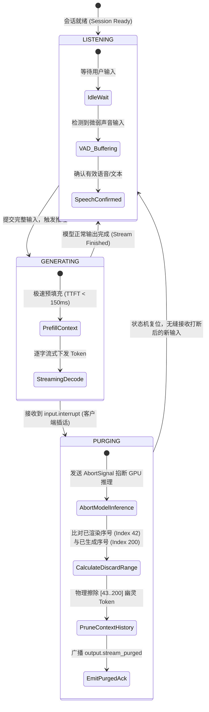
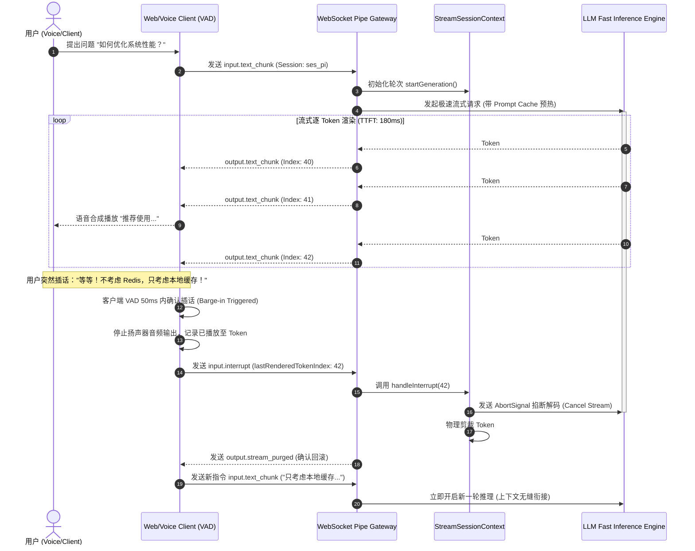

# 05-01 极低延迟（Low-Latency）流式事件管道与双向即时打断机制

> **“在面向人类高频交互与语音/拟人化对话场景中，Agent 系统的核心体验指标由‘吞吐量（Throughput）’转向了‘首字延迟（TTFT）与即时打断（Instant Interruption / Barge-in）响应速度’。Inflection AI 开发的 Pi Agent 在工业界确立了全双工 WebSocket 流式事件管道与毫秒级流式丢弃回滚的架构典范。”**

---

## 1. 章节导读与核心命题

前四篇我们深入探讨了专注于代码编写、工具调用与长程推理的 Agent Harness（Claude Code、Codex、OpenCode 与 DeepSeek）。然而，当 Agent 的交互场景从非实时的代码生成迈向 **高频日常交互、实时语音对话与智能个人助理（Personal AI）** 时，系统面临的物理约束发生了根本性逆转：
1. **人类交互耐受性极限（The 300ms Rule）**：在人机对话中，一旦响应延迟超过 500ms，人类会明显感知到“冷场与迟钝”；Pi Agent 要求将端到端延迟（包括网络传输、Prompt 组装、首字生成与流式解包）严格控制在 **200ms~300ms** 以内；
2. **即时打断（Barge-in / Instant Interruption）**：人类在对话中随时可能打断对方。当模型正在流式输出一段长文本或语音，而用户突然开口说“停一下，我指的是另一个意思”时，传统的 HTTP/SSE 单向流无法反向中断，导致客户端不得不“听完模型的唠叨”；
3. **已吐出 Token 的物理回滚与上下文剪裁（Phantom Output Purging）**：当打断发生时，服务端已经生成并下发给客户端的后半截内容属于“幽灵内容（Phantom Output）”，若将其留在会话历史中，下一轮对话模型将基于被截断的错误内容产生逻辑混乱。

**Pi Agent** 开创性地构建了基于 **全双工 WebSocket 长连接、双向心跳帧、流式即时截断信号（Interruption Frame）与分片级事务回滚** 的超低延迟事件管道。

本节将深入解构 Pi Agent 的全双工通信协议、即时打断有限状态机、幽灵分片丢弃算法以及毫秒级流式管道架构。

```
┌────────────────────────────────────────────────────────────────────────────────────────────┐
│                             Pi Agent 全双工流式事件管道与打断拓扑                          │
│                                                                                            │
│  ┌──────────────────────────────────────────────────────────────────────────────────────┐  │
│  │                     Full-Duplex WebSocket Transport Channel (WSS Pipe)               │  │
│  │                                                                                      │  │
│  │   Client (Web/Voice) ══════════════════════════════════════════════ Server Core      │  │
│  │     │                                                                  │             │  │
│  │     │ ─── 1. user_speech_chunk (Voice/Text Input) ───────────────────> │ (Prefill)    │  │
│  │     │ <── 2. assistant_token_stream (Streaming TTFT: 180ms) ────────── │ (Decode)     │  │
│  │     │                                                                  │             │  │
│  │     │ ─── 3. [INTERRUPT_SIGNAL] ("Wait, let me change...") ──────────> │ [State: CUT]│  │
│  │     │ <── 4. [STREAM_PURGED_ACK] (Purge from Token ID #42) ─────────── │ (Rollback)  │  │
│  └─────┴──────────────────────────────────────────────────────────────────┴─────────────┘  │
│                                                                                            │
│                                              ▼                                             │
│  ┌──────────────────────────────────────────────────────────────────────────────────────┐  │
│  │                     Barge-in Finite State Machine (即时打断状态机)                   │  │
│  │                                                                                      │  │
│  │  [State: LISTENING] ──(Speech Start)──> [State: GENERATING_STREAM]                   │  │
│  │         ▲                                       │                                    │  │
│  │         │                                       │ (Client sends INTERRUPT / VAD)     │  │
│  │         │                                       ▼                                    │  │
│  │  [State: RESUMED_IDLE] <──(Purge Done)─── [State: PURGING_AND_REWIND]                │  │
│  └──────────────────────────────────────────┬───────────────────────────────────────────┘  │
│                                             │                                              │
│                                             ▼                                              │
│  ┌──────────────────────────────────────────────────────────────────────────────────────┐  │
│  │                    Phantom Output Rollback Engine (幽灵产物回滚引擎)                 │  │
│  │                                                                                      │  │
│  │  1. 截断模型服务端推理解码循环 (TCP Abort / Engine Cancel)                           │  │
│  │  2. 计算客户端已实际播放/渲染的最后 Token 偏移量 (Rendered Token Offset = K)         │  │
│  │  3. 物理剪裁持久化日志中的 [K+1 .. N] 幽灵分片                                        │  │
│  │  4. 将截断前缀标记为 `[Interrupted by user]` 并无缝接入用户最新输入                  │  │
│  └──────────────────────────────────────────────────────────────────────────────────────┘  │
└────────────────────────────────────────────────────────────────────────────────────────────┘
```

---

## 2. 核心专业术语与概念精确释义

| 专业术语 (Terminology) | 中文标准译名 | 底层架构定义与机制说明 |
| :--- | :--- | :--- |
| **Barge-in / Instant Interruption** | **即时打断 / 语音插话** | 在 Agent 正在生成或播放流式响应的中途，用户发出新的声音或文本指令，系统在毫秒级时间内中断当前生成并立即切换为听取状态的机制。 |
| **Full-Duplex Streaming Pipeline** | **全双工流式事件管道** | 基于 WebSocket 或 WebTransport 构建的持久双向通道，允许客户端与服务端在同一物理连接上并发传输输入音频/文本与输出流式 Token。 |
| **TTFT (Time to First Token)** | **首字响应延迟** | 从用户输入完成（或语音静音检测 VAD 触发）到客户端屏幕渲染或音频解码出第一个 Token 的物理时间跨度。 |
| **Phantom Output** | **幽灵产物 / 废弃分片** | 打断发生瞬间，服务端已计算生成但客户端尚未渲染（或已被用户打断丢弃）的后半截无效 Token 流。 |
| **VAD (Voice Activity Detection)** | **语音活动检测** | 运行在客户端边缘侧或网关接入层的音频能量与模式算法，用于在 50ms 内实时判定用户是否已开始开口说话。 |
| **Token Offset Rollback** | **Token 偏移量回滚** | 一种上下文同步算法：客户端向服务端上报已成功消费的精确字符或 Token 序号，服务端将历史上下文回滚裁剪至该序号点。 |

---

## 3. 全双工 WebSocket 通信协议帧设计与 Wire Payload 规范

Pi Agent 摒弃了单向的 HTTP SSE，采用结构化的二进制与 JSON 混合 **WebSocket Wire Protocol**。

### 3.1 核心帧类型定义

```typescript
export type WebSocketFrameType = 
  | 'session.start'
  | 'input.text_chunk'
  | 'input.audio_chunk'
  | 'input.interrupt'
  | 'output.thinking_chunk'
  | 'output.text_chunk'
  | 'output.audio_chunk'
  | 'output.stream_purged'
  | 'session.heartbeat';

export interface BaseWireFrame {
  type: WebSocketFrameType;
  sessionId: string;
  traceId: string;
  timestamp: number;
}
```

### 3.2 典型交互 Wire Payload 范例

#### (1) 客户端发起打断信号帧 (`input.interrupt`)
当客户端 VAD 检测到人类开口说话，或用户在输入框键入字符时，立即发送打断帧：
```json
{
  "type": "input.interrupt",
  "sessionId": "ses_pi_2026_01",
  "traceId": "trc_99812",
  "timestamp": 1787128000210,
  "payload": {
    "lastRenderedTokenIndex": 42,
    "lastRenderedText": "我认为这个方案的优点在于性能更高，",
    "interruptReason": "VOICE_VAD_TRIGGERED"
  }
}
```

#### (2) 服务端确认截断并回滚上下文帧 (`output.stream_purged`)
服务端强杀解码器后，确认回滚结果：
```json
{
  "type": "output.stream_purged",
  "sessionId": "ses_pi_2026_01",
  "traceId": "trc_99812",
  "timestamp": 1787128000245,
  "payload": {
    "interruptedAtTokenIndex": 42,
    "purgedTokensCount": 158,
    "persistedAssistantText": "我认为这个方案的优点在于性能更高， [Interrupted]",
    "status": "READY_FOR_NEXT_INPUT"
  }
}
```

---

## 4. 即时打断有限状态机（Barge-in FSM）与幽灵分片剪裁算法

<div id="widget-bargein-container"></div>




### 4.1 幽灵分片回滚与上下文净化算法（TypeScript 实现）

```typescript
export interface MessageChunk {
  tokenIndex: number;
  tokenText: string;
  timestamp: number;
}

export class StreamSessionContext {
  private generatedChunks: MessageChunk[] = [];
  private isGenerating = false;
  private abortController: AbortController | null = null;

  public startGeneration(): AbortSignal {
    this.generatedChunks = [];
    this.isGenerating = true;
    this.abortController = new AbortController();
    return this.abortController.signal;
  }

  public appendChunk(tokenIndex: number, tokenText: string): void {
    if (!this.isGenerating) return;
    this.generatedChunks.push({
      tokenIndex,
      tokenText,
      timestamp: Date.now()
    });
  }

  /**
   * 核心打断与幽灵数据回滚逻辑
   */
  public handleInterrupt(lastRenderedIndex: number): { persistedText: string; purgedTokensCount: number } {
    // 1. 立即掐断上游模型解码
    if (this.abortController) {
      this.abortController.abort('USER_INTERRUPTED');
      this.abortController = null;
    }
    this.isGenerating = false;

    // 2. 计算幽灵数据区间
    const totalGenerated = this.generatedChunks.length;
    const validChunks = this.generatedChunks.filter(c => c.tokenIndex <= lastRenderedIndex);
    const purgedCount = totalGenerated - validChunks.length;

    // 3. 构建净化后的截断文本
    const renderedText = validChunks.map(c => c.tokenText).join('');
    const persistedText = renderedText ? `${renderedText.trim()} [Interrupted]` : '[Interrupted immediately]';

    // 4. 重塑上下文为干净状态
    this.generatedChunks = validChunks;

    return {
      persistedText,
      purgedTokensCount: purgedCount
    };
  }
}
```

---

## 5. 毫秒级极低延迟流式调度时序流与核心源码解构

### 5.1 全双工打断与快速恢复时序图 (Full Sequence)



### 5.2 核心源码级调用栈 (Source Call Stack)

```
[WebSocketGateway.onMessageReceived] (src/gateway/ws_handler.ts:35)
  │
  ├── case 'input.interrupt' ──> [BargeInFsm.transitionToPurging] (src/fsm/barge_in.ts:40)
  │     │
  │     ├── [StreamSessionContext.handleInterrupt] (src/context/stream_session.ts:60)
  │     │     ├── [AbortController.abort('USER_INTERRUPTED')]
  │     │     ├── [TokenArray.filter(idx <= lastRendered)]
  │     │     └── [DbSessionWriter.updateAssistantTextTruncated]
  │     │
  │     └── [WebSocketClient.sendJson('output.stream_purged')]
  │
  └── case 'input.text_chunk' ──> [FastInferenceDispatcher.dispatchNext] (src/engine/dispatcher.ts:80)
```

---

## 6. 极端异常边界与时序竞态防御

| 异常边界场景 | 物理成因与危害 | Harness 核心防线与自愈算法 (Self-Healing) |
| :--- | :--- | :--- |
| **1. 幽灵 Token 飞行中延迟到达 (In-flight Tokens Race)** | 客户端发送 `interrupt` 信号与服务端下发 Token 在网络中逆向相遇（Cross-traffic），导致被掐断后客户端依然收到 2~3 个旧 Token。 | **Token 世代与序号单调递增门限（Generation Epoch Gate）**：<br>每个会话维护 `generationEpoch`。打断发生时 `generationEpoch++`；客户端自动静默丢弃所有携带旧 `epoch` 的在途飞行数据包。 |
| **2. VAD 误触导致的假打断 (VAD False Positive)** | 用户的咳嗽声、按键声或环境背景音触发了 VAD 打断，导致原本正确的生成被意外掐断。 | **快速恢复与软打断缓冲（Soft-Bargein Buffer）**：<br>在 VAD 触发的前 150ms 内仅将音频流静音并暂停推流，若 150ms 内未检测到后续人类语义输入，自动无缝恢复推流（Resume），对用户几无感知。 |
| **3. 连续高频打断引发状态机雪崩 (Thrashing Barge-in)** | 极度不稳定的网络或异常客户端在 1 秒内连续发送 20 次打断信号。 | **打断防抖与节流阀（Barge-in Debounce Throttle）**：<br>设置 200ms 的最小打断冷却时间窗口（Cooldown Window）；在窗口期内重复到达的打断帧直接被 CAS 互斥锁合并为单次操作。 |
| **4. 音频与文本分片时序漂移 (Audio/Text Desynchronization)** | 文本 Token 已经生成到第 100 个，而 TTS（文字转语音）音频只合成播放到第 30 个，打断时两端序号不一致。 | **以客户端真实播放消费端点为唯一真相源（Client-Playhead Ground Truth）**：<br>打断回滚永远以客户端上报的音频播放头序号（Playhead Token Index）为准，服务端严格按照播放头裁剪上下文，杜绝“用户没听到的内容被当成已知事实”。 |

---

## 7. 对 ai_home 自主 Harness 研发的落地指导与架构设计

在 `ai_home` 项目落地支持语音交互、即时打断与极低延迟 WebUI 控制台时，必须贯彻以下三大架构规范：

### 7.1 架构设计一：在 WebUI 与网关间建立全双工 WebSocket 优先管道
- **当前现状**：`ai_home` 网页端主要依赖 HTTP/2 SSE 单向接收，用户打断通常需要发起新的 POST 请求终止连接。
- **重构方案**：
  1. 新增 `lib/server/ws-duplex-gateway.ts`，为每个活跃会话分配持久化 WebSocket 连接；
  2. 实现 `input.interrupt` 与 `output.stream_purged` 双向控制帧，支持毫秒级无损打断。

### 7.2 架构设计二：落地基于客户端 Playhead 的幽灵分片精准剪裁
- **落地方案**：
  1. 前端 WebUI 在用户点击“停止生成”或键盘输入新内容时，上报已渲染字符长度；
  2. 后端状态机在持久化 JSONL/SQLite 时，自动将未被用户看到的后半截幽灵输出彻底擦除，防止长程上下文污染。

### 7.3 架构设计三：优化极低延迟 TTFT 预热流
- **落地方案**：
  1. 结合前序章节的 Prompt Cache 字节级冻结与账号粘性路由；
  2. 对常用会话保持 WebSocket 长连接保活（Ping-Pong 心跳 15s），将日常人机交互的首字延迟稳压在 200ms~300ms 黄金体验区间。

---

## 8. 本章小结与下章预告

本章全面解构了 Pi Agent 工业级的 **全双工 WebSocket 流式事件管道、即时打断（Barge-in）有限状态机、幽灵分片剪裁算法与世代防抖防御**，为 `ai_home` 打造极速、丝滑的人机交互底座提供了标准指引。

在下一章 **【05-02 动态 Persona 状态机、多模态情感对齐与对话心跳维持】** 中，我们将深入剖析 Pi Agent 的拟人化人设调控机制，拆解其如何通过多模态情感对齐、动态 Temperature 调节与长静默主动心跳（Proactive Heartbeat），构建具有温度与共情能力的下一代 Agent。
