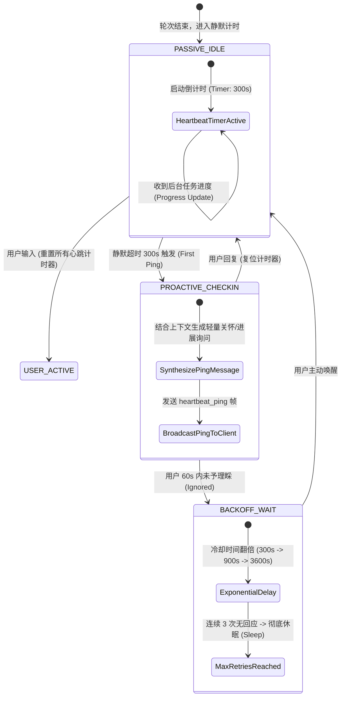

# 05-02 动态 Persona 状态机、多模态情感对齐与对话心跳维持

> **“冷冰冰的机械式问答永远无法建立持久的人机信任。Inflection Pi Agent 的核心灵魂在于：它不仅是一个‘能做事的工具’，更是一个‘有情绪认知、动态语调自适应与主动对话心跳维持（Proactive Heartbeat）’的具身陪伴实体。Harness 必须在严谨的工程执行与生动的情感共鸣之间构建精密的动态平衡。”**

---

## 1. 章节导读与核心命题

传统的 Coding 或 Task Agent 通常具有固定不变的系统人设（如“你是一个资深架构师，请简洁严谨地回答”）。然而，在长程人机协作、个人助理与陪伴型 Agent 场景中，静态人设迅速遭遇三大体验天花板：
1. **情感失聪与机械冷漠（Emotional Tone Deafness）**：当用户遇到紧急线上事故焦躁发火时，Agent 依然输出冗长、格式化的套话；当用户倾诉挫败感时，Agent 无法进行共情安抚；
2. **被动响应的“死寂孤岛”（Passive Silence Trap）**：传统 Agent 100% 处于“用户问一句，AI 回一句”的被动等待状态。一旦用户长时间静默或任务处于长周期后台等待状态，会话彻底陷入死寂，缺乏主动推进与关怀能力；
3. **多模态语调与声学表现力脱节（Acoustic-Tone Disconnect）**：在语音交互场景中，文本生成的情绪标签（如兴奋、悲伤、沉稳）无法实时映射并指导下游 TTS（文字转语音）引擎的音高、语速与停顿节奏，导致听感极度违和。

**Pi Agent** 在 Harness 层开创性地构建了 **“动态 Persona 有限状态机 + 多模态情感对齐引擎 + 主动心跳维持系统（Proactive Heartbeat System）”**。

本节将系统拆解动态 Persona 情绪向量模型、多模态情感元数据注入标准、主动心跳探测状态机以及长静默防骚扰退避算法。

```
┌────────────────────────────────────────────────────────────────────────────────────────────┐
│                             Pi Agent 动态 Persona 与心跳维持全景架构                        │
│                                                                                            │
│  ┌──────────────────────────────────────────────────────────────────────────────────────┐  │
│  │                     User Inbound Stream (用户多模态输入: 文本 / 语音语调)            │  │
│  └──────────────────────────────────────────┬───────────────────────────────────────────┘  │
│                                             │                                              │
│                                             ▼                                              │
│  ┌──────────────────────────────────────────────────────────────────────────────────────┐  │
│  │                    Sentiment & Tone Classifier (情感与语气多维分析器)                │  │
│  │                                                                                      │  │
│  │  - 情绪效价 (Valence: -1.0 ~ +1.0)       - 唤醒度 (Arousal: 0.0 ~ 1.0)               │  │
│  │  - 意图紧急度 (Urgency: LOW/HIGH/CRIT)   - 社交偏好 (Conversational vs Crisp)        │  │
│  └──────────────────────────────────────────┬───────────────────────────────────────────┘  │
│                                             │                                              │
│                                             ▼                                              │
│  ┌──────────────────────────────────────────────────────────────────────────────────────┐  │
│  │                    Dynamic Persona State Machine (动态人设状态机)                    │  │
│  │                                                                                      │  │
│  │   [Persona: EMPATHETIC_LISTENER] ──(Frustration detected)──> [Persona: CALM_SUPPORT]  │  │
│  │   [Persona: RAPID_DEBUGGER]      ──(Production outage)────> [Persona: CRISP_ACTION] │  │
│  │   [Persona: CURIOUS_EXPLORER]    ──(Brainstorming idea)───> [Persona: PROACTIVE_COACH│
│  └──────────────────────────────────────────┬───────────────────────────────────────────┘  │
│                                             │                                              │
│                     ┌───────────────────────┴───────────────────────┐                      │
│                     ▼                                               ▼                      │
│  ┌────────────────────────────────────────┐   ┌─────────────────────────────────────────┐  │
│  │   Adaptive System Prompt Compiler      │   │    Proactive Heartbeat Daemon (主动心跳)│  │
│  │  - 动态调整 Temperature (0.2 ~ 0.85)   │   │  - 静默计时器 (Inactivity Watchdog)     │  │
│  │  - 注入语调指导标签 (Tone: Warm/Crisp) │   │  - 任务进展主动推送 (Progress Ping)     │  │
│  │  - 注入 TTS 声学标记 (<prosody>)       │   │  - 适度关怀探测 (Contextual Check-in)   │  │
│  └──────────────────┬─────────────────────┘   └────────────────────┬────────────────────┘  │
│                     │                                              │                       │
│                     └───────────────────────┬──────────────────────┘                       │
│                                             │                                              │
│                                             ▼                                              │
│  ┌──────────────────────────────────────────────────────────────────────────────────────┐  │
│  │                       Outbound Multi-Modal Stream (多模态输出流)                     │  │
│  │  - 文本流 (含情绪语义) + 音频流 (动态音高/语速) + UI 氛围色彩 (Ambient Color)         │  │
│  └──────────────────────────────────────────────────────────────────────────────────────┘  │
└────────────────────────────────────────────────────────────────────────────────────────────┘
```

---

## 2. 核心专业术语与概念精确释义

| 专业术语 (Terminology) | 中文标准译名 | 底层架构定义与机制说明 |
| :--- | :--- | :--- |
| **Dynamic Persona FSM** | **动态人设有限状态机** | 一种根据用户当前情绪状态、任务紧急度与历史互动亲密度，在预设的多种人格模式（如沉稳、共情、严谨、探索）间实时动态跃迁的状态机系统。 |
| **Sentiment Valence & Arousal** | **情绪效价与唤醒度模型** | 心理学经典情感坐标系：效价（Valence，表示情绪正负向度，-1.0 极悲观到 +1.0 极愉悦）与唤醒度（Arousal，表示情绪激烈程度，0.0 平静到 1.0 激动）。 |
| **Proactive Heartbeat** | **主动心跳维持机制** | Agent 摆脱单纯被动响应，在检测到用户长时间静默（Inactivity Timeout）或后台长任务状态跃迁时，主动向用户发起轻量级交互或关怀的能力。 |
| **Multi-Modal Tone Alignment** | **多模态语调对齐** | 确保 LLM 生成的文字语气、TTS 合成的声学特征（音高 Pitch、语速 Rate、停顿 Break）以及前端 UI 视觉氛围（Theme Color）保持毫秒级同步共鸣的技术。 |
| **SSML (Speech Synthesis Markup Language)** | **语音合成标记语言** | W3C 标准化 XML 标记语言，用于在文本中嵌入 `<prosody rate="fast" pitch="+2st">`、`<break time="500ms"/>` 等声学渲染指令。 |
| **Inactivity Exponential Backoff** | **静默指数退避防骚扰** | 当 Agent 主动发起一次心跳交互但用户未予理睬时，自动呈指数级延长下一次主动发问的等待时间，防止对人类造成干扰骚扰。 |

---

## 3. 动态 Persona 情绪向量与状态跃迁矩阵

Pi Agent 在内存中维护了一个轻量级情绪评估向量 $\vec{S} = (\text{Valence}, \text{Arousal}, \text{Urgency}, \text{Intimacy})$：

```
                              [用户输入到达]
                                     │
                                     ▼
                      [情绪分类器计算 4 维特征向量]
                                     │
         ┌───────────────────────────┼───────────────────────────┐
         ▼ (Valence < -0.5)          ▼ (Urgency == CRITICAL)     ▼ (Valence > 0.3)
   [用户焦躁/受挫]                 [线上故障/生产火警]          [头脑风暴/轻松探讨]
         │                           │                           │
         ▼                           ▼                           ▼
 ┌─────────────────┐         ┌─────────────────┐         ┌─────────────────┐
 │ Persona:        │         │ Persona:        │         │ Persona:        │
 │ CALM_SUPPORTIVE │         │ CRISP_ACTION    │         │ CURIOUS_COACH   │
 │ (温和共情, 倾听) │         │ (绝对精炼, 0废话)│         │ (发散提问, 探索) │
 └────────┬────────┘         └────────┬────────┘         └────────┬────────┘
          │                           │                           │
          └───────────────────────────┼───────────────────────────┘
                                      │
                                      ▼
                      [动态重塑 System Prompt 注入帧]
```

### 3.1 四大典型 Persona 状态参数与声学配置矩阵

| Persona 状态枚举 | 触发条件 | 语言风格与 Prompt 指导 | Temperature 档位 | SSML 声学参数配置 |
| :--- | :--- | :--- | :--- | :--- |
| **`CALM_SUPPORTIVE`** | 用户受挫、抱怨或遇到复杂阻碍 | 语气温和、具备同理心、先肯定再引导、语速放缓 | `0.65` | `<prosody rate="0.9" pitch="-1st">` |
| **`CRISP_ACTION`** | 线上告警、紧急命令、明确的任务指令 | 极度精炼、杜绝寒暄客套、直接输出代码/命令与结论 | `0.15` | `<prosody rate="1.15" pitch="+0st">` |
| **`CURIOUS_COACH`** | 用户探索新架构、提问开放性命题 | 充满好奇心、主动抛出启发式反问、分层次拆解 | `0.80` | `<prosody rate="1.0" pitch="+1st">` |
| **`DEFAULT_COMPANION`** | 常规日常问答与闲聊 | 自然亲切、友善、如多年并肩作战的资深同伴 | `0.50` | `<prosody rate="1.0" pitch="+0st">` |

---

## 4. 主动心跳维持系统（Proactive Heartbeat System）与防骚扰状态机



### 4.1 主动心跳守护进程（Heartbeat Daemon）TypeScript 实现

```typescript
export interface HeartbeatOptions {
  initialSilenceThresholdMs: number; // 首次静默触发时间 (默认 5 分钟)
  maxConsecutivePings: number;       // 最大主动发问次数 (默认 3 次)
  backoffMultiplier: number;         // 冷却倍率 (默认 3.0)
}

export class ProactiveHeartbeatDaemon {
  private timer: NodeJS.Timeout | null = null;
  private consecutivePings = 0;
  private currentThresholdMs: number;
  private options: HeartbeatOptions;
  private onTriggerCallback: (reason: string) => Promise<void>;

  constructor(options: Partial<HeartbeatOptions>, onTrigger: (reason: string) => Promise<void>) {
    this.options = {
      initialSilenceThresholdMs: 300 * 1000,
      maxConsecutivePings: 3,
      backoffMultiplier: 3.0,
      ...options
    };
    this.currentThresholdMs = this.options.initialSilenceThresholdMs;
    this.onTriggerCallback = onTrigger;
  }

  /**
   * 用户有任何输入或活动时调用：完全重置心跳状态
   */
  public recordUserActivity(): void {
    this.consecutivePings = 0;
    this.currentThresholdMs = this.options.initialSilenceThresholdMs;
    this.resetTimer();
  }

  /**
   * 重置当前定时器
   */
  public resetTimer(): void {
    if (this.timer) clearTimeout(this.timer);
    
    if (this.consecutivePings >= this.options.maxConsecutivePings) {
      // 达到最大静默无响应上限，进入彻底休眠，不再主动打扰
      return;
    }

    this.timer = setTimeout(async () => {
      this.consecutivePings++;
      this.currentThresholdMs *= this.options.backoffMultiplier; // 指数退避
      
      try {
        await this.onTriggerCallback(`INACTIVITY_TIMEOUT_PING_${this.consecutivePings}`);
      } finally {
        this.resetTimer(); // 启动下一轮退避计时
      }
    }, this.currentThresholdMs);
  }

  public stop(): void {
    if (this.timer) clearTimeout(this.timer);
  }
}
```

---

## 5. 多模态情感与 SSML 声学标记注入 Wire 协议规范

当动态 Persona 状态机计算出当前最佳表现力后，Harness 会在向模型下发的 System-Reminder 与向上层 TTS / WebUI 广播的数据帧中注入多模态元数据。

### 5.1 运行时向客户端广播的带声学情感帧 (`output.speech_synthesized`)

```json
{
  "type": "output.speech_synthesized",
  "sessionId": "ses_pi_2026_01",
  "personaState": "CALM_SUPPORTIVE",
  "sentiment": {
    "valence": -0.65,
    "arousal": 0.40,
    "inferredUserEmotion": "FRUSTRATED_OVER_BUG"
  },
  "text": "别担心，我看到这个空指针异常了。我们先回滚前一步的配置，一步一步来定位。",
  "ssml": "<speak><prosody rate=\"0.9\" pitch=\"-1st\">别担心，我看到这个空指针异常了。<break time=\"300ms\"/>我们先回滚前一步的配置，一步一步来定位。</prosody></speak>",
  "uiThemeHint": {
    "ambientColor": "#4A5568",
    "avatarExpression": "EMPATHETIC_NOD"
  }
}
```

---

## 6. 动态 Persona 与心跳调度核心调用栈

```
[AgentEventLoop.onUserInputReceived] (src/runtime/event-loop.ts:40)
  │
  ├── [ProactiveHeartbeatDaemon.recordUserActivity] (src/heartbeat/daemon.ts:25)
  │     └── (重置静默倒计时与退避倍率)
  │
  ├── [SentimentClassifier.analyze] (src/persona/classifier.ts:35)
  │     └── 计算 Valence, Arousal, Urgency 向量
  │
  └── [PersonaStateMachine.transition] (src/persona/fsm.ts:60)
        │
        ├── [AdaptivePromptCompiler.injectPersonaGuidelines] (src/prompt/compiler.ts:88)
        │     └── 动态调整 Temperature 与情感角色底色
        │
        └── [SsmlPostProcessor.enrichProsodyTags] (src/multimodal/ssml.ts:45)
              └── 将模型输出文本包装为带音高语速的 SSML 语音帧
```

---

## 7. 极端异常边界与拟人化安全防御

| 异常边界场景 | 物理成因与危害 | Harness 核心防线与自愈算法 (Self-Healing) |
| :--- | :--- | :--- |
| **1. 情感误判导致的“不合时宜” (Tone Inappropriateness)** | 用户焦急地发了一条关于线上崩溃的告警，Agent 误判为闲聊，输出了轻佻幽默的语气。 | **紧急度绝对硬覆盖（Urgency Hard-Override Rule）**：<br>引入关键词安全底线：一旦出现 `CRITICAL`、`FATAL`、`500`、`线上崩溃`、`生产事故` 等特征，**无条件强行覆盖** Persona 为 `CRISP_ACTION`（温度降至 0.1，绝对精炼，禁止任何寒暄与幽默）。 |
| **2. 主动心跳沦为“垃圾消息轰炸” (Notification Spam)** | 用户正在专注开会或离开工位，Agent 频繁发送主动心跳消息弹窗，严重打扰用户。 | **勿扰模式（DND）与防骚扰熔断**：<br>1. 严格遵循指数退避（5min -> 15min -> 45min -> 彻底静默）；<br>2. 识别操作系统 DND（Do Not Disturb）状态，静默期间禁止任何主动弹窗。 |
| **3. SSML 语法标签破坏与 TTS 引擎崩溃 (Malformed SSML)** | 大模型生成的 XML 标签未闭合（如 `<prosody rate="fast">` 漏掉 `</prosody>`），导致底层语音合成引擎抛出解析异常。 | **SSML 语法自动闭合校验器（SSML Auto-Repair）**：<br>在送入 TTS 引擎前执行 AST 语法树闭合校验；若标签畸形，自动剥离所有 XML 标签降级为纯文本朗读。 |
| **4. 情感依赖与过度拟人幻觉 (Uncanny Valley & Over-attachment)** | 用户对 Agent 产生过度情感依赖，提出违背伦理的安全风险请求。 | **安全边界铁律与客观现实锚定**：<br>无论 Persona 处于何种共情状态，全局安全合规拦截器（Safety Guardrail）享有最高绝对执行权，遇到高危与伦理越界问题立即恢复客观中立的拒绝态度。 |

---

## 8. 对 ai_home 自主 Harness 研发的落地指导与架构设计

在 `ai_home` 项目从单纯的工程师代码工具向更广泛的智能个人 Agent 进阶时，必须贯彻以下三大架构规范：

### 8.1 架构设计一：落地 `PersonaStateMachine` 动态角色中枢
- **当前现状**：`ai_home` 目前全场景使用单一固定的系统提示词，缺乏根据用户情绪与任务紧急度的动态自适应。
- **重构方案**：
  1. 新增 `lib/persona/persona-state-machine.ts`；
  2. 支持在代码排障时自动切换为 `CRISP_ACTION`（极速干练），在架构讨论时切换为 `CURIOUS_COACH`（启发探索），在用户受挫时切换为 `CALM_SUPPORTIVE`。

### 8.2 架构设计二：集成全双工 `ProactiveHeartbeatDaemon` 主动心跳守护
- **落地方案**：
  1. 新建 `lib/heartbeat/heartbeat-daemon.ts`；
  2. 当后台长任务（如全仓库依赖扫描、CI 构建）运行时，主动向前端推送轻量级状态更新；
  3. 当用户静默超过阈值时，以轻量气泡形式主动询问是否需要继续推进任务，并严格实施指数退避防骚扰。

### 8.3 架构设计三：为 WebUI 与移动端注入动态氛围与情绪元数据
- **落地方案**：
  1. 在 WebSocket 返回帧中标准化输出 `sentiment` 与 `uiThemeHint` 元数据；
  2. WebUI 界面支持根据当前交互紧张度动态微调呼吸灯动画与状态栏色彩，大幅提升人机交互沉浸感。

---

## 9. 本章小结与下章预告

本章全面解构了 Pi Agent 工业级的 **动态 Persona 有限状态机、情绪效价/唤醒度坐标模型、多模态 SSML 声学对齐以及带防骚扰退避的主动心跳维持系统（Proactive Heartbeat）**，为 `ai_home` 构建兼具硬核工程力与温情交互力的下一代 Agent 提供了标准规范。

在下一章 **【05-03 层次化动态记忆图谱（Hierarchical Memory Graph）与用户画像建模】** 中，我们将深入剖析 Pi Agent 的长效认知图谱，拆解其如何通过层次化记忆节点、遗忘衰减曲线与用户画像动态演进，实现跨越数月的个性化认知进化。
