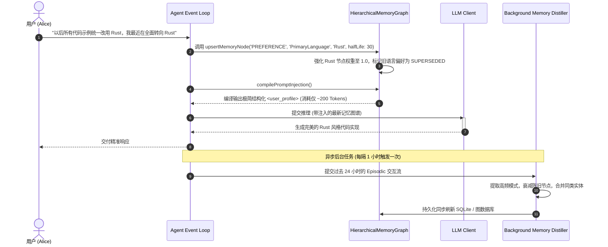

# 05-03 层次化动态记忆图谱（Hierarchical Memory Graph）与用户画像建模

> **“在陪伴与个人智能体（Personal AI）领域，记忆不是简单的静态键值对，也不是无序堆砌的聊天记录。Inflection Pi Agent 的核心壁垒在于其‘三层动态记忆图谱（Hierarchical Memory Graph）’：通过情境工作记忆（Episodic）、语义事实图谱（Semantic）与动态人格画像（Core Profile）的有机分层，搭配基于时间衰减与强化召回的认知进化模型，使 Agent 具备跨越数月乃至数年的深度个性化理解力。”**

---

## 1. 章节导读与核心命题

当 Agent 陪伴用户的周期从“单次编程会话”延伸至“数周、数月乃至数年的长期共处”时，传统的记忆方案（如 Claude Code 的单项目 `MEMORY.md` 或简单的向量检索 RAG）将遭遇严酷的认知瓶颈：
1. **记忆扁平化与检索噪音（Flat Memory Pollution）**：将用户三个月前随口提的一句“今天天气不错”，与用户的长期生活习惯（如“对花生严重过敏”、“技术栈主攻 Rust”）同等权重地保存在向量库中，导致高频召回大量琐碎噪音；
2. **缺乏时序演进与偏好漂移（Preference Drift）**：人类的偏好与状态随时间动态变化（例如上个月正在学 Python，这个月已全面转向 Go；过去单身，现在已婚）。静态持久化会导致 Agent 反复搬出陈旧记忆产生认知冲突；
3. **缺少情感与心理画像建模（Psychographic Profiling）**：无法从日常对话中提炼用户的沟通风格（喜欢直入主题还是委婉探讨）、专业技术深度（初学者 vs 资深架构师）与情绪敏感点。

**Pi Agent** 在 Harness 底层开创性地设计了 **“层次化动态记忆图谱（Hierarchical Memory Graph, HMG）”** 体系。

本节将深入解构这套记忆系统的三层分层存储拓扑、艾宾浩斯遗忘衰减与强化算法、用户画像实时提取引擎，以及跨轮次精准动态图谱水合方案。

```
┌────────────────────────────────────────────────────────────────────────────────────────────┐
│                             Pi Agent 层次化动态记忆图谱 (HMG) 全景架构                      │
│                                                                                            │
│  ┌──────────────────────────────────────────────────────────────────────────────────────┐  │
│  │                 Layer 1: Core User Profile (核心用户画像层 - 永恒记忆)                │  │
│  │                                                                                      │  │
│  │   - 核心事实: 姓名、居住地、职业角色 (如 "Senior Distributed Systems Engineer")       │  │
│  │   - 禁忌与原则: 物理过敏源、绝对讨厌的沟通风格 (如 "Dislikes long introductory text")│  │
│  │   - 认知深度: 资深技术背景，代码无需输出基础概念解释                                │  │
│  └──────────────────────────────────────────┬───────────────────────────────────────────┘  │
│                                             │                                              │
│                                             ▼ (指导语义关系连接)                           │
│  ┌──────────────────────────────────────────────────────────────────────────────────────┐  │
│  │                 Layer 2: Semantic Knowledge Graph (语义知识实体图谱层)               │  │
│  │                                                                                      │  │
│  │   [Node: Project ai_home] ────(Uses)────> [Node: Rust / TypeScript]                  │  │
│  │            │                                       │                                 │  │
│  │       (Maintains)                             (Preference)                           │  │
│  │            ▼                                       ▼                                 │  │
│  │   [Node: Multi-Account Gateway] ──(Goal)─> [Node: Low-Latency Streaming]            │  │
│  │                                                                                      │  │
│  │   - 具备时间戳、边权重（Weight）、置信度（Confidence）与衰减半衰期 (Half-life)        │  │
│  └──────────────────────────────────────────┬───────────────────────────────────────────┘  │
│                                             │                                              │
│                                             ▼ (提供细粒度情境追溯)                         │
│  ┌──────────────────────────────────────────────────────────────────────────────────────┐  │
│  │                 Layer 3: Episodic Interaction Stream (情境事件记忆流)                │  │
│  │                                                                                      │  │
│  │   - 过去 7 天内的具体对话片段与事件快照 (Event Sourcing Logs)                         │  │
│  │   - 引入艾宾浩斯遗忘衰减曲线 (Ebbinghaus Decay Curve) 自动淘汰琐碎细节               │  │
│  │   - 发生重要共鸣或重复提及的事件 ──(Consolidation)──> 抽象提炼上升至 Layer 2 图谱    │  │
│  └──────────────────────────────────────────────────────────────────────────────────────┘  │
└────────────────────────────────────────────────────────────────────────────────────────────┘
```

---

## 2. 核心专业术语与概念精确释义

| 专业术语 (Terminology) | 中文标准译名 | 底层架构定义与机制说明 |
| :--- | :--- | :--- |
| **Hierarchical Memory Graph (HMG)** | **层次化动态记忆图谱** | 一种将记忆在垂直维度划分为核心画像（Core Profile）、语义实体图（Semantic Graph）与情境事件流（Episodic Stream）的多层图数据结构。 |
| **Episodic Memory** | **情境/情节记忆** | 记录特定时间、地点与对话情境下的具体交互事件（如“用户周二下午抱怨服务器网络超时”）。时效性强，随时间自然衰减。 |
| **Semantic Memory** | **语义实体记忆** | 脱离具体对话情境的抽象事实与概念关系网络（如“用户拥有一个基于 macOS 的开发环境”）。 |
| **Core User Profile** | **核心用户画像** | 关于用户基本身份、不可变事实、绝对偏好与禁忌的高阶结构化摘要，常驻系统最高提示词上下文。 |
| **Ebbinghaus Memory Decay** | **艾宾浩斯记忆衰减算法** | 模拟人类遗忘规律的数学衰减模型：记忆节点的检索权重随时间推移呈指数级下降，但在被再次激活（Re-activated）时权重跃迁强化并延长半衰期。 |
| **Memory Consolidation** | **记忆固化与蒸馏** | 后台批处理流水线将底层分散、重复的情境记忆，提炼抽取为高阶语义实体与关系边并写入知识图谱的过程。 |
| **Preference Drift** | **用户偏好漂移** | 用户的兴趣、技术栈或生活状态随时间发生变化的客观现象。Harness 必须具备基于时间戳冲突检测的新旧偏好覆盖机制。 |

---

## 3. 三层记忆图谱数据模型与存储拓扑

Pi Agent 将三层记忆实体映射为结构化的图节点与关系边：

```
┌────────────────────────────────────────────────────────────────────────────────────────┐
│                              三层记忆图谱物理存储与实体规范                              │
│                                                                                        │
│  [Entity: UserProfileNode] (Layer 1)                                                   │
│  ├── userId: "usr_alice_001"                                                           │
│  ├── coreTraits: { "role": "Staff Engineer", "concisenessPreference": "VERY_HIGH" }   │
│  ├── hardConstraints: ["Never recommend Java solutions", "Uses macOS Darwin exclusively"]
│  └── updatedAt: 1787129000000                                                          │
│                                                                                        │
│  [Entity: GraphNode & GraphEdge] (Layer 2)                                             │
│  ├── Node: { id: "n_rust", label: "Technology", name: "Rust", confidence: 0.95 }      │
│  ├── Node: { id: "n_gateway", label: "Project", name: "ai_home Gateway" }             │
│  └── Edge: { source: "usr_alice", target: "n_rust", relation: "LOVES", weight: 0.92,  │
│              lastReinforced: 1787129000000, halfLifeDays: 30 }                         │
│                                                                                        │
│  [Entity: EpisodicLog] (Layer 3)                                                       │
│  ├── eventId: "evt_ep_99120"                                                           │
│  ├── timestamp: 1787128500000                                                          │
│  ├── summary: "Alice debugged a WebSocket broken pipe issue in her proxy server."      │
│  └── rawDecayWeight: 0.73 (随天数衰减: W = W0 * e^(-lambda * delta_t))                 │
└────────────────────────────────────────────────────────────────────────────────────────┘
```

---

## 4. 记忆强化衰减算法与偏好覆盖数学模型

<div id="widget-memory-graph-container"></div>


为了杜绝记忆库无限膨胀与死锁，Pi Agent 实现了基于物理时间衰减与激活强化的动态权重算法：

```
               Memory Node Weight (W)
                 ▲
             1.0 ┼───────┐ (首次产生记忆, W0 = 1.0)
                 │        \
                 │         \ (指数时间衰减: W(t) = W0 * e^(-λt))
             0.5 ┼──────────\─────┐ (用户再次提及, 触发 Reinforce 跃迁强化!)
                 │           \   / \
                 │            \_/   \ (半衰期延长，衰减变慢)
             0.2 ┼───────────────────\───────────── (Prune Threshold: 跌破 0.2 自动归档淘汰)
                 │                    \
               0 └─────────────────────┴────────────────────────► Time (Days)
```

### 4.1 记忆衰减与强化数学公式
设记忆节点初始权重为 $W_0 = 1.0$，经过时间 $\Delta t$（天），衰减系数为 $\lambda = \frac{\ln 2}{T_{\text{half}}}$（其中 $T_{\text{half}}$ 为半衰期）：

$$W(t) = W_{\text{prev}} \times e^{-\lambda \Delta t}$$

**强化跃迁（Re-activation Jump）**：
当用户在对话中再次提及该实体或相关联事件时：
$$W_{\text{new}} = \min(1.0, \quad W(t) + \beta \times (1.0 - W(t)))$$
$$T_{\text{half\_new}} = T_{\text{half\_prev}} \times 1.5 \quad (\text{记忆变得更坚固，半衰期拉长 50\%})$$

**偏好覆盖裁决（Preference Conflict Resolution）**：
若检测到新记忆与老记忆存在逻辑互斥（如老记忆“居住地：北京”，新记忆“已搬家至东京”）：
- 比较时间戳 $\text{Timestamp}_{\text{new}} > \text{Timestamp}_{\text{old}}$；
- 老节点立即被标记为 `SUPERSEDED`，权重瞬时置 $0.0$，新节点以 $W_0 = 1.0$ 写入图谱。

---

## 5. 层次化记忆图谱管理器 TypeScript 核心实现

```typescript
export interface GraphNode {
  id: string;
  category: 'PREFERENCE' | 'TECH_STACK' | 'PROJECT' | 'PERSONAL_FACT';
  name: string;
  details: string;
  weight: number;              // 当前活跃权重 (0.0 ~ 1.0)
  halfLifeDays: number;        // 记忆半衰期 (天)
  lastReinforcedAt: number;    // 上次激活时间戳 (ms)
  status: 'ACTIVE' | 'SUPERSEDED' | 'ARCHIVED';
}

export interface UserCoreProfile {
  userId: string;
  summary: string;
  immutableConstraints: string[];
}

export class HierarchicalMemoryGraph {
  private coreProfile: UserCoreProfile;
  private nodes: Map<string, GraphNode> = new Map();
  private readonly PRUNE_THRESHOLD = 0.2;

  constructor(coreProfile: UserCoreProfile) {
    this.coreProfile = coreProfile;
  }

  /**
   * 衰减更新：计算所有记忆节点当前的真实权重
   */
  public applyTemporalDecay(currentTime = Date.now()): void {
    for (const [id, node] of this.nodes.entries()) {
      if (node.status !== 'ACTIVE') continue;

      const deltaDays = (currentTime - node.lastReinforcedAt) / (1000 * 86400);
      const lambda = Math.LN2 / node.halfLifeDays;
      node.weight = node.weight * Math.exp(-lambda * deltaDays);

      // 若权重跌破淘汰阈值，自动转入冷归档
      if (node.weight < this.PRUNE_THRESHOLD) {
        node.status = 'ARCHIVED';
      }
    }
  }

  /**
   * 记忆强化或新建
   */
  public upsertMemoryNode(category: GraphNode['category'], name: string, details: string, halfLifeDays = 14): void {
    const nodeId = `${category}::${name.toLowerCase()}`;
    const existing = this.nodes.get(nodeId);

    if (existing && existing.status === 'ACTIVE') {
      // 触发强化跃迁
      const beta = 0.5;
      existing.weight = Math.min(1.0, existing.weight + beta * (1.0 - existing.weight));
      existing.halfLifeDays *= 1.5; // 半衰期拉长
      existing.details = details; // 更新最新事实
      existing.lastReinforcedAt = Date.now();
    } else {
      // 创建新节点
      this.nodes.set(nodeId, {
        id: nodeId,
        category,
        name,
        details,
        weight: 1.0,
        halfLifeDays,
        lastReinforcedAt: Date.now(),
        status: 'ACTIVE'
      });
    }
  }

  /**
   * 动态水合：编译注入 Prompt 的高纯度上下文
   */
  public compilePromptInjection(): string {
    this.applyTemporalDecay();

    // 1. Layer 1: 核心用户画像 (常驻)
    const profileLines = [
      '<user_profile>',
      `  <core_role>${this.coreProfile.summary}</core_role>`,
      '  <hard_constraints>'
    ];
    this.coreProfile.immutableConstraints.forEach(c => profileLines.push(`    <constraint>${c}</constraint>`));
    profileLines.push('  </hard_constraints>');

    // 2. Layer 2: 活跃高权重实体记忆图谱 (按权重降序排列，最多取 Top 10)
    const activeNodes = Array.from(this.nodes.values())
      .filter(n => n.status === 'ACTIVE' && n.weight >= this.PRUNE_THRESHOLD)
      .sort((a, b) => b.weight - a.weight)
      .slice(0, 10);

    if (activeNodes.length > 0) {
      profileLines.push('  <active_knowledge_graph>');
      activeNodes.forEach(node => {
        profileLines.push(`    <entity category="${node.category}" name="${node.name}" confidence="${node.weight.toFixed(2)}">`);
        profileLines.push(`      ${node.details}`);
        profileLines.push(`    </entity>`);
      });
      profileLines.push('  </active_knowledge_graph>');
    }

    profileLines.push('</user_profile>');
    return profileLines.join('\n');
  }
}
```

---

## 6. 记忆图谱动态水合与提炼时序图



---

## 7. 极端异常边界与记忆幻觉治理

| 异常边界场景 | 物理成因与危害 | Harness 核心防线与自愈算法 (Self-Healing) |
| :--- | :--- | :--- |
| **1. 记忆图谱无限膨胀爆仓 (Graph Bloat)** | 长期对话积累了数千个琐碎实体节点，导致每次编译注入的 Prompt 超过数千 Token。 | **硬性水位 Top-K 截断与冷热归档**：<br>严格限制进入 Prompt 的激活实体数量上限为 $K=10$；权重低于 $0.2$ 的长尾节点自动刷入磁盘冷存储，严禁占用实时注意力和 Token 配额。 |
| **2. 瞬态情绪被错误沉淀为长期偏好 (Emotional State Misattribution)** | 用户在某次测试中因赶时间说了句“随便写个能跑的就行，不用写注释”，Agent 误将其当作永久规则“用户讨厌代码注释”。 | **置信度多轮频次确认（Multi-Turn Confidence Gate）**：<br>一次性偶发指令初始置信度仅为 $0.4$（仅停留在 Layer 3 情境流）；只有在不同会话中累计出现 $\ge 3$ 次，才允许被后台蒸馏器提升至 Layer 2/Layer 1 长期画像。 |
| **3. 记忆自相矛盾引发模型逻辑死锁 (Contradiction Lockup)** | 图谱中同时存在“用户只使用 Mac”与“用户要求在 Windows 下构建”两条冲突事实。 | **时间戳优先与显式冲突消解（Recency Arbitration）**：<br>Harness 在编译图谱时执行一致性校验：当检测到互斥属性时，新时间戳事实强制获得 100% 裁决权，并自动向旧节点打上 `SUPERSEDED` 废弃标记。 |
| **4. 隐私敏感信息意外图谱化 (PII Leakage in Graph)** | 用户在对话中粘贴了生产环境数据库密码或私人身份证号，被记忆系统自动持久化存入画像。 | **PII 敏感模式前置拦截清洗（PII Scrubbing Filter）**：<br>在写入图谱前，强制流经正则表达式与敏感词扫描器，自动对 `API_KEY`、`Password`、`CardNumber` 等模式执行脱敏掩码（如 `[REDACTED_SECRET]`），杜绝敏感数据永久存盘。 |

---

## 8. 对 ai_home 自主 Harness 研发的落地指导与架构设计

在 `ai_home` 项目落地长效个性化记忆与企业级用户画像中枢时，必须贯彻以下三大设计规范：

### 8.1 架构设计一：落地 `HierarchicalMemoryGraph` 三层数据模型
- **当前现状**：`ai_home` 目前仅有项目维度的短文本 `MEMORY.md`，缺乏跨项目、跨周期的全局用户画像模型。
- **重构方案**：
  1. 新增 `lib/memory/graph-manager.ts`；
  2. 建立 `CoreProfile`（用户不变偏好）+ `SemanticGraph`（技术栈与项目实体）+ `EpisodicLog`（情境事件）的三层模型；
  3. 支持在 WebUI 设置页面的“个人画像与记忆”看板中进行可视化可视化编辑与节点手动拉黑。

### 8.2 架构设计二：实施基于时间戳衰减与偏好覆盖的淘汰机制
- **落地方案**：
  1. 引入本文推导的 `Ebbinghaus Decay` 算法，随时间自然淡化低频碎片记忆；
  2. 实施基于 `SUPERSEDED` 标记的偏好覆盖引擎，确保用户的最新决策永远享有最高优先级。

### 8.3 架构设计三：严格实施 Top-K 极简结构化 XML 注入
- **落地方案**：
  1. 无论图谱中积累了多少实体，单次注入上下文的记忆 Token 消耗严格限制在 300 Tokens 以内；
  2. 采用标准 `<user_profile>` 结构化 XML 格式注入在 System-Reminder 尾部，既保证强大的个性化认知，又绝不击穿上游的 Prompt Cache。

---

## 9. 本章小结与第五篇总结

本章全面解构了 Pi Agent 工业级的 **三层层次化动态记忆图谱（HMG）、艾宾浩斯遗忘衰减与强化算法、偏好冲突覆盖机制以及 PII 隐私脱敏防护**，为 `ai_home` 打造具备跨周期长效认知进化能力的个人 Agent 奠定了理论与工程基石。

### 🔮 第五篇：Pi Agent 架构深度解构·全景结语
至此，我们已经完整解构了以极低延迟和深度情感交互为代表的 Pi Agent 体系：
- **05-01**：全双工 WebSocket 流式事件管道、即时打断（Barge-in）有限状态机与幽灵分片剪裁；
- **05-02**：动态 Persona 状态机、情绪效价/唤醒度坐标模型、多模态 SSML 声学对齐与主动心跳维持（Proactive Heartbeat）；
- **05-03**：层次化动态记忆图谱（Core Profile / Semantic Graph / Episodic Stream）、时间衰减算法与动态用户画像建模。

在接下来的 **【第六篇：自主 Agent Harness 架构蓝图与落地研发（终章）】** 中，我们将汇聚前五篇所有顶尖工业级实现的精髓，正式发布 **`ai_home` 下一代全功能 Agent 运行时的完整架构拓扑、统一状态机代码实现与生产落地蓝图！**
