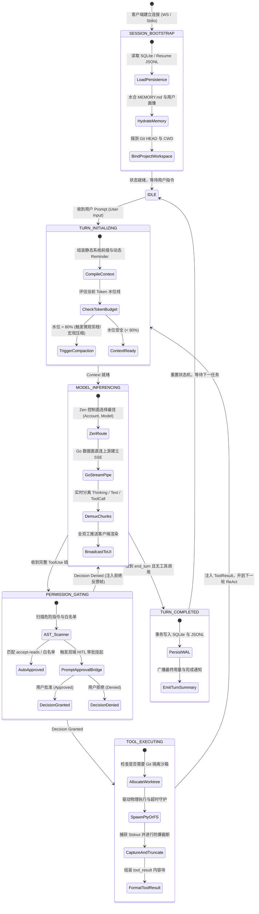

# 06-01 ai_home 下一代 Agent 运行时架构拓扑与分层原则

> **“在深度解构了 Anthropic Claude Code、OpenAI Codex、OpenCode、DeepSeek Harness 与 Inflection Pi Agent 五大顶尖工业级实现之后，我们汇聚其设计精髓，正式确立 `ai_home` 自主下一代 Agent 运行时的宏观架构蓝图：一个集‘微内核插件化、全双工跨端投射、多模型智能路由、物理沙箱隔离与双轨事件溯源持久化’于一体的高性能 Agent 具身底座。”**

---

## 1. 章节导读与核心命题

在过去的发展阶段中，`ai_home` 主要作为一个兼具多账号负载均衡、协议代理转发与轻量级 WebUI 的 API 网关存在。然而，随着开发者对 **自主编程重构、长程推理排障、跨子代理并发协同与远程工作区委派（Fabric）** 诉求的爆发，单纯的 API Proxy 模式已触碰到架构天花板。

从 **“API 反向代理（Reverse Proxy）”** 迈向 **“全功能自主 Agent Harness 运行时”**，`ai_home` 必须重构并确立一套严密的架构分层与拓扑规范：
1. **彻底打破上帝文件（No God Files 铁律）**：坚决摒弃将状态机、工具执行、PTY 调度、账号选择混杂在一个上千行单体模块中的做法，严格遵循 SOLID 模块化分层原则；
2. **控制面（Control Plane）与数据面（Data Plane）物理分离**：TypeScript 负责状态机流转、插件流水线与安全审批，Go / 高性能中间件负责长连接 SSE 流式零拷贝转发与透明透传；
3. **双端完全等价（Dual-Parity）与多宿主接入**：无论是终端命令行 PTY TUI，还是现代化 WebUI 控制台，亦或是外部 IDE 插件，均通过标准 IPC / WebSocket 消费统一协议帧。

本节作为全书第六篇（自主研发落地）的纲领性章节，将正式发布 `ai_home` 下一代 Agent Harness 的 **五层物理架构拓扑图、核心模块职责矩阵、分层隔离原则与关键数据契约**。

```
┌────────────────────────────────────────────────────────────────────────────────────────────┐
│                             ai_home 下一代 Agent Harness 全景架构拓扑                       │
│                                                                                            │
│  ┌──────────────────────────────────────────────────────────────────────────────────────┐  │
│  │                   Layer 1: Presentation & Ingress (交互与接入层)                     │  │
│  │                                                                                      │  │
│  │   [Terminal PTY (xterm.js)]     [Modern WebUI (React/AntD)]     [IDE Extension IPC]  │  │
│  └──────────────────────────────────────────┬───────────────────────────────────────────┘  │
│                                             │ (Full-Duplex WS / Stdio JSON-RPC 2.0)        │
│                                             ▼                                              │
│  ┌──────────────────────────────────────────────────────────────────────────────────────┐  │
│  │                   Layer 2: Core Orchestration & Loop (核心调度与事件循环层)          │  │
│  │                                                                                      │  │
│  │   [AgentEventLoop (FSM)] ──> [ContextOrchestrator] ──> [PermissionGatekeeper]        │  │
│  │         │                            │                           │                   │  │
│  │         ▼                            ▼                           ▼                   │  │
│  │   [SubagentPool]             [ContextCompactor]          [UnifiedApprovalBridge]     │  │
│  └──────────────────────────────────────────┬───────────────────────────────────────────┘  │
│                                             │ (Plugin Pipeline & Event Interceptors)       │
│                                             ▼                                              │
│  ┌──────────────────────────────────────────────────────────────────────────────────────┐  │
│  │                   Layer 3: Tools & Execution Engine (工具与执行沙箱层)               │  │
│  │                                                                                      │  │
│  │  ┌─────────────────────┐  ┌─────────────────────┐  ┌──────────────────────────────┐  │  │
│  │  │ Core Built-in Tools │  │  MCP Client Bridge  │  │ Sandbox & Isolation Manager  │  │  │
│  │  │ (Read/Edit/Bash...) │  │ (Stdio/SSE Servers) │  │ (Git Worktree / PTY Pool)    │  │  │
│  │  └─────────────────────┘  └─────────────────────┘  └──────────────────────────────┘  │  │
│  └──────────────────────────────────────────┬───────────────────────────────────────────┘  │
│                                             │ (Resolved Target & Normalized Request)       │
│                                             ▼                                              │
│  ┌──────────────────────────────────────────────────────────────────────────────────────┐  │
│  │                   Layer 4: Multi-Model Gateway & Routing (多模型网关与路由层)        │  │
│  │                                                                                      │  │
│  │   [Zen Policy Engine] ──> [Circuit Breaker (429/500)] ──> [Model-Account Selector]   │  │
│  │         │ (Control)                  │ (Health)                  │ (Sticky KV Cache) │  │
│  │         ▼                            ▼                           ▼                   │  │
│  │   [Go Data Plane Proxy] ──> [Universal Stream Normalizer] ──> Upstream Cloud Providers│
│  └──────────────────────────────────────────┬───────────────────────────────────────────┘  │
│                                             │ (Immutable Telemetry & State Frames)         │
│                                             ▼                                              │
│  ┌──────────────────────────────────────────────────────────────────────────────────────┐  │
│  │                   Layer 5: Persistence & Memory (持久化与长效记忆层)                 │  │
│  │                                                                                      │  │
│  │   - Track 1: SQLite 实体库 (~/.aih/aih.db - 会话/工作区/用量归属模型)                │  │
│  │   - Track 2: JSONL 事务日志 (~/.aih/sessions/<id>.jsonl - 物理事件溯源流)            │  │
│  │   - Track 3: 层次化记忆库 (~/.aih/projects/<hash>/memory/ - MEMORY.md + 图谱)        │  │
│  └──────────────────────────────────────────────────────────────────────────────────────┘  │
└────────────────────────────────────────────────────────────────────────────────────────────┘
```

---

## 2. 核心专业术语与概念精确释义

| 专业术语 (Terminology) | 中文标准译名 | 底层架构定义与机制说明 |
| :--- | :--- | :--- |
| **Agent Harness** | **Agent 具身运行时底座** | 围绕无状态模型构建的完整操作系统级软件容器。统一管理事件循环、上下文编排、工具执行、安全沙箱、多模型路由与持久化存储。 |
| **Layered Architecture** | **五层分层架构体系** | 将系统从上至下严格解耦为：交互接入层、核心调度层、工具执行层、网关路由层与持久化记忆层的单向依赖拓扑。 |
| **Dual-Parity Design** | **双端完全等价通信** | 保证命令行终端（PTY ANSI）与现代浏览器（WebUI WebSocket）在功能完整度、审批流拦截、流式渲染与状态同步上实现 100% 毫秒级对齐。 |
| **No-God-Files Discipline** | **禁止上帝类/上帝文件铁律** | `ai_home` 项目开发军规：单一文件严格限制在 300 行以内，杜绝职责混杂，强制按照业务领域拆分独立子模块。 |
| **Microkernel & Plugin Hub** | **微内核与插件中枢** | 核心调度引擎仅保留最小状态转移逻辑，所有鉴权、审计、Linter 修复与通知扩展均作为标准化插件挂载于双向 Hook 流水线。 |
| **Dual-Track Persistence** | **双轨持久化存储** | 高频流式事件追加写入 JSONL 物理日志（保障溯源与重放），聚合状态与元数据写入 SQLite WAL 数据库（保障毫秒级索引与分页查询）。 |

---

## 3. 五层物理架构职责矩阵与模块划分规范

为了确保代码仓库的极致整洁与可维护性，`ai_home` 下一代目录树严格按照领域驱动设计（DDD）划分：

```
ai_home/
├── lib/
│   ├── runtime/           # Layer 2: 核心事件循环与状态机 (AgentEventLoop, TurnStateMachine)
│   ├── context/           # Layer 2: 上下文编排、Token 水位线与微观/宏观压缩 (ContextOrchestrator)
│   ├── security/          # Layer 2: 4态权限状态机与 AST 危险命令扫描 (PermissionGatekeeper)
│   ├── approval/          # Layer 2: 终端与 WebUI 统一审批网桥 (UnifiedApprovalBridge)
│   ├── orchestration/     # Layer 2: 子代理派生池与 Workflow 流水线引擎 (SubagentPool, WorkflowEngine)
│   ├── tools/             # Layer 3: 内建核心工具集与类型定义 (Read, Edit, Write, Bash, BaseTool)
│   ├── mcp/               # Layer 3: Model Context Protocol 客户端桥接器 (McpBridgeManager)
│   ├── pty/               # Layer 3: PTY 伪终端进程管理与超时强杀池 (PtyProcessManager)
│   ├── git/               # Layer 3: Git Worktree 物理工作区并发隔离管理器 (WorktreeManager)
│   ├── gateway/           # Layer 4: Zen 智能路由决策大脑与协议适配器 (ZenRouter, WireAdapters)
│   ├── account/           # Layer 4: 多账号持久化凭据池与四态熔断器 (AccountPool, CircuitBreaker)
│   ├── storage/           # Layer 5: SQLite DAO 与 JSONL WAL 事务双轨引擎 (SessionStorage, WalLogger)
│   └── memory/            # Layer 5: 双层文件记忆与层次化图谱管理器 (MemoryManager, GraphManager)
├── web/                   # Layer 1: 基于 AntD Pro / React 的现代化 WebUI 前端
├── cmd/                   # Layer 1: CLI 入口与 App Server Stdio 守护进程 (aih cli/app-server)
└── server/                # Go 高性能流式数据平面内核 (Go Data Plane Proxy)
```

### 3.1 各层核心职责与约束矩阵

| 架构分层 (Layer) | 核心模块 (Modules) | 核心职责 | 绝对禁止事项 (Anti-patterns) |
| :--- | :--- | :--- | :--- |
| **Layer 1: 交互接入层** | `web/`, `cmd/cli`, `cmd/app-server` | 捕获用户按键与输入、渲染流式 Markdown/ANSI、发起审批决策、保持 WebSocket 长连接。 | **严禁包含任何业务逻辑或直接操作底层文件系统**。 |
| **Layer 2: 核心调度层** | `runtime/`, `context/`, `security/`, `approval/` | 驱动 ReAct 状态机、动态上下文水合、Token 预算监控与压缩、4 态权限门禁拦截、多 Agent 编排。 | **严禁直接发起特定厂商的原始 HTTP 请求**（必须通过 Layer 4 网关）。 |
| **Layer 3: 工具执行层** | `tools/`, `mcp/`, `pty/`, `git/` | 物理工具驱动（`Read`/`Edit`/`Bash`）、AST 唯一补丁替换、PTY 进程树管理、Git Worktree 沙箱隔离。 | **严禁绕过 Layer 2 权限网关直接执行破坏性命令**。 |
| **Layer 4: 网关路由层** | `gateway/`, `account/`, `server/ (Go)` | Zen 策略调度、多账号凭据投影、四态熔断、Prompt Cache 亲和度计算、Go 数据面零拷贝流式转发。 | **严禁感知特定业务任务的细节，仅负责模型协议归一与高可用转发**。 |
| **Layer 5: 持久化记忆层** | `storage/`, `memory/` | SQLite 关系型实体映射、JSONL 不可变物理事件落盘、跨会话长效记忆索引（`MEMORY.md`）与图谱。 | **严禁阻塞主事件循环，写入一律异步化或基于 WAL 极速刷盘**。 |

---

## 4. 核心系统生命周期状态机与全局事件拓扑

在 `ai_home` 中，一次完整的 Agent 任务从发起到交付，其全局状态机遵循确定性的有限状态流转：



---

## 5. 核心架构设计契约与 TypeScript 类型规范

以下是 `ai_home` 下一代 Harness 运行时的全局核心契约定义：

```typescript
/**
 * ai_home Agent 运行时全局配置契约
 */
export interface AihRuntimeConfig {
  readonly workspaceRoot: string;
  readonly storageDir: string;               // 默认 ~/.aih
  readonly permissionMode: 'default' | 'accept-reads' | 'dont-ask' | 'bypass';
  readonly maxContextTokens: number;         // 默认 200,000
  readonly compactionThresholdRatio: number; // 默认 0.80 (80%)
  readonly ptyTimeoutMs: number;              // 默认 120,000 (2分钟)
  readonly enableWorktreeIsolation: boolean;  // 是否开启 Git Worktree 并发隔离
}

/**
 * 全局统一流式分发帧 (UniversalStreamFrame)
 */
export type StreamFrameType = 
  | 'thinking' 
  | 'text' 
  | 'tool_call_start' 
  | 'tool_call_delta' 
  | 'tool_call_done' 
  | 'approval_required' 
  | 'turn_completed' 
  | 'error';

export interface UniversalStreamFrame {
  readonly sessionId: string;
  readonly turnIndex: number;
  readonly type: StreamFrameType;
  readonly delta?: string;
  readonly payload?: Record<string, unknown>;
  readonly timestamp: number;
}

/**
 * 核心调度器对外暴露的执行接口
 */
export interface IAgentEventLoop {
  readonly sessionId: string;
  submitUserPrompt(prompt: string): Promise<void>;
  submitApprovalDecision(approvalId: string, decision: 'APPROVED' | 'DENIED'): Promise<void>;
  interruptCurrentGeneration(renderedTokenOffset: number): Promise<void>;
  onFrame(listener: (frame: UniversalStreamFrame) => void): void;
  destroy(): Promise<void>;
}
```

---

## 6. 四大极端异常防御与全链路容错矩阵

| 异常边界分类 | 涉及子系统与故障特征 | `ai_home` 全链路自愈与容错机制 (Self-Healing Matrix) |
| :--- | :--- | :--- |
| **1. 进程崩溃与断电 (Crash & Power Loss)** | 正在执行 50 轮重构长任务时系统突然断电或进程崩溃，导致状态丢失。 | **双轨 WAL 幂等恢复**：<br>系统启动时扫描 `~/.aih/sessions/<id>.jsonl`；若发现未决崩溃，自动将末尾状态置为 `ABORTED`，并在用户调用 `aih resume` 时 10ms 内无损恢复上下文。 |
| **2. 上游全线 429 熔断 (Cascading 429 Outage)** | 某个核心模型在特定账号触发限流，导致请求频繁报错。 | **(Account, Model) 粒度动态降级**：<br>Zen 路由大脑自动将该二元组置入 30s 冷却状态，立即将流量平滑切换至账号池中的备用凭据或同能力的替补模型（如 Claude Opus -> GPT-5.5）。 |
| **3. 恶意注入与提权越权 (Prompt Injection & Priv-Esc)** | 外部文件或网页隐藏恶意指令试图执行 `rm -rf /` 或外发环境变量。 | **AST 静态安全门禁 + 双端强行审批**：<br>在工具执行前强制解析 Shell 抽象语法树；命中高危规则立即挂起并向 WebUI 与终端弹出红色警告，未经人类显式授权绝对禁止执行。 |
| **4. 巨量输出与上下文爆炸 (Output Bomb & Overflow)** | 执行长脚本输出了数万行日志，冲垮内存与上下文窗口。 | **流式实时截断 + 80% 水位自动滚扎**：<br>PTY 驱动层在达到 16KB 时强制截断输出；上下文编排器在达到 80% 水位线时自动触发微观折叠与后台子代理宏观语义压缩。 |

---

## 7. 本章小结与后续落地路线图

本章正式确立了 `ai_home` 下一代 Agent Harness 的 **五层物理架构拓扑、模块职责划分原则、全局生命周期状态机以及全链路容错矩阵**，为后续四个小节的具体代码实现指明了唯一的架构基准。

在接下来的四个小节中，我们将逐一攻克核心模块的代码实现与落地：
- **06-02**：落地跨 Provider 归一的统一事件循环状态机核心代码；
- **06-03**：落地高性能插件化工具系统与跨 Agent 数据管道；
- **06-04**：落地混合持久化记忆、上下文压缩与 Prompt Cache 亲和调度中枢；
- **06-05**：落地 PTY 终端与 WebUI 双端完全等价通信桥（全书大结语）。
