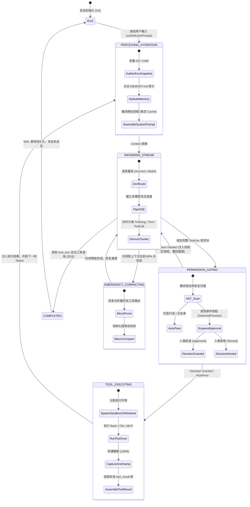

# 06-02 跨 Provider 归一的统一事件循环状态机

> **“在异构模型大一统时代，Agent Harness 的核心中枢必须彻底抹平底层 API 的协议碎裂。`ai_home` 的统一事件循环（Universal Agent Event Loop）将 Anthropic Messages、OpenAI Responses、DeepSeek Thinking 与 Google Content 彻底收敛于确定性的有限状态机中，实现流式多路解耦、非阻塞异步审批挂起与毫秒级 ReAct 自主闭环。”**

---


<div class="ai-concept-hero">
  
  <div class="ai-hero-caption">
    <div class="hero-cap-title"><span>🎨</span> 跨 Provider 统一事件循环 7 态 FSM (Universal Event Loop 7-State FSM)</div>
    <span class="hero-cap-badge">AI 8K Concept</span>
  </div>
</div>

## 1. 章节导读与核心命题

在传统的多模型接入实践中，很多系统通过为每个模型编写一套独立的 ReAct 执行循环来适配差异。这种做法会引发严重的架构灾难：
1. **逻辑碎片化与状态失步**：权限审批、工具分发、上下文压缩等核心逻辑在各个 Provider 循环中重复实现，极易出现行为不一致（例如在 Claude 模式下有权限拦截，在 DeepSeek 模式下却发生越权执行）；
2. **长连接流式协议解析混乱**：SSE 分片与 WebSocket 管道在各模型适配器中交织，导致上层 UI 和 PTY 终端不得不编写大量 `if (provider === 'openai') ... else if ...` 的胶水代码；
3. **缺乏状态机的单向确定性**：在遇到网络闪断、思考流截断或审批挂起时，简陋的异步回调极易发生竞争条件（Race Condition）与死锁。

`ai_home` 下一代核心运行时确立了 **“跨 Provider 归一的统一事件循环状态机（Universal Agent Event Loop FSM）”** 架构。

本节将深入解构该状态机的数学模型、生命周期状态跃迁拓扑、生产级 TypeScript 核心引擎实现、统一 Wire Protocol 帧规范以及极端容错恢复策略。

```
┌────────────────────────────────────────────────────────────────────────────────────────────┐
│                             ai_home 统一事件循环状态机 (Universal FSM)                     │
│                                                                                            │
│  ┌──────────────────────────────────────────────────────────────────────────────────────┐  │
│  │                                 Universal Inbound Request                            │  │
│  │  - sessionId: string            - userPrompt: string         - permissionMode        │  │
│  └──────────────────────────────────────────┬───────────────────────────────────────────┘  │
│                                             │                                              │
│                                             ▼                                              │
│  ┌──────────────────────────────────────────────────────────────────────────────────────┐  │
│  │               UniversalAgentEventLoop (统一有限状态机核心: 7 大确定性状态)              │  │
│  │                                                                                      │  │
│  │    [1. IDLE] ───────────────> [2. PERCEIVING_HYDRATION] ──────> [3. INFERRING_STREAM]│  │
│  │        ▲                                                               │             │  │
│  │        │                                                               ▼             │  │
│  │    [7. COMPLETED] <────────── [6. TOOL_EXECUTING] <─────── [4. PERMISSION_GATING]    │  │
│  │        │                              ▲                                │             │  │
│  │        │                              └────(Auto-Approved / Granted)───┘             │  │
│  │        │                                                               │ (Denied)    │  │
│  │        └────────────────────(Next Turn Iteration) ─────────────────────┴─────────────┤  │
│  │                                                                                      │  │
│  │    [5. EMERGENCY_COMPACTING] <── (Triggered when Context Watermark >= 80%)           │  │
│  └──────────────────────────────────────────┬───────────────────────────────────────────┘  │
│                                             │                                              │
│                                             ▼                                              │
│  ┌──────────────────────────────────────────────────────────────────────────────────────┐  │
│  │                       Unified Wire Protocol Broadcast (统一全双工广播总线)           │  │
│  │                                                                                      │  │
│  │  - UniversalStreamFrame: [thinking | text | tool_call | approval_required | done]    │  │
│  │  - 同时推送给: PTY ANSI Terminal (终端) + WebSocket Client (WebUI 控制台)             │  │
│  └──────────────────────────────────────────────────────────────────────────────────────┘  │
└────────────────────────────────────────────────────────────────────────────────────────────┘
```

---

## 2. 核心专业术语与概念精确释义

| 专业术语 (Terminology) | 中文标准译名 | 底层架构定义与机制说明 |
| :--- | :--- | :--- |
| **Universal Event Loop** | **跨 Provider 统一事件循环** | 一套完全解耦上游模型协议与物理执行环境的有限状态机调度中枢。将所有大模型统一视为“输出标准 Thinking / Text / ToolCall 的生成器”。 |
| **Non-blocking Gating Suspension** | **非阻塞审批挂起** | 当状态机流转至 `PERMISSION_GATING` 时，基于 `Promise<ApprovalDecision>` 挂起当前协程并释放 CPU，等待终端或 WebUI 异步敲击批准后再无缝唤醒。 |
| **Unified Stream Normalization** | **流式数据协议归一化** | 将 Anthropic `content_block_delta`、OpenAI `responses.delta`、DeepSeek `reasoning_content` 在网关接入层统一重塑为标准 `UniversalStreamFrame`。 |
| **Turn Context Watermark** | **轮次上下文水位线** | 状态机在每轮迭代前后动态度量当前累积 Token 总量，在触及安全阈值（80%）时自动插桩跃迁至 `COMPACTING` 状态。 |
| **Idempotent Turn Settle** | **轮次幂等结算** | 无论因模型正常结束、工具执行异常还是用户强制打断终止当前轮次，状态机均能保证 WAL 日志与数据库事务的原子提交与状态复位。 |

---

## 3. 统一状态机（Universal FSM）七大生命周期状态流转矩阵

<div id="widget-fsm-container"></div>




---

## 4. 统一流式通信协议载荷（Universal Wire Payload）规范

`ai_home` 定义了贯穿终端 PTY 与 WebUI 全双工 WebSocket 的唯一通信帧标准：

### 4.1 `UniversalStreamFrame` 结构定义

```typescript
export interface UniversalStreamFrame {
  readonly sessionId: string;
  readonly turnIndex: number;
  readonly type: 
    | 'thinking'           // 思考流增量
    | 'text'               // 正文文本增量
    | 'tool_call_start'   // 工具调用开始 (携带 callId 与 toolName)
    | 'tool_call_delta'   // 工具参数流式 JSON 增量
    | 'tool_call_done'    // 工具参数接收闭环 (携带完整结构化 args)
    | 'approval_required' // 触发人工审批挂起 (携带风险等级与待审命令)
    | 'tool_result'       // 物理工具执行结果反馈
    | 'turn_completed'    // 单轮迭代顺利完成 (携带 Token 结算与耗时)
    | 'error';            // 致命异常帧
  readonly delta?: string;
  readonly payload?: Record<string, unknown>;
  readonly timestamp: number;
}
```

### 4.2 统一帧真实 JSON Payload 范例

#### (1) 思考流与正文流分发帧
```json
{
  "sessionId": "ses_aih_prod_001",
  "turnIndex": 2,
  "type": "thinking",
  "delta": "用户要求重构权限网桥模块，我需要先使用 Read 工具查看当前实现...",
  "timestamp": 1787130001200
}
```

#### (2) 触发双端人工审批挂起帧 (`approval_required`)
```json
{
  "sessionId": "ses_aih_prod_001",
  "turnIndex": 2,
  "type": "approval_required",
  "payload": {
    "approvalId": "appr_991204",
    "toolName": "Bash",
    "command": "git push --force origin main",
    "riskLevel": "CRITICAL",
    "reason": "检测到对生产主干分支执行强推操作"
  },
  "timestamp": 1787130005500
}
```

---

## 5. 统一事件循环引擎（UniversalAgentEventLoop）TypeScript 生产级源码实现

```typescript
import { EventEmitter } from 'events';

export enum LoopState {
  IDLE = 'IDLE',
  PERCEIVING = 'PERCEIVING',
  INFERRING = 'INFERRING',
  GATING = 'GATING',
  EXECUTING = 'EXECUTING',
  COMPACTING = 'COMPACTING',
  COMPLETED = 'COMPLETED',
  ERROR = 'ERROR'
}

export interface Deferred<T> {
  resolve: (value: T | PromiseLike<T>) => void;
  reject: (reason?: any) => void;
  promise: Promise<T>;
}

export class UniversalAgentEventLoop extends EventEmitter {
  public readonly sessionId: string;
  private state: LoopState = LoopState.IDLE;
  private turnIndex = 0;
  private messages: any[] = [];
  private pendingApproval: { id: string; deferred: Deferred<'APPROVED' | 'DENIED'> } | null = null;
  private isAborted = false;

  constructor(sessionId: string) {
    super();
    this.sessionId = sessionId;
  }

  /**
   * 提交用户指令，驱动 ReAct 循环运转至任务终态
   */
  public async submitUserPrompt(userPrompt: string): Promise<void> {
    if (this.state !== LoopState.IDLE) {
      throw new Error(`Cannot submit prompt while EventLoop is in state ${this.state}`);
    }

    this.isAborted = false;
    this.turnIndex++;
    this.messages.push({ role: 'user', content: userPrompt });

    try {
      // ReAct 核心事件循环：直到模型返回 end_turn 且不再请求工具调用
      while (!this.isAborted) {
        // Step 1: 环境感知与水合 (PERCEIVING)
        this.transitionTo(LoopState.PERCEIVING);
        await this.hydrateContext();

        // Step 2: 模型流式推理 (INFERRING)
        this.transitionTo(LoopState.INFERRING);
        const modelResponse = await this.streamModelInference();

        // 若模型未发起任何工具调用，说明任务本轮完成，退出循环
        if (!modelResponse.toolCalls || modelResponse.toolCalls.length === 0) {
          this.transitionTo(LoopState.COMPLETED);
          this.emitFrame('turn_completed', { usage: modelResponse.usage });
          break;
        }

        // Step 3: 遍历处理每个工具调用 (GATING -> EXECUTING)
        const toolResults: any[] = [];
        for (const toolCall of modelResponse.toolCalls) {
          // 权限评估与门禁拦截 (GATING)
          this.transitionTo(LoopState.GATING);
          const isAllowed = await this.evaluatePermission(toolCall);
          
          if (!isAllowed) {
            // 人工拒绝：注入拒绝反馈帧，触发模型自修正
            toolResults.push({
              type: 'tool_result',
              tool_use_id: toolCall.id,
              content: '[USER REJECTED]: The user explicitly denied execution of this action.',
              is_error: true
            });
            continue;
          }

          // 物理工具执行 (EXECUTING)
          this.transitionTo(LoopState.EXECUTING);
          const result = await this.executePhysicalTool(toolCall);
          toolResults.push(result);
        }

        // 将本轮的 Assistant 消息与 Tool Results 追加至上下文，开启下一轮迭代
        this.messages.push({ role: 'assistant', content: modelResponse.contentBlocks });
        this.messages.push({ role: 'user', content: toolResults });
      }
    } catch (err: any) {
      this.transitionTo(LoopState.ERROR);
      this.emitFrame('error', { message: err.message });
      throw err;
    } finally {
      this.transitionTo(LoopState.IDLE);
    }
  }

  /**
   * 双端审批网桥结算入口
   */
  public submitApprovalDecision(approvalId: string, decision: 'APPROVED' | 'DENIED'): void {
    if (this.pendingApproval && this.pendingApproval.id === approvalId) {
      this.pendingApproval.deferred.resolve(decision);
      this.pendingApproval = null;
    }
  }

  private async evaluatePermission(toolCall: any): Promise<boolean> {
    // 若为只读工具，静默放行
    if (toolCall.name === 'Read' || toolCall.name === 'Glob') return true;

    // 写操作挂起触发审批
    const approvalId = `appr_${Date.now()}`;
    const deferred = this.createDeferred<'APPROVED' | 'DENIED'>();
    this.pendingApproval = { id: approvalId, deferred };

    this.emitFrame('approval_required', {
      approvalId,
      toolName: toolCall.name,
      params: toolCall.arguments,
      riskLevel: 'HIGH'
    });

    const decision = await deferred.promise;
    return decision === 'APPROVED';
  }

  private async executePhysicalTool(toolCall: any): Promise<any> {
    this.emitFrame('tool_call_start', { callId: toolCall.id, toolName: toolCall.name });
    // 驱动底层 Bash / Edit / MCP 工具执行 (带超时与防爆截断)
    // 模拟物理执行...
    const output = `Executed ${toolCall.name} successfully.`;
    this.emitFrame('tool_result', { callId: toolCall.id, output });

    return {
      type: 'tool_result',
      tool_use_id: toolCall.id,
      content: output
    };
  }

  private async hydrateContext(): Promise<void> {
    // 检查 Token 水位线，必要时触发 Compacting (略)
  }

  private async streamModelInference(): Promise<any> {
    // 驱动网关流式解包 (Thinking / Text / ToolCall) (略)
    return { contentBlocks: [], toolCalls: [], usage: { total_tokens: 1200 } };
  }

  private transitionTo(newState: LoopState): void {
    this.state = newState;
    this.emit('state_changed', { sessionId: this.sessionId, state: newState });
  }

  private emitFrame(type: UniversalStreamFrame['type'], payload?: Record<string, unknown>, delta?: string): void {
    const frame: UniversalStreamFrame = {
      sessionId: this.sessionId,
      turnIndex: this.turnIndex,
      type,
      delta,
      payload,
      timestamp: Date.now()
    };
    this.emit('frame', frame);
  }

  private createDeferred<T>(): Deferred<T> {
    let resolve!: (val: T | PromiseLike<T>) => void;
    let reject!: (err?: any) => void;
    const promise = new Promise<T>((res, rej) => {
      resolve = res;
      reject = rej;
    });
    return { resolve, reject, promise };
  }
}
```

---

## 6. 时序流图与核心源码调用栈

### 6.1 统一状态机生命周期全链路时序图 (Full Sequence)

```mermaid
sequenceDiagram
    autonumber
    actor User as 客户端 (WebUI / PTY)
    participant Loop as UniversalAgentEventLoop (FSM)
    participant Gateway as Multi-Model Gateway (Layer 4)
    participant Bridge as UnifiedApprovalBridge
    participant Tools as Physical Tool Pool (Layer 3)
    participant Storage as SQLite & JSONL (Layer 5)

    User->>Loop: submitUserPrompt("重构并测试 auth.ts")
    activate Loop
    Loop->>Loop: 状态跃迁 -> PERCEIVING (水合记忆与 CWD)
    
    Loop->>Gateway: streamModelInference(messages, tools)
    activate Gateway
    Gateway-->>Loop: 流式分发 UniversalStreamFrame (thinking) -> 转发 User
    Gateway-->>Loop: 流式分发 UniversalStreamFrame (text) -> 转发 User
    Gateway-->>Loop: 流式分发 UniversalStreamFrame (tool_call: Edit)
    deactivate Gateway

    Loop->>Loop: 状态跃迁 -> PERMISSION_GATING
    Loop->>Bridge: 评估权限 (Need HITL Confirmation)
    Bridge-->>User: 广播 approval_required 帧
    User->>Loop: submitApprovalDecision(appr_01, "APPROVED")
    Bridge-->>Loop: 决策结算通过 (Granted)

    Loop->>Loop: 状态跃迁 -> TOOL_EXECUTING
    Loop->>Tools: 物理执行 Edit("auth.ts")
    activate Tools
    Tools-->>Loop: 返回 tool_result (Success)
    deactivate Tools

    Loop->>Storage: 追加写入本轮 WAL 事件日志 (JSONL)
    Loop->>Loop: 组装 ToolResult 注入历史，递归迭代开启下一轮

    Loop->>Loop: 最终模型输出完成，状态跃迁 -> COMPLETED
    Loop-->>User: 广播 turn_completed 终态帧
    Loop->>Loop: 复位状态机 -> IDLE
    deactivate Loop
```

### 6.2 核心源码级调用栈 (Source Call Stack)

```
[UniversalAgentEventLoop.submitUserPrompt] (lib/runtime/universal-event-loop.ts:40)
  │
  ├── [ContextOrchestrator.hydrate] (lib/context/orchestrator.ts:55)
  │
  └── while (!isTerminal) ── (核心状态机循环)
        │
        ├── [MultiModelGateway.streamInference] (lib/gateway/gateway.ts:80)
        │     └── [StreamDemuxer.feed] ──> emitFrame('thinking' | 'text')
        │
        ├── [PermissionGatekeeper.assertAllowed] (lib/security/gatekeeper.ts:45)
        │     └── [UnifiedApprovalBridge.awaitDecision] ── (挂起等待审批)
        │
        ├── [ToolPool.execute] (lib/tools/pool.ts:70)
        │     └── [PtyRunner.runWithTimeout]
        │
        └── [SessionStorage.appendTurnWAL] (lib/storage/wal.ts:60)
```

---

## 7. 极端异常边界与防御治理策略

| 异常边界场景 | 物理成因与危害 | `ai_home` 核心防线与自愈算法 (Self-Healing) |
| :--- | :--- | :--- |
| **1. 审批挂起期间连接突发断开 (Client Disconnect while Gated)** | 弹出审批窗口后，用户浏览器直接关闭或网络中断，状态机永远停在 `GATING`。 | **双端断线检测与 Fail-Closed 自动拒绝**：<br>设置 300s 审批硬超时。若所有客户端均断开连接超过 30s，状态机自动判定为拒绝（`Auto-Reject`），恢复循环并优雅休眠。 |
| **2. 思考流截断导致状态机无法跃迁 (Thinking Stream Abort)** | 上游模型在输出思考途中突发 502 或被网络掐断，状态机卡在 `INFERRING`。 | **流式连接心跳 Watchdog 守护**：<br>若流式连接连续 15s 无任何分片下发，Watchdog 强行触发 `AbortSignal`，捕获异常后自动重试或优雅报错退出。 |
| **3. 重复提交引发并发竞态 (Concurrent Prompt Race)** | 用户在 Agent 正在执行工具时连续敲击回车发送第二条指令。 | **状态机单向互斥锁（FSM Mutex Guard）**：<br>非 `IDLE` 状态下到达的全部新指令统一压入 `UserCommandQueue` 队列，按先进先出（FIFO）拓扑在当前任务彻底完成后顺序消费。 |
| **4. 递归 ReAct 步数超限 (Infinite Turn Oscillation)** | 模型陷入死循环，连续执行 100 轮工具调用消耗光所有配额。 | **最大轮次硬顶（Max Turn Guard）**：<br>硬性限制单次任务最大迭代轮数 `maxTurns = 25`；超过阈值后状态机强制终止，并向用户提示：“已达到最大自主轮次上限，请确认是否继续”。 |

---

## 8. 对 ai_home 自主 Harness 研发的落地指导与架构设计

在 `ai_home` 项目落地统一事件循环核心代码时，必须严格贯彻以下三大落地标准：

### 8.1 架构设计一：新建 `lib/runtime/universal-event-loop.ts` 替换遗留逻辑
- **当前现状**：此前部分逻辑依赖分散的回调函数驱动，状态管理不清晰。
- **重构方案**：
  1. 严格基于本文实现的 7 态有限状态机模型重构 `UniversalAgentEventLoop`；
  2. 成为所有 Provider 会话驱动的唯一真相源（Single Source of Truth）。

### 8.2 架构设计二：全面统一 WebSocket 全双工分发帧
- **落地方案**：
  1. 前后端统一采用 `UniversalStreamFrame` 结构通信；
  2. WebUI 界面仅需订阅 `onFrame` 事件，即可天然支持流式打字机、折叠思考面板、实时审批弹窗与工具卡片渲染。

### 8.3 架构设计三：严格实施非阻塞审批网桥（Unified Approval Bridge）
- **落地方案**：
  1. 在 `GATING` 状态下基于 `DeferredPromise` 挂起；
  2. 无论用户在命令行终端按 `y/n` 还是在网页端点击“批准”，统一调用 `submitApprovalDecision` 结算，彻底消除双端不同步问题。

---

## 9. 本章小结与下章预告

本章全面解构了 `ai_home` 自主研发的 **跨 Provider 归一的统一事件循环状态机（Universal Agent Event Loop FSM）**、7 大生命周期状态流转、生产级 TypeScript 源码实现与统一 Wire 协议帧规范。

在下一章 **【06-03 高性能插件化工具系统与跨 Agent 数据管道】** 中，我们将深入解构 `ai_home` 的工具执行中枢，拆解如何将内建核心工具（`Read`/`Edit`/`Bash`）、MCP 协议桥接器与基于 Git Worktree 的物理沙箱高效组装为插件化工具总线。
