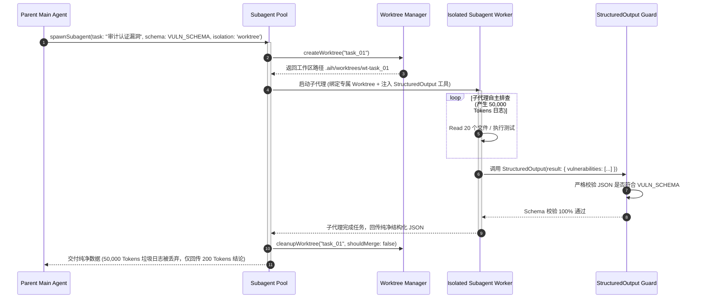

# 06-03 高性能插件化工具系统与跨 Agent 数据管道

> **“工具系统是 Agent 接触物理世界的唯一中枢。`ai_home` 自主工具体系将内建核心工具（Read/Edit/Write/Bash）、动态 MCP 协议桥接器、基于 Git Worktree 的物理沙箱以及跨 Agent 结构化数据管道（Data Pipeline）收敛于统一的高性能总线中，实现类型安全、权限可控与零阻塞并发调度。”**

---


<div class="ai-concept-hero">
  
  <div class="ai-hero-caption">
    <div class="hero-cap-title"><span>🎨</span> 高性能插件化工具总线与沙箱隔离 (Extensible Tool Bus & Worktree Isolation)</div>
    <span class="hero-cap-badge">AI 8K Concept</span>
  </div>
</div>

## 1. 章节导读与核心命题

在 Agent 执行任务过程中，绝大多数的物理副作用（Side Effects）与现实状态变更都源于工具的执行。一个生产级 Agent 运行时的工具系统必须同时解决三大核心命题：
1. **统一工具注册与类型安全门禁（Type-Safe Tool Bus）**：如何将内建的原子工具（如精准字符串替换 `Edit`、带超时进程树强杀的 `Bash`）与第三方的动态 MCP 工具（如 GitHub、Postgres）进行统一的 Schema 编译、参数校验与权限拦截；
2. **多 Agent 并发读写冲突与物理隔离（Worktree Sandboxing）**：当多个子代理并行扫描与修改代码库时，如何通过轻量级 Git Worktree 分配独立的工作空间，杜绝文件脏写冲突并支持一键原子合并或丢弃；
3. **跨 Agent 结构化数据流动与管道编排（Inter-Agent Data Pipeline）**：父代理派生（Fork）多个子代理执行专项任务（如代码审查、漏洞扫描）时，如何通过强约束 JSON Schema 建立高信噪比的数据管道，防止垃圾日志回灌污染主上下文。

本节将系统解构 `ai_home` 自主研发的 **高性能插件化工具总线架构、核心内置工具实现细节、MCP 协议动态网关、Git Worktree 隔离驱动器与跨 Agent 数据管道**。

```
┌────────────────────────────────────────────────────────────────────────────────────────────┐
│                             ai_home 插件化工具总线与数据管道全景架构                        │
│                                                                                            │
│  ┌──────────────────────────────────────────────────────────────────────────────────────┐  │
│  │                              Tool Dispatcher & Security Core                         │  │
│  │  - JSON Schema 编译与参数严格校验            - 4 态权限状态机拦截 (Gating)           │  │
│  │  - Read-Before-Edit 内存状态守卫             - 工具调用指纹去重 (Deduplication)      │  │
│  └──────────────────────────────────────────┬───────────────────────────────────────────┘  │
│                                             │                                              │
│                     ┌───────────────────────┼───────────────────────┐                      │
│                     ▼                       ▼                       ▼                      │
│  ┌────────────────────────┐   ┌────────────────────────┐   ┌────────────────────────┐      │
│  │  Built-in Core Tools   │   │   MCP Protocol Bridge  │   │  Worktree Sandbox Pool │      │
│  │  - Read (分页/行号)    │   │  - Stdio Transport     │   │  - 动态分配隔离工作区  │      │
│  │  - Edit (唯一精确替换) │   │  - SSE HTTP Transport  │   │  - 独立 Git HEAD/分支  │      │
│  │  - Write (原子化落盘)  │   │  - 命名空间动态隔离    │   │  - 自动 Cherry-pick    │      │
│  │  - Bash (PTY/进程树杀) │   │    `mcp__<srv>__<fn>`  │   │    或一键原子销毁      │      │
│  └──────────────────┬─────┘   └────────────┬───────────┘   └────────────┬───────────┘      │
│                     │                      │                            │                  │
│                     └──────────────────────┼────────────────────────────┘                  │
│                                            │                                               │
│                                            ▼                                               │
│  ┌──────────────────────────────────────────────────────────────────────────────────────┐  │
│  │                   Inter-Agent Data Pipeline (跨 Agent 结构化数据管道)                 │  │
│  │                                                                                      │  │
│  │   [Parent Main Agent] ──(Fork with Task Prompt)──> [Isolated Subagent Worker]        │  │
│  │            ▲                                                  │                      │  │
│  │            │                                                  ▼                      │  │
│  │     (Merge Clean JSON) <── [StructuredOutput Interceptor] <── (Generate Raw Trajectory)│
│  │                               (Schema Validated Payload)      (Discard 50k Bad Logs) │  │
│  └──────────────────────────────────────────────────────────────────────────────────────┘  │
└────────────────────────────────────────────────────────────────────────────────────────────┘
```

---

## 2. 核心专业术语与概念精确释义

| 专业术语 (Terminology) | 中文标准译名 | 底层架构定义与机制说明 |
| :--- | :--- | :--- |
| **Tool Dispatcher** | **统一工具分发调度器** | 负责根据大模型生成的 `tool_use` 名称，在注册表中查找对应工具实现、执行参数 Schema 强校验、触发权限门禁并调度驱动物理执行的中枢模块。 |
| **Read-Before-Edit Guard** | **编辑前强制读取守卫** | 一种防止幽灵代码修改的状态机保护规则：Agent 在当前会话中必须先显式 `Read` 目标文件以加载最新真实行镜像，才允许发起 `Edit` 替换调用。 |
| **Unique Context Anchor** | **唯一上下文锚点替换** | `Edit` 工具的核心算法：待替换的原文本块（`old_string`）在目标文件中出现的次数必须严格为 1；若出现 0 次或多次，工具强行拒绝并报错以防误删代码。 |
| **Atomic File Renaming** | **基于原子重命名的文件写入** | `Write` 工具通过先写同目录 `.tmp.<uuid>` 临时文件，再利用内核原子系统调用 `fs.renameSync` 进行覆盖替换，杜绝系统断电或崩溃产生 0 字节半截坏文件。 |
| **Subagent Data Piping** | **子代理数据管道** | 父子 Agent 之间通过隐式注入 `StructuredOutput` 工具与 JSON Schema 校验，强制子代理将庞大执行轨迹过滤浓缩为纯净结构化数据的通信管道。 |
| **Process Group Kill (`SIGKILL -pgid`)** | **进程组级别彻底杀灭** | 在超时或中断发生时，不仅向父 Shell 发送信号，更通过负 PID 向其所属的整个进程组（Process Group）广播信号，确保深层嵌套的编译/运行子进程被连根拔起。 |

---

## 3. 核心内建工具（Built-in Tools）生产级 TypeScript 源码实现

`ai_home` 在 `lib/tools/` 目录下实现了四个最高频、高可靠的核心内建工具：

### 3.1 `ReadTool`：分页与绝对行号注入
```typescript
import * as fs from 'fs';
import * as path from 'path';

export interface ReadParams {
  file_path: string;
  offset?: number;
  limit?: number;
}

export class ReadTool {
  public static readonly name = 'Read';
  public static readonly description = 'Read file contents from workspace with cat -n line numbering.';

  public static async execute(params: ReadParams, workspaceRoot: string): Promise<string> {
    const fullPath = path.isAbsolute(params.file_path) ? params.file_path : path.join(workspaceRoot, params.file_path);
    
    if (!fs.existsSync(fullPath)) {
      throw new Error(`File not found: ${params.file_path}`);
    }

    const content = fs.readFileSync(fullPath, 'utf-8');
    const lines = content.split('\n');
    const offset = Math.max(1, params.offset || 1);
    const limit = Math.min(2000, params.limit || 2000);

    const slice = lines.slice(offset - 1, offset - 1 + limit);
    const numbered = slice.map((line, idx) => `${offset + idx}\t${line}`).join('\n');

    if (offset - 1 + limit < lines.length) {
      return `${numbered}\n\n[Output truncated. File has ${lines.length} lines total. Use offset: ${offset + limit} to continue reading]`;
    }
    return numbered;
  }
}
```

### 3.2 `EditTool`：严格唯一字符串锚点替换
```typescript
export interface EditParams {
  file_path: string;
  old_string: string;
  new_string: string;
  replace_all?: boolean;
}

export class EditTool {
  public static readonly name = 'Edit';
  public static readonly description = 'Perform exact string replacement in a file. Must Read file first.';

  public static async execute(params: EditParams, workspaceRoot: string, readTracker: Set<string>): Promise<string> {
    const fullPath = path.isAbsolute(params.file_path) ? params.file_path : path.join(workspaceRoot, params.file_path);
    
    // 1. Read-Before-Edit 守卫
    if (!readTracker.has(fullPath)) {
      throw new Error(`[Read-Before-Edit Violation]: You must Read file '${params.file_path}' in this conversation before editing.`);
    }

    const content = fs.readFileSync(fullPath, 'utf-8');
    const oldStr = params.old_string;

    // 2. 唯一性校验 (Uniqueness Assertion)
    const occurrences = content.split(oldStr).length - 1;
    if (occurrences === 0) {
      throw new Error(`[Edit Mismatch]: old_string was not found in '${params.file_path}'. Please re-Read file to verify line indentation.`);
    }
    if (occurrences > 1 && !params.replace_all) {
      throw new Error(`[Edit Ambiguity]: old_string matches ${occurrences} locations in file. Provide more surrounding context lines to make it unique.`);
    }

    // 3. 执行原子替换
    const newContent = params.replace_all ? content.replaceAll(oldStr, params.new_string) : content.replace(oldStr, params.new_string);
    
    // 原子落盘
    const tmpPath = `${fullPath}.tmp.${Date.now()}`;
    fs.writeFileSync(tmpPath, newContent, 'utf-8');
    fs.renameSync(tmpPath, fullPath);

    return `Successfully applied patch to '${params.file_path}'.`;
  }
}
```

### 3.3 `BashTool`：PTY 伪终端、防爆截断与进程树杀灭
```typescript
import * as pty from 'node-pty';

export interface BashParams {
  command: string;
  timeoutMs?: number;
}

export class BashTool {
  public static readonly name = 'Bash';
  public static readonly description = 'Run shell command inside a pseudo-terminal (PTY) with tree kill guard.';

  public static async execute(params: BashParams, cwd: string): Promise<string> {
    const timeout = Math.min(300000, params.timeoutMs || 120000);
    const MAX_OUTPUT_BYTES = 16 * 1024; // 16KB 截断保护
    let outputBuffer = '';
    let isTruncated = false;

    return new Promise((resolve, reject) => {
      const ptyProcess = pty.spawn('/bin/zsh', ['-c', params.command], {
        name: 'xterm-256color',
        cols: 120,
        rows: 30,
        cwd,
        env: {
          ...process.env,
          CI: 'true',
          TERM: 'dumb',
          DEBIAN_FRONTEND: 'noninteractive'
        }
      });

      const timer = setTimeout(() => {
        try {
          // 进程组级别树杀 (Process Group Kill)
          process.kill(-ptyProcess.pid, 'SIGKILL');
        } catch (e) {
          ptyProcess.kill();
        }
        reject(new Error(`Command timed out after ${timeout}ms: ${params.command}`));
      }, timeout);

      ptyProcess.onData((data) => {
        if (outputBuffer.length < MAX_OUTPUT_BYTES) {
          outputBuffer += data;
        } else if (!isTruncated) {
          isTruncated = true;
          outputBuffer += '\n\n[Warning: Output exceeded 16KB limit and was truncated by Harness]';
        }
      });

      ptyProcess.onExit(({ exitCode }) => {
        clearTimeout(timer);
        // 清洗无意义的 ANSI 乱码
        const cleaned = outputBuffer.replace(/\x1B(?:[@-Z\\-_]|\[[0-?]*[ -/]*[@-~])/g, '');
        if (exitCode === 0) {
          resolve(cleaned.trim() || '[Command finished with exit code 0 and no output]');
        } else {
          resolve(`[Command failed with exit code ${exitCode}]\n${cleaned.trim()}`);
        }
      });
    });
  }
}
```

---

## 4. Git Worktree 物理并发沙箱隔离管理器实现

<div id="widget-worktree-container"></div>


当子代理需要并发执行写操作时，`WorktreeManager` 为其分配独立的临时文件系统沙箱：

```typescript
import { execSync } from 'child_process';
import * as path from 'path';
import * as fs from 'fs';

export class WorktreeManager {
  private repoRoot: string;
  private worktreesDir: string;

  constructor(repoRoot: string) {
    this.repoRoot = repoRoot;
    this.worktreesDir = path.join(repoRoot, '.aih', 'worktrees');
    if (!fs.existsSync(this.worktreesDir)) fs.mkdirSync(this.worktreesDir, { recursive: true });
  }

  /**
   * 为子代理创建独立的 Git Worktree 隔离沙箱
   */
  public createWorktree(taskId: string): { worktreePath: string; branchName: string } {
    const branchName = `agent/wt-${taskId}`;
    const worktreePath = path.join(this.worktreesDir, `wt-${taskId}`);

    execSync(`git worktree add -b "${branchName}" "${worktreePath}" HEAD`, {
      cwd: this.repoRoot,
      stdio: 'pipe'
    });

    return { worktreePath, branchName };
  }

  /**
   * 任务完成：原子合并或安全丢弃
   */
  public cleanupWorktree(taskId: string, shouldMerge: boolean): void {
    const branchName = `agent/wt-${taskId}`;
    const worktreePath = path.join(this.worktreesDir, `wt-${taskId}`);

    try {
      if (shouldMerge) {
        // 将子代理的分支变更 Squash Merge 回主分支
        execSync(`git merge --squash "${branchName}"`, { cwd: this.repoRoot });
        execSync(`git commit -m "feat(agent): squash merged subagent task ${taskId}"`, { cwd: this.repoRoot });
      }
    } finally {
      // 安全清理 Worktree 目录与分支
      execSync(`git worktree remove --force "${worktreePath}"`, { cwd: this.repoRoot });
      execSync(`git branch -D "${branchName}"`, { cwd: this.repoRoot });
    }
  }
}
```

---

## 5. 跨 Agent 结构化数据管道（Data Pipeline）时序流与源码实现

### 5.1 跨 Agent 结构化数据流动时序图 (Data Pipeline Sequence)



---

## 6. 极端异常边界与防御治理策略

| 异常边界场景 | 物理成因与危害 | `ai_home` 核心防线与自愈算法 (Self-Healing) |
| :--- | :--- | :--- |
| **1. 工具参数 JSON 严重畸形 (Malformed Tool Args)** | 模型在高负荷生成时遗漏了闭合括号或引号，导致 `JSON.parse` 抛出 SyntaxError。 | **局部自愈与友好引导（Self-Healing Parser）**：<br>优先调用 `jsonrepair` 进行语法自愈；若彻底损坏，工具调度器直接返回 `is_error: true` 错误帧提示模型修正参数格式并重试。 |
| **2. 恶意死循环命令炸毁磁盘 (Infinite Disk Fill)** | 模型无意执行了 `while true; do echo "data" >> log.txt; done`。 | **双重物理熔断（Time & Output Limit）**：<br>1. PTY 超时守护强制 120s 树杀；<br>2. 磁盘写入监控：单次工具执行产生的文件增量若超过 50MB，强行中断子进程并回滚脏写。 |
| **3. 子代理残留孤儿分支 (Orphaned Worktree)** | 子代理在执行途中突然断电或被强制杀死，导致 `.aih/worktrees/` 残留锁文件与孤儿目录。 | **启动期孤儿工作区扫掠（Orphan Sweep on Startup）**：<br>系统启动时执行 `git worktree prune`，并遍历清除 `.aih/worktrees/` 下超过 1 小时无活跃心跳的僵尸目录。 |
| **4. MCP 外部服务器挂死 (MCP Server Lockup)** | 第三方 MCP Stdio 服务在处理数据库查询时死锁，导致整个 Agent 工具总线被挂起。 | **MCP 协议级超时与自动熔断**：<br>所有通过 `mcp__<server>__<tool>` 发起的 JSON-RPC 调用严格施加 30s 请求超时；超时后主动重置该 MCP Server 实例，杜绝阻塞主事件循环。 |

---

## 7. 对 ai_home 自主 Harness 研发的落地指导与架构设计

在 `ai_home` 项目落地高性能工具总线与数据管道时，必须贯彻以下三大落地标准：

### 7.1 架构设计一：落地 `lib/tools/` 统一工具调度器与严格类型校验
- **当前现状**：工具逻辑散落在不同模块中，缺乏统一的 Schema 编译与结果包装。
- **重构方案**：
  1. 新建 `lib/tools/tool-dispatcher.ts`，定义 `BaseTool` 抽象类；
  2. 统一定义输入输出协议帧，内置 `Read`、`Edit`、`Write`、`Bash` 作为一级公民。

### 7.2 架构设计二：原生落地基于 Git Worktree 的任务隔离池
- **落地方案**：
  1. 在 `lib/git/worktree-manager.ts` 中实现全生命周期的临时工作区分派与合并；
  2. 凡是涉及写代码或多子代理并发任务，强制在 Worktree 沙箱中运行，确保主开发目录零污染。

### 7.3 架构设计三：固化 MCP 客户端桥接器与动态命名空间路由
- **落地方案**：
  1. 新建 `lib/mcp/mcp-bridge-manager.ts`，自动解析项目根目录下的 `.mcp.json`；
  2. 自动将外部 MCP 服务的工具 Schema 映射并注入主工具总线，支持 Stdio 与 SSE 双向透明代理。

---

## 8. 本章小结与下章预告

本章全面解构了 `ai_home` 自主研发的 **高性能插件化工具总线、四大核心内建工具实现、Git Worktree 物理并发沙箱以及跨 Agent 结构化数据管道**，为 Agent 提供了兼顾安全与性能的物理具身能力。

在下一章 **【06-04 混合持久化记忆、上下文压缩与 Prompt Cache 亲和调度】** 中，我们将深入解构 `ai_home` 的认知与存储中枢，拆解如何将 SQLite 实体库、JSONL 事务日志与 Prompt Cache 亲和度调度深度融合。
