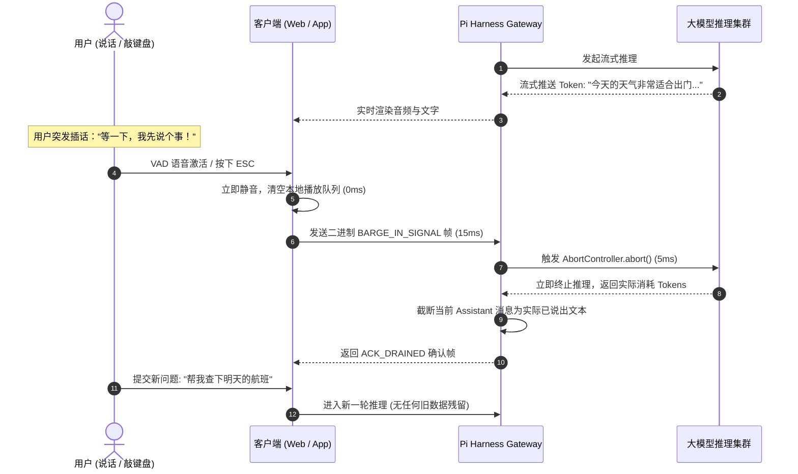

# 01-02 毫秒级双向打断（Barge-in）、流式排空与原子状态重置

> **“在真实的人类交谈中，‘倾听并适时被打断’是智能与情商的最高体现。一个无法被打断、喋喋不休背诵答案的 Agent 永远只是冷冰冰的机器。Agent Pi 的 Barge-in 架构能够在用户开口发声或键入字符的 50ms 内，瞬间截断上游大模型生成流、排空客户端播放缓冲，并在原子级别重置状态机。”**

---

  
  

    
🎨 毫秒级即时打断与原子流式排空引擎 (Barge-in & Stream Drain Engine)

    AI 8K Concept
  

## 1. 章节导读与核心命题

传统 Agent 在处理用户打断时面临的三大难题：
1. **算力与 Token 浪费**：客户端虽然按下了停止键，但服务端与上游云端仍在大力生成后续几千个 Token，产生巨大的财务浪费；
2. **幽灵消息（Ghost Frames）**：打断指令到达前，网络管道中积压的几十个数据包依然会继续推给客户端，造成界面跳动与语音重叠；
3. **上下文时序错乱**：被截断的上半句话是否应该存入历史？存多少？下一轮对话如何自然承接被用户打断的思路？

本节系统剖析 Agent Pi 的 **Barge-in 信号原子传播链、AbortController 上游取消流与截断历史清洗算法**。

---

## 2. 核心专业术语与概念精确释义

| 专业术语 (Terminology) | 中文标准译名 | 底层架构定义与机制说明 |
| :--- | :--- | :--- |
| **Barge-in** | **即时打断 / 插入** | 用户在 Agent 输出过程中随时切入输入，系统立即暂停输出并切换为全神贯注倾听模式。 |
| **Pipeline Drain** | **管道排空** | 瞬间丢弃 TCP / WebSocket 发送队列中尚未被客户端播放的无效数据帧。 |
| **Atomic Abort Propagation** | **原子取消传播** | 通过 HTTP/2 RST_STREAM 或底层 TCP FIN 信号在 10ms 内通知上游大模型停止计算。 |
| **Truncated Turn Archival** | **截断轮次归档** | 精确记录用户打断时 Agent 实际说出的字符切片，并在历史中打上 `[Interrupted by User]` 标记。 |

---

## 3. Barge-in 时序交互图

---

## 4. 对 ai_home 自主 Harness 研发的落地指导与架构设计

在 `ai_home` 中，必须为所有流式推理请求绑定原生的 `AbortController`，并在 WebUI 侧边栏与底部终端中实现全局 `Esc` / 快捷按键打断，确保无论模型生成多长文本，均能一键毫秒级刹车并清爽恢复等待状态。
